# گزارش پیاده سازی معماری ارائه شده مقاله :
# A synergistic multi-stage RAG architecture for boosting context relevance in data science literature


---
<div style="display: flex; justify-content: start; align-items: center; gap: 10px;">
    
</div>

<div style="display: flex; justify-content: start; align-items: center; gap: 10px;">
    
</div>

**دانشگاه فردوسی مشهد**

**دانشکده مهندسی**

**گروه کامپیوتر**

**درس شناسایی آماری الگو**

**استاد : دکتر صدوقی یزدی**

**گزارش پروژه**

**نویسنده**: دانیال آقاخانی زاده  – دانشجوی کارشناسی‌ارشد هوش مصنوعی

**ایمیل :** [DanialAghakhanizadeh@gmail.com](mailto:@gmail.com)

---

## فهرست مطالب

<br>

- [مقدمه](#مقدمه)
  - [معماری RAG](#معماری-rag)
    - [مزایا و چالش های RAG](#مزایا-و-چالش-های-rag)
  - [رویکرد هم افزایانه](#رویکرد-هم-افزایانه)
  - [معماری پیشنهاد شده](#معماری-پیشنهادی)

<br>

- [پیاده سازی: آماده سازی داده ها](#پیاده-سازی-آماده-سازی-داده-ها)
  - [دریافت مقالات](#دریافت-مقالات)
  - [پیش‌پردازش](#جمع-آوری-اطلاعات-و-پیش-پردازش)
  - [معرفی GROBID](#اما-grobid-چیست-و-چه-مزایا-و-برتریهایی-نسبت-به-سایر-ابزارهای-مشابه-دارد)
    - [نصب GROBID](#نصب-grobid)

<br>

- [پیاده سازی: مدل‌های جانمایی](#پیاده-سازی-مدل-های-جانمایی)
  - [آماده سازی داده های آموزشی](#آماده-سازی-داده-های-آموزشی)
  - [پردازش متن کتاب ها](#پردازش-متن-کتاب-ها)
  - [ریزتنظیم مدل جانمایی](#ریزتنظیم-مدل-جانمایی)
    - [پیکربندی SNS](#ریزتنظیم-با-sns)

<br>

- [پیاده سازی: قطعه‌بندی معنایی](#پیاده-سازی-قطعه-بندی-معنایی)
  - [رویکرد اول-چکیده](#قطعه-بندی-معنایی-در-رویکرد-abstract-first)
    - [قطعه بندی معنایی چکیده](#کد-بخش-اول-استخراج-و-اندیس-گذاری-چکیده-ها)
    - [قطعه بندی معنایی بدنه](#کد-بخش-دوم-قطعه-بندی-معنایی-بدنه-مقالات)

<br>

- [پیاده سازی:  Retrieval-augmented generation](#پیاده-سازی-retrieval-augmented-generation)
  - [رویکرد پایه RAG](#معماری-rag-ساده)
  - [رویکرد اول-چکیده RAG](#معماری-rag-رویکرد-abstract-first)

<br>

- [ارزیابی](#ارزیابی)
  - [کتابخانه RAGAS](#کتابخانه-ragas)
    - [معیار Faithfulness](#۱-وفاداری-به-متن-faithfulness)
    - [معیار Answer Relevance](#۲-ارتباط-پاسخ-answer-relevance)
    - [معیار Context Relevancy](#۳-ارتباط-زمینه-context-relevance)
  - [پیاده سازی عملی معیار های ارزیابی](#پیادهسازی-عملی-معیارهای-ارزیابی)

<br>

- [نتایج](#نتایچ)
  - [آزمایش شماره ۱: مقایسه ی عملکرد مدل های زبانی محلی](#آزمایش-شماره-۱-مقایسه-ی-عملکرد-مدل-های-زبانی-محلی)
    - [آزمون آماری ANOVA](#آزمون-آماری-anova)
    - [آزمون HSD Tukey](#آزمون-توکی-hsd-tukey)
  - [آزمایش شماره ۲: مقایسه عملکرد مدل جانمایی بر اساس پیکربندی منابع آموزشی مختلف در مقاله](#آزمایش-شماره-۲-مقایسه-عملکرد-مدل-جانمایی-بر-اساس-پیکربندی-منابع-آموزشی-مختلف-در-مقاله)
  - [آزمایش شماره ۳: مقایسه عملکرد مدل های جانمایی](#آزمایش-شماره-۳-مقایسه-عملکرد-مدل-های-جانمایی)
  - [آزمایش شماره ۴: مقایسه عملکرد دستورات مختلف](#آزمایش-شماره-۴-مقایسه-عملکرد-پرامپت-های-مختلف)
  - [آزمایش شماره ۵: مقایسه عملکرد مدل های زبانی در ارزیابی نتایج](#آزمایش-شماره-۵-مقایسه-ی-عملکرد-مدل-های-زبانی-در-ارزیابی-نتایج)

<br>

- [ایده های پیشنهادی](#ایده-های-پیشنهادی)
  - [رویکرد اول-چکیده به همراه جداساز گره معنایی](#رویکرد-abstract-first--semantic-node-splitter)
  - [قطعه‌بندی معنایی](#قطعهبندی-معنایی-در-رویکرد-abstract-first--sns)
  - [پیاده سازی RAG](#معماری-rag-با-رویکرد-abstract-first--sns)
- [نتایج](#نتایج)
- [جمع‌بندی](#جمع-بندی)
- [سایر راه های بهبود عملکرد معماری](#راهکارهای-تکمیلی-برای-بهبود-عملکرد-معماری)
- [جمع‌بندی نهایی](#جمع-بندی-نهایی)

<br>

- [پیوست ها](#پیوست-ها)
  - [پیوست ۱: ابزار ها](#پیوست-۱-ابزار-ها)
  - [پیوست ۲: پیکربندی مراحل و آزمایش‌ها](#پیوست-۲-پیکربندی-مراحل-و-آزمایش-ها)
  - [پیوست ۳: پیوند ها](#پیوست-۳-خروجی-ها)
  - [پیوست ۴: منابع](#پیوست-۴)
 

---

## چکیده
در این گزارش، عملکرد رویکرد هم‌افزایانه در معماری‌های RAG با هدف افزایش ارتباط زمینه‌ای و معنایی پاسخ‌های مدل‌های زبانی بزرگ در بازیابی و تحلیل متون علمی و ادبیات پژوهشی حوزه علوم داده و یادگیری ماشین بررسی می‌شود. سپس نحوه‌ی پیاده‌سازی معماری ارائه‌شده در مقاله‌ی اصلی، با تمرکز بر ارزیابی خروجی مدل‌های زبانی محلی (متن‌باز)، به‌صورت مرحله‌به‌مرحله مورد مطالعه قرار می‌گیرد. در ادامه، روش ارزیابی این مدل‌ها تشریح شده و در پایان، نتایج حاصل از عملکرد معماری هم‌افزایانه در مدل‌های محلی با یکدیگر و همچنین با مدل معرفی‌شده در مقاله مقایسه می‌گردد.

واژگان كليدي:
مدل های زبانی بزرگ -
بازیابی اطلاعات -
پیش‌پردازش -
هم‌افزایی -
همامتن

---

## مقدمه

&nbsp;&nbsp;&nbsp;در دنیای امروز، با ورود مدل‌های مولد هوش مصنوعی ـ به‌ویژه مدل‌های زبانی بزرگ ـ به زندگی روزمره‌ی بشر و بهره‌مندی از مزایای گسترده‌ی آن‌ها در پردازش اطلاعات، تولید محتوا و سایر کاربردها، هم‌زمان با فرصت‌ها، با چالش‌ها و مخاطراتی نیز مواجه می‌شویم.

&nbsp;&nbsp;&nbsp;یکی از مهم‌ترین چالش‌های این مدل‌ها، پدیده‌ی توهم‌زایی [^1] یا تولید اطلاعات نادقیق و گمراه‌کننده در خروجی سیستم‌هاست. گرچه چنین خطاهایی در پاسخ به پرسش‌های عمومی ممکن است چندان جدی تلقی نشوند، اما در کاربردهای تحقیقاتی یا محاسباتی قابل پذیرش نیستند و در حوزه‌های حساسی مانند پزشکی حتی می‌توانند پیامدهای جبران‌ناپذیری به‌همراه داشته باشند.
علاوه بر این، استفاده از مدل‌های عمومی زبانی در مسائل تخصصی، نبود آموزش کافی به‌دلیل محدودیت منابع سخت‌افزاری یا کمبود داده، و همچنین به‌روز نبودن مدل‌ها از جمله عواملی هستند که احتمال بروز توهم در خروجی این سیستم‌ها را افزایش می‌دهند.
به همین دلیل، تاکنون راهکارهای متعددی برای کاهش این مشکل ارائه شده است؛ از جمله روش‌های مبتنی بر پایش و تشخیص توهم‌زایی [2]، مهندسی دستورات [^2]  [3]و تولید تقویت‌شده با بازیابی[^3]. [4] [5] 

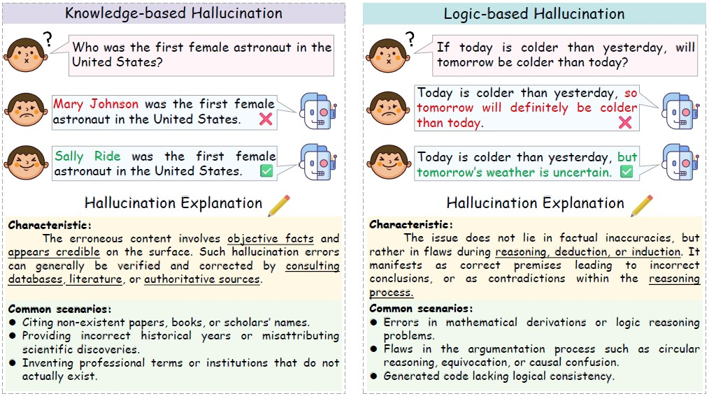
<p style="text-align:center;">
  <sub>تصویر ۱ – دو نمونه از انواع توهم : توهم بر مبنای منطق (سمت راست) – توهم بر مبنای دانش (سمت چپ)</sub>
</p>
<br>

---
## معماری RAG
&nbsp;&nbsp;&nbsp;به‌طور کلی، در معماری RAG که نخستین بار در سال ۲۰۲۰ میلادی در حوزه‌ی پردازش زبان‌های طبیعی  معرفی شد، در کنار پرسش ورودی کاربر، اطلاعات مرتبط با آن نیز به مدل زبانی داده می‌شود. در نتیجه، مدل به‌جای اتکا صرف به دانش اولیه‌ی خود، با توجه به این اطلاعات زمینه‌ای [^5] وادار می‌شود تا پاسخ دقیق‌تری تولید کند.
با توجه به محدودیت ورودی‌های مدل‌های زبانی ـ که به آن‌ها توکن‌های ورودی [^6] گفته می‌شود (هر توکن به‌طور تقریبی شامل چهار حرف الفبا است [6]) ـ و با در نظر گرفتن گستردگی نیاز کاربران و تعداد بالای پرسش‌ها، لازم است این فرآیند به‌صورت خودکار انجام شود. این فرآیند با کمک اتصال یک پایگاه داده ی اولیه به معماری RAG و سپس تبدیل دانش موجود به مقادیر اندیس‌گذاری شده برداری مقدور می‌گردد.
این خودکارسازی با اتصال یک پایگاه داده‌ی اولیه به معماری RAG و سپس تبدیل دانش موجود به مقادیر برداری اندیس‌گذاری‌شده امکان‌پذیر می‌گردد. به این ترتیب، با ورود پرسش کاربر به سیستم، ابتدا دانش مرتبط در فضای برداری پایگاه داده جستجو و بازیابی می‌شود. سپس همامتن [^7] بازیابی‌شده در کنار پرسش کاربر به مدل داده می‌شود تا پاسخ نهایی تولید گردد.
<br>

از مهم‌ترین مزایای معماری RAG می‌توان به موارد زیر اشاره کرد:
<br>

&nbsp;۱- بهینه‌سازی توکن‌ها: بازیابی همامتن مرتبط همراه با کاهش حجم داده‌های ورودی و صرفه‌جویی در مصرف منابع.<br>
&nbsp;۲- افزایش دقت: تولید پاسخ‌ها بر مبنای داده‌های معتبر و قطعی خارج از مدل.<br>
&nbsp;۳- مقیاس‌پذیری: امکان استفاده پویا از دیتاست‌های بزرگ و متنوع.<br>
&nbsp;۴- انعطاف‌پذیری: قابلیت تلفیق آسان با سایر سیستم‌ها و ابزارها.<br>
&nbsp;۵- بهبود تجربه‌ی کاربری: ارائه پاسخ‌های سریع‌تر و دقیق‌تر.<br>

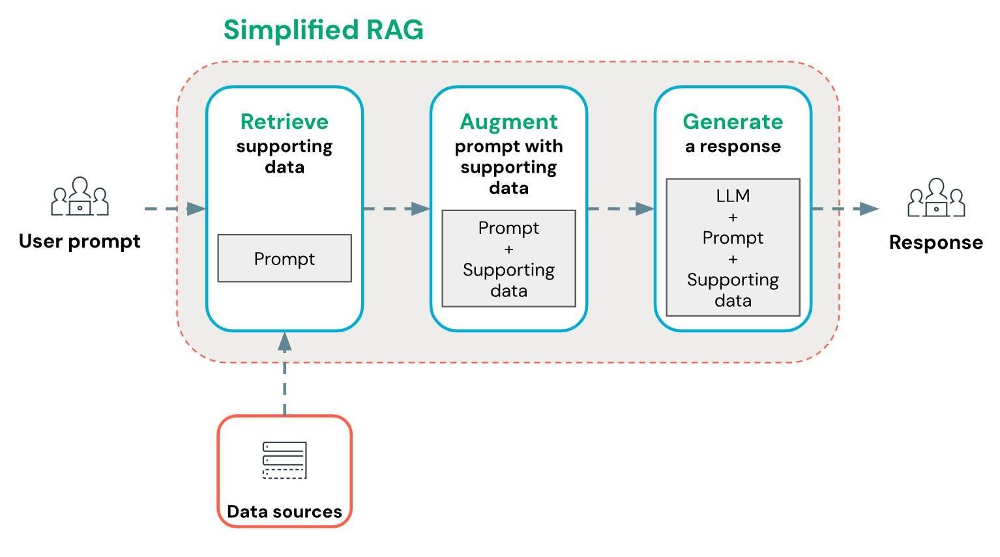
<p style="text-align:center;">
  <sub>تصویر ۲ – ساختار کلی معماری RAG ساده </sub>
</p>
<br>

### مزایا و چالش های RAG

از مهم‌ترین چالش‌های معماری RAG نیز می‌توان به موارد زیر اشاره کرد:<br>
۱- ارتباط معنایی داده‌های بازیابی‌شده: کیفیت پاسخ‌ها به میزان ارتباط و اعتبار منابع بیرونی وابسته است.<br>
۲- تاخیر در پاسخ‌دهی: افزایش مراحل بازیابی می‌تواند زمان تولید پاسخ را بیشتر کند.<br>
۳- انباره‌های داده: دسترسی به داده‌های ساخت‌یافته و مدیریت روابط میان منابع همچنان دشوار است.<br>
۴- محدودیت‌های همامتن (Context): حجم زیاد داده‌های بازیابی‌شده ممکن است از محدودیت توکن‌های ورودی مدل زبانی فراتر رود؛ بنابراین نیاز به منقطع‌سازی [^8] و مدیریت داده‌ها وجود دارد.<br>
۵- ناترازی معنایی: اسناد بازیابی‌شده ممکن است فاقد ارتباطات ساختاری لازم برای استدلال عمیق مدل باشند.<br>
<br>
<br>
&nbsp;
با توجه به چالش‌های مطرح‌شده، به‌ویژه محدودیت‌های همامتن و محدودیت توکن‌ها که در داده‌های حجیم می‌توانند منجر به سربار اطلاعات [^9] شوند، بهبود عملکرد RAG در برخی کاربردها ـ به‌ویژه فعالیت‌های پژوهشی ـ امری ضروری است.<br>
<br>
برای رفع این مشکل، روش‌های متعددی ارائه شده‌اند؛ از جمله استفاده از گراف دانش در پایگاه داده (معماری  GraphRAG [7])، رویکرد ComoRAG [8]، وLongRAG  [9] که هر یک از این معماری‌ها تلاش کرده‌اند تا محدودیت‌های موجود در بازیابی و مدیریت داده‌های حجیم را کاهش دهند.
یکی از جدیدترین رویکردها در این زمینه، پیاده‌سازی رویکرد هم‌افزایانه [^10] در معماری RAG است که با ترکیب چندین تکنیک به‌صورت مرحله‌ای، بهبود چشمگیری در ارتباط معنایی و کارایی سیستم ایجاد می‌کند.
<br><br>

----

## رویکرد هم افزایانه
&nbsp;&nbsp;&nbsp;بر اساس مقاله‌‌ی  “Synergizing RAG and Reasoning” که در سال ۲۰۲۵ منتشر شده است [9]، مفهوم هم‌افزایی در معماری RAG به‌صورت ترکیب توانایی‌های کسب دانش خارجی در RAG با قابلیت‌های استدلال درونی [^11] مدل‌های زبانی بزرگ تعریف می‌شود. این ترکیب در راستای بهبود کیفیت پاسخ‌دهی به مسائل پیچیده به‌کار گرفته می‌شود و موجب ارتقای دقت و عمق تحلیل در کاربردهای پژوهشی و تخصصی می‌گردد.
<br>

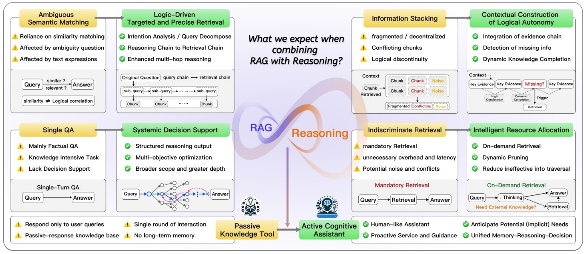
<p style="text-align:center;">
  <sub>تصویر ۳ – مقایسه ی عملکرد RAG ساده (رنگ زرد) و RAG هم‌افزا (رنگ سبز) - مقاله [9]</sub>
</p>
<br>

با توجه به تصویر ۳ مشاهده می‌شود که معماری‌های RAG سنتی عمدتاً به شباهت معنایی در فرآیند بازیابی اطلاعات متکی هستند. این وابستگی موجب می‌شود که در بسیاری از موارد، اسناد بازیابی‌شده صرفاً بر اساس شباهت ظاهری به پرسش و نه بر اساس ارتباط منطقی یا استدلالی با موضوع مورد نظر انتخاب شوند. 
<br>


در این مدل‌ها، ورود حجم زیادی از اسناد بازیابی‌شده به مدل زبانی می‌تواند باعث سردرگمی مدل‌های زبانی بزرگ شود. به‌ویژه زمانی که اسناد شامل اطلاعاتی باشند که فاقد انسجام معنایی یا ارتباط ساختاری باشند، مدل قادر به استنتاج دقیق نخواهد بود. این وضعیت منجر به بروز نقص در زنجیره‌ی استدلال یا همان «حلقه‌ی مفقوده» در پاسخ‌دهی می‌شود.
<br>

در مقابل، معماری RAG هم‌افزایانه با بهره‌گیری از استدلال چندمرحله‌ای، تجزیه‌ی هدفمند پرسش، و بازیابی مبتنی بر زنجیره‌ی منطقی، تلاش می‌کند تا این چالش‌ها را برطرف کند و پاسخ‌هایی دقیق‌تر و منسجم‌تر ارائه دهد.
<br>

با این تفاسیر، هم‌افزایی در معماری RAG از طریق ترکیب توانایی‌های استدلالی مدل با قطعات معنایی [^12] بازیابی‌شده، موجب می‌شود که مدل زبانی بتواند همانند یک محقق خبره، پاسخ یک مسئله را در میان اسناد متعدد جستجو کرده، مرتبط‌ترین بخش‌ها را در کنار یکدیگر قرار دهد، و در نهایت از میان این اطلاعات به نتیجه‌گیری و استدلال نهایی برسد.
<br>

این رویکرد حتی امکان تصمیم‌گیری سیستماتیک را برای مدل فراهم می‌سازد و معماری RAG را از یک ابزار منفعل [^13] صرفاً تحقیقاتی، به یک دستیار شناختی فعال و تشخیص‌دهنده تبدیل می‌کند که قادر است نیازهای ضمنی کاربر را نیز پیش‌بینی و پاسخ‌گویی کند.
<br>
<br>

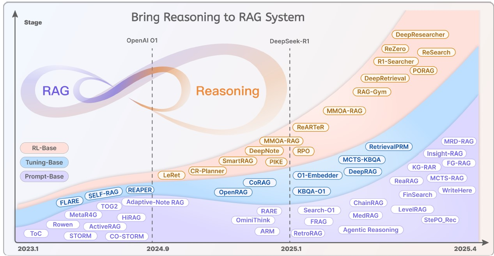
<p style="text-align:center;">
  <sub>تصویر ۴ – روند تغییر رویکرد های RAG در سال های اخیر از بازیابی ساده به سمت هم‌افزایی با توجه به انتشار مدل های زبانی مطرح – مقاله [9]	</sub>
</p>
<br>

---
## معماری پیشنهادی
&nbsp;&nbsp;&nbsp;همان‌طور که پیش‌تر اشاره شد، معماری RAG در کاربردهای تحقیقاتی و مطالعه‌ی ادبیات آکادمیک [^14] نقش بسزایی ایفا می‌کند. از جمله نمونه‌های موفق در این زمینه می‌توان به فریم‌ورک MKRAG اشاره کرد که با قابلیت تجمیع یافته‌ها از منابع دانش، در فرآیند تولید پاسخ در حوزه‌ی پزشکی به‌کار گرفته شده است. [11]<br>

همچنین، مدل‌هایی با رویکرد استدلال موردمحور [^15] در حوزه‌ی بررسی پرونده‌های حقوقی توسعه یافته‌اند [12] که با تلفیق اطلاعات زمینه‌ای و تحلیل منطقی، پاسخ‌هایی دقیق و ساختاریافته ارائه می‌دهند؛ موارد مشابه دیگری نیز وجود دارد که در متن اصلی مقاله‌ی Aytar مفصل‌تر مورد بررسی قرار گرفته‌اند.<br>
<br>

به علاوه، به‌منظور پاسخ‌گویی به چالش‌های معماری RAG، نویسندگان مقاله پیشرفت‌های ارائه‌شده در پژوهش‌های اخیر را مورد توجه و بررسی قرار داده‌اند. از جمله مهم‌ترین این رویکردها می‌توان به موارد زیر اشاره کرد:<br>

&nbsp; ۱- روش بازیابی عبارات متراکم [^16] (DPR) [13]: این روش معماری‌ای شامل دو انکودر BERT را معرفی می‌کند؛ یک انکودر برای پرسش‌ها و دیگری برای متون بازیابی‌شده. با بهره‌گیری از یادگیری تضادآمیز [^17]، شباهت‌های معنایی میان پرسش و متن با دقت بیشتری شناسایی می‌شوند.<br>
&nbsp; ۲- روش جانمایی اسناد فرضی [^18]  (HyDE): در این رویکرد، ابتدا اسناد فرضی تولید می‌شوند که به‌طور بالقوه می‌توانند پاسخ پرسش را در خود داشته باشند. سپس این اسناد با متون واقعی مقایسه شده و نتایج بازیابی بهینه‌سازی می‌گردند.<br>
&nbsp; ۳- رویکردهای رتبه‌بندی [^19] [14]: برای افزایش دقت در بازیابی، ابتدا مجموعه‌ای از متون مرتبط انتخاب شده و سپس با استفاده از مدل‌های دقیق‌تر، رتبه‌بندی مجدد آن‌ها انجام می‌شود تا مرتبط‌ترین پاسخ‌ها در اولویت قرار گیرند.<br>
&nbsp; ۴- تکنیک‌های بسط چند کوئری [^20] [15]: این روش مدل زبانی را قادر می‌سازد تا با تولید چندین نسخه بازنویسی‌شده از پرسش اولیه، نتایج متنوع‌تری را بازیابی کرده و مشکلاتی مانند ابهام معنایی یا عدم تطابق واژگان را پوشش دهد.<br><br>
نویسندگان این مقاله، برای پاسخ‌گویی به محدودیت‌های معماری‌های RAG سنتی و استاندارد ـ که پیش‌تر به آن‌ها اشاره شد (از جمله سربار اطلاعات، ضعف در ارتباط همامتن‌های بازیابی‌شده و چالش ناسازگاری‌های جزئی حوزه‌محور) ـ از روش‌های نوین یادشده الگوبرداری کرده‌اند. بر اساس این رویکرد، آن‌ها یک معماری پنج‌مرحله‌ای ارائه کرده‌اند که به‌صورت هم‌افزایانه طراحی شده و هدف آن ارتقای دقت، انسجام معنایی و کارایی در بازیابی و تولید پاسخ‌های علمی است. 
<br>

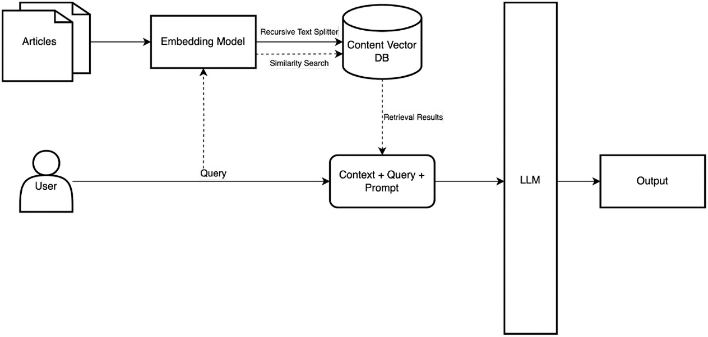
<p style="text-align:center;">
  <sub>تصویر ۵ – معماری RAG ساده</sub>
</p>

<br>

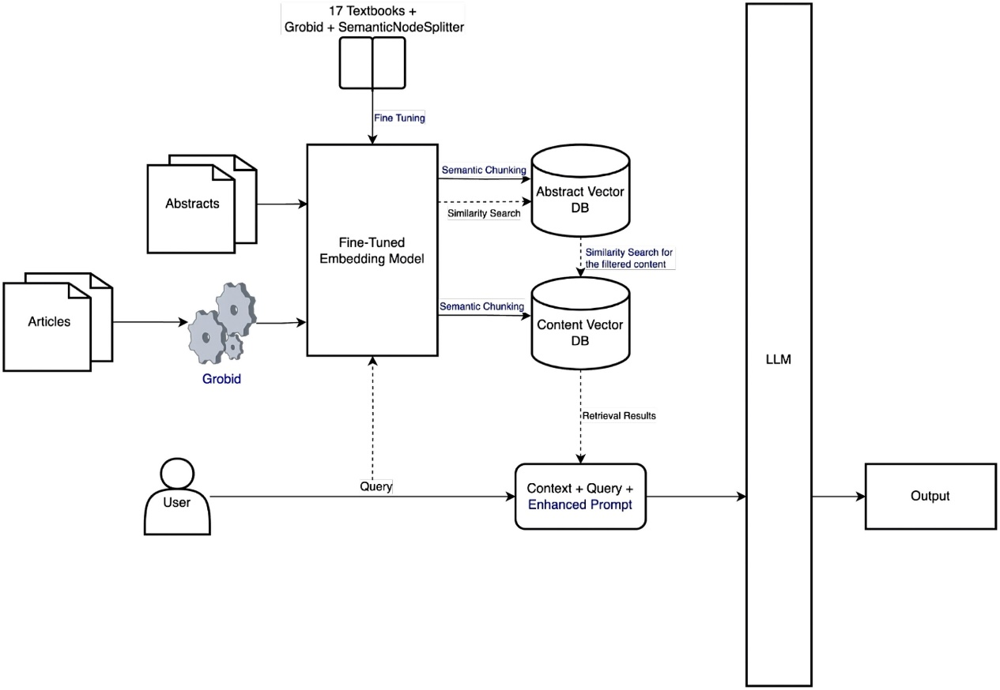
<p style="text-align:center;">
  <sub>تصویر ۶ – معماری پیشنهاد شده در مقاله Aytar</sub>
</p>

<br>

### مراحل معماری پیشنهادی
بر اساس تصویر شماره ۶، روش ارائه‌شده شامل پنج مرحله‌ی اصلی است:<br>
<br>
&nbsp; ۱- پیش‌پردازش و پاک‌سازی اطلاعات منبع داده با استفاده از ابزار GROBID.<br>
&nbsp; ۲- فاین‌تیون و تنظیم مجدد مدل‌های embedding بر اساس داده‌های مرجع تخصصی.<br>
&nbsp; ۳- قطعه‌بندی معنایی (Semantic Chunking) برای حفظ انسجام و ارتباط مفهومی در داده‌های منبع.<br>
&nbsp; ۴- به‌کارگیری رویکرد اول-چکیده [^21] در فرآیند بازیابی اطلاعات.<br>
&nbsp; ۵- استفاده از تکنیک‌های دستور بهینه‌شده [^22] در عملیات پرسش کاربر.<br>
<br>
هر یک از این مراحل در بخش «پیاده‌سازی» به‌صورت مفصل‌تر مورد بررسی قرار خواهند گرفت.

---
## پیاده سازی: آماده سازی داده ها
### جمع آوری اطلاعات و پیش پردازش
نویسندگان این مقاله برای جمع‌آوری داده‌های مورد استفاده در مدل و ارزیابی عملکرد آن، مجموعه‌ای شامل ۵۰ پرسش به همراه پاسخ‌های مرجع طراحی کرده‌اند تا امکان مقایسه نتایج فراهم شود. این پرسش‌ها از موضوعات متنوعی همچون مخابرات، کشاورزی، مالی و سایر حوزه‌ها انتخاب شده‌اند.<br>

به‌علاوه، طراحی پرسش‌ها به‌گونه‌ای انجام شده است که سه مرحله‌ی اصلی از فریم‌ورک CRISP-DM [16]  ـ یکی از مدل‌های شناخته‌شده در حوزه‌ی داده‌کاوی ـ را پوشش دهد:<br>

&nbsp; •	مرحله آماده‌سازی داده‌ها: شامل ۱۰ پرسش.<br>
&nbsp; •	مرحله مدل‌سازی: شامل ۳۵ پرسش.<br>
&nbsp; •	مرحله ارزیابی: شامل ۵ پرسش.<br>

این تقسیم‌بندی موجب می‌شود ارزیابی عملکرد معماری پیشنهادی در تمامی مراحل کلیدی فرآیند داده‌کاوی صورت گیرد و نتایج به‌صورت جامع‌تر مورد بررسی قرار گیرند.

<br>

#### به صورت دقیق تر: <br>


&nbsp;۱- مرحله آماده‌سازی داده‌ها:<br><br>
&nbsp;&nbsp;&nbsp;•	انتخاب ویژگی‌ها: ۳ پرسش<br>
&nbsp;&nbsp;&nbsp;•	حذف داده‌های پرت: ۲ پرسش<br>
&nbsp;&nbsp;&nbsp;•	کاهش ابعاد: ۵ پرسش<br>

<br>


&nbsp;۲- مرحله مدل‌سازی: <br><br>
&nbsp;&nbsp;&nbsp;•	تولید داده‌های ترکیبی: ۳ پرسش<br>
&nbsp;&nbsp;&nbsp;•	دسته‌بندی(Classification): ۵ پرسش<br>
&nbsp;&nbsp;&nbsp;•	رگرسیون(Regression): ۵ پرسش<br>
&nbsp;&nbsp;&nbsp;•	خوشه‌بندی(Clustering): ۵ پرسش<br>
&nbsp;&nbsp;&nbsp;•	یادگیری تقویتی(Reinforcement Learning): ۲ پرسش<br>
&nbsp;&nbsp;&nbsp;•	تشخیص تصاویر(Image Recognition): ۵ پرسش<br>
&nbsp;&nbsp;&nbsp;•	پردازش زبان طبیعی (NLP): ۵ پرسش<br>
&nbsp;&nbsp;&nbsp;•	تحلیل سری‌های زمانی(Time Series Analysis) : ۵ پرسش<br>

<br>


&nbsp;۳- مرحله ارزیابی عملکرد مدل:<br>
&nbsp;&nbsp;&nbsp;•	اختصاص ۵ پرسش برای سنجش کیفیت و دقت نتایج.<br>

<br>

<br>

 سپس نویسندگان مقاله، با توجه به پرسش‌های طراحی‌شده، هر پرسش را به کمک مدل GPT-4o به سه بخش اصلی تبدیل کردند:
<br>
<br>
&nbsp;•	تاپیک اصلی [^23]<br>
&nbsp;•	حوزه‌های کاربرد [^24]<br>
&nbsp;•	الزامات مشخص [^25] <br>

بر اساس موضوعات استخراج‌شده، مقالات مرتبط برای هر پرسش از طریق رابط برنامه‌نویسی `arXiv API` دریافت شدند. در مجموع حدود ۵۰۰۰ مقاله در قالب فایل‌های PDF گردآوری شد تا به‌عنوان منبع داده برای مراحل بعدی معماری مورد استفاده قرار گیرند.<br>

&nbsp;&nbsp;&nbsp;با توجه به اهمیت مرحله‌ی ارزیابی، لازم است پرسش‌های طراحی‌شده و پاسخ‌های مرجع از صحت و دقت بالایی برخوردار باشند. به‌منظور اطمینان بیشتر در پیاده‌سازی مقاله، ابتدا فهرستی شامل حدود ۵۰۰۰ مقاله از موضوعات مختلف از طریق رابط برنامه‌نویسی `arXiv API` گردآوری شد و سپس نسخه‌های آینه‌ی [^26] آن‌ها از طریق پایگاه داده‌ی گوگل بارگیری گردید.

<br>

در ادامه، با استفاده از ۵۰ پرسش طراحی‌شده توسط نویسندگان، پاسخ‌های تولیدشده توسط مدل‌های زبانی مختلف مورد ارزیابی و مقایسه قرار گرفتند. نتایج این مقایسه در بخش «نتایج» به‌صورت تفصیلی ارائه خواهد شد.

<br>

برای دریافت مقالات، ابتدا لازم است ابزارها و کتابخانه‌های مورد نیاز نصب شوند:<br>


&nbsp; **۱- ابزار gsutil:** این ابزار که توسط Google Cloud ارائه شده است [17]، امکان مدیریت حافظه‌های ابری را فراهم می‌کند. از طریق آن می‌توان عملیات‌هایی مانند بارگیری [^27] ، بارگذاری [^28] و سایر تعاملات مرتبط با لیست‌های سطلی [^29] را از طریق خط فرمان اجرا کرد.

<br>

برای نصب و راه‌اندازی ابزار gsutil مراحل زیر دنبال می‌شوند:
<br>

&nbsp;-**در سیستم عامل ویندوز:**
<br>
&nbsp;&nbsp;&nbsp;فایل نصب Google Cloud CLI را از لینک زیر دریافت کرده:

[https://dl.google.com/dl/cloudsdk/channels/rapid/GoogleCloudSDKInstaller.exe](https://dl.google.com/dl/cloudsdk/channels/rapid/GoogleCloudSDKInstaller.exe)

<br>

&nbsp;&nbsp;&nbsp;یا می‌توان در PowerShell دستور زیر را وارد کرد:
<br>

```Powershell
(New-Object Net.WebClient).DownloadFile("https://dl.google.com/dl/cloudsdk/channels/rapid/GoogleCloudSDKInstaller.exe", "$env:Temp\GoogleCloudSDKInstaller.exe")

$env:Temp\GoogleCloudSDKInstaller.exe
```
<br>

&nbsp;-**راهنمای نصب برای سایر سیستم‌عامل‌ها و توزیع‌های لینوکس در لینک زیر در دسترس است:**

[https://cloud.google.com/storage/docs/gsutil_install](https://cloud.google.com/storage/docs/gsutil_install)

<br>

&nbsp; **۲- کتابخانه‌ی feedparser:** این کتابخانه در زبان Python برای پردازش و تجزیه‌ی فیدهای RSS و Atom مورد استفاده قرار می‌گیرد و امکان استخراج و مدیریت داده‌های منتشرشده در این فیدها را فراهم می‌سازد. برای نصب این کتابخانه کافی است تا دستور pip install feedparser  در محیط خط فرمان پایتون اجرا شود.

<br>

### دریافت مقالات
کد زیر نحوه ی دریافت مقالات را نشان می‌دهد:

```python
import feedparser
import os
import time
import json
from collections import defaultdict

MAX_TOTAL_PAPERS = 5200
CATEGORIES = ["cs.LG", "stat.ML", "cs.CL", "cs.AI", "cs.CV", "cs.NE", "cs.IR", "cs.CR", "cs.SE", "cs.SI"]
BATCH_SIZE = 100
category_papers = defaultdict(list)

```

<br>

در ابتدای کد، کتابخانه‌های مورد نیاز برای اجرای عملیات فراخوانی می‌شوند. این کتابخانه‌ها شامل ابزارهایی برای پردازش فیدها، مدیریت فایل‌ها، زمان‌بندی، کار با داده‌های JSON و ساختارهای داده‌ای پیشرفته هستند.<br>
پس از آن، متغیرهای اصلی برای کنترل فرآیند دریافت مقالات تعریف می‌شوند:

<br>
•	MAX_TOTAL_PAPERS: این متغیر حداکثر تعداد مقالاتی را که باید از پایگاه داده دریافت شوند مشخص می‌کند (در اینجا ۵۲۰۰ مقاله). <br>
•	CATEGORIES: در این متغیر، فهرستی از دسته‌بندی‌ها و موضوعات علمی مورد نظر تعریف شده است؛ مانند یادگیری ماشین، هوش مصنوعی، بینایی ماشین، پردازش زبان طبیعی و سایر حوزه‌های مرتبط.<br>
•	BATCH_SIZE: این متغیر اندازه‌ی هر دسته‌ی بارگیری مقالات را تعیین می‌کند (در اینجا ۱۰۰ مقاله در هر بارگیری). بسته‌بندی داده‌ها علاوه بر مدیریت بهتر منابع سیستم، نقش مهمی در افزایش سرعت جمع‌آوری اطلاعات و دریافت مقالات دارد. به این ترتیب، به‌جای پردازش کل داده‌ها به‌صورت یک‌جا، داده‌ها در بسته‌های کوچک‌تر تقسیم شده و به‌صورت مرحله‌ای بارگیری می‌شوند. این روش هم فشار روی حافظه و پردازنده را کاهش می‌دهد و هم امکان کنترل بهتر جریان داده‌ها را فراهم می‌سازد.<br>
•	category_papers: یک ساختار داده‌ای از نوع `defaultdict(list)` برای ذخیره‌ی مقالات دریافت‌شده بر اساس دسته‌بندی‌ها.
<br>

هر کد از فهرست زیر، معرف یک شاخه‌ی پژوهشی در پایگاه داده‌ی arXiv می‌باشد:

<br>


|                      عنوان                     |     کد دسته بندی    |
|:----------------------------------------------:|:-------------------:|
|         Machine Learning (علوم کامپیوتر)       |         cs.LG       |
|             Machine Learning (آمار)            |        stat.ML      |
|             Computation and Language           |         cs.CL       |
|             Artificial Intelligence            |         cs.AI       |
|     Computer Vision and Pattern Recognition    |         cs.CV       |
|        Neural and Evolutionary Computing       |         cs.NE       |
|              Information Retrieval             |         cs.IR       |
|            Cryptography and Security           |         cs.CR       |
|               Software Engineering             |         cs.SE       |
|         Social and Information Networks        |         cs.SI       |


<sub>جدول ۱ – کد های مربوط به شاخه های پژوهشی در arXiv</sub>


<br>

سپس تابع `()fetch_metadata` برای واکشی و ذخیره‌سازی اطلاعات مقالات از پایگاه داده‌ی arXiv  به صورت زیر تعریف می‌شود:

<br>

```python
def fetch_metadata():
    base_url = "http://export.arxiv.org/api/query?"
    total_collected = 0
    for cat in CATEGORIES:
        print(f"\n📚 Fetching category: {cat}")
        for start in range(0, 750, BATCH_SIZE):
            query = f"cat:{cat}"
            url = (
                f"{base_url}search_query={query}&start={start}&max_results={BATCH_SIZE}"
                f"&sortBy=submittedDate&sortOrder=descending"
            )

            feed = feedparser.parse(url)
            if len(feed.entries) == 0:
                print("  ⚠️ No more results for this category.")
                break

            for e in feed.entries:
                pid = e.id.split("/")[-1]
                paper = {
                    "id": pid,
                    "title": e.title.strip(),
                    "published": e.published,
                    "category": cat,
                }
                category_papers[cat].append(paper)

            print(f"  ✅ Batch {start}-{start+BATCH_SIZE}, total={len(category_papers[cat])}")
            time.sleep(2)
    all_papers = []
    for cat in CATEGORIES:
        all_papers.extend(category_papers[cat])
    json.dump(all_papers, open("arxiv_papers.json", "w", encoding="utf-8"), indent=2)

    print("\n📊 Paper counts per category:")
    for cat in CATEGORIES:
        print(f"  - {cat}: {len(category_papers[cat])}")
    return category_papers
```

همان‌طور که مشاهده می‌شود، تابع متادیتای مقالات را بر اساس موضوعات تعریف‌شده (cat) از arXiv API جمع‌آوری می‌کند. سپس داده‌های استخراج‌شده در فایل `arxiv_papers.json` ذخیره می‌شوند. در ادامه، تعداد مقالات دریافت‌شده برای هر دسته‌بندی نمایش داده شده و در نهایت، لیست کامل مقالات در ساختار `category_papers` بازگردانده می‌شود تا در مراحل بعدی پردازش مورد استفاده قرار گیرد.

<br>

در ادامه، در بخش بعدی کد، تابع `()select_papers` تعریف شده است که وظیفه‌ی انتخاب مقالات مورد نظر از میان داده‌های جمع‌آوری‌شده را بر عهده دارد:

```python
def select_papers(category_papers):
    selected = []
    total_available = sum(len(p) for p in category_papers.values())
    print(f"\n📦 Total available papers: {total_available}")

    for cat in CATEGORIES:
        cat_count = len(category_papers[cat])
        share = int((cat_count / total_available) * MAX_TOTAL_PAPERS)
        selected.extend(category_papers[cat][:share])
        print(f"  ✅ Selected {share} papers from {cat}")

    print(f"\n🎯 Total selected for GCS path generation: {len(selected)}")
    return selected
```

در کد بالا،‌ روند اجرای این تابع به صورت زیر است:<br>

&nbsp;•	ابتدا مجموع کل مقالات موجود در همه‌ی دسته‌بندی‌ها محاسبه و نمایش داده می‌شود.<br>
&nbsp;•	سپس برای هر دسته‌بندی، نسبت تعداد مقالات آن دسته به کل مقالات محاسبه می‌گردد.<br>
&nbsp;•	بر اساس این نسبت، سهم هر دسته از مقدار آستانه‌ی تعیین‌شده (MAX_TOTAL_PAPERS = 5200) مشخص می‌شود.<br>
&nbsp;•	به عنوان مثال، اگر دسته‌ی cs.LG حدود ۲۰٪ از کل ۷۰۰۰ مقاله‌ی اولیه را تشکیل دهد، در انتخاب نهایی نیز حدود ۲۰٪ از ۵۲۰۰ مقاله‌ی هدف به این دسته اختصاص داده خواهد شد.<br>
&nbsp;•	در نهایت، لیست مقالات انتخاب‌شده در خروجی بازگردانده می‌شود تا برای مراحل بعدی (مانند تولید مسیرهای ذخیره‌سازی یا پردازش بیشتر) مورد استفاده قرار گیرد.<br>

<br>
سپس لیست نهایی مقالات انتخاب‌شده (ذخیره‌شده در متغیر selected) به تابع نهایی ارسال می‌شود. این تابع وظیفه دارد لینک‌های دانلود مربوط به هر مقاله را ایجاد کرده و برای استفاده‌های بعدی آماده سازد.

<br>

```python
def generate_gcs_paths(papers, output_file="gcs_paths.txt"):
    paths = []
    for p in papers:
        pid = p["id"]
        prefix = pid[:4]    
        gcs_path = f"gs://arxiv-dataset/arxiv/arxiv/pdf/{prefix}/{pid}.pdf"
        paths.append(gcs_path)

    with open(output_file, "w") as f:
        f.write("\n".join(paths))

    print(f"\n✅ GCS paths saved in: {output_file}")
    print(f"📥 To download, run:\n  gsutil -m cp -I ./pdfs < {output_file}")
```
تابع `()generate_gcs_paths` وظیفه‌ی تولید مسیرهای دانلود مقالات از فضای ابریGoogle Cloud Storage (GCS) را بر عهده دارد. روند اجرای این تابع به صورت زیر است:

&nbsp;&nbsp;&nbsp;•	ابتدا برای هر مقاله، شناسه‌ی مقاله (id) استخراج می‌شود.
<br>
&nbsp;&nbsp;&nbsp;•	سپس چهار رقم ابتدایی شناسه به عنوان prefix در مسیر ذخیره‌سازی استفاده می‌گردد.
<br>
&nbsp;&nbsp;&nbsp;•	مسیر نهایی فایل PDF مقاله بر اساس قالب زیر ساخته می‌شود:<br>
```terminal
gs://arxiv-dataset/arxiv/arxiv/pdf/{prefix}/{id}.pdf
```
&nbsp;&nbsp;&nbsp;•	و	همه‌ی مسیرهای ساخته‌شده در یک لیست جمع‌آوری می‌شوند.<br>
&nbsp;&nbsp;&nbsp;•	در پایان، این لیست در فایل متنی `gcs_paths.txt` ذخیره می‌شود تا در مراحل بعدی برای دانلود دسته‌ای مقالات مورد استفاده قرار گیرد.<br>
&nbsp;&nbsp;&nbsp;•	همچنین دستور نمونه‌ای برای دانلود فایل‌ها با ابزار gsutil چاپ می‌شود تا کاربر بتواند مقالات را به‌صورت خودکار دریافت کند.<br>


در پایان این کد، pipeline دستورات فراخوانی توابع نوشته شده و سپس فایل .py این کد پایتون اجرا می‌گردد.

```python
if __name__ == "__main__":
    category_papers = fetch_metadata()
    selected_papers = select_papers(category_papers)
    generate_gcs_paths(selected_papers)
```
<br>
خروجی اجرای این برنامه به صورت زیر خواهد بود:

```terminal
(venv) /root/myprojects/synergisticrag/download_arxiv_pdfs.py

📚 Fetching category: cs.LG
  ✅ Batch 0-100, total=100
  ✅ Batch 100-200, total=200
  ⚠️ No more results for this category.
.
...
.....

📊 Paper counts per category:
  - cs.LG: 200
  - stat.ML: 400
  - cs.CL: 400
  - cs.AI: 100
  - cs.CV: 100
  - cs.NE: 500
  - cs.IR: 300
  - cs.CR: 300
  - cs.SE: 500
  - cs.SI: 800

📦 Total available papers: 3600
  ✅ Selected 288 papers from cs.LG
  ✅ Selected 577 papers from stat.ML
  ✅ Selected 577 papers from cs.CL
  ✅ Selected 144 papers from cs.AI
  ✅ Selected 144 papers from cs.CV
  ✅ Selected 722 papers from cs.NE
  ✅ Selected 433 papers from cs.IR
  ✅ Selected 433 papers from cs.CR
  ✅ Selected 722 papers from cs.SE
  ✅ Selected 1155 papers from cs.SI

🎯 Total selected for GCS path generation: 5200
✅ GCS paths saved in: gcs_paths.txt
📥 To download, run:
  gsutil -m cp -I ./pdfs < gcs_paths.txt
```
<br>

سپس با اجرای دستور `gsutil -m cp -I ./pdfs < gcs_paths.txt` در ترمینال (powershell یا Bash) مقالات دریافت می‌شوند.
<br>
نتیجه ی اجرای دستور مشابه زیر خواهد بود:


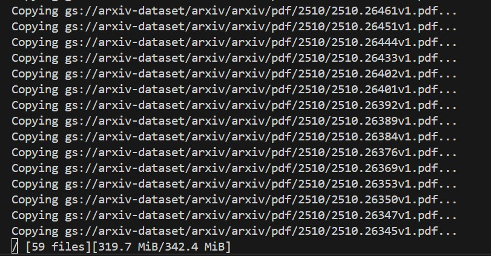
<p style="text-align:center;">
  <sub>تصویر ۷ – ترمینال bash در حال اجرای دستور gsutil</sub>
</p>

<br>

---
## پیش‌پردازش اطلاعات
پس از دریافت فایل‌های مقالات و قرار دادن آن‌ها در پوشه‌ی pdfs، مرحله‌ی پیش‌پردازش آغاز می‌شود. در این مرحله، فرمت مقالات از PDF به TEI تبدیل خواهد شد.

<br>
برای پیش‌پردازش و تبدیل فایل‌های PDF به فرمت‌های متنی مانند txt، xml یا سایر قالب‌های قابل پردازش، ابزارهای متنوعی ارائه شده‌اند.<br>

&nbsp;•	ابزارهای عمومی برای تبدیل فرمت:<br>

&nbsp;&nbsp;&nbsp;o	ابزار PyMuPDF<br>
&nbsp;&nbsp;&nbsp;o	ابزار PDFplumber<br>
&nbsp;&nbsp;&nbsp;o	ابزار PyPDF2<br>

این ابزارها امکان استخراج متن از فایل‌های PDF و ذخیره‌سازی آن در قالب‌های ساده‌تر را فراهم می‌کنند.

<br>

&nbsp;•	ابزارهای تخصصی‌تر:
<br>

&nbsp;&nbsp;&nbsp;o	ابزار Camelot [18] این ابزار به‌طور ویژه برای استخراج جدول‌ها از فایل‌های PDF طراحی شده و در پروژه‌هایی که نیاز به پردازش داده‌های جدولی دارند بسیار کاربردی است.

<br>
برای پیش‌پردازش و پاکسازی متن، عملیات‌هایی مانند حذف علائم زائد و نویز (کاراکترهای ویژه)، جداسازی یا توکن‌سازی کلمات و ساده‌سازی داده‌ها انجام می‌شود. در این زمینه، ابزارهای NLP و پردازش متن متعددی ارائه شده‌اند.
<br>
یکی از ابزارهای پرکاربرد، NLTK است که امکانات متنوعی برای پردازش زبان طبیعی فراهم می‌کند. به عنوان نمونه، می‌توان از ماژول stopwords در این کتابخانه برای حذف کلمات توقف (مانند «و»، «از»، «به») استفاده کرد تا متن نهایی تمیزتر و آماده‌ی تحلیل شود.
نویسندگان این مقاله نیز برای انجام عملیات های فوق (شامل پاکسازی متن، تبدیل فرمت، شناسایی جملات و حذف نویز) از ابزار GROBID [19] استفاده کرده‌اند.

<br>

<br>

### اما GROBID چیست و چه مزایا و برتری‌هایی نسبت به سایر ابزارهای مشابه دارد؟
<br>
GROBID که مخفف  “GeneRation Of BIbliographic Data” [^30]  است، یک کتابخانه و ابزار مبتنی بر یادگیری ماشین می‌باشد. این ابزار با هدف استخراج، تجزیه‌وتحلیل و بازسازی اسناد علمی طراحی شده و قادر است فایل‌هایی با ساختارهایی مانند PDF را به قالب‌های متنی استاندارد نظیر XML/TEI تبدیل کند. تمرکز اصلی  GROBID بر نشریات علمی، مقالات پژوهشی و گزارش‌های فنی است و به همین دلیل در پروژه‌های مرتبط با پردازش و سازمان‌دهی داده‌های علمی کاربرد گسترده‌ای دارد.

<br>

از مهم‌ترین کاربرد های ابزار GROBID می‌توان به موارد زیر اشاره کرد:<br>

- استخراج سربرگ [^31] و تجزیه و تحلیل [^32] مقالات: اطلاعاتی مانند چکیده، نویسندگان، کلمات کلیدی و سایر داده های اولیه.
- استخراج منابع و متادیتا: شناسایی شناسه‌های استاندارد مانند DOI، PMID و دیگر داده‌های کتاب‌شناختی با استفاده از مدل‌های یادگیری عمیق در حوزه استناد [^33].
- شناسایی محتوای استناد: تشخیص بخش‌هایی از متن که به منابع دیگر ارجاع داده‌اند و شناسایی مراجعی که به آن‌ها استناد شده است.
- تحلیل منابع: بررسی و سازمان‌دهی داده‌های مربوط به منابع علمی.
- تحلیل نام‌ها: شناسایی و تجزیه‌ی نام اشخاص (نام کوچک، نام میانه، نام خانوادگی و...) در سربرگ و منابع، با استفاده از دو مدل مجزا.
- تحلیل پیوندها و آدرس‌ها: استخراج و پردازش لینک‌ها و نشانی‌های موجود در متن.
- تحلیل و نرمال‌سازی تاریخ‌ها: شناسایی تاریخ‌های موجود در متن و تبدیل آن‌ها به قالب استاندارد.
- سایر قابلیت‌ها: شامل مجموعه‌ای از ابزارهای کمکی برای پردازش و ساختارسازی داده‌های علمی.

<br>

در نتیجه‌ی این فرآیندهای پردازشی برای فایل‌های PDF، ابزار GROBID بیش از ۵۵ برچسب نهایی را برای ساختارهای ریزدانه [^34] شده مدیریت و پردازش می‌کند. این برچسب‌ها شامل انواع متادیتا و ساختارهای متنی مانند پاراگراف‌ها، تیترها، شرح تصاویر و سایر اجزای متن هستند.
<br>

در کنار کاربردهای ذکرشده، ابزار GROBID مزایای دیگری نیز دارد که آن را از سایر ابزارهای مشابه متمایز می‌سازد. از جمله می‌توان به سرعت بالا و مقیاس‌پذیری در پردازش داده‌های حجیم اشاره کرد؛ به‌طور مثال، یک سیستم مجهز به پردازنده‌ی ۱۶ هسته‌ای یا ۱۶ رشته‌ای و ۳۲ گیگابایت حافظه‌ی رم قادر است روزانه حدود ۹۱۵ هزار فایل PDF یا نزدیک به ۲۰ میلیون صفحه را پردازش کند. علاوه بر این، ماژولار بودن مدل‌های عمیق در این کتابخانه و بازکاربردپذیری [^35] آن‌ها در سایر برنامه‌ها و کدها، از دیگر ویژگی‌هایی است که GROBID را برجسته می‌سازد.
<br>

لذا در این پژوهش نیز برای انجام فرآیند پیش‌پردازش و اصلاح فایل‌های متنی دانلودشده از ابزار GROBID استفاده شده است.

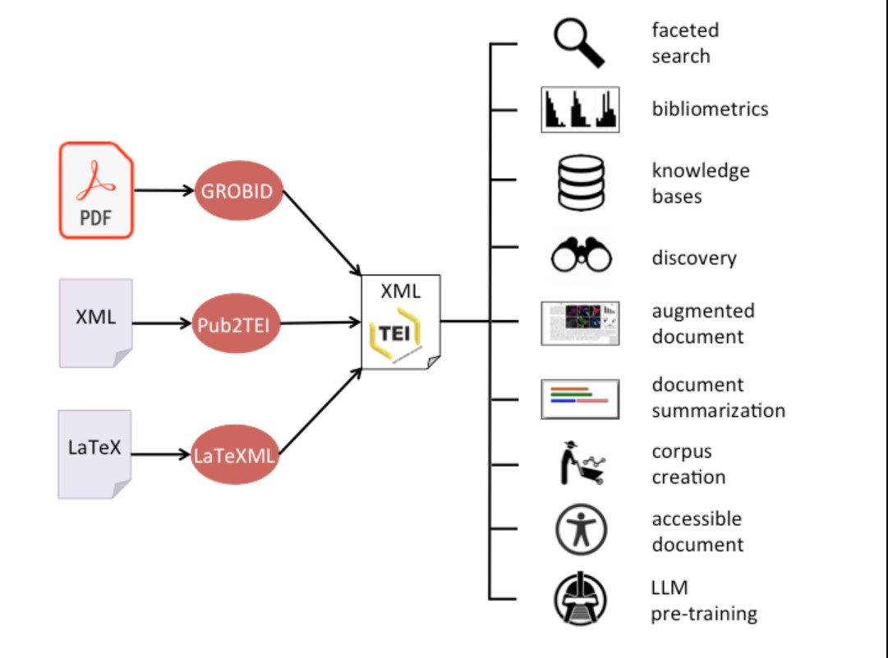
<p style="text-align:center;">
  <sub>تصویر ۸ – نحوه ی عملکرد GROBID – تصویر ارائه شده توسط توسعه دهنده</sub>
</p>

<br>

### نصب GROBID
برای نصب و راه‌اندازی GROBID، در ابتدا لازم است که Docker بر روی سیستم نصب شده باشد. این پیش‌نیاز امکان اجرای آسان و قابل حمل سرویس GROBID را فراهم می‌کند و محیطی ایزوله برای مدیریت وابستگی‌ها و اجرای پایدار آن ایجاد می‌نماید. 

<br>
- برای دریافت نسخه‌ی کامل و استفاده از قابلیت‌های آن روی GPU، می‌توان از دستور زیر بهره گرفت:

```powershell
docker run --rm --gpus all --init --ulimit core=0 -p 8070:8070 grobid/grobid:0.8.2-full 
```

این دستور باعث می‌شود:<br>

&nbsp;&nbsp;&nbsp;•	ایمیج کاملGROBID  (نسخه‌ی 0.8.2 `full-`) دریافت و اجرا شود.<br>
&nbsp;&nbsp;&nbsp;•	پردازش‌ها بر روی GPU سیستم با سرعت و قدرت بیشتری انجام گیرد.<br>
&nbsp;&nbsp;&nbsp;•	سرویس GROBID روی پورت 8070 در دسترس قرار گیرد.<br>
&nbsp;&nbsp;&nbsp;•	گزینه‌ی `rm-` پس از پایان اجرا کانتینر را حذف کند و سیستم تمیز باقی بماند.<br>
&nbsp;&nbsp;&nbsp;•	گزینه‌ی `init-` و `ulimit core=0--` برای مدیریت بهتر منابع و جلوگیری از تولید فایل‌های core dump استفاده شوند.<br>

<br>

- برای نصب و به‌کارگیری نسخه‌ی سبک GROBID که تنها بر روی CPU اجرا می‌شود، می‌توان از دستور زیر استفاده کرد:
```powershell
docker run --rm --init --ulimit core=0 -p 8070:8070 grobid/grobid:0.8.2-crf
```

در این حالت:<br>

&nbsp;&nbsp;&nbsp;•	خروجی حاصل دقت کمتری نسبت به نسخه‌ی کامل دارد.<br>
&nbsp;&nbsp;&nbsp;•	اما حجم image دریافت‌شده کمتر است.<br>
&nbsp;&nbsp;&nbsp;•	همچنین میزان مصرف حافظه‌ی RAM کاهش می‌یابد.
<br>


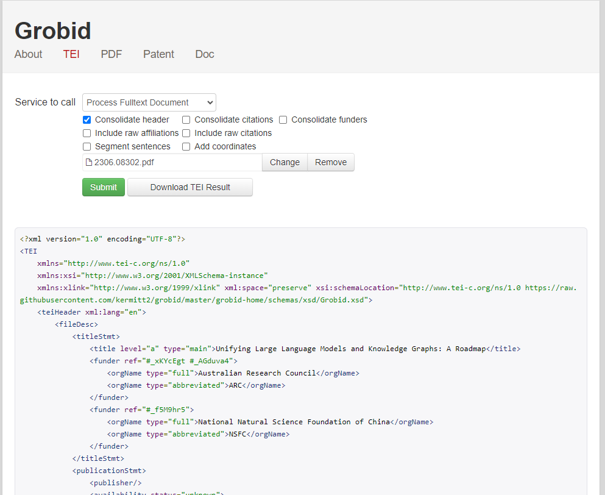
<p style="text-align:center;">
  <sub>تصویر ۹ – نمایی از رابط کاربری GROBID در localhost</sub>
</p>

<br>

### فرآیند پیش پردازش
برای انجام عملیات‌های پیش‌پردازش، ابتدا همان‌طور که پیش‌تر اشاره شد، کانتینر GROBID را با استفاده از دستور زیر فراخوانی می‌کنیم:

```powershell
 docker run --rm -d --name grobid_batch `
    -p 8070:8070 `
    -v " “Enter pdfs location here” :/pdfs" `
    -v " “Enter TEI outputs location here” :/tei" `
    lfoppiano/grobid:0.8.2
```

در این دستور:

&nbsp;&nbsp;&nbsp;•	خط اول: کانتینر تعریف شده و نام آن grobid_batch تعیین می‌شود. گزینه‌ی `rm-` مشخص می‌کند که پس از توقف کانتینر، به‌طور خودکار حذف شود.<br>
&nbsp;&nbsp;&nbsp;•	خط دوم: پورت اجرای سرویس روی 8070 تنظیم می‌شود تا دسترسی به GROBID امکان‌پذیر باشد.<br>
&nbsp;&nbsp;&nbsp;•	خط سوم: مسیر فایل‌های ورودی ( PDF ها) برای کانتینر تعریف می‌شود.<br>
&nbsp;&nbsp;&nbsp;•	خط چهارم: مسیر خروجی پردازش(فایل‌های TEI) مشخص می‌گردد.<br>
&nbsp;&nbsp;&nbsp;•	خط آخر: از نسخه ی رسمی GROBID در Docker hub استفاده می‌شود. (در صورت نیاز، می‌توان از نسخه‌های جایگزین مانند grobid/grobid:0.8.2-full و grobid/grobid:0.8.2-crf نیز بهره گرفت.)

<br>

در ادامه، اسکریپت پایتون تدوین‌شده برای انجام عملیات‌های پیش‌پردازش اجرا می‌گردد:
```python
import os, requests, json
from tqdm import tqdm
from time import sleep

PDF_DIR = r" Enter pdfs location here "
OUT_DIR = r" Enter TEI outputs location here "
API_URL = "http://localhost:8070/api/processFulltextDocument"

BATCH_SIZE = 5
RETRY_LIMIT = 1
TIMEOUT = 180
```
در ابتدای کد:
<br>
•	در خط اول، کتابخانه‌های لازم برای مدیریت فایل‌ها در سیستم عامل (os)، برقراری ارتباط با API (requests) و کار با داده‌های JSON فراخوانی می‌شوند. <br>
•	در خط دوم و سوم، ابزارهای کمکی شامل tqdm برای نمایش نوار پیشرفت و sleep برای مدیریت زمان‌بندی در پایپلاین پردازش وارد می‌شوند.<br>

سپس در خطوط مربوط به آدرس ها:<br>
&nbsp;&nbsp;&nbsp;•	`PDF_DIR`: مسیر فایل‌های ورودی (PDF ها) را مشخص می‌کند.<br>
&nbsp;&nbsp;&nbsp;•	`OUT_DIR`: مسیر فایل‌های خروجی (TEI) را تعیین می‌کند.<br>
&nbsp;&nbsp;&nbsp;•	`API_URL`: آدرس پردازش مورد نظر در سرویس GROBID را مشخص می‌نماید. در اینجا از ماژول<br> پردازش کامل `processFulltextDocument` استفاده شده است که شامل عملیات‌هایی مانند حذف نویز و یکسان‌سازی کلمات است. <br>

در سه خط پایانی: <br>
&nbsp;&nbsp;&nbsp;•	BATCH_SIZE = 5: اندازه هر بسته‌ی ورودی را تعیین می‌کند (پردازش ۵ فایل در هر نوبت اجرا).<br>
&nbsp;&nbsp;&nbsp;•	RETRY_LIMIT = 1: تعداد تلاش مجدد در صورت عدم موفقیت در پردازش را مشخص می‌کند.<br>
&nbsp;&nbsp;&nbsp;•	TIMEOUT = 180: حداکثر زمان پردازش هر فایل (بر حسب ثانیه) را تعیین می‌کند.

<br>

سپس پارامترهای مربوط به عملیات پیش‌پردازش مطابق کد زیر مشخص می‌گردند:
```python
PARAMS = {
    "consolidateHeader": 1,
    "consolidateCitations": 0,
    "segmentSentences": 1,
    "generateIDs": "true",
    "teiCoordinates": "false",
    "removeInvalidXMLChars": "true"
}
```

در این قسمت:<br>
&nbsp;&nbsp;&nbsp;•	خط اول: `consolidateHeader` اطلاعات سربرگ هر مقاله را (شامل عنوان، نویسندگان و موسسات) را تجمیع و ادغام می‌کند.<br>
&nbsp;&nbsp;&nbsp;•	خط دوم: `consolidateCitations` یا فرآیند ادغام ارجاعات است که با توجه نیازمندی به اتصال پایگاه داده و اطلاعات جانبی و عدم کاربرد در معماری RAG غیر فعال می‌شود.<br>
&nbsp;&nbsp;&nbsp;•	خط سوم: `segmentSentences` که وظیفه ی شناسایی و تفکیک جملات از یکدیگر را دارد. (این مورد با توجه به معماری مقاله و فرآیند قطعه بندی معنایی در مرحله ی بعد نقش کلیدی و حیاتی دارد.)<br>
&nbsp;&nbsp;&nbsp;•	خط چهارم:‌ `generateIDs` که برای هر بخش پردازش شده یک شناسه منحصر به فرد تولید میکند تا شناسایی و پردازش ارجاعات انجام شود.<br>
&nbsp;&nbsp;&nbsp;•	خط پنجم: `teiCoordinates` که مختصات هر عنصر را در صفحه تشخیص میدهد.(این مورد نیز غیرضروری است.)<br>
&nbsp;&nbsp;&nbsp;•	خط ششم: `removeInvalidXMLChars` که وظیفه ی آن شناسایی و حذف کاراکتر هایی است که منجر به خرابی خروجی XML می‌شود. لذا فعال سازی آن ضروری است.<br>


در قسمت بعد:
```python
os.makedirs(OUT_DIR, exist_ok=True)
meta_file = os.path.join(OUT_DIR, "metadata.jsonl")
fail_file = os.path.join(OUT_DIR, "failed.txt")

pdf_files = [
    f for f in os.listdir(PDF_DIR)
    if f.lower().endswith(".pdf") 
    and not os.path.exists(os.path.join(OUT_DIR, f.replace(".pdf", ".tei.xml")))
]
```
&nbsp;&nbsp;&nbsp;•	در خط اول برای اطمینان بیشتر، مسیر خروجی (OUT_DIR) در صورت عدم وجود ایجاد می‌شود تا فایل‌های پردازش‌شده در آن ذخیره گردند.<br>

&nbsp;&nbsp;&nbsp;•	در خط دوم و سوم :‌ <br>
&nbsp;&nbsp;&nbsp;&nbsp;&nbsp;&nbsp;o	فایل `metadata.jsonl` برای ذخیره‌ی متادیتای مربوط به فایل‌های پردازش‌شده ایجاد می‌شود.<br>
&nbsp;&nbsp;&nbsp;&nbsp;&nbsp;&nbsp;o	فایل `failed.txt` برای ثبت نام فایل‌هایی که پردازش آن‌ها ناموفق بوده است در نظر گرفته <br>می‌شود.

&nbsp;&nbsp;&nbsp;•	بخش مربوط به `pdf_files`: با مقایسه‌ی فایل‌های موجود در مسیر ورودی `PDF_DIR` و خروجی `OUT_DIR`، تنها فایل‌های PDF که هنوز پردازش نشده‌اند در لیست `pdf_files` قرار می‌گیرند. این کار به منظور جلوگیری از پردازش تکراری انجام می‌شود.

<br>

در حلقه اصلی کد:
```python
for i in range(0, len(pdf_files), BATCH_SIZE):
    batch = pdf_files[i:i+BATCH_SIZE]

    for fname in tqdm(batch, desc=f"Batch {i//BATCH_SIZE + 1}"):
        pdf_path = os.path.join(PDF_DIR, fname)
        tei_path = os.path.join(OUT_DIR, fname.replace(".pdf", ".tei.xml"))

        for attempt in range(1, RETRY_LIMIT + 1):
            try:
                with open(pdf_path, "rb") as f:
                    r = requests.post(API_URL, files={"input": f}, params=PARAMS, timeout=TIMEOUT)

                if r.status_code == 200 and len(r.content) > 500 and b"<TEI" in r.content:
                    with open(tei_path, "wb") as out:
                        out.write(r.content)
                    
                    with open(meta_file, "a", encoding="utf-8") as mf:
                        mf.write(json.dumps({"pdf": pdf_path, "tei": tei_path}) + "\n")
                    break
                else:
                    print(f"⚠️ HTTP {r.status_code} for {fname}, attempt {attempt}")
            except requests.exceptions.RequestException as e:
                print(f"❌ Exception for {fname}, attempt {attempt}: {e}")

            sleep(2)
        else:
            with open(fail_file, "a", encoding="utf-8") as ff:
                ff.write(fname + "\n")
            print(f"❌ Failed after {RETRY_LIMIT} attempts: {fname}")

    sleep(1)

print(f"\n✅ Completed. {len(os.listdir(OUT_DIR))} TEI files created in {OUT_DIR}")
```

&nbsp;&nbsp;&nbsp;•	در حلقه‌ی بیرونی: فایل‌های PDF بر اساس اندازه‌ی بسته‌ی تعیین‌شده `BATCH_SIZE` به ترتیب وارد فرآیند پردازش می‌شوند.<br>
&nbsp;&nbsp;&nbsp;•	در حلقه‌ی میانی: هر فایل در بسته بررسی شده و مسیر ورودی `pdf_path` و خروجی `tei_path` آن مشخص می‌گردد.<br>

&nbsp;&nbsp;&nbsp;•	در حلقه‌ی داخلی (تلاش مجدد): <br>
&nbsp;&nbsp;&nbsp;&nbsp;&nbsp;&nbsp;o	فایل PDF باز شده و به API سرویس GROBID ارسال می‌شود.<br>
&nbsp;&nbsp;&nbsp;&nbsp;&nbsp;&nbsp;o	در صورت موفقیت (کد وضعیت 200 و محتوای معتبر شامل تگ `<TEI>`)، خروجی پردازش در مسیر مقصد ذخیره می‌شود.<br>
&nbsp;&nbsp;&nbsp;&nbsp;&nbsp;&nbsp;o	سپس متادیتای مربوط به فایل در `meta_file` ثبت می‌گردد. <br>
&nbsp;&nbsp;&nbsp;&nbsp;&nbsp;&nbsp;o	در صورت خطا یا عدم موفقیت، پیام هشدار نمایش داده می‌شود و پس از پایان تعداد تلاش‌های مجاز `RETRY_LIMIT`، نام فایل در `fail_file` ذخیره می‌شود.<br>

&nbsp;&nbsp;&nbsp;•	مدیریت زمان‌بندی: بین هر تلاش و هر بسته پردازش، توقف کوتاه (sleep) برای مدیریت پایپلاین در نظر گرفته شده است.<br>
&nbsp;&nbsp;&nbsp;•	پایان برنامه: پس از تکمیل پردازش، تعداد فایل‌های TEI ایجادشده در مسیر خروجی نمایش داده می‌شود.

<br>

در پایان نیز پیام اتمام پردازش به نمایش در می‌آید.


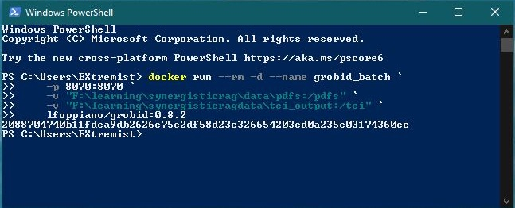
<p style="text-align:center;">
  <sub>تصویر ۱۰ – نمونه ی دستور اجرای کانتینر GROBID</sub>
</p>

<br>


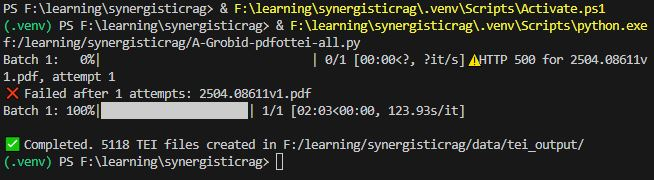
<p style="text-align:center;">
  <sub>تصویر ۱۱ – نمونه ی ترمینال اجرای دستورات کد پیش‌پردازش</sub>
</p>

<br>

به طور مثال در تصویر ۱۱ مشاهده می‌شود که پس از اجرای کد عملیات پیش‌پردازش بر روی ۵۱۱۹ فایل مقاله، تعداد ۵۱۱۸ فایل پردازش شده و تنها یک فایل با خطا مواجه گردیده است.<br>

علت بروز خطا می‌تواند موارد زیر باشد:<br>
&nbsp;&nbsp;&nbsp;•	عدم دسترسی به فضای کافی حافظه‌ی RAM در زمان پردازش.<br>
&nbsp;&nbsp;&nbsp;•	اسکرین‌شات بودن فایل مقاله (به علت عدم وجود قابلیت OCR در GROBID).<br>
&nbsp;&nbsp;&nbsp;•	خرابی یا ناقص بودن فایل ورودی.<br>
&nbsp;&nbsp;&nbsp;•	رمزگذاری یا محدودیت‌های امنیتی اعمال‌شده بر روی فایل<br>
&nbsp;&nbsp;&nbsp;•	سایر مشکلات مرتبط با ساختار فایل PDF.<br>

در سیستم مورد استفاده برای تهیه‌ی این گزارش، از پردازنده‌ی Intel Core i7-8700K، به همراه ۳۲ گیگابایت حافظه‌ی RAM و کارت گرافیک Nvidia GTX 1080Ti 11GB OC بهره گرفته شده است. از مجموع حافظه‌ی RAM، مقدار ۱۵ گیگابایت به اجرای سرویس GROBID در محیط Docker اختصاص یافته است.<br>

مدت زمان سپری‌شده برای اجرای عملیات پیش‌پردازش تقریباً ۱۰ ساعت بوده است. لازم به ذکر است که اعداد نمایش داده‌شده در تصویر مربوط به اجرای دوم کد هستند و از دقت کامل برخوردار نمی‌باشند.

<br>

---
## پیاده سازی: مدل های جانمایی

### مدل های جانمایی

در دومین مرحله از پیاده‌سازی معماری RAG هم‌افزا، به بررسی و به‌کارگیری مدل‌های جانمایی [^36] پرداخته می‌شود.<br>

در حوزه‌ی یادگیری ماشین، جانمایی‌ یکی از روش‌های یادگیری بازنمایی [^37] یا یادگیری ویژگی [^38] به‌شمار می‌رود که طی آن داده‌های پیچیده و با ابعاد بالا به یک فضای برداری با ابعاد کمتر نگاشت می‌شوند. هدف از این فرایند، کاهش پیچیدگی داده‌ها و استخراج ویژگی‌های کلیدی بدون اتکا به دانش پیشین [^39] درباره‌ی ساختار یا محتوای داده است.<br>

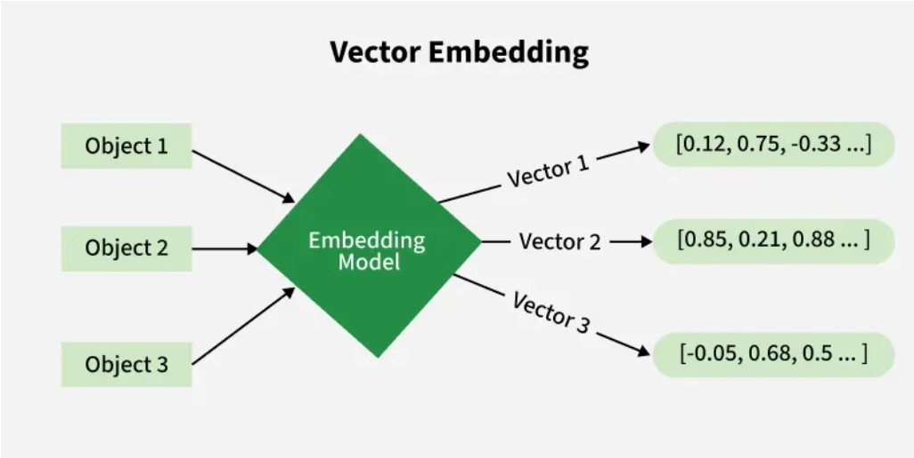
<p style="text-align:center;">
  <sub>تصویر ۱۲ – شمای کلی از نحوه ی عملکرد مدل embedding</sub>
</p>

<br>

در پردازش زبان های طبیعی نیز یکی از روش های بازنمایی استفاده از بردار های ویژگی برای تصویر کردن مفاهیم مشابه در نزدیکی یکدیگر می‌باشد. برای محاسبه ی فاصله دو بازنمایی لازم است تا یک معیار شباهت انتخاب شود.<br>


معیار های شباهت عبارتند از:<br>

&nbsp;&nbsp;&nbsp;۱- فاصله ی اقلیدسی : <br>

&nbsp;&nbsp;&nbsp;&nbsp;&nbsp;&nbsp;فرمول:

<br>

$$
|a - b|
$$

<br>

&nbsp;&nbsp;&nbsp;&nbsp;&nbsp;&nbsp;فرمول اسکالر:
<br>

$$
\sqrt{ \sum (a_n - b_n)^2 }
$$

<br>

&nbsp;&nbsp;&nbsp;۲- شباهت کسینوسی :<br>
 
&nbsp;&nbsp;&nbsp;&nbsp;&nbsp;&nbsp;فرمول:

<br>

$$
\frac{a \cdot b}{|a| \, |b|}
$$

<br>

&nbsp;&nbsp;&nbsp;&nbsp;&nbsp;&nbsp;فرمول اسکالر:

<br>

$$
\frac{ \sum a_n b_n }{ \sqrt{ \left( \sum a_n^2 \right) \left( \sum b_n^2 \right) } }
$$

<br>

۳- ضرب داخلی :

 &nbsp;&nbsp;&nbsp;&nbsp;&nbsp;&nbsp;فرمول:

<br>

$$
a \cdot b
$$


<br>

&nbsp;&nbsp;&nbsp;&nbsp;&nbsp;&nbsp;فرمول اسکالر:

<br>

$$
\sum a_n b_n
$$

<br>

از جمله ابزارهای رایج در حوزه‌ی بازنمایی برداری می‌توان به مدل GloVe ارائه‌شده توسط دانشگاه استنفورد‌ [20]، و همچنین مدل‌های BERT [21] و Word2Vec [22] توسعه‌یافته توسط گوگل اشاره کرد. <br>

برای پردازش جملات در این معماری، از یک مدل جانمایی جملات مبتنی بر ماژول Sentence Transformers ـ که به‌طور معمول با عنوان SBERT شناخته می‌شود ـ استفاده شده است‌ [23]. در این پیاده‌سازی، مدل `all-mpnet-base-v2` به‌عنوان مدل اصلی تولید بازنمایی‌های برداری جملات به‌کار گرفته شده است. <br>

برای دریافت و استفاده از مدل به‌صورت محلی، امکان مراجعه به پایگاه HuggingFace و دانلود نسخه‌ی موردنظر وجود دارد. همچنین می‌توان مدل را در زمان اجرای فرآیند پردازش، به‌صورت مستقیم فراخوانی و بارگذاری کرد. <br>

برای پیاده‌سازی روش نخست، ابتدا با استفاده از دستور زیر ماژول `Sentence-Transformers` دریافت و در محیط کاری نصب می‌شود: <br>

```powershell
pip install –U sentence-transformers
```
<br>
سپس به‌منظور دانلود مدل به‌صورت محلی، ابزار خط فرمان (CLI) مربوط به HuggingFace Hub با دستور زیر نصب می‌گردد: <br>

```powershell
pip install –U “huggingface_hub[cli]” 
```
<br>

برای دانلود مدل (در اینجا مدل `all-mpnet-base-v2`) به‌صورت محلی، از قالب دستوری مشابه زیر استفاده می‌شود:<br>

```powershell
hf download sentence-transformers/all-mpnet-base-v2 -–local-dir “محل ذخیره سازی”
```
<br>

### آماده سازی داده های آموزشی
لازم به ذکر است که به‌منظور مقایسه و ارزیابی عملکرد معماری پیشنهادی، نویسندگان مقاله برای فاین‌تیون [^40] مدل جانمایی، شش پیکربندی [^41] متفاوت را مطابق آنچه در صفحه‌ی ۱۰ مقاله ارائه شده است، مورد بررسی قرار داده‌اند، این پیکر‌بندی‌ها به شرح زیر هستند:

<br>

۱- **No FT**: مدل `all-mpnet-base-v2` بدون انجام هیچ‌گونه ریزتنظیم(فاین‌تیون).<br>
۲- **5 TB**: ریزتنظیم مدل `all-mpnet-base-v2` با دیتاست [^42] متشکل از ۵ کتاب مرجع حوزه علوم داده (در این حالت، تنها تبدیل PDF به TXT انجام شده و هیچ‌گونه پیش‌پردازش یا استفاده از GROBID صورت نگرفته است.)<br>
۳- **17 TB**: ریزتنظیم مدل `all-mpnet-base-v2` با دادگان متشکل از ۱۷ کتاب مرجع حوزه علوم داده (مشابه حالت قبل، صرفاً تبدیل PDF به TXT انجام شده و از GROBID استفاده نشده است.)<br>
۴- **5 TB + G**: ریزتنظیم مدل `all-mpnet-base-v2` با دادگان متشکل از ۵ کتاب مرجع حوزه علوم داده که توسط GROBID نیز پیش‌پردازش شده اند.<br>
۵- **17 TB + G**: ریزتنظیم مدل `all-mpnet-base-v2` با دادگان متشکل از ۱۷ کتاب مرجع حوزه علوم داده که توسط GROBID نیز پیش‌پردازش شده اند.<br>
۶- **17 TB + G + SNS**: ریزتنظیم مدل `all-mpnet-base-v2` با دادگان متشکل از ۱۷ کتاب مرجع حوزه علوم داده که توسط GROBID نیز پیش‌پردازش شده اند.<br>

افزون بر ۵  پیکربندی نخست، یک مرحله‌ی تکمیلی با عنوان (SNS) Semantic Node Splitter یا تقسیم گره‌های معنایی نیز بر داده‌های آموزشی اعمال شده است. هدف از این مرحله، افزایش خلوص معنایی بازنمایی‌ها و در نتیجه بهبود کیفیت بازیابی اطلاعات است. در ادامه، به‌طور مفصل به سازوکار و نقش این مرحله پرداخته خواهد شد.<br>

---
#### عناوین کتاب های پیکربندی های 5 TB:
1. Aggarwal, C. C. (2018). Neural Networks and Deep Learning: A Textbook. Springer.
2. Alpaydın, E. (2014). Introduction to Machine Learning (3rd ed.). The MIT Press.
3. Bruce, P., & Bruce, A. (2017). Practical Statistics for Data Scien-tists: 50 Essential Concepts. O’Reilly Media.
4. Langr, J., & Bok, V. (2019). GANs in Action: Deep Learning with Generative Adversarial Networks. Manning Publications.
5. Montgomery, D. C., Jennings, C. L., & Kulahci, M. (2015). Intro-duction to Time Series Analysis and Forecasting (2nd ed.). Wiley.

<br>

#### عناوین کتاب های حالت های 17 TB:
1. Aßenmacher, Matthias. Multimodal Deep Learning. Self-published, 2023.
2. Bertsekas, Dimitri P. A Course in Reinforcement Learning. Arizona State University.
3. Boykis, Vicki. What are Embeddings. Self-published, 2023.
4. Bruce, Peter, and Andrew Bruce. Practical Statistics for Data Scientists: 50 Essential Concepts. O’Reilly Media, 2017.
5. Daumé III, Hal. A Course in Machine Learning. Self-published.
6. Deisenroth, Marc Peter, A. Aldo Faisal, and Cheng Soon Ong.Mathematics for Machine Learning. Cambridge University Press, 2020.
7. Devlin, Hannah, Guo Kunin, Xiang Tian. Seeing Theory. Self-published.
8. Gutmann, Michael U. Pen & Paper: Exercises in Machine Learning. Self-published.
9. Jung, Alexander. Machine Learning: The Basics. Springer, 2022.
10. Langr, Jakub, and Vladimir Bok. Deep Learning with Generative Adversarial Networks. Manning Publications, 2019.
11. MacKay, David J.C. Information Theory, Inference, and Learning Algorithms. Cambridge University Press, 2003.
12. Montgomery, Douglas C., Cheryl L. Jennings, and Murat Kulahci.Introduction to Time Series Analysis and Forecasting. 2nd Edition, Wiley, 2015.
13. Nilsson, Nils J. Introduction to Machine Learning: An Early Draft of a Proposed Textbook. Stanford University, 1996.
14. Prince, Simon J.D. Understanding Deep Learning. Draft Edition, 2024.
15. Shashua, Amnon. Introduction to Machine Learning. The Hebrew University of Jerusalem, 2008.
16. Sutton, Richard S., and Andrew G. Barto. Reinforcement Learning: An Introduction. 2nd Edition, MIT Press, 2018.
17. Alpaydin, Ethem. Introduction to Machine Learning. 3rd Edition, MIT Press, 2014.

<br>

---

### پردازش متن کتاب ها
برای پیکربندی‌های ۲ و ۳، ابتدا با استفاده از ابزارهای تبدیل PDF به TXT ـ که در بخش‌های پیشین معرفی شدند ـ فایل‌های مربوط به کتاب‌های مرجع به فرمت متنی (TXT) تبدیل می‌شوند. پس از انجام این مرحله، محتوای متنی استخراج‌شده به‌عنوان ورودی برای فرآیند ریزتنظیم مدل جانمایی مورد استفاده قرار می‌گیرد.<br>

```python
import os, json
from tqdm import tqdm
import fitz  # PyMuPDF

BOOK_DIR = r" Enter Books .pdf files location "
OUT_DIR = r" Enter Books .txt files extraction destination "
os.makedirs(OUT_DIR, exist_ok=True)

meta_file = os.path.join(OUT_DIR, "metadata_books_raw.jsonl")

book_files = [
    f for f in os.listdir(BOOK_DIR)
    if f.lower().endswith(".pdf")
    and not os.path.exists(os.path.join(OUT_DIR, f.replace(".pdf", ".txt")))
]

def extract_text_fitz(pdf_path):
    doc = fitz.open(pdf_path)
    text_parts = []
    for page in doc:
        text = page.get_text("text")  
        text_parts.append(text)
    doc.close()
    return "\n".join(text_parts)

for fname in tqdm(book_files, desc="Books without GROBID (fast)"):
    pdf_path = os.path.join(BOOK_DIR, fname)
    out_txt = os.path.join(OUT_DIR, fname.replace(".pdf", ".txt"))
    try:
        text = extract_text_fitz(pdf_path)
        if len(text.strip()) < 200:
            print(f"⚠️ Very short text (maybe scanned): {fname}")
            continue
        with open(out_txt, "w", encoding="utf-8") as f:
            f.write(text)
        with open(meta_file, "a", encoding="utf-8") as mf:
            mf.write(json.dumps({"pdf": pdf_path, "text": out_txt}) + "\n")
    except Exception as e:
        print(f"❌ Failed {fname}: {e}")
```
<p style="text-align:center;">
  <sub>نمونه کد تبدیل فایل کتاب های PDF به TXT خام</sub>
</p>

<br>

برای پیکربندی‌های ۴ و ۵ نیز فرآیند تبدیل و پیش‌پردازش کتاب‌ها با استفاده از ابزار GROBID انجام می‌شود؛ مشابه همان روشی که برای پردازش فایل‌های مقالات به‌کار گرفته شده بود. در این مرحله، GROBID ساختار منطقی اسناد را استخراج کرده و متن کتاب‌ها را با دقت بیشتری تفکیک و استانداردسازی می‌کند تا داده‌های ورودی برای ریزتنظیم مدل جانمایی از کیفیت بالاتری برخوردار باشند:

```python
import os, requests, json
from tqdm import tqdm
from time import sleep
import xml.etree.ElementTree as ET

BOOK_DIR = r" Enter Books .pdf files location "
OUT_DIR = r" Enter .tei Processed Books files extraction destination "
API_URL = "http://localhost:8070/api/processFulltextDocument"

PARAMS = {
    "consolidateHeader": 1,
    "segmentSentences": 1,
    "generateIDs": "true",
    "removeInvalidXMLChars": "true"
}
TIMEOUT = 1000
RETRY_LIMIT = 1

os.makedirs(OUT_DIR, exist_ok=True)
meta_file = os.path.join(OUT_DIR, "metadata_books.jsonl")

book_files = [
    f for f in os.listdir(BOOK_DIR)
    if f.lower().endswith(".pdf")
    and not os.path.exists(os.path.join(OUT_DIR, f.replace(".pdf", ".txt")))
]

def tei_to_plaintext(tei_content: bytes):
    root = ET.fromstring(tei_content)
    ns = {"tei": "http://www.tei-c.org/ns/1.0"}
    paras = [" ".join(p.itertext()).strip() for p in root.findall(".//tei:text/tei:body//tei:p", ns)]
    return "\n\n".join(paras)

for fname in tqdm(book_files, desc="Books with GROBID"):
    pdf_path = os.path.join(BOOK_DIR, fname)
    out_txt = os.path.join(OUT_DIR, fname.replace(".pdf", ".txt"))
    tei_path = os.path.join(OUT_DIR, fname.replace(".pdf", ".tei.xml"))

    for attempt in range(1, RETRY_LIMIT + 1):
        try:
            with open(pdf_path, "rb") as f:
                r = requests.post(API_URL, files={"input": f}, params=PARAMS, timeout=TIMEOUT)
            if r.status_code == 200 and b"<TEI" in r.content:
                with open(tei_path, "wb") as out:
                    out.write(r.content)
                text = tei_to_plaintext(r.content)
                with open(out_txt, "w", encoding="utf-8") as t:
                    t.write(text)
                with open(meta_file, "a", encoding="utf-8") as mf:
                    mf.write(json.dumps({"pdf": pdf_path, "tei": tei_path, "text": out_txt}) + "\n")
                break
            else:
                print(f"⚠️ HTTP {r.status_code} for {fname}, attempt {attempt}")
        except Exception as e:
            print(f"❌ Exception for {fname}, attempt {attempt}: {e}")
        sleep(3)
    else:
        print(f"❌ Failed after {RETRY_LIMIT} attempts: {fname}")


```
<p style="text-align:center;">
  <sub>کد تبدیل فایل کتاب های PDF به TXT پیش‌پردازش شده با GROBID</sub>
</p>

<br>

---

### ریز‌تنظیم مدل جانمایی 
پس از آماده‌سازی متن دادگان، مدل جانمایی برای پیکربندی‌های ۲ تا ۶ با استفاده از کد زیر آموزش داده می‌شود. در بخش نخست، کتابخانه‌ها و ابزارهای موردنیاز فراخوانی می‌شوند:
```python
import os
import random
from pathlib import Path
from tqdm import tqdm
from nltk.tokenize import sent_tokenize
from torch.utils.data import DataLoader
from sentence_transformers import SentenceTransformer, InputExample, losses, evaluation
import nltk
nltk.download('punkt', quiet=True)
```
در کد فوق:<br>

&nbsp;&nbsp;&nbsp;•	خط اول (os): برای پردازش فایل‌ها در سیستم‌عامل، شامل خواندن ورودی‌ها و نوشتن خروجی‌ها استفاده می‌شود.<br>
&nbsp;&nbsp;&nbsp;•	خط دوم (random):‌ برای درهم‌سازی (shuffling) جملات پیش از مرحله‌ی آموزش و اعتبارسنجی [^43] به‌کار می‌رود.<br>
&nbsp;&nbsp;&nbsp;•	خط سوم (Path): از `pathlib` جهت مدیریت مسیرها و فایل‌ها در قالبی ساخت‌یافته و مستقل از سیستم‌عامل استفاده می‌شود.<br>
&nbsp;&nbsp;&nbsp;•	خط چهارم (tqdm) برای ایجاد نوار پیشرفت در ترمینال، مشابه نمونه‌های پیشین.

<br>

علاوه بر این:<br>

&nbsp;&nbsp;&nbsp;•	از `sent_tokenize` در `nltk.tokenize` برای تقسیم متن‌ها به جملات استفاده می‌شود.<br>
&nbsp;&nbsp;&nbsp;•	از `DataLoader` در `torch.utils.data` برای بارگذاری داده‌ها و مدیریت دسته‌های آموزشی در PyTorch بهره گرفته می‌شود.

<br>

در کتابخانه‌ی sentence_transformers نیز:<br>

&nbsp;&nbsp;&nbsp;•	کلاس SentenceTransformer برای بارگذاری مدل جانمایی مورد استفاده قرار می‌گیرد.<br>
&nbsp;&nbsp;&nbsp;•	کلاس InputExample ساختار نمونه‌های آموزشی را تعریف می‌کند.<br>
&nbsp;&nbsp;&nbsp;•	ماژول losses برای پیاده‌سازی توابع خطا در فرآیند آموزش به‌کار می‌رود.<br>
&nbsp;&nbsp;&nbsp;•	ماژول evaluation ابزارهای لازم برای ارزیابی مدل را فراهم می‌کند.<br>

در دو خط پایانی، ابتدا کتابخانه‌ی nltk بارگذاری شده و سپس مدل Punkt برای تقسیم جملات دانلود می‌شود تا امکان پردازش متون فراهم گردد.<br>

در ادامه، همانند بخش‌های پیشین، تنظیمات اولیه موردنیاز برای ریزتنظیم مدل جانمایی تعریف می‌شود. قطعه‌کد زیر مسیرهای ورودی و خروجی و همچنین پارامترهای اصلی آموزش را مشخص می‌کند:
```python
DATA_ROOT = Path(r" Enter documents address here ")
BASE_MODEL = Path(r" Enter raw model address here e.g. all-mpnet-base-v2 ")
SAVE_DIR = Path(r" Enter fine-tuned model address here ")
SAVE_DIR.mkdir(parents=True, exist_ok=True)

EPOCHS = 15
BATCH_SIZE = 16
LR = 2e-5
MAX_SENT_PER_FILE = 6000   
WINDOW_SIZE = 3      
```
چهار خط نخست به ترتیب موارد زیر را مشخص می‌کنند:<br>

&nbsp;&nbsp;&nbsp;•	DATA_ROOT: مسیر دادگان ورودی (متن کتاب‌ها یا اسناد پردازش‌شده).<br>
&nbsp;&nbsp;&nbsp;•	BASE_MODEL: مسیر مدل اولیه (خام) مانند all mpnet base v2.<br>
&nbsp;&nbsp;&nbsp;•	SAVE_DIR: مسیر ذخیره‌سازی مدل ریزتنظیم‌شده.<br>
&nbsp;&nbsp;&nbsp;•	دستور mkdir نیز پوشه‌ی مقصد را در صورت عدم وجود ایجاد می‌کند.
<br>

سپس پنج خط بعدی پارامترهای اصلی آموزش مدل را تعیین می‌کنند:<br>
&nbsp;&nbsp;&nbsp;•	EPOCHS: تعداد دوره‌های آموزش. به‌عنوان نمونه، مقدار ۱۵ برای آموزش بر روی دادگان ۵ کتاب استفاده شده است.<br>
&nbsp;&nbsp;&nbsp;•	BATCH_SIZE: اندازه‌ی دسته‌های آموزشی، که در اینجا مقدار ۱۶ انتخاب شده است.
&nbsp;&nbsp;&nbsp;•	LR: نرخ یادگیری مدل، برابر با ۰٫۰۰۰۰۲.<br>
&nbsp;&nbsp;&nbsp;•	MAX_SENT_PER_FILE: حداکثر تعداد جملاتی که از هر کتاب استخراج و پردازش می‌شود. در این مثال، برای هر کتاب سقف ۶۰۰۰ جمله در نظر گرفته شده است.<br>
&nbsp;&nbsp;&nbsp;•	WINDOW_SIZE: اندازه‌ی پنجره‌ی مقایسه جملات. این پارامتر تعیین می‌کند که هر جمله با چند جمله‌ی مجاور خود جفت‌سازی و مقایسه شود.

<br>

در بخش سوم و در قسمت تعریف توابع، نخستین تابع با نام `load_text_files` به‌صورت زیر پیاده‌سازی می‌شود:
```python
def load_text_files(data_dir):
    files = sorted([f for f in data_dir.glob("*.txt")])
    print(f"📘 Found {len(files)} text files in {data_dir}")
    return files
```
<br>

این تابع وظیفه دارد تمامی فایل‌های متنی با پسوند TXTرا در مسیر مشخص‌شده شناسایی کرده و آن‌ها را به‌صورت یک فهرست مرتب‌شده بازگرداند. به‌علاوه:<br>

&nbsp;&nbsp;&nbsp;•مسیر ورودی data_dir را پیمایش می‌کند،<br>
&nbsp;&nbsp;&nbsp;•تمامی فایل‌های با الگوی `*.txt`را استخراج می‌کند،<br>
&nbsp;&nbsp;&nbsp;•آن‌ها را مرتب‌سازی می‌کند،<br>
&nbsp;&nbsp;&nbsp;•تعداد فایل‌های یافت‌شده را چاپ می‌کند،<br>
&nbsp;&nbsp;&nbsp;•و در نهایت فهرست فایل‌ها را بازمی‌گرداند.

<br>

تابع دوم با نام `file_to_sentences` تعریف می‌شود که در تابع سوم (در ادامه) مورد استفاده قرار خواهد گرفت:

```python
def file_to_sentences(path, min_len=30):
    try:
        text = path.read_text(encoding="utf-8", errors="ignore")
    except:
        return []
    sents = [s.strip() for s in sent_tokenize(text) if len(s.strip()) >= min_len]
    return sents[:MAX_SENT_PER_FILE]
```
تابع `file_to_sentences` وظیفه دارد متن موجود در فایل ورودی را خوانده و آن را به مجموعه‌ای از جملات قابل استفاده در فرآیند آموزش تبدیل کند. عملکرد این تابع به‌صورت زیر است:

&nbsp;&nbsp;&nbsp;•پارامتر ورودی path مسیر فایل متنی (TXT) استخراج‌شده از مرحله‌ی قبل را دریافت می‌کند.<br>
&nbsp;&nbsp;&nbsp;•در مرحله‌ی نخست، تلاش می‌شود محتوای فایل با کدگذاری UTF 8 خوانده شود. در صورت بروز خطا، تابع یک فهرست خالی بازمی‌گرداند.<br>
&nbsp;&nbsp;&nbsp;•سپس متن خوانده‌شده با استفاده از تابع sent_tokenize به جملات تقسیم می‌شود.<br>
&nbsp;&nbsp;&nbsp;•تنها جملاتی انتخاب می‌شوند که حداقل ۳۰ کاراکتر طول داشته باشند؛
این شرط برای حذف جملات بسیار کوتاه و فاقد ارزش معنایی اعمال شده است.<br>
&nbsp;&nbsp;&nbsp;•در نهایت، تابع حداکثر `MAX_SENT_PER_FILE` جمله (در اینجا ۶۰۰۰ جمله) را بازمی‌گرداند تا حجم داده‌ی ورودی برای هر کتاب کنترل شود.

<br>


در قسمت بعد، تابع سوم با نام `build_examples` وظیفه‌ی تولید جفت‌جملات آموزشی را بر عهده دارد. این تابع با استفاده از فایل‌های متنی ورودی، جملات استخراج‌شده و اندازه‌ی پنجره‌ی معنایی، مجموعه‌ای از نمونه‌های مناسب برای ریزتنظیم مدل جانمایی ایجاد می‌کند:
```python
def build_examples(files):
    examples = []
    for f in tqdm(files, desc="Building training pairs"):
        sents = file_to_sentences(f)
        if len(sents) < 2:
            continue
        for i in range(len(sents) - 1):
            examples.append(InputExample(texts=[sents[i], sents[i + 1]]))
            for j in range(2, WINDOW_SIZE + 1):
                if i + j < len(sents):
                    examples.append(InputExample(texts=[sents[i], sents[i + j]]))
    print(f"✅ Total training pairs: {len(examples)}")
    return examples
```
تابع build_examples مراحل زیر را انجام می‌دهد:<br>

&nbsp;&nbsp;&nbsp;•ورودی تابع، فهرست فایل‌های متنی استخراج‌شده از load_text_files است.<br>
&nbsp;&nbsp;&nbsp;•برای هر فایل، ابتدا با استفاده از file_to_sentences جملات معتبر استخراج می‌شوند.<br>
&nbsp;&nbsp;&nbsp;•اگر تعداد جملات کمتر از دو باشد، فایل نادیده گرفته می‌شود.<br>
&nbsp;&nbsp;&nbsp;•سپس برای هر جمله، یک جفت جمله با جمله‌ی بعدی ساخته می‌شود (فاصله‌ی ۱).<br>
&nbsp;&nbsp;&nbsp;•در ادامه، با توجه به مقدار `WINDOW_SIZE`، جملات با فاصله‌های بیشتر (مثلاً ۲ و ۳) نیز با جمله‌ی فعلی جفت می‌شوند. این کار باعث می‌شود مدل بتواند روابط معنایی میان جملات نزدیک را بهتر یاد بگیرد.<br>
&nbsp;&nbsp;&nbsp;•در نهایت، تعداد کل جفت‌نمونه‌های ساخته‌شده چاپ شده و فهرست نمونه‌ها بازگردانده می‌شود.<br>

حلقه‌ی tqdm همانند بخش‌های پیشین، وظیفه‌ی نمایش نوار پیشرفت را بر عهده دارد و روند ساخت جفت‌نمونه‌ها را در ترمینال به‌صورت زنده نشان می‌دهد.
<br>


در ادامه، داده‌های استخراج‌شده به نمونه‌های آموزشی تبدیل شده و سپس برای آموزش مدل جانمایی تفکیک می‌شوند:
```python
files = load_text_files(DATA_ROOT)
examples = build_examples(files)
random.shuffle(examples)

split = int(len(examples) * 0.95)
train_examples = examples[:split]
val_examples = examples[split:]
```

&nbsp;&nbsp;&nbsp;•خط اول: با استفاده از تابع `load_text_files`، تمامی فایل‌های متنی موجود در مسیر داده‌ها بارگذاری می‌شوند.<br>
&nbsp;&nbsp;&nbsp;•خط دوم: تابع `build_examples` از روی فایل‌های متنی، جفت‌جملات آموزشی را بر اساس اندازه‌ی پنجره‌ی معنایی ایجاد می‌کند.<br>
&nbsp;&nbsp;&nbsp;•خط سوم: فهرست نمونه‌های تولیدشده به‌صورت تصادفی درهم‌سازی (shuffle) می‌شود تا ترتیب جملات در فرآیند آموزش باعث ایجاد سوگیری نشود.<br>
&nbsp;&nbsp;&nbsp;•سه خط پایانی داده‌های درهم‌ریخته‌شده را به دو بخش تقسیم می‌کنند:<br>
&nbsp;&nbsp;&nbsp;• ٪۹۵ برای آموزش مدل (train_examples)<br>
&nbsp;&nbsp;&nbsp;• ۵٪ برای اعتبارسنجی مدل (val_examples)<br>

این نسبت باعث می‌شود مدل در طول آموزش به اندازه‌ی کافی داده‌ی متنوع دریافت کند و در عین حال مجموعه‌ای مستقل برای ارزیابی عملکرد آن در نظر گرفته شود.<br>


در ادامه، داده‌های آموزشی و اعتبارسنجی برای استفاده در فرآیند ریزتنظیم مدل آماده می‌شوند:
```python
train_dataloader = DataLoader(train_examples, shuffle=True, batch_size=BATCH_SIZE)
val_sentences1 = [ex.texts[0] for ex in val_examples]
val_sentences2 = [ex.texts[1] for ex in val_examples]
val_scores = [1.0] * len(val_examples)

val_evaluator = evaluation.EmbeddingSimilarityEvaluator(
    val_sentences1,
    val_sentences2,
    val_scores,
    name="val"
)
```
توضیح عملکرد کد بالا:<br>
۱) ساخت DataLoader برای داده‌های آموزشی:<br>
در خط نخست، کلاس DataLoader از کتابخانه‌ی PyTorch فراخوانی می‌شود. 
این کلاس وظیفه دارد:<br>
&nbsp;&nbsp;&nbsp;• داده‌های آموزشی را در دسته‌های کوچک (Batch) مطابق مقدار `BATCH_SIZE` آماده کند،<br>
&nbsp;&nbsp;&nbsp;• ترتیب داده‌ها را در هر epoch به‌صورت تصادفی تغییر دهد (shuffle=True).<br>
&nbsp;&nbsp;&nbsp;• و داده‌ها را برای استفاده در حلقه‌ی آموزش مدل در اختیار Sentence Transformers قرار دهد.<br>

۲) استخراج جملات اعتبارسنجی:<br>
در دو خط بعدی:<br>
&nbsp;&nbsp;&nbsp;•val_sentences1 شامل جمله‌ی اول هر جفت نمونه‌ی اعتبارسنجی است.<br>
&nbsp;&nbsp;&nbsp;•val_sentences2 شامل جمله‌ی دوم هر جفت نمونه است.<br>
این دو فهرست ورودی‌های لازم برای محاسبه‌ی شباهت معنایی هستند.<br>

۳) تعریف نمرات شباهت واقعی:<br>
در خط چهارم، برای هر جفت جمله یک مقدار ۱.۰ در نظر گرفته می‌شود. این مقدار نشان می‌دهد که تمام جفت‌جملات اعتبارسنجی از نظر معنایی مرتبط هستند و باید شباهت بالایی داشته باشند.<br>

۴)  تعریف ارزیاب شباهت  (EmbeddingSimilarityEvaluator)<br>
در بخش پایانی، شیء val_evaluator ساخته می‌شود. این ارزیاب:<br>
&nbsp;&nbsp;&nbsp;• بردارهای embedding جملات را با استفاده از مدل محاسبه می‌کند،<br>
&nbsp;&nbsp;&nbsp;• شباهت کسینوسی بین هر جفت جمله را به‌دست می‌آورد،<br>
&nbsp;&nbsp;&nbsp;• این شباهت پیش‌بینی‌شده را با مقدار واقعی (val_scores) مقایسه می‌کند،<br>
&nbsp;&nbsp;&nbsp;• و در نهایت با محاسبه‌ی همبستگی [^44] میان دو مجموعه نمره، کیفیت مدل را در مرحله‌ی اعتبارسنجی گزارش می‌کند.<br>

این ارزیاب در طول آموزش و در پایان هر epoch اجرا می‌شود تا روند بهبود مدل قابل پایش باشد.<br>

در این مرحله، مدل پایه بارگذاری شده و تابع هزینه و پارامترهای مربوط به گرم‌سازی نرخ یادگیری تعریف می‌شوند:
```python
print(f"🔹 Loading base model: {BASE_MODEL}")
model = SentenceTransformer(str(BASE_MODEL))
train_loss = losses.MultipleNegativesRankingLoss(model)
warmup_steps = max(100, int(len(train_dataloader) * EPOCHS * 0.1))
print(f"🚀 Starting fine-tuning... (epochs={EPOCHS}, batch={BATCH_SIZE})")
```
۱) بارگذاری مدل پایه<br>
در خط نخست، مسیر مدل پایه چاپ می‌شود و سپس:<br>
&nbsp;&nbsp;&nbsp;•با استفاده از `SentenceTransformer`، مدل اولیه (مثلاً all mpnet base v2) بارگذاری می‌شود.<br>
&nbsp;&nbsp;&nbsp;• این مدل نقطه‌ی شروع فرآیند ریزتنظیم است.<br>

۲) تعریف تابع هزینه (Loss Function)<br>
در خط بعدی، تابع هزینه `MultipleNegativesRankingLoss` انتخاب می‌شود. این تابع:<br>
&nbsp;&nbsp;&nbsp;• جملات مرتبط و هم‌معنی را به یکدیگر نزدیک‌تر می‌کند،<br>
&nbsp;&nbsp;&nbsp;• و سایر نمونه‌ها را به‌عنوان نمونه‌های منفی در نظر گرفته و از آن‌ها فاصله می‌گیرد.<br>
این روش یکی از رایج‌ترین و مؤثرترین توابع هزینه برای آموزش مدل‌های embedding مبتنی بر شباهت معنایی است.<br>

۳) تعیین `warmup_steps` برای کنترل نرخ یادگیری<br>
در خط سوم، مقدار `warmup_steps` محاسبه می‌شود. این مقدار تعیین می‌کند که:<br>
&nbsp;&nbsp;&nbsp;• نرخ یادگیری در ابتدای آموزش به‌صورت تدریجی از صفر شروع شود،<br>
&nbsp;&nbsp;&nbsp;• و طی حدود ۱۰٪ از کل گام‌های آموزشی به مقدار نهایی خود یعنی
$
2 \times 10^{-5}
$
 برسد.<br>

&nbsp;&nbsp;&nbsp;• این تکنیک که به آن **Warmup** گفته می‌شود، نقش مهمی در:<br>
&nbsp;&nbsp;&nbsp;• جلوگیری از نوسان‌های شدید در ابتدای آموزش،<br>
&nbsp;&nbsp;&nbsp;• افزایش پایداری فرآیند یادگیری،<br>
&nbsp;&nbsp;&nbsp;• و بهبود دقت نهایی مدل
دارد.<br>

۴) آغاز فرآیند ریزتنظیم<br>
در خط پایانی، پیام آغاز آموزش چاپ می‌شود و پارامترهای کلیدی مانند تعداد epoch ها و اندازه‌ی batch نمایش داده می‌شود.<br>


در مرحله‌ی پایانی، مدل با استفاده از پارامترهای از پیش تعیین‌شده آموزش داده می‌شود:
```python
model.fit(
    train_objectives=[(train_dataloader, train_loss)],
    evaluator=val_evaluator,
    epochs=EPOCHS,
    warmup_steps=warmup_steps,
    optimizer_params={'lr': LR},
    output_path=str(SAVE_DIR),
    save_best_model=True,          
    show_progress_bar=True
)
print(f"✅ Best fine-tuned model saved to: {SAVE_DIR}/best_model")
```
۱) اجرای آموزش مدل<br>
تابع `model.fit` فرآیند ریزتنظیم را آغاز می‌کند. در این مرحله:<br>
&nbsp;&nbsp;&nbsp;• `train_dataloader` داده‌های آموزشی را در قالب `batch` های متوالی فراهم می‌کند.<br>
&nbsp;&nbsp;&nbsp;• `train_loss` تابع هزینه‌ای است که مدل بر اساس آن به‌روزرسانی می‌شود.<br>
&nbsp;&nbsp;&nbsp;• `val_evaluator` در پایان هر `epoch` برای ارزیابی کیفیت مدل فراخوانی می‌شود.<br>
&nbsp;&nbsp;&nbsp;• `warmup_steps` تعداد گام‌هایی را مشخص می‌کند که طی آن نرخ یادگیری به‌صورت تدریجی افزایش می‌یابد.<br>

۲) تنظیم نرخ یادگیری<br>
پارامتر `optimizer_params` (در اینجا با مقدار LR = 2e-5) نرخ یادگیری نهایی مدل را تعیین می‌کند. در این مقدار پس از طی دوره‌ی `warmup` به‌طور کامل فعال می‌شود.<br>


۳) ذخیره‌سازی بهترین نسخه مدل<br>
پارامتر `save_best_model=True` باعث می‌شود که:<br>
&nbsp;&nbsp;&nbsp;• در پایان هر epoch، ارزیاب `val_evaluator` اجرا شود،<br>
&nbsp;&nbsp;&nbsp;• عملکرد مدل بر اساس متریک شباهت معنایی سنجیده شود،<br>
&nbsp;&nbsp;&nbsp;• و بهترین نسخه‌ی مدل (با بالاترین امتیاز اعتبارسنجی) در مسیر مشخص‌شده ذخیره گردد.<br>
در پایان، مسیر ذخیره‌سازی بهترین مدل چاپ می‌شود تا کاربر از موفقیت فرآیند ریزتنظیم مطمئن شود.
<br>

خروجی اجرای این مراحل مشابه زیر خواهد بود:
 

<p style="text-align:center;">
  <sub>
تصویر ۱۳ – مثالی از ترمینال اجرای دستورات کد فاین‌تیون مدل embedding – برای پیکربندی  5TB + G
</sub>
</p>

<br>
 

<p style="text-align:center;">
  <sub>
تصویر ۱۴ – مثالی از ترمینال اجرای دستورات کد فاین‌تیون مدل embedding – برای پیکربندی  5TB + G – اتمام فرآیند
</sub>
</p>

<br>

---
### ریز‌تنظیم با SNS

همان‌طور که پیش‌تر اشاره شد، در ششمین پیکربندی آزمایشی مقاله (17TB + G + SNS)، داده‌هایی که توسط  (SNS) Semantic Node Splitter [^45]  پردازش شده‌اند، برای آموزش مجدد و ریزتنظیم مدل جانمایی مورد استفاده قرار گرفته‌اند. تفاوت اصلی این پیکربندی با پیکربندی‌های قبلی در نحوه آماده‌سازی داده‌های آموزشی است.<br>

در پیکربندی‌های پیشین، جملات به‌صورت ترتیبی و بدون توجه به میزان شباهت معنایی با یکدیگر جفت می‌شدند. این روش اگرچه ساده و کم‌هزینه است، اما الزاماً تضمین نمی‌کند که جفت‌جمله‌های انتخاب‌شده از نظر معنایی با یکدیگر هم‌راستا باشند. در نتیجه، مدل جانمایی در مرحله ریزتنظیم، سیگنال‌های آموزشی ضعیف‌تر و پراکنده‌تری دریافت می‌کرد.<br>

اما در پیکربندی مبتنی بر SNS، جملات ابتدا براساس شباهت معنایی خوشه‌بندی شده و سپس هر خوشه به‌عنوان یک «گره معنایی» در نظر گرفته می‌شود. جملات موجود در هر گره از نظر معنا به یکدیگر نزدیک‌اند و بنابراین جفت‌جمله‌های تشکیل‌شده برای ریزتنظیم، کیفیت بسیار بالاتری دارند.

<br>

این تغییر باعث می‌شود مدل جانمایی در مرحله بازیابی:<br>

&nbsp;&nbsp;&nbsp;• درک عمیق‌تری از ساختار معنایی متن پیدا کند؛<br>
&nbsp;&nbsp;&nbsp;• بردارهای دقیق‌تر و منسجم‌تری برای جملات تولید کند؛<br>
&nbsp;&nbsp;&nbsp;• و در نهایت، context های مرتبط‌تری را در پاسخ به پرسش کاربر بازیابی کند.

<br>

به بیان دیگر، SNS با ایجاد جفت‌های آموزشی مبتنی بر شباهت معنایی، کیفیت سیگنال آموزشی را افزایش می‌دهد و این موضوع به‌طور مستقیم در بهبود عملکرد مدل جانمایی در معماری RAG منعکس می‌شود.<br>

برای پیاده سازی این مرحله کافیست تا دو تغییر زیر در کد ریزتنظیم معرفی شده ایجاد شود:<br>

۱) ابتدا تابع `sns_split` به کد ریزتنظیم افزوده می‌گردد:<br>
```python
SNS_THRESHOLD = 0.55
MAX_NODE_LEN = 8
MIN_NODE_LEN = 2

model = SentenceTransformer(str(BASE_MODEL))

def sns_split(sents):
    if len(sents) <= MIN_NODE_LEN:
        return [" ".join(sents)]

    with torch.no_grad():
        embs = model.encode(
            sents,
            normalize_embeddings=True,
            show_progress_bar=False,
            batch_size=96
        )

    sims = util.cos_sim(embs[:-1], embs[1:]).diagonal().cpu().numpy()
    nodes, cur = [], [sents[0]]

    for i in range(1, len(sents)):
        if sims[i - 1] < SNS_THRESHOLD or len(cur) >= MAX_NODE_LEN:
            nodes.append(" ".join(cur))
            cur = [sents[i]]
        else:
            cur.append(sents[i])

    if cur:
        nodes.append(" ".join(cur))

    return nodes
```
در کد بالا، در ابتدا پارامترهای اصلی تابع به‌صورت زیر تعریف می‌شوند:<br>

&nbsp;&nbsp;&nbsp;•	SNS_THRESHOLD: حداقل شباهت معنایی لازم بین دو جمله متوالی برای قرار گرفتن در یک گره مشترک.<br>
&nbsp;&nbsp;&nbsp;•	MAX_NODE_LEN: حداکثر تعداد جملات مجاز در یک گره.<br>
&nbsp;&nbsp;&nbsp;•	MIN_NODE_LEN: حداقل تعداد جملات لازم برای تشکیل یک گره مستقل.<br>
این پارامترها رفتار SNS را کنترل می‌کنند و تعیین می‌کنند که گره‌ها چقدر کوچک یا بزرگ باشند.

<br>

سپس:
<br>
&nbsp;&nbsp;&nbsp;•	model: مدل جانمایی پایه (همان مدلی که قرار است ریزتنظیم شود) برای محاسبه شباهت معنایی بین جملات استفاده می‌شود. این کار باعث می‌شود ریزتنظیم دقیقاً بر اساس همان فضای برداری انجام شود.<br>
&nbsp;&nbsp;&nbsp;•	embs: بردارهای جملات با نرمال‌سازی واحد تولید می‌شوند؛ محاسبات داخل `torch.no_grad` و با `batch_size=96` انجام می‌گیرد تا مصرف حافظه و سرعت بهینه شوند.<br>
&nbsp;&nbsp;&nbsp;•	sims: سپس شباهت کسینوسی بین هر جمله و جمله بعدی محاسبه می‌شود. در اینجا تنها شباهت‌های متوالی اهمیت دارند. (SNS یک الگوریتم خطی است، نه خوشه‌بندی کامل.) این شباهت‌ها تعیین می‌کنند که آیا دو جمله باید در یک گره قرار بگیرند یا خیر.
<br>

در nodes، cur و حلقه for بعد از آن:<br>

&nbsp;&nbsp;&nbsp;•	یک گره جدید با جمله اول شروع می‌شود.<br>
&nbsp;&nbsp;&nbsp;•	حلقه: برای هر جمله بعدی، ابتدا بررسی می‌شود:<br>

&nbsp;&nbsp;&nbsp;&nbsp;&nbsp;&nbsp;o	اگر شباهت با جمله قبلی کمتر از آستانه باشد یا طول گره به حداکثر برسد، گره جاری بسته می‌شود و جمله فعلی به‌عنوان شروع گره جدید قرار می‌گیرد.<br>
&nbsp;&nbsp;&nbsp;&nbsp;&nbsp;&nbsp;o	در غیر این صورت، جمله فعلی به گره جاری اضافه می‌شود.<br>

&nbsp;&nbsp;&nbsp;•	پایان: اگر گره‌ای نیمه‌کاره باقی مانده باشد، به خروجی افزوده می‌شود.<br>
&nbsp;&nbsp;&nbsp;•	خروجی:<br>

&nbsp;&nbsp;&nbsp;&nbsp;&nbsp;&nbsp;o	مجموعه‌ای از گره‌های معنایی با جملات مرتبط و طول کنترل‌شده که برای ساخت جفت‌جمله‌های باکیفیت در مرحله ریزتنظیم یا ارزیابی استفاده می‌شوند.

<br>

خروجی تابع مجموعه‌ای از گره‌های معنایی است که هر گره شامل چند جمله مرتبط است. این گره‌ها سپس برای ساخت جفت‌جمله‌های باکیفیت در مرحله ریزتنظیم استفاده می‌شوند.<br>


۲) سپس، تابع file_to_sentences  به صورت زیر بازنویسی شود:
```python
def file_to_sentences(path, min_len=30):
    try:
        text = path.read_text(encoding="utf-8", errors="ignore")
    except Exception:
        return []

    sents = [s.strip() for s in sent_tokenize(text) if len(s.strip()) >= min_len]

    if len(sents) == 0:
        return []

    nodes = sns_split(sents)

    return nodes[:MAX_SENT_PER_FILE]
```
توضیح عملکرد تابع بازنویسی شده:<br>

&nbsp;&nbsp;&nbsp;•	خواندن فایل ورودی: متن فایل با رمزگذاری UTF 8 خوانده می‌شود. در صورت بروز خطا، تابع مقدار خالی بازمی‌گرداند.<br>
&nbsp;&nbsp;&nbsp;•	استخراج جملات معتبر: متن به جملات تقسیم می‌شود و تنها جملاتی که طول آن‌ها حداقل `min_len` کاراکتر باشد نگه داشته می‌شوند. این کار از ورود جملات بسیار کوتاه و بی‌معنا جلوگیری می‌کند.<br>
&nbsp;&nbsp;&nbsp;•	بررسی خالی نبودن جملات: اگر هیچ جمله معتبری وجود نداشته باشد، تابع مقدار خالی بازمی‌گرداند.<br>
&nbsp;&nbsp;&nbsp;•	تقسیم جملات به نودهای معنایی: به‌جای بازگرداندن جملات خام، تابع `sns_split` فراخوانی می‌شود تا جملات براساس شباهت معنایی به گره‌های معنایی تقسیم شوند.<br>
&nbsp;&nbsp;&nbsp;•	محدود کردن تعداد خروجی: تنها تعداد مشخصی از نودها (تا سقف `MAX_SENT_PER_FILE`) بازگردانده می‌شود تا حجم داده آموزشی کنترل شود.<br>

با این بازنویسی:<br>

&nbsp;&nbsp;&nbsp;•	واحدهای آموزشی مدل جانمایی از جملات پراکنده و ترتیبی به گره‌های معنایی منسجم تبدیل می‌شوند.<br>
&nbsp;&nbsp;&nbsp;•	هر گره شامل چند جمله مرتبط است و بنابراین سیگنال آموزشی بسیار قوی‌تری به مدل منتقل می‌شود.<br>
&nbsp;&nbsp;&nbsp;•	این موضوع در مرحله بازیابی باعث افزایش ارتباط معنایی context های بازیابی‌شده و در نتیجه بهبود کیفیت پاسخ نهایی مدل می‌شود.<br>
خروجی عملکرد این پیکربندی و مقایسه عملکرد آن با پیکربندی های پیشین در بخش نتایج مورد بررسی قرار خواهد گرفت.

<br>

#### یک نکته مهم درباره بهینه‌سازی زمان اجرای این کد:
با توجه به اینکه در این پیکربندی، فرآیند آماده‌سازی داده‌ها بر پایه مدل جانمایی انجام می‌شود، اجرای کل عملیات در یک مرحله می‌تواند هزینه زمانی قابل‌توجهی ایجاد کند. محاسبه بردارهای جملات، سنجش شباهت‌های متوالی و تشکیل نودهای معنایی همگی عملیات‌های نسبتاً سنگینی هستند و تکرار آن‌ها در هر بار اجرای ریزتنظیم، زمان کل فرآیند را به‌طور غیرضروری افزایش می‌دهد.

لذا بهتر است برای کاهش مرتبه ی زمانی اجرای این کد، آن را به دو مرحله آماده سازی داده ها و ریز تنظیم مدل تقسیم کرد.

<br>

این تفکیک باعث می‌شود:<br>

&nbsp;&nbsp;&nbsp;•	مرتبه زمانی کل فرآیند کاهش یابد؛<br>
&nbsp;&nbsp;&nbsp;•	عملیات سنگین SNS فقط یک‌بار انجام شود؛<br>
&nbsp;&nbsp;&nbsp;•	امکان اجرای چندین ریزتنظیم با تنظیمات مختلف بدون پردازش مجدد داده‌ها فراهم شود؛<br>
&nbsp;&nbsp;&nbsp;•	فرآیند تکرارپذیرتر، قابل‌کنترل‌تر و مقیاس‌پذیرتر گردد.<br>

در آخرین قسمت از این گزارش به بررسی روش هایی برای بهبود عملکرد این معماری پرداخته خواهد شد.

<br>

---
## پیاده سازی: قطعه بندی معنایی

### قطعه بندی معنایی

در سومین مرحله از معماری هم‌افزا، به قطعه‌بندی معنایی (Semantic Chunking) پرداخته می‌شود. بر اساس توضیحات ارائه‌شده در مقاله، نویسندگان در معماری پیشنهادی خود از رویکرد «اول–چکیده» (Abstract First) برای بازیابی اطلاعات استفاده کرده‌اند. 
<br>

این رویکرد که عملکرد آن در بخش‌های بعدی گزارش به‌طور دقیق بررسی خواهد شد، از دو مؤلفه‌ی اصلی تشکیل شده است: <br>
۱) Semantic Chunking <br>
۲) RAG (Retrieval-Augmented Generation) <br>

در این بخش، ابتدا نحوه‌ی عملکرد قطعه‌بندی معنایی در یک معماری RAG ساده را تشریح می‌کنیم. سپس در ادامه، پیاده‌سازی این مرحله در چارچوب رویکرد «اول–چکیده» مورد بررسی قرار خواهد گرفت.<br>

در یک معماری RAG ساده، فرآیند قطعه‌بندی و آماده‌سازی داده‌ها برای بازیابی اطلاعات معمولاً در چهار مرحله‌ی متوالی انجام می‌شود:<br>

`TEI → Chunk → Embed → Store`
<br>

به‌صورت خلاصه:<br>
&nbsp;&nbsp;&nbsp;•	TEI: دریافت و آماده‌سازی ورودی متنی (Text Extraction & Ingestion)<br>
&nbsp;&nbsp;&nbsp;•	Chunk: قطعه‌بندی متن به بخش‌های کوچک‌تر و معنایی<br>
&nbsp;&nbsp;&nbsp;•	Embed: تبدیل هر قطعه به بردارهای معنایی (Embeddings)<br>
&nbsp;&nbsp;&nbsp;•	Store: ذخیره‌سازی بردارها در پایگاه داده‌ی برداری برای بازیابی بعدی<br>

<br>
در ابتدای مرحله‌ی قطعه‌بندی معنایی، کتابخانه‌ها و کلاس‌های موردنیاز برای پردازش متن، تولید بردارهای معنایی و ایجاد پایگاه داده‌ی برداری فراخوانی می‌شوند:

```python
import os
import numpy as np
from pathlib import Path
from tqdm import tqdm
from sentence_transformers import SentenceTransformer, util
from nltk.tokenize import sent_tokenize
import nltk
import chromadb
from concurrent.futures import ThreadPoolExecutor

nltk.download('punkt', quiet=True)

DATA_DIR = Path(r" Enter TEI files location here ")   
EMB_MODEL = Path(r" Enter fine-tuned embedding model address here ")
CHROMA_DIR = Path(r" Enter you Database address here ")
CHROMA_DIR.mkdir(parents=True, exist_ok=True)

```

در کنار ابزارهایی که در مراحل پیشین معرفی شده بودند، در این بخش دو مؤلفه‌ی جدید نیز مورد استفاده قرار می‌گیرد:<br>

&nbsp;&nbsp;&nbsp;•	`ThreadPoolExecutor` برای پردازش چندنخی [^46] به‌کار می‌رود و امکان پردازش هم‌زمان تعداد زیادی فایل TEI را فراهم می‌کند. این موضوع سرعت قطعه‌بندی و استخراج جملات را به‌طور قابل توجهی افزایش می‌دهد.
<br>

&nbsp;&nbsp;&nbsp;•	`Chromadb` برای ایجاد یک پایگاه داده‌ی برداری [^47] استفاده می‌شود. این پایگاه داده محل ذخیره‌سازی embedding های قطعات معنایی است و در مرحله‌ی RAG برای بازیابی سریع و دقیق اطلاعات مورد استفاده قرار می‌گیرد.

<br>

در سه خط پایانی کد:<br>

&nbsp;&nbsp;&nbsp;•	DATA_DIR: مسیر فایل‌های TEI پردازش‌شده را مشخص می‌کند (در این پروژه شامل ۵۰۰۰ مقاله).
<br>

&nbsp;&nbsp;&nbsp;•	EMB_MODEL: مسیر مدل جانمایی ریزتنظیم‌شده را تعیین می‌کند؛ مدلی که در مرحله‌ی قبل آموزش داده شد.
<br>

&nbsp;&nbsp;&nbsp;•	CHROMA_DIR: مسیر ذخیره‌سازی پایگاه داده‌ی برداری را مشخص می‌کند. دستور `mkdir` نیز تضمین می‌کند که این مسیر در صورت عدم وجود ایجاد شود.

<br>

در مرحله بعد، مجموعه‌ای از پارامترهای کلیدی برای کنترل نحوه‌ی تشکیل قطعات معنایی و پردازش داده‌ها تعریف می‌شود:

```python
SIM_THRESHOLD = 0.55
```
این مقدار آستانه‌ی حداقل شباهت معنایی میان جملات یک قطعه است.
بر اساس ارزیابی نویسندگان مقاله و آزمایش‌های تجربی، مقدار ۰.۵۵ به‌عنوان مقدار بهینه انتخاب شده است.<br>

&nbsp;&nbsp;&nbsp;•	اگر شباهت کسینوسی بین دو جمله کمتر از ۰٫۵۵ باشد: جمله‌ی جدید در یک قطعه‌ی مستقل قرار می‌گیرد.<br>
&nbsp;&nbsp;&nbsp;•	اگر شباهت بیشتر یا برابر با این مقدار باشد: جمله به همان قطعه‌ی معنایی قبلی افزوده می‌شود.<br>

این آستانه نقش تعیین‌کننده‌ای در اندازه، انسجام و کیفیت قطعات معنایی دارد.

<br>


<p style="text-align:center;">
  <sub>
تصویر ۱۵ – آنالیز حساسیت آستانه قطعه بندی معنایی – تصویر ۷ مقاله Aytar
</sub>
</p>

<br>


بر اساس نتایج ارائه‌شده در تصویر ۱۵، مقدار آستانه شباهت معنایی نقش تعیین‌کننده‌ای در کیفیت قطعه‌بندی و عملکرد نهایی معماری RAG دارد. تحلیل حساسیت نشان می‌دهد:<br>

&nbsp;&nbsp;&nbsp;•		در بازه‌ی آستانه‌های بسیار پایین (۰.۰۵ تا ۰.۱۵)، تعداد زیادی قطعه‌ی معنایی کوچک و خُرد تولید می‌شود. این امر موجب وفاداری بالا به متن مرجع می‌گردد، اما در عین حال ارتباط زمینه‌ای میان قطعات و مرجع به‌شدت کاهش می‌یابد.<br>

&nbsp;&nbsp;&nbsp;•		در مقابل، با استفاده از آستانه‌های بسیار بالا (۰.۸۵ تا ۰.۹۵)، تنها تعداد محدودی قطعه‌ی بزرگ تشکیل می‌شود. در این حالت، روابط معنایی ضعیف میان جملات درون هر قطعه منجر به کاهش وفاداری به متن مرجع، افت ارتباط پاسخ و به‌ویژه کاهش ارتباط زمینه‌ای با مرجع خواهد شد.

<br>

#### انتخاب مقدار بهینه:<br>

با توجه به منحنی‌های عملکرد در سه معیار اصلی (Context Relevance، Faithfulness، Answer Relevance)، مقدار ۰.۵۵ به‌عنوان آستانه‌ی بهینه انتخاب شده است. این مقدار:<br>

&nbsp;&nbsp;&nbsp;•	بیشترین امتیاز را در معیار ارتباط زمینه‌ای [^48] کسب کرده،<br>
&nbsp;&nbsp;&nbsp;•	در عین حال سطح قابل قبولی از وفاداری به متن [^49] و ارتباط پاسخ [^50] را حفظ کرده است.<br>
بنابراین، مقدار `SIM_THRESHOLD = 0.55` در این پروژه به‌عنوان نقطه‌ی تعادل میان انسجام معنایی، وفاداری و قابلیت بازیابی اطلاعات در نظر گرفته شده است.
<br>

در خطوط دوم و سوم حداقل و حداکثر تعداد جمله در هر قطعه ی معنایی تعیین می‌گردد.<br>
```python
MIN_CHUNK_LEN = 3
MAX_CHUNK_LEN = 15
BATCH_SIZE = 128          
MAX_BATCH = 5000          
THREADS = 5               
CHROMA_SAFE_LIMIT = 5400  
```

&nbsp;&nbsp;&nbsp;•	در `MIN_CHUNK_LEN` و `MAX_CHUNK_LEN` این دو پارامتر به ترتیب حداقل و حداکثر تعداد جملات در هر قطعه‌ی معنایی را مشخص می‌کنند. مقدارهای انتخاب‌شده (۳ و ۱۵) تضمین می‌کنند که قطعات نه بیش از حد کوچک و نه بیش از حد بزرگ باشند، تا هم انسجام معنایی حفظ شود و هم کارایی مدل در مرحله‌ی بازیابی افزایش یابد.<br>
&nbsp;&nbsp;&nbsp;•	`BATCH_SIZE` تعداد جملاتی که در هر بسته‌ی پردازشی برای انکودینگ به مدل جانمایی ارسال می‌شوند، مقدار ۱۲۸ انتخاب شده تا تعادل مناسبی میان سرعت پردازش و مصرف حافظه برقرار شود.<br>
&nbsp;&nbsp;&nbsp;•	`MAX_BATCH` حداکثر تعداد بسته‌هایی که در بافر پردازش نگهداری می‌شوند. این مقدار برای کنترل حافظه و جلوگیری از ازدحام در پردازش موازی تنظیم شده است.<br>
&nbsp;&nbsp;&nbsp;•	`THREADS` تعداد رشته‌های پردازشی موازی برای اجرای هم‌زمان عملیات قطعه‌بندی و embedding مقدار ۵ انتخاب شده تا سرعت پردازش فایل‌های TEI افزایش یابد بدون آن‌که فشار بیش از حد به منابع سیستم وارد شود.<br>
&nbsp;&nbsp;&nbsp;•	`CHROMA_SAFE_LIMIT` حداکثر تعداد embedding هایی که در هر Batch به پایگاه داده‌ی برداری (ChromaDB) ارسال می‌شوند. مقدار ۵۴۶۱ به‌عنوان محدودیت داخلی اولیه در ChromaDB در نظر گرفته شده است. عدم رعایت این سقف منجر به بروز خطا در عملیات ذخیره‌سازی بردارها خواهد شد، لذا رعایت این حد ایمنی ضروری است.

<br>

در مرحله بعد، مدل جانمایی ریزتنظیم‌شده بارگذاری می‌شود و سپس پایگاه داده برداری برای ذخیره‌سازی قطعات معنایی ایجاد یا بازیابی می‌گردد:<br>
```python
print(f"🔹 Loading fine-tuned embedding model: {EMB_MODEL}")
model = SentenceTransformer(str(EMB_MODEL), device="cuda")

client = chromadb.PersistentClient(path=str(CHROMA_DIR))
collection = client.get_or_create_collection(name="semantic_chunks_articles")
```

۱) بارگذاری مدل جانمایی ریزتنظیم‌شده
در خط نخست، مسیر مدل ریزتنظیم‌شده چاپ می‌شود و سپس:<br>

&nbsp;&nbsp;&nbsp;•	مدل با استفاده از کلاس `SentenceTransformer` بارگذاری می‌شود،<br>
&nbsp;&nbsp;&nbsp;•	و روی دستگاه (cuda) GPU قرار می‌گیرد تا عملیات embedding با سرعت بیشتری انجام شود.<br>
این مدل همان مدلی است که در مرحله قبل آموزش داده شد و اکنون برای تولید بردارهای معنایی قطعات مورد استفاده قرار می‌گیرد.
<br>

۲) ایجاد یا بازیابی پایگاه داده برداری<br>
در دو خط بعدی:<br>
&nbsp;&nbsp;&nbsp;•	یک `PersistentClient` از کتابخانه ChromaDB ساخته می‌شود که پایگاه داده را در مسیر تعیین‌شده ذخیره می‌کند.<br>
&nbsp;&nbsp;&nbsp;•	سپس با استفاده از `get_or_create_collection` یک مجموعه (Collection) با نام `semantic_chunks_articles` ایجاد یا در صورت وجود، بازیابی می‌شود.

<br>

این مجموعه محل ذخیره‌سازی:<br>
&nbsp;&nbsp;&nbsp;•	شناسه هر قطعه،<br>
&nbsp;&nbsp;&nbsp;•	متن قطعه،<br>
&nbsp;&nbsp;&nbsp;•	و embedding مربوط به آن<br>
خواهد بود و در مرحله RAG برای بازیابی سریع و دقیق اطلاعات مورد استفاده قرار می‌گیرد.

<br>


در مرحله بعدی، تابع `semantic_chunk_text` پیاده‌سازی می‌شود که مسئولیت تقسیم متن ورودی به قطعات معنایی منسجم را بر عهده دارد:
<br>

```python
def semantic_chunk_text(text, threshold=0.55, min_len=3, max_len=15):
    sents = [s.strip() for s in sent_tokenize(text) if len(s.strip()) > 15]
    if len(sents) <= MIN_CHUNK_LEN:
        return [" ".join(sents)]

    with torch.no_grad():
        embs = model.encode(
            sents,
            batch_size=BATCH_SIZE,
            normalize_embeddings=True,
            show_progress_bar=False
        )

    sims = util.cos_sim(embs[:-1], embs[1:]).diagonal().cpu().numpy()
    chunks, cur_chunk = [], [sents[0]]

    for i in range(1, len(sents)):
        if sims[i-1] < SIM_THRESHOLD or len(cur_chunk) >= MAX_CHUNK_LEN:
            chunks.append(" ".join(cur_chunk))
            cur_chunk = [sents[i]]
        else:
            cur_chunk.append(sents[i])

    if cur_chunk:
        chunks.append(" ".join(cur_chunk))

    return chunks
```
با توجه مقادیر تعیین شده در ابتدای کد، مراحل اجرای تابع فوق به صورت زیر می‌باشد:
<br>

۱) استخراج جمله‌های معتبر:<br>
&nbsp;&nbsp;&nbsp;•	پردازش: متن با `sent_tokenize` به جمله‌های جداگانه تقسیم می‌شود.<br>
&nbsp;&nbsp;&nbsp;•	فیلتر:‌ تنها جمله‌هایی پذیرفته می‌شوند که طول آن‌ها بیش از ۱۵ کاراکتر باشد.<br>
&nbsp;&nbsp;&nbsp;•	هدف: حذف جمله‌های بسیار کوتاه و کم‌ارزش برای برش معنایی.<br>

۲) مدیریت متون کوتاه:<br>
&nbsp;&nbsp;&nbsp;•	شرط: اگر تعداد جمله‌ها کمتر یا برابر با `MIN_CHUNK_LEN` باشد، همان جمله‌ها در قالب یک قطعه واحد بازگردانده می‌شوند.<br>
&nbsp;&nbsp;&nbsp;•	کاربرد: مناسب برای اسناد کوچک یا پاراگراف‌های کوتاه بدون نیاز به محاسبات شباهت.<br>

۳) بردارسازی جملات با بهینه‌سازی حافظه:<br>
&nbsp;&nbsp;&nbsp;•	`no_grad`: محاسبه داخل `torch.no_grad` انجام می‌شود تا از ذخیره‌سازی گرادیان جلوگیری و مصرف حافظه کاهش یابد.<br>
&nbsp;&nbsp;&nbsp;•	کدگذاری: جمله‌ها با `model.encode` و با `batch_size=BATCH_SIZE` کدگذاری می‌شوند.<br>
&nbsp;&nbsp;&nbsp;•	نرمال‌سازی: `normalize_embeddings=True`  برای پایداری محاسبه شباهت کسینوسی.<br>

۴) محاسبه شباهت کسینوسی متوالی:<br>
&nbsp;&nbsp;&nbsp;•	روش: شباهت بین هر جمله و جمله بعدی با `util.cos_sim` محاسبه می‌شود.<br>
&nbsp;&nbsp;&nbsp;•	استخراج: تنها قطر اصلی برداشته می‌شود تا شباهت‌های متوالی (i,i+1) به‌دست آید.<br>
&nbsp;&nbsp;&nbsp;•	منطق SNS: یک الگوریتم خطی است؛ خوشه‌بندی کامل انجام نمی‌دهد و فقط توالی اهمیت دارد.<br>

۵) ساخت قطعات معنایی با منطق برش اصلاح‌شده:<br>
&nbsp;&nbsp;&nbsp;•	شروع: قطعه اول با جمله‌ی نخست آغاز می‌شود.<br>
&nbsp;&nbsp;&nbsp;•	حلقه: برای هر جمله بعدی:<br>
&nbsp;&nbsp;&nbsp;&nbsp;&nbsp;&nbsp;o	شرط برش: اگر شباهت با جمله قبلی کمتر از `SIM_THRESHOLD` باشد یا طول قطعه به `MAX_CHUNK_LEN` برسد، قطعه جاری بسته می‌شود و جمله فعلی آغازگر قطعه جدید می‌گردد.<br>
&nbsp;&nbsp;&nbsp;&nbsp;&nbsp;&nbsp;o	ادامه: در غیر این صورت، جمله به قطعه جاری افزوده می‌شود.<br>

&nbsp;&nbsp;&nbsp;•	پایان: اگر قطعه‌ای نیمه‌تمام باقی مانده باشد، به خروجی افزوده می‌شود.

<br>

در قسمت بعد ، تابع `process_file` تعریف می‌شود که مسئولیت خواندن فایل‌های TEI، پاک‌سازی اولیه‌ی متن و اعمال قطعه‌بندی معنایی را بر عهده دارد:<br>
```python
def process_file(txt_file):
    """Read TEI XML, clean tags, and generate semantic chunks."""
    text = txt_file.read_text(encoding="utf-8", errors="ignore")
    text = text.replace("\n", " ").replace("<", " <").replace(">", "> ").replace("  ", " ")
    text = " ".join([t for t in text.split() if not t.startswith("<")])
    chunks = semantic_chunk_text(text, SIM_THRESHOLD, MIN_CHUNK_LEN, MAX_CHUNK_LEN)
    return txt_file.name, chunks
```

۱) خواندن فایل TEI<br>
در خط نخست، محتوای فایل TEI با استفاده از `read_text` خوانده می‌شود. پارامتر errors="ignore" تضمین می‌کند که در صورت وجود کاراکترهای ناسازگار، عملیات خواندن متوقف نشود.<br>

۲) پاک‌سازی اولیه‌ی متن<br>
در سه خط بعدی، مجموعه‌ای از عملیات پیش‌پردازش روی متن انجام می‌شود:<br>
&nbsp;&nbsp;&nbsp;•	حذف و یکسان‌سازی خط‌جدیدها<br>
&nbsp;&nbsp;&nbsp;•	افزودن فاصله قبل و بعد از تگ‌های XML برای جداسازی بهتر<br>
&nbsp;&nbsp;&nbsp;•	حذف کامل تگ‌های TEI با فیلتر کردن تمام توکن‌هایی که با < آغاز می‌شوند<br>
این مرحله باعث می‌شود متن خام TEI به یک متن تمیز و قابل پردازش تبدیل شود.<br>

۳) اعمال قطعه‌بندی معنایی<br>
در خط بعد، متن پاک‌سازی‌شده به تابع `semantic_chunk_text` ارسال می‌شود. این تابع با توجه به پارامترهای تعیین‌شده (آستانه شباهت، حداقل و حداکثر طول قطعه) متن را به قطعات معنایی منسجم تقسیم می‌کند.<br>

۴) خروجی تابع<br>
در پایان، تابع یک زوج خروجی برمی‌گرداند:<br>
&nbsp;&nbsp;&nbsp;•	نام فایل<br>
&nbsp;&nbsp;&nbsp;•	فهرست قطعات معنایی استخراج‌شده از آن فایل
این ساختار خروجی برای ذخیره‌سازی در پایگاه داده‌ی برداری (ChromaDB) و همچنین برای پردازش موازی فایل‌ها بسیار مناسب است.

<br>
 
در مرحله بعد، چهار بافر برای نگه‌داری موقت داده‌های مربوط به قطعات معنایی تعریف می‌شود و سپس تابعی برای انتقال ایمن این داده‌ها به پایگاه داده ChromaDB پیاده‌سازی می‌گردد:
```python
buffer_docs, buffer_embs, buffer_meta, buffer_ids = [], [], [], []
total_chunks = 0

def flush_to_db():
    """Write buffered data to ChromaDB safely below batch limit."""
    global buffer_docs, buffer_embs, buffer_meta, buffer_ids
    while len(buffer_docs) > 0:
        chunk_size = min(len(buffer_docs), CHROMA_SAFE_LIMIT)
        collection.add(
            documents=buffer_docs[:chunk_size],
            embeddings=buffer_embs[:chunk_size],
            metadatas=buffer_meta[:chunk_size],
            ids=buffer_ids[:chunk_size]
        )
        buffer_docs = buffer_docs[chunk_size:]
        buffer_embs = buffer_embs[chunk_size:]
        buffer_meta = buffer_meta[chunk_size:]
        buffer_ids = buffer_ids[chunk_size:]
```
۱) چهار بافر زیر برای ذخیره‌سازی موقت داده‌ها قبل از انتقال به پایگاه داده استفاده می‌شوند:<br>
&nbsp;&nbsp;&nbsp;•	buffer_docs: متن هر قطعه معنایی<br>
&nbsp;&nbsp;&nbsp;•	buffer_embs: بردار embedding مربوط به هر قطعه<br>
&nbsp;&nbsp;&nbsp;•	buffer_meta: فراداده هر قطعه (نام فایل، شماره قطعه، طول قطعه و …)<br>
&nbsp;&nbsp;&nbsp;•	buffer_ids: شناسه یکتای هر قطعه برای ذخیره‌سازی در ChromaDB
این ساختار بافرگذاری باعث می‌شود داده‌ها ابتدا در حافظه جمع‌آوری شوند و سپس در بسته‌های کنترل‌شده به پایگاه داده منتقل گردند.<br>

۲) تابع `flush_to_db` مسئول انتقال ایمن داده‌ها از بافر به پایگاه داده است. این تابع با استفاده از مقدار `CHROMA_SAFE_LIMIT = 5400` اطمینان حاصل می‌کند که هیچ‌گاه بیش از ۵۴۰۰  مقدار embedding در یک درخواست به ChromaDB ارسال نشود. این مقدار محدودیت داخلی ChromaDB است و رعایت نکردن آن منجر به خطا در عملیات ذخیره‌سازی خواهد شد.<br>

۳) منطق عملکرد تابع: <br>
&nbsp;&nbsp;&nbsp;•	اگر تعداد داده‌های موجود در بافر کمتر یا برابر با ۵۴۰۰ باشد: تمام داده‌ها در یک مرحله به پایگاه داده منتقل می‌شوند و بافر تخلیه می‌گردد.<br>
&nbsp;&nbsp;&nbsp;•	اگر تعداد داده‌ها بیشتر از ۵۴۰۰ باشد: ابتدا ۵۴۰۰ مورد اول به پایگاه داده ارسال می‌شود، سپس از بافر حذف می‌گردد، و این فرآیند تا تخلیه کامل بافر تکرار می‌شود.
این روش از بروز خطاهای ناشی از ارسال حجم بیش از حد داده جلوگیری کرده و ذخیره‌سازی را پایدار و قابل اعتماد می‌کند.

<br>

در بخش پایانی کد قطعه‌بندی ، خروجی‌های حاصل از قطعه‌بندی به‌صورت مرحله‌ای در پایگاه داده ذخیره می‌شوند:
```python
txt_files = sorted(DATA_DIR.glob("*.tei.xml"))
print(f"📘 Found {len(txt_files)} TEI files for semantic chunking.")

with ThreadPoolExecutor(max_workers=THREADS) as executor:
    for name, chunks in tqdm(executor.map(process_file, txt_files), total=len(txt_files), desc="Processing TEI files"):
        embeddings = model.encode(chunks, batch_size=BATCH_SIZE, normalize_embeddings=True, show_progress_bar=False)
        ids = [f"{Path(name).stem}_chunk_{i}" for i in range(len(chunks))]
        metadata = [{"source": name, "chunk_id": i} for i in range(len(chunks))]
        buffer_docs.extend(chunks)
        buffer_embs.extend(embeddings.tolist())
        buffer_meta.extend(metadata)
        buffer_ids.extend(ids)
        total_chunks += len(chunks)
               if len(buffer_docs) >= MAX_BATCH:
            flush_to_db()

flush_to_db()
print(f"✅ Done: {len(txt_files)} TEI files processed, {total_chunks} semantic chunks stored in {CHROMA_DIR}")
```
۱) فراخوانی فایل‌های TEI<br>
در خط نخست، تمام فایل‌های با پسوند `.tei.xml` از مسیر تعیین‌شده `DATA_DIR` خوانده و به‌صورت مرتب‌شده در فهرست `txt_files` ذخیره می‌شوند. این فایل‌ها ورودی اصلی فرآیند قطعه‌بندی معنایی هستند.<br>

۲) آغاز پردازش موازی<br>
در خط بعد، با استفاده از `ThreadPoolExecutor` و مقدار `THREADS،` پردازش موازی فایل‌ها آغاز می‌شود. این کار باعث افزایش سرعت پردازش هزاران فایل TEI می‌شود.<br>

۳) پردازش هر فایل و تولید قطعات معنایی:<br>
در هر تکرار حلقه:<br>
&nbsp;&nbsp;&nbsp;•	تابع `process_file` روی فایل اجرا شده و قطعات معنایی آن استخراج می‌شود.<br>
&nbsp;&nbsp;&nbsp;•	سپس برای هر قطعه، مقدار برداری (embedding) با استفاده از مدل ریزتنظیم‌شده محاسبه می‌شود.<br>
&nbsp;&nbsp;&nbsp;•	برای هر قطعه یک شناسه یکتا (ID) تولید می‌شود.<br>
&nbsp;&nbsp;&nbsp;•	فراداده (metadata) شامل نام فایل و شماره قطعه ساخته می‌شود.<br>

۴) افزودن داده‌ها به بافر:<br>
چهار بافر اصلی با استفاده از extend به‌روزرسانی می‌شوند:<br>
&nbsp;&nbsp;&nbsp;•	buffer_docs: متن قطعات<br>
&nbsp;&nbsp;&nbsp;•	buffer_embs: بردارهای embedding<br>
&nbsp;&nbsp;&nbsp;•	buffer_meta: فراداده قطعات<br>
&nbsp;&nbsp;&nbsp;•	buffer_ids: شناسه‌های یکتا<br>
در این مرحله، تعداد کل قطعات پردازش‌شده نیز در `total_chunks` جمع زده می‌شود.<br>

۵) کنترل اندازه بافر و ذخیره‌سازی مرحله‌ای:<br>
در پایان هر تکرار حلقه، اندازه بافر بررسی می‌شود:<br>
&nbsp;&nbsp;&nbsp;•	اگر تعداد داده‌ها به `MAX_BATCH` برسد، تابع `flush_to_db` فراخوانی شده و داده‌ها در بسته‌های ایمن (کمتر از `CHROMA_SAFE_LIMIT`) در پایگاه داده ذخیره می‌شوند.
این کار از انباشته شدن بیش از حد داده‌ها در حافظه جلوگیری می‌کند.<br>

۶) تخلیه نهایی بافر:<br>
پس از پایان حلقه، یک بار دیگر `flush_to_db` فراخوانی می‌شود تا:<br>
&nbsp;&nbsp;&nbsp;•	داده‌های باقی‌مانده که کمتر از `MAX_BATCH` هستند نیز ذخیره شوند،<br>
&nbsp;&nbsp;&nbsp;•	و حافظه RAM به‌طور کامل تخلیه گردد.<br>

۷) پیام نهایی:<br>
در پایان، تعداد فایل‌های پردازش‌شده و تعداد کل قطعات معنایی ذخیره‌شده در پایگاه داده چاپ می‌شود.

<br>


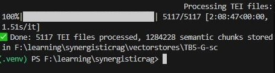


<p style="text-align:center;">
  <sub>تصویر ۱۶ – مثال خروجی اجرای کد قطعه بندی معنایی برای پیکربندی   5TB + G</sub>
</p>

<br>

---
### قطعه بندی معنایی در رویکرد Abstract-First
در رویکرد اول–چکیده، فرآیند بازیابی اطلاعات به‌گونه‌ای طراحی شده است که ابتدا جستجوی معنایی تنها بر روی چکیده مقالات انجام می‌شود. پس از انتخاب مقالات مرتبط، متن کامل بدنه مقاله به‌عنوان دانش زمینه (Context) در کنار دستور کاربرد (Prompt) به مدل زبانی ارائه می‌گردد.<br>

به همین دلیل، در این رویکرد لازم است قطعه‌بندی معنایی چکیده‌ها و بدنه مقالات به‌صورت مستقل انجام شود. چرا که:<br>
&nbsp;&nbsp;&nbsp;•	چکیده‌ها معمولاً کوتاه‌تر، فشرده‌تر و دارای ساختار معنایی متفاوتی نسبت به بدنه مقاله هستند.<br>
&nbsp;&nbsp;&nbsp;•	بدنه مقاله شامل بخش‌های طولانی‌تر و متنوع‌تری است که نیازمند قطعه‌بندی دقیق‌تر و مبتنی بر شباهت معنایی است.<br>
برای این منظور، دو اسکریپت مجزا -اما مشابه با کد قطعه‌بندی اصلی- برای پردازش چکیده‌ها و متن کامل مقالات استفاده می‌شود.<br>

جریان کلی پردازش در این معماری به صورت زیر است:<br>

`TEI → Extraction & Indexing (Abstract) → Chunk (Body) → Embed → Store`

<br>

#### توضیح مراحل:

<br>
&nbsp;&nbsp;&nbsp;•	TEI: دریافت و خواندن فایل‌های TEI شامل چکیده و متن کامل<br>
&nbsp;&nbsp;&nbsp;•	(Abstract) Extraction & Indexing: استخراج چکیده‌ها و ایجاد ایندکس معنایی اولیه<br>
&nbsp;&nbsp;&nbsp;•	(Body) Chunk: قطعه‌بندی معنایی بدنه مقاله با استفاده از آستانه شباهت<br>
&nbsp;&nbsp;&nbsp;•	Embed: تولید مقادیر برداری برای قطعات معنایی<br>
&nbsp;&nbsp;&nbsp;•	Store: ذخیره‌سازی بردارها و فراداده‌ها در پایگاه داده برداری (ChromaDB)

<br>

این ساختار دو مرحله‌ای باعث می‌شود:<br>
&nbsp;&nbsp;&nbsp;•	جستجو در مرحله اول بسیار سریع‌تر و هدفمندتر انجام شود<br>
&nbsp;&nbsp;&nbsp;•	تنها مقالات مرتبط وارد مرحله پردازش عمیق شوند<br>
&nbsp;&nbsp;&nbsp;•	کیفیت پاسخ نهایی مدل زبانی به‌طور قابل توجهی افزایش یابد

<br>

---
### کد بخش اول: استخراج و اندیس گذاری چکیده ها<br>

در گام نخست از معماری اول-چکیده، تمرکز بر پردازش و آماده‌سازی چکیده مقالات است. از آن‌جا که چکیده هر مقاله معمولاً متنی کوتاه، منسجم و از نظر معنایی یکپارچه است، نیازی به قطعه‌بندی معنایی برای این بخش وجود ندارد.
هدف اصلی در این مرحله، ایجاد یک ایندکس معنایی از چکیده‌ها است تا عملیات جستجو در مرحله بازیابی تنها بر اساس همین چکیده‌ها انجام شود.

<br>
 این کار باعث می‌شود:<br>

&nbsp;&nbsp;&nbsp;•	جستجو بسیار سریع‌تر و سبک‌تر باشد<br>
&nbsp;&nbsp;&nbsp;•	تنها مقالات مرتبط وارد مرحله پردازش عمیق شوند<br>
&nbsp;&nbsp;&nbsp;•	هزینه محاسباتی مرحله RAG به‌طور چشمگیری کاهش یابد<br>

بنابراین، کافی است برای هر چکیده:<br>
      ۱) متن آن استخراج شود<br>
      ۲) مقدار برداری آن با مدل ریزتنظیم‌شده محاسبه گردد<br>
      ۳) همراه با شناسه و فراداده مربوطه در یک پایگاه داده برداری ChromaDB ذخیره شود<br>

در برنامه اول، همین فرآیند پیاده‌سازی شده است و چکیده‌ها بدون قطعه‌بندی معنایی، مستقیماً استخراج، embedding و اندیس‌گذاری می‌شوند. 

<br>

در ابتدای برنامه‌ی مربوط به استخراج و اندیس‌گذاری چکیده‌ها، مجموعه‌ای از کتابخانه‌ها و ابزارهای موردنیاز برای پردازش فایل‌های TEI، استخراج چکیده‌ها، تولید مقادیر برداری و ذخیره‌سازی آن‌ها در پایگاه داده برداری فراخوانی می‌شود:
```python
import os
from pathlib import Path
from tqdm import tqdm
from bs4 import BeautifulSoup
from sentence_transformers import SentenceTransformer
import chromadb
import nltk

nltk.download('punkt', quiet=True)
DATA_DIR = Path(r" Enter TEI files location ")
EMB_MODEL = Path(r" Enter fine-tuned embedding model address ")
CHROMA_ABS = Path(r" Enter output DB destination ")
CHROMA_ABS.mkdir(parents=True, exist_ok=True)
BATCH_SIZE = 256
DEVICE = "cuda" if __import__("torch").cuda.is_available() else "cpu"
```

در کد فوق عملیات های زیر به ترتیب انجام می‌شوند: <br>

۱) فراخوانی کتابخانه‌های موردنیاز<br>
&nbsp;&nbsp;&nbsp;•	`BeautifulSoup`: برای تجزیه و تحلیل ساختار XML فایل‌های TEI و استخراج بخش چکیده<br>
&nbsp;&nbsp;&nbsp;•	`SentenceTransformer`: برای بارگذاری مدل جانمایی ریزتنظیم‌شده<br>
&nbsp;&nbsp;&nbsp;•	`chromadb`: برای ایجاد پایگاه داده برداری و ذخیره‌سازی مقادیر برداری چکیده‌ها<br>
&nbsp;&nbsp;&nbsp;•	`nltk`: برای توکن‌سازی و پردازش اولیه متن<br>
&nbsp;&nbsp;&nbsp;•	`tqdm`: برای نمایش نوار پیشرفت در هنگام پردازش تعداد زیاد فایل<br>

این مجموعه ابزارها امکان استخراج، پردازش و ذخیره‌سازی کارآمد چکیده‌ها را فراهم می‌کنند.

<br>

۲) تنظیم مسیرهای ورودی و خروجی<br>

در خطوط بعدی:<br>
&nbsp;&nbsp;&nbsp;•	DATA_DIR: مسیر فایل‌های TEI را مشخص می‌کند.<br>
&nbsp;&nbsp;&nbsp;•	EMB_MODEL: مسیر مدل جانمایی ریزتنظیم‌شده را تعیین می‌کند.<br>
&nbsp;&nbsp;&nbsp;•	CHROMA_ABS: مسیر ذخیره‌سازی پایگاه داده برداری مخصوص چکیده‌ها است.<br>
دستور mkdir نیز تضمین می‌کند که مسیر پایگاه داده در صورت عدم وجود ایجاد شود.<br>

۳) تعیین پارامترهای پردازشی<br>
&nbsp;&nbsp;&nbsp;•	BATCH_SIZE = 256: تعداد چکیده‌هایی است که در هر مرحله برای embedding به مدل ارسال می‌شوند.<br>
&nbsp;&nbsp;&nbsp;•	DEVICE: مشخص می‌کند که عملیات embedding در صورت وجود GPU روی cuda انجام شود؛ در غیر این صورت روی CPU اجرا خواهد شد.

<br>


در این مرحله، مدل embedding ریزتنظیم‌شده بارگذاری می‌شود و سپس پایگاه داده برداری مخصوص چکیده‌ها ایجاد یا بازیابی می‌گردد:
```python
print("🔹 Loading embedding model:", EMB_MODEL)
model = SentenceTransformer(str(EMB_MODEL), device=DEVICE)

client = chromadb.PersistentClient(path=str(CHROMA_ABS))
collection = client.get_or_create_collection(name="abstracts")
```
در این بخش:<br>
۱) بارگذاری مدل embedding ریزتنظیم‌شده
در خط نخست، مسیر مدل چاپ شده و سپس مدل با استفاده از `SentenceTransformer` بارگذاری می‌شود. این مدل برای تولید بردارهای معنایی چکیده‌ها استفاده خواهد شد. پارامتر `device=DEVICE` نیز تعیین می‌کند که عملیات embedding در صورت وجود GPU روی cuda و در غیر این صورت روی CPU اجرا شود.<br>

۲) ایجاد یا بازیابی پایگاه داده برداری<br>
در دو خط بعدی:<br>
&nbsp;&nbsp;&nbsp;•		یک `PersistentClient` از ChromaDB ساخته می‌شود که پایگاه داده را در مسیر تعیین‌شده `CHROMA_ABS` ذخیره می‌کند.<br>
&nbsp;&nbsp;&nbsp;•	سپس با استفاده از `get_or_create_collection` یک مجموعه با نام abstracts ایجاد یا در صورت وجود، بازیابی می‌شود.

<br>

این مجموعه محل ذخیره‌سازی:<br>
&nbsp;&nbsp;&nbsp;•	متن چکیده‌ها<br>
&nbsp;&nbsp;&nbsp;•	embedding هر چکیده<br>
&nbsp;&nbsp;&nbsp;•	شناسه یکتا<br>
&nbsp;&nbsp;&nbsp;•	فراداده مربوط به هر مقاله
خواهد بود.

<br>

در مرحله بعد، تابع `extract_abstract_from_tei` پیاده‌سازی می‌شود که وظیفه استخراج متن چکیده از ساختار XML فایل‌های TEI را بر عهده دارد:
```python
def extract_abstract_from_tei(path: Path) -> str:
    txt = path.read_text(encoding="utf-8", errors="ignore")
    soup = BeautifulSoup(txt, "xml")
    abs_nodes = soup.find_all("abstract")
    if not abs_nodes:
        abs_nodes = soup.find_all(lambda tag: tag.name == "div" and tag.get("type") == "abstract")
    abs_text = " ".join([n.get_text(" ", strip=True) for n in abs_nodes]).strip()
    return abs_text
```
در این کد:<br>
۱) خواندن فایل TEI<br>
در خط نخست، محتوای فایل TEI با استفاده از `read_text` خوانده می‌شود. پارامتر errors="ignore" تضمین می‌کند که در صورت وجود کاراکترهای ناسازگار، عملیات خواندن متوقف نشود.<br>

۲) تبدیل ساختار TEI به XML قابل پردازش<br>
در خط دوم، متن خوانده‌شده با استفاده از `BeautifulSoup(txt, "xml")` به یک ساختار XML تبدیل می‌شود تا امکان جستجو و استخراج عناصر مختلف فراهم گردد.<br>

۳) جستجوی برچسب‌های چکیده (tags)<br>
در خط سوم، تابع به دنبال تمام تگ‌های `<abstract> </abstract>` می‌گردد. این تگ‌ها در استاندارد TEI محل اصلی ذخیره چکیده هستند.<br>

۴) جستجوی جایگزین در صورت عدم وجود برچسب abstract<br>
در برخی نسخه‌های TEI، چکیده‌ها در قالب `<div type="abstract"> </div>` می‌شوند. در صورتی که تگ `<abstract>` یافت نشود، تابع با استفاده از یک شرط lambda به دنبال این ساختار جایگزین می‌گردد.<br>

۵) استخراج متن چکیده<br>
در خط آخر:<br>

&nbsp;&nbsp;&nbsp;•	متن تمام گره‌های یافت‌شده استخراج می‌شود،<br>
&nbsp;&nbsp;&nbsp;•	بین آن‌ها فاصله قرار داده می‌شود،<br>
&nbsp;&nbsp;&nbsp;•	و خروجی نهایی در متغیر `abs_text` ذخیره و بازگردانده می‌شود.<br>
این مقدار همان چکیده نهایی مقاله است که در مرحله بعد embedding و اندیس‌گذاری خواهد شد.

<br>

در این بخش، فایل‌های TEI پردازش شده و چکیده‌های معتبر استخراج و برای ذخیره‌سازی در پایگاه داده برداری آماده می‌شوند:
```python
file_list = sorted(DATA_DIR.glob("*.tei.xml"))
docs, ids, metas = [], [], []

for f in tqdm(file_list, desc="Extracting abstracts"):
    a = extract_abstract_from_tei(f)
    if a and len(a.split()) > 5:
        docs.append(a)
        ids.append(f.stem)
        metas.append({"source": f.name})
print(f"📘 Found {len(docs)} abstracts to index.")
```
توضیح عملکرد کد:<br>
۱) فراخوانی فایل‌های TEI:<br>
در خط نخست، تمام فایل‌های با پسوند `.tei.xml` از مسیر تعیین‌شده`DATA_DIR` خوانده و به‌صورت مرتب‌شده در `file_list` ذخیره می‌شوند. این فایل‌ها ورودی اصلی مرحله استخراج چکیده هستند.<br>

۲)  تعریف ساختارهای ذخیره‌سازی:<br>
سه فهرست خالی برای نگه‌داری داده‌های استخراج‌شده ایجاد می‌شود:<br>
&nbsp;&nbsp;&nbsp;•	docs: متن چکیده‌ها<br>
&nbsp;&nbsp;&nbsp;•	ids: شناسه یکتای هر مقاله (بر اساس نام فایل)<br>
&nbsp;&nbsp;&nbsp;•	metas: فراداده مربوط به هر چکیده (مانند نام فایل منبع)<br>

۳) پردازش فایل‌ها و استخراج چکیده:<br>

در حلقه اصلی:<br>
&nbsp;&nbsp;&nbsp;•	برای هر فایل، تابع `extract_abstract_from_tei` فراخوانی می‌شود.<br>
&nbsp;&nbsp;&nbsp;•	اگر چکیده استخراج‌شده معتبر باشد و بیش از ۵ واژه داشته باشد،<br> به‌عنوان یک چکیده قابل استفاده در نظر گرفته می‌شود. این شرط برای حذف چکیده‌های خالی یا بسیار کوتاه اعمال شده است.<br>

سپس:<br>
&nbsp;&nbsp;&nbsp;•	متن چکیده به `docs`<br>
&nbsp;&nbsp;&nbsp;•	شناسه مقاله (بدون پسوند) به `ids`<br>
&nbsp;&nbsp;&nbsp;•	و فراداده مربوط به فایل به `metas`<br>
افزوده می‌شود.

۴) گزارش تعداد چکیده‌های معتبر:<br>
در پایان، تعداد چکیده‌هایی که شرایط لازم را داشته‌اند چاپ می‌شود. این مقدار نشان می‌دهد چه تعداد چکیده برای مرحله embedding و اندیس‌گذاری آماده هستند.

<br>

در این مرحله، چکیده‌های استخراج‌شده در بسته‌های پردازشی (Batch) به مدل embedding داده می‌شوند و سپس همراه با شناسه و فراداده مربوطه در پایگاه داده ChromaDB ذخیره می‌گردند: 
در این قسمت:
```python
for i in tqdm(range(0, len(docs), BATCH_SIZE), desc="Indexing abstracts"):
    chunk_docs = docs[i:i+BATCH_SIZE]
    chunk_ids = ids[i:i+BATCH_SIZE]
    chunk_metas = metas[i:i+BATCH_SIZE]
    embs = model.encode(chunk_docs, normalize_embeddings=True)
    collection.add(
        documents=chunk_docs,
        embeddings=embs.tolist(),
        metadatas=chunk_metas,
        ids=chunk_ids
    )

print("✅ Abstract indexing complete. Chroma path:", CHROMA_ABS)
```

۱) تقسیم چکیده‌ها به بسته‌های پردازشی<br>
در حلقه اصلی، چکیده‌ها، شناسه‌ها و فراداده‌ها بر اساس مقدار `BATCH_SIZE` به بخش‌های کوچک‌تر تقسیم می‌شوند:
<br>
&nbsp;&nbsp;&nbsp;•	chunk_docs: مجموعه‌ای از چکیده‌ها<br>
&nbsp;&nbsp;&nbsp;•	chunk_ids: شناسه یکتای هر چکیده<br>
&nbsp;&nbsp;&nbsp;•	chunk_metas: فراداده مربوط به هر چکیده (مانند نام فایل منبع)
این تقسیم‌بندی باعث می‌شود عملیات embedding و ذخیره‌سازی با کارایی و مصرف حافظه مناسب انجام شود.<br>

۲) محاسبه برداری چکیده‌ها<br>
در خط بعد، embedding تمام چکیده‌های موجود در Batch با استفاده از مدل ریزتنظیم‌شده محاسبه می‌شود:<br>
`embs = model.encode(chunk_docs, normalize_embeddings=True)`
<br>
نرمال‌سازی مقادیر برداری باعث پایداری بیشتر در محاسبه شباهت معنایی می‌شود.


۳) ذخیره‌سازی در پایگاه داده برداری<br>
در مرحله بعد، داده‌های هر Batch در مجموعه abstracts ذخیره می‌شوند:<br>

&nbsp;&nbsp;&nbsp;•	متن چکیده‌ها (documents)<br>
&nbsp;&nbsp;&nbsp;•	مقادیر برداری (embeddings)<br>
&nbsp;&nbsp;&nbsp;•	فراداده مربوط به هر چکیده (metadatas)<br>
&nbsp;&nbsp;&nbsp;•	شناسه یکتا (ids)<br>
این ساختار امکان جستجوی معنایی سریع و دقیق در مرحله بازیابی را فراهم می‌کند.<br>

۴) پیام تکمیل عملیات<br>
در پایان، پیام موفقیت چاپ می‌شود که نشان می‌دهد تمام چکیده‌ها با موفقیت اندیس‌گذاری شده‌اند و مسیر پایگاه داده نیز گزارش می‌شود.

<br>
 

---

### کد بخش دوم: قطعه بندی معنایی بدنه مقالات

در مرحله دوم از رویکرد اول-چکیده، متن کامل و بدنه مقالات پردازش می‌شود. این بخش همان محتوایی است که در مرحله بازیابی دانش (Retrieval) در معماری RAG مورد استفاده قرار می‌گیرد. برخلاف چکیده‌ها که معمولاً کوتاه، یکپارچه و از نظر معنایی منسجم هستند،
بدنه مقالات طولانی‌تر، متنوع‌تر و شامل بخش‌های متعدد است؛ بنابراین برای استفاده مؤثر در RAG لازم است به قطعات معنایی کوچک‌تر و منسجم تقسیم شوند.<br>

در این مرحله، فرآیند قطعه‌بندی معنایی بسیار مشابه کد رویکرد اصلی Semantic Chunking است، با این تفاوت که:<br>

&nbsp;&nbsp;&nbsp;•	ورودی‌ها متن کامل مقالات هستند،<br>
&nbsp;&nbsp;&nbsp;•	خروجی‌ها قطعات معنایی بدنه مقاله هستند که بعداً همراه با embedding در پایگاه داده برداری ذخیره می‌شوند،<br>
&nbsp;&nbsp;&nbsp;•	و این قطعات در مرحله پاسخ‌دهی مدل زبانی به‌عنوان دانش زمینه (Context) مورد استفاده قرار می‌گیرند.

<br>

به‌طور خلاصه، جریان کار در این مرحله به صورت زیر است:<br>
۱) خواندن فایل TEI و استخراج متن بدنه<br>
۲) پاک‌سازی و پیش‌پردازش متن<br>
۳) قطعه‌بندی معنایی با استفاده از آستانه شباهت<br>
۴) تولید embedding برای هر قطعه<br>
۵) ذخیره‌سازی قطعات، مقادیر برداری و فراداده‌ها در ChromaDB<br>

این فرآیند تضمین می‌کند که مدل RAG بتواند در زمان پاسخ‌دهی، به‌جای جستجو در متن خام و طولانی، به مجموعه‌ای از قطعات معنایی دقیق، کوتاه و مرتبط دسترسی داشته باشد.

<br>


در ابتدای برنامه مربوط به قطعه‌بندی معنایی بدنه مقالات، مجموعه‌ای از کتابخانه‌ها و ابزارهای لازم برای پردازش فایل‌های TEI، استخراج متن بدنه، تولید مقادیر برداری و ذخیره‌سازی آن‌ها در پایگاه داده برداری فراخوانی می‌شود:

```python
import os
import numpy as np
from pathlib import Path
from tqdm import tqdm
from sentence_transformers import SentenceTransformer, util
from nltk.tokenize import sent_tokenize
import nltk
import chromadb
from concurrent.futures import ThreadPoolExecutor
from bs4 import BeautifulSoup
nltk.download('punkt', quiet=True)

DATA_DIR = Path(r" Enter TEI documents location ")   
EMB_MODEL = Path(r" Enter fine-tuned embedding model address ")
CHROMA_BODY = Path(r" Enter output DB destination ")
CHROMA_BODY.mkdir(parents=True, exist_ok=True)

# selected IDs file (one doc stem per line) OR set SELECT_ALL=True
SELECTED_IDS_FILE = Path(r" selected_ids.txt location ")
SELECT_ALL = True  
```
در کد فوق:<br>
۱) فراخوانی کتابخانه‌های موردنیاز<br>

در این بخش، کتابخانه‌های زیر فراخوانی می‌شوند:<br>
&nbsp;&nbsp;&nbsp;•	BeautifulSoup: برای تجزیه و تحلیل ساختار XML فایل‌های TEI <br>
&nbsp;&nbsp;&nbsp;•	SentenceTransformer: برای بارگذاری مدل جانمایی ریزتنظیم‌شده<br>
&nbsp;&nbsp;&nbsp;•	chromadb: برای ایجاد پایگاه داده برداری و ذخیره‌سازی مقادیر برداری قطعات<br>
&nbsp;&nbsp;&nbsp;•	ThreadPoolExecutor: برای پردازش موازی فایل‌ها<br>
&nbsp;&nbsp;&nbsp;•	nltk: برای توکن‌سازی جملات<br>
&nbsp;&nbsp;&nbsp;•	tqdm: برای نمایش نوار پیشرفت<br>
&nbsp;&nbsp;&nbsp;•	numpy: برای عملیات عددی موردنیاز<br>
این ابزارها امکان پردازش سریع، دقیق و مقیاس‌پذیر بدنه مقالات را فراهم می‌کنند.

<br>


۲) تنظیم مسیرهای ورودی و خروجی<br>

در خطوط بعدی:<br>
&nbsp;&nbsp;&nbsp;•	DATA_DIR: مسیر فایل‌های TEI شامل متن کامل مقالات را مشخص می‌کند.<br>
&nbsp;&nbsp;&nbsp;•	EMB_MODEL: مسیر مدل جانمایی ریزتنظیم‌شده را تعیین می‌کند.<br>
&nbsp;&nbsp;&nbsp;•	CHROMA_BODY: مسیر ذخیره‌سازی پایگاه داده برداری مخصوص بدنه مقالات است.<br>
دستور mkdir نیز تضمین می‌کند که مسیر پایگاه داده در صورت عدم وجود ایجاد شود.

<br>

۳) انتخاب مقالات برای پردازش<br>

در دو خط پایانی:<br>
&nbsp;&nbsp;&nbsp;•		اگر مقدار `SELECT_ALL = True` باشد، تمام فایل‌های موجود در مسیر پردازش می‌شوند.<br>
&nbsp;&nbsp;&nbsp;•	اگر مقدار `SELECT_ALL = False` باشد، تنها مقالاتی پردازش می‌شوند که نام آن‌ها در فایل `selected_ids.txt` ذکر شده باشد.<br>

این قابلیت زمانی مفید است که:<br>
&nbsp;&nbsp;&nbsp;•	برای برخی مقالات چکیده استخراج نشده باشد،<br>
&nbsp;&nbsp;&nbsp;•	یا تنها مقالات منتخب (بر اساس نتایج جستجوی چکیده‌ها) وارد مرحله قطعه‌بندی بدنه شوند.

<br>

در بخش بعدی، مجموعه‌ای از پارامترهای کنترلی برای قطعه‌بندی معنایی بدنه مقالات تعریف می‌شود. این پارامترها مشابه نسخه پایه کد قطعه‌بندی معنایی هستند، اما برای پردازش بدنه مقالات در رویکرد اول-چکیده تنظیم شده‌اند:
```python
SIM_THRESHOLD = 0.55
MIN_CHUNK_LEN = 3
MAX_CHUNK_LEN = 15
BATCH_SIZE = 128
MAX_BUFFER = 5000      
THREADS = 4
CHROMA_SAFE_LIMIT = 5400

DEVICE = "cuda" if __import__("torch").cuda.is_available() else "cpu"
```

توضیح عملکرد پارامترها:
<br>
&nbsp;&nbsp;&nbsp;•	SIM_THRESHOLD = 0.55: آستانه شباهت معنایی میان جملات برای تعیین محل برش قطعات. مقدار ۰.۵۵ بر اساس تحلیل حساسیت به‌عنوان مقدار بهینه انتخاب شده است.<br>
&nbsp;&nbsp;&nbsp;•	MIN_CHUNK_LEN / MAX_CHUNK_LEN: حداقل و حداکثر تعداد جملات در هر قطعه معنایی. این مقادیر از ایجاد قطعات بسیار کوچک یا بیش از حد بزرگ جلوگیری می‌کنند.<br>
&nbsp;&nbsp;&nbsp;•	BATCH_SIZE = 128: تعداد قطعاتی که در هر مرحله برای بردارسازی به مدل ارسال می‌شوند.<br>
&nbsp;&nbsp;&nbsp;•	MAX_BUFFER = 5000: حداکثر تعداد قطعاتی که قبل از ذخیره‌سازی در حافظه بافر نگه‌داری می‌شوند.<br>
&nbsp;&nbsp;&nbsp;•	THREADS = 4: تعداد رشته‌های پردازشی برای اجرای موازی عملیات قطعه‌بندی.<br>
&nbsp;&nbsp;&nbsp;•	CHROMA_SAFE_LIMIT = 5400: سقف ایمن برای تعداد embedding هایی که در یک درخواست به ChromaDB ارسال می‌شود. این مقدار محدودیت داخلی ChromaDB است و رعایت نکردن آن باعث خطا در ذخیره‌سازی می‌شود.<br>
&nbsp;&nbsp;&nbsp;•	DEVICE: تعیین می‌کند که مدل embedding روی GPU یا CPU اجرا شود.

<br>

پس از تعیین پارامترها، مدل ریزتنظیم‌شده بارگذاری شده و پایگاه دادهٔ برداری مخصوص قطعات بدنه مقاله ایجاد می‌شود:
```python
print("🔹 Loading embedding model:", EMB_MODEL)
model = SentenceTransformer(str(EMB_MODEL), device=DEVICE)
client = chromadb.PersistentClient(path=str(CHROMA_BODY))
collection = client.get_or_create_collection(name="semantic_body_chunks")
```
توضیحات:<br>
۱) بارگذاری مدل جانمایی:<br>
در خط نخست، مدل ریزتنظیم‌شده با استفاده از `SentenceTransformer` بارگذاری می‌شود و روی GPU یا CPU قرار می‌گیرد. این مدل برای تولید embedding قطعات معنایی بدنه مقاله استفاده خواهد شد.

<br>

۲) ایجاد یا بازیابی پایگاه داده برداری:<br>
در دو خط بعدی:<br>
&nbsp;&nbsp;&nbsp;•	یک `PersistentClient` برای مسیر ذخیره‌سازی بدنه مقالات ساخته می‌شود.
&nbsp;&nbsp;&nbsp;•	سپس مجموعه‌ای با نام `semantic_body_chunks` ایجاد یا بازیابی می‌شود.

۳) نقش collection:<br>
متغیر `collection` مجموعه‌ای است که:<br>
&nbsp;&nbsp;&nbsp;•	متن قطعات معنایی<br>
&nbsp;&nbsp;&nbsp;•	Embedding هر قطعه<br>
&nbsp;&nbsp;&nbsp;•	فراداده مربوط به هر قطعه<br>
&nbsp;&nbsp;&nbsp;•	و شناسه یکتا<br>
در آن ذخیره می‌شود. این مجموعه در مرحله بازیابی به‌عنوان پایگاه دانش زمینه مدل RAG مورد استفاده قرار می‌گیرد.

<br>

در این مرحله، تابع `extract_body_from_tei` پیاده‌سازی می‌شود که وظیفه استخراج متن اصلی و بدنه مقاله را از ساختار XML فایل‌های TEI بر عهده دارد:
```python
def extract_body_from_tei(path: Path) -> str:
    txt = path.read_text(encoding="utf-8", errors="ignore")
    soup = BeautifulSoup(txt, "xml")
    bodies = soup.find_all("body")
    if not bodies:
        bodies = soup.find_all(lambda tag: tag.name == "div" and tag.get("type") == "body")
    body_text = " ".join([b.get_text(" ", strip=True) for b in bodies]).strip()
    if not body_text:
        for t in soup.find_all(["abstract", "front"]):
            t.decompose()
        body_text = soup.get_text(" ", strip=True)
    return body_text
```

توضیح عملکرد تابع<br>
۱) خواندن فایل TEI<br>
در خط نخست، محتوای فایل TEI با استفاده از `read_text` خوانده می‌شود. پارامتر `errors="ignore"` تضمین می‌کند که وجود کاراکترهای ناسازگار باعث توقف پردازش نشود.<br>

۲) تبدیل ساختار TEI به XML قابل پردازش<br>
در خط دوم، متن خوانده‌شده با استفاده از `BeautifulSoup(txt, "xml")` به یک ساختار XML تبدیل می‌شود تا امکان جستجو و استخراج بخش‌های مختلف مقاله فراهم گردد.<br>

۳) جستجوی تگ‌های بدنه مقاله<br>
در خط سوم، تابع به دنبال تمام تگ‌های `<body> </body>` می‌گردد. این تگ‌ها در استاندارد TEI محل اصلی ذخیره متن بدنه مقاله هستند.<br>

۴) جستجوی جایگزین در صورت نبود تگ body<br>
در برخی نسخه‌های TEI، بدنه مقاله در قالب `<div type="body"> </div>` ذخیره می‌شود. در صورتی که تگ `<body>` یافت نشود، تابع با استفاده از یک شرط lambda به دنبال این ساختار جایگزین می‌گردد.<br>

۵) استخراج متن بدنه<br>
در خط بعد، متن تمام گره‌های یافت‌شده استخراج و در قالب یک رشته واحد ترکیب می‌شود. اگر این مقدار خالی باشد، یعنی هیچ‌یک از ساختارهای فوق یافت نشده باشد.<br>

۶) حذف بخش‌های غیرضروری و استخراج متن کامل<br>
در این حالت:<br>
•	ابتدا بخش‌های abstract و front حذف می‌شوند،<br>
•	سپس کل متن باقی‌مانده فایل TEI به‌عنوان بدنه مقاله استخراج می‌شود.<br>
این روش تضمین می‌کند که حتی در ساختارهای TEI غیر استاندارد نیز متن اصلی مقاله بازیابی شود.<br>

۷)‌ خروجی تابع<br>
در پایان، متن بدنه مقاله در قالب یک رشته تمیز و آماده پردازش بازگردانده می‌شود.

<br>

در قسمت بعد تابع `semantic_chunk_text` مسئول تقسیم متن بدنه مقاله به قطعات معنایی منسجم است. این تابع همان منطق نسخه پایه قطعه‌بندی معنایی را دنبال می‌کند، اما با پارامترهای تنظیم‌شده برای پردازش بدنه مقالات در معماری اول-چکیده:

```python
def semantic_chunk_text(text, threshold=SIM_THRESHOLD, min_len=MIN_CHUNK_LEN, max_len=MAX_CHUNK_LEN):
    sents = [s.strip() for s in sent_tokenize(text) if len(s.strip()) > 15]
    if len(sents) <= min_len:
        return [" ".join(sents)]

    with torch.no_grad():
        embs = model.encode(
            sents,
            batch_size=BATCH_SIZE,
            normalize_embeddings=True,
            show_progress_bar=False
        )

    sims = util.cos_sim(embs[:-1], embs[1:]).diagonal().cpu().numpy()

    chunks, cur_chunk = [], [sents[0]]

    for i in range(1, len(sents)):
        if sims[i-1] < threshold or len(cur_chunk) >= max_len:
            chunks.append(" ".join(cur_chunk))
            cur_chunk = [sents[i]]
        else:
            cur_chunk.append(sents[i])

    if cur_chunk:
        chunks.append(" ".join(cur_chunk))

    return chunks
```

مراحل اجرایی تابع:<br>
۱) استخراج جمله‌های معتبر:<br>
&nbsp;&nbsp;&nbsp;•	پردازش: متن با `sent_tokenize` به جمله‌ها تقسیم می‌شود.<br>
&nbsp;&nbsp;&nbsp;•	فیلتر: تنها جمله‌های با طول بیش از ۱۵ کاراکتر پذیرفته می‌شوند تا جملات بسیار کوتاه و کم‌ارزش حذف شوند.<br>

۲) مدیریت متون کوتاه:<br>
&nbsp;&nbsp;&nbsp;•	شرط: اگر تعداد جمله‌ها کمتر یا برابر با `min_len` باشد، همان جمله‌ها به‌صورت یک قطعه واحد بازگردانده می‌شوند.<br>
&nbsp;&nbsp;&nbsp;•	کاربرد: مناسب برای اسناد کوتاه یا بخش‌هایی با ساختار معنایی ساده.<br>

۳) بردارسازی با بهینه‌سازی حافظه:<br>
&nbsp;&nbsp;&nbsp;•	no_grad: محاسبات درون `torch.no_grad` انجام می‌شود تا از ذخیره گرادیان و افزایش مصرف حافظه جلوگیری شود.<br>
&nbsp;&nbsp;&nbsp;•	کدگذاری: جمله‌ها با `model.encode` و `batch_size=BATCH_SIZE` کدگذاری می‌شوند.<br>
&nbsp;&nbsp;&nbsp;•	نرمال‌سازی: `normalize_embeddings=True` برای پایداری شباهت کسینوسی.<br>

۴) محاسبه شباهت کسینوسی متوالی:<br>
&nbsp;&nbsp;&nbsp;•	روش: شباهت بین هر جمله و جمله بعدی با `util.cos_sim` محاسبه می‌شود.<br>
&nbsp;&nbsp;&nbsp;•	استخراج: تنها قطر اصلی ماتریس برای زوج‌های (i,i+1) برداشته می‌شود، چون الگوریتم خطی است و توالی اهمیت دارد.<br>

۵) ساخت قطعات معنایی با منطق برش اصلاح‌شده:<br>
&nbsp;&nbsp;&nbsp;•	شروع: قطعه اول با جمله نخست آغاز می‌شود.<br>
&nbsp;&nbsp;&nbsp;•	حلقه: برای هر جمله بعدی:<br>
&nbsp;&nbsp;&nbsp;&nbsp;&nbsp;&nbsp;o	شرط برش: اگر شباهت با جمله قبلی کمتر از `threshold` باشد یا طول قطعه به `max_len` برسد، قطعه جاری بسته می‌شود و جمله فعلی آغازگر قطعه جدید می‌گردد.<br>
&nbsp;&nbsp;&nbsp;&nbsp;&nbsp;&nbsp;o	ادامه: در غیر این صورت، جمله به قطعه جاری افزوده می‌شود.<br>
ش	پایان: اگر قطعه‌ای نیمه‌تمام باقی مانده باشد، به خروجی افزوده می‌شود.

<br>

در قسمت بعد، در این مرحله، پیش از آغاز پردازش، تعیین می‌شود که کدام فایل‌های TEI باید وارد فرآیند قطعه‌بندی معنایی شوند. این انتخاب بر اساس مقدار پارامتر `SELECT_ALL` یا فهرست شناسه‌های موجود در فایل `selected_ids.txt` انجام می‌شود:

```python
if SELECT_ALL or not SELECTED_IDS_FILE.exists():
    to_process = sorted(DATA_DIR.glob("*.tei.xml"))
else:
    ids = [line.strip() for line in SELECTED_IDS_FILE.read_text(encoding="utf-8").splitlines() if line.strip()]
    to_process = [DATA_DIR / (i + ".tei.xml") for i in ids if (DATA_DIR / (i + ".tei.xml")).exists()]

print(f"📘 Will process {len(to_process)} articles for body chunking.")
```

توضیح عملکرد کد:<br>
۱) حالت اول: پردازش همه مقالات:<br>
اگر مقدار `SELECT_ALL = True` باشد، یا اگر فایل `selected_ids.txt` وجود نداشته باشد،<br> برنامه به‌صورت خودکار تمام فایل‌های TEI موجود در مسیر `DATA_DIR` را برای پردازش انتخاب می‌کند:<br>

`to_process = sorted(DATA_DIR.glob("*.tei.xml"))`

<br>
این حالت زمانی استفاده می‌شود که:<br>
&nbsp;&nbsp;&nbsp;•	قصد پردازش کامل مجموعه داده وجود دارد،<br>
&nbsp;&nbsp;&nbsp;•	یا هنوز مرحله استخراج چکیده انجام نشده و فهرست مقالات منتخب در دسترس نیست.

<br>

۲) حالت دوم: پردازش مقالات منتخب:<br>
اگر `SELECT_ALL = False` باشد، برنامه تنها فایل‌هایی را پردازش می‌کند که نام آن‌ها در فایل `selected_ids.txt` ذکر شده باشد. این فایل معمولاً شامل شناسه مقالاتی است که در مرحله جستجوی چکیده‌ها مرتبط تشخیص داده شده‌اند.
در این حالت:
&nbsp;&nbsp;&nbsp;•	شناسه‌ها از فایل خوانده می‌شوند،<br>
&nbsp;&nbsp;&nbsp;•	برای هر شناسه مسیر فایل TEI ساخته می‌شود،
و	تنها فایل‌هایی که واقعاً وجود دارند وارد فهرست پردازش می‌شوند.

<br>

۳) گزارش تعداد مقالات انتخاب‌شده:<br>
در پایان، تعداد مقالاتی که قرار است وارد مرحله قطعه‌بندی معنایی شوند چاپ می‌شود. این پیام برای اطمینان از صحت انتخاب ورودی‌ها و کنترل جریان پردازش ضروری است.
<br>

در ادامه، همانند نسخه پایه قطعه‌بندی معنایی، چهار بافر برای نگه‌داری موقت داده‌های مربوط به قطعات بدنه مقاله تعریف می‌شود. سپس تابعی برای انتقال ایمن و مرحله‌ای این داده‌ها به پایگاه داده ChromaDB پیاده‌سازی می‌گردد:

```python
buffer_docs, buffer_embs, buffer_meta, buffer_ids = [], [], [], []
total_chunks = 0
def flush_to_db():
    global buffer_docs, buffer_embs, buffer_meta, buffer_ids
    while len(buffer_docs) > 0:
        chunk_size = min(len(buffer_docs), CHROMA_SAFE_LIMIT)
        collection.add(
            documents=buffer_docs[:chunk_size],
            embeddings=buffer_embs[:chunk_size],
            metadatas=buffer_meta[:chunk_size],
            ids=buffer_ids[:chunk_size]
        )
        buffer_docs = buffer_docs[chunk_size:]
        buffer_embs = buffer_embs[chunk_size:]
        buffer_meta = buffer_meta[chunk_size:]
        buffer_ids = buffer_ids[chunk_size:]
```

۱) توضیح عملکرد بافرها در خط اول:<br>
چهار بافر زیر برای ذخیره‌سازی موقت داده‌ها قبل از انتقال به پایگاه داده استفاده می‌شوند:<br>
&nbsp;&nbsp;&nbsp;•	buffer_docs: متن قطعات معنایی استخراج‌شده<br>
&nbsp;&nbsp;&nbsp;•	buffer_embs: بردار embedding هر قطعه<br>
&nbsp;&nbsp;&nbsp;•	buffer_meta: فراداده مربوط به هر قطعه (نام فایل، شماره قطعه، طول قطعه و …)<br>
&nbsp;&nbsp;&nbsp;•	buffer_ids: شناسه یکتای هر قطعه برای ذخیره‌سازی در ChromaDB
این ساختار بافرگذاری باعث می‌شود داده‌ها ابتدا در حافظه جمع‌آوری شوند و سپس در بسته‌های کنترل‌شده به پایگاه داده منتقل گردند.<br>

۲) تعریف تابع `flush_to_db`:<br>
تابع `flush_to_db` مسئول انتقال ایمن داده‌ها از بافر به پایگاه داده است. این تابع با استفاده از مقدار `CHROMA_SAFE_LIMIT = 5400` اطمینان حاصل می‌کند که هیچ‌گاه بیش از ۵۴۰۰ embedding در یک درخواست به ChromaDB ارسال نشود. این مقدار محدودیت داخلی ChromaDB است و رعایت نکردن آن منجر به خطا در عملیات ذخیره‌سازی خواهد شد.<br>

۳) منطق عملکرد تابع:<br>
&nbsp;&nbsp;&nbsp;•	اگر تعداد داده‌های موجود در بافر کمتر یا برابر با ۵۴۰۰ باشد: تمام داده‌ها در یک مرحله به پایگاه داده منتقل می‌شوند و بافر تخلیه می‌گردد.<br>

د	اگر تعداد داده‌ها بیشتر از ۵۴۰۰ باشد: ابتدا ۵۴۰۰ مورد اول به پایگاه داده ارسال می‌شود، سپس از بافر حذف می‌گردد، و این فرآیند تا تخلیه کامل بافر تکرار می‌شود.
این روش از بروز خطاهای ناشی از ارسال حجم بیش از حد داده جلوگیری کرده و ذخیره‌سازی را پایدار و قابل اعتماد می‌کند.

<br>

در مرحله بعد، تابع `process_file` مسئول پردازش هر فایل TEI به‌صورت مستقل است. این تابع ابتدا متن بدنه مقاله را استخراج می‌کند و سپس در صورت داشتن حداقل طول لازم، آن را وارد فرآیند قطعه‌بندی معنایی می‌نماید: 

```python
def process_file(path: Path):
    body = extract_body_from_tei(path)
    if not body or len(body.split()) < 50:
        return path.name, []
    chunks = semantic_chunk_text(body)
    return path.name, chunks
```

توضیح عملکرد تابع:<br>

۱) استخراج بدنه مقاله:<br>
در خط نخست، تابع `extract_body_from_tei(path)` فراخوانی می‌شود تا متن اصلی مقاله از ساختار TEI استخراج گردد. خروجی این تابع ممکن است:<br>

&nbsp;&nbsp;&nbsp;•	متن کامل بدنه،<br>
&nbsp;&nbsp;&nbsp;•	یا در صورت نبود ساختار استاندارد، متن جایگزین استخراج‌شده باشد.<br>

۲) بررسی حداقل طول بدنه:<br>
در خط بعد، دو شرط بررسی می‌شود:<br>
&nbsp;&nbsp;&nbsp;•	اگر متن بدنه خالی باشد،<br>
&nbsp;&nbsp;&nbsp;•	یا اگر تعداد واژه‌های آن کمتر از ۵۰ کلمه باشد،<br>
تابع نتیجه را به‌صورت `(path.name, [])` بازمی‌گرداند. این رفتار برای حذف مقالات بسیار کوتاه، ناقص یا فاقد محتوای قابل استفاده در RAG ضروری است.<br>

۳) قطعه‌بندی معنایی بدنه مقاله:<br>
اگر متن بدنه طول کافی داشته باشد، تابع `semantic_chunk_text(body)` فراخوانی می‌شود. این تابع متن را بر اساس شباهت معنایی میان جملات به چندین قطعه منسجم تقسیم می‌کند.<br>

۴) خروجی نهایی:<br>
در پایان، تابع نام فایل و فهرست قطعات معنایی استخراج‌شده را بازمی‌گرداند: `path.name, chunks`
این ساختار خروجی به‌گونه‌ای طراحی شده است که در مرحله پردازش موازی `ThreadPoolExecutor` به‌راحتی قابل استفاده باشد.

<br>

در بخش پایانی برنامه، فایل‌های انتخاب‌شده وارد مرحله پردازش موازی شده و قطعات معنایی استخراج‌شده همراه با مقادیر برداری و فراداده مربوطه در پایگاه داده برداری ذخیره می‌شوند:

```python
from concurrent.futures import ThreadPoolExecutor
with ThreadPoolExecutor(max_workers=THREADS) as ex:
    for name, chunks in tqdm(ex.map(process_file, to_process), total=len(to_process), desc="Chunking bodies"):
        if not chunks:
            continue
        embs = model.encode(chunks, batch_size=BATCH_SIZE, normalize_embeddings=True, show_progress_bar=False)
        ids = [f"{Path(name).stem}_chunk_{i}" for i in range(len(chunks))]
        metas = [{"source": name, "chunk_id": i} for i in range(len(chunks))]

        buffer_docs.extend(chunks)
        buffer_embs.extend(embs.tolist())
        buffer_meta.extend(metas)
        buffer_ids.extend(ids)
        total_chunks += len(chunks)

        if len(buffer_docs) >= MAX_BUFFER:
            flush_to_db()
flush_to_db()

print(f"✅ Done: processed {len(to_process)} articles, stored {total_chunks} chunks in {CHROMA_BODY}")
```

توضیح عملکرد کد:<br>
۱) آغاز پردازش موازی:<br>
در این بخش، با استفاده از `ThreadPoolExecutor(max_workers=THREADS)` پردازش فایل‌ها به‌صورت موازی انجام می‌شود. این کار سرعت پردازش مجموعه‌های بزرگ TEI را به‌طور چشمگیری افزایش می‌دهد.<br>

۲) فراخوانی تابع `process_file` برای هر مقاله:<br>
در هر تکرار حلقه:<br>
&nbsp;&nbsp;&nbsp;•	تابع `process_file` روی یک فایل TEI اجرا می‌شود.<br>
&nbsp;&nbsp;&nbsp;•	این تابع ابتدا بدنه مقاله را استخراج کرده و سپس در صورت داشتن حداقل ۵۰ کلمه، آن را وارد فرآیند قطعه‌بندی معنایی می‌کند.<br>
&nbsp;&nbsp;&nbsp;•	خروجی تابع شامل:<br>
&nbsp;&nbsp;&nbsp;&nbsp;&nbsp;&nbsp;o	نام فایل<br>
&nbsp;&nbsp;&nbsp;&nbsp;&nbsp;&nbsp;o	و فهرست قطعات معنایی استخراج‌شده است.<br>
اگر مقاله فاقد بدنه معتبر باشد، مقدار chunks خالی خواهد بود و پردازش آن فایل نادیده گرفته می‌شود.<br>

۳) محاسبه مقدار برداری قطعات معنایی:<br>
برای هر فایل معتبر، embedding تمام قطعات معنایی با استفاده از مدل ریزتنظیم‌شده محاسبه می‌شود:<br>

`embs = model.encode()`

این embedding ها پایه عملیات جستجوی معنایی در مرحله Retrieval هستند.<br>

۴) ایجاد شناسه و فراداده هر قطعه:<br>
برای هر قطعه:<br>
&nbsp;&nbsp;&nbsp;•	یک شناسه یکتا (ID) به‌صورت `filename_chunk_i` تولید می‌شود.<br>
&nbsp;&nbsp;&nbsp;•	فراداده‌ای شامل نام فایل و شماره قطعه ساخته می‌شود.<br>

۵) افزودن داده‌ها به بافر:<br>
چهار بافر اصلی با استفاده از `extend` به‌روزرسانی می‌شوند:<br>
&nbsp;&nbsp;&nbsp;•	buffer_docs: متن قطعات<br>
&nbsp;&nbsp;&nbsp;•	buffer_embs: مقادیر برداری<br>
&nbsp;&nbsp;&nbsp;•	buffer_meta: فراداده قطعات<br>
&nbsp;&nbsp;&nbsp;•	buffer_ids: شناسه‌های یکتا<br>
همچنین تعداد کل قطعات پردازش‌شده در `total_chunks` جمع زده می‌شود.<br>

۶) کنترل اندازه بافر و ذخیره‌سازی مرحله‌ای:<br>
در پایان هر تکرار حلقه، اندازه بافر بررسی می‌شود:<br>
&nbsp;&nbsp;&nbsp;•	اگر تعداد داده‌ها به `MAX_BUFFER` برسد، تابع `flush_to_db()` فراخوانی شده و داده‌ها در بسته‌های ایمن (کمتر از `CHROMA_SAFE_LIMIT`) در پایگاه داده ذخیره می‌شوند.
این کار از انباشته شدن بیش از حد داده‌ها در حافظه جلوگیری می‌کند.<br>

۷) تخلیه نهایی بافر:<br>
پس از پایان پردازش موازی، یک بار دیگر `flush_to_db` فراخوانی می‌شود تا:<br>
&nbsp;&nbsp;&nbsp;•	داده‌های باقی‌مانده که کمتر از `MAX_BUFFER` هستند نیز ذخیره شوند،<br>
&nbsp;&nbsp;&nbsp;•	و حافظه RAM به‌طور کامل تخلیه گردد.<br>

۸) پیام نهایی:<br>
در پایان، تعداد مقالات پردازش‌شده و تعداد کل قطعات معنایی ذخیره‌شده در پایگاه داده چاپ می‌شود:<br>

 


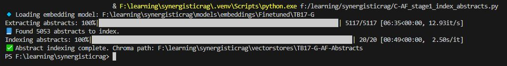


<p style="text-align:center;">
  <sub>تصویر ۱۷ – مثال خروجی اجرای کد استخراج چکیده ها در رویکرد Abstract-First برای پیکربندی 17TB + G</sub>
</p>

<br>


<p style="text-align:center;">
  <sub>تصویر ۱۸ – مثال خروجی اجرای کد قطعه بندی معنایی رویکرد Abstract-First برای پیکربندی 17TB + G
</sub>
</p>
 
<br>

---
## پیاده سازی: Retrieval-augmented generation

### معماری RAG
در این بخش، به مهم‌ترین قسمت گزارش یعنی پیاده‌سازی معماری RAG با رویکرد هم‌افزا می‌پردازیم. در این رویکرد، از راهبرد بر پایه چکیده‌ها، به‌همراه مدل جانمایی فاین‌تیون‌شده و قطعات معنایی ریزدانه‌شده بدنه مقالات به‌صورت ترکیبی استفاده می‌شود.

در مراحل قبلی، زیرساخت لازم برای این معماری شامل استخراج چکیده‌ها، تولید مقادیر برداری تخصصی، و قطعه‌بندی معنایی بدنه مقالات و اندیس‌گذاری آن‌ها در پایگاه داده برداری آماده شده است. در این بخش، نشان می‌دهیم که چگونه این اجزا در کنار یکدیگر قرار می‌گیرند تا در فرآیند پاسخ‌گویی به پرسش‌های کاربران به‌صورت هم‌افزا مورد استفاده قرار گیرند.

<br>

---

### معماری RAG ساده

ابتدا در حالت پایه، معماری ساده RAG با استفاده از مجموعه‌ای از کتابخانه‌ها و ابزارهای متداول در پردازش زبان طبیعی و بازیابی برداری پیاده‌سازی می‌شود. در گام نخست، کتابخانه‌های موردنیاز برای بارگذاری مدل‌های زبانی، مدل‌های جانمایی و ارتباط با پایگاه داده برداری فراخوانی می‌گردند:
```python
import os, json, torch
from pathlib import Path
from tqdm import tqdm
from sentence_transformers import SentenceTransformer
from chromadb import PersistentClient
from transformers import AutoTokenizer, AutoModelForCausalLM, pipeline
import nltk
nltk.download('punkt', quiet=True)
```
در این بخش:<br>
&nbsp;&nbsp;&nbsp;•	از SentenceTransformer: برای تولید بردارهای معنایی پرسش‌ها و اسناد استفاده می‌شود؛<br>
&nbsp;&nbsp;&nbsp;•	از ChromaDB (PersistentClient): برای نگه‌داری و جستجوی برداری اسناد؛<br>
&nbsp;&nbsp;&nbsp;•	از Transformers: برای بارگذاری مدل زبانی مولد (LLM) و پیاده‌سازی مرحله Generation؛<br>
&nbsp;&nbsp;&nbsp;•	و از NLTK برای توکن‌سازی متون (در صورت نیاز) بهره گرفته می‌شود.
به این ترتیب، زیرساخت اولیه لازم برای پیاده‌سازی یک سامانه RAG ساده فراهم می‌گردد.

<br>

در گام بعد، مسیرهای مربوط به ورودی پرسش‌ها، خروجی سامانه RAG، پایگاه داده برداری، مدل جانمایی و مدل زبانی محلی تعیین می‌شوند:
 ```python
INPUT_QUERIES_FILE = r" Enter .jsonl queries input location "  
OUTPUT_FILE = r" Enter .jsonl output destination "

CHROMA_PATH = r" Enter semantic chunks’ vector Database location "               
EMB_MODEL_PATH = r" Enter fine-tuned embedding model location "            
LLM_MODEL_PATH = r" Enter Local LLM Model location "
```
در این قسمت:<br>
&nbsp;&nbsp;&nbsp;•	INPUT_QUERIES_FILE: مسیر فایل ورودی با فرمت jsonl که شامل فهرستی از پرسش‌ها است. هر رکورد این فایل معمولاً شامل متن پرسش، شناسه یکتا و در صورت وجود، منبع یا برچسب ارزیابی برای سنجش عملکرد مدل است.<br>
&nbsp;&nbsp;&nbsp;•	OUTPUT_FILE: مسیر فایل خروجی jsonl که پاسخ‌های تولیدشده توسط معماری RAG، به همراه متادیتا (مانند اسناد بازیابی‌شده، نمره شباهت و …) در آن ذخیره می‌شود.<br>
&nbsp;&nbsp;&nbsp;•	CHROMA_PATH: مسیر پایگاه داده برداری ChromaDB که در آن قطعات معنایی اسناد اندیس‌گذاری شده‌اند و در مرحله بازیابی مورد استفاده قرار می‌گیرند.<br>
&nbsp;&nbsp;&nbsp;•	EMB_MODEL_PATH: مسیر مدل جانمایی فاین‌تیون‌شده که برای تبدیل پرسش‌ها و قطعات متنی به بردارهای معنایی مشترک به کار می‌رود.<br>
&nbsp;&nbsp;&nbsp;•	LLM_MODEL_PATH: مسیر مدل زبانی بزرگ محلی که در مرحله تولید پاسخ، پاسخ نهایی را بر اساس متن بازیابی‌شده و پرسش ورودی تولید می‌کند.

<br>

در این مرحله، پارامترهای کلیدی مربوط به رفتار بازیابی و تولید در معماری RAG تنظیم می‌شوند:
```python
TOP_K = 5
MAX_NEW_TOKENS = 300
DEVICE = "cuda" if torch.cuda.is_available() else "cpu"
```
توضیح هر پارامتر به صورت زیر است:<br>
&nbsp;&nbsp;&nbsp;•	TOP_K = 5: تعداد قطعات معنایی برتری را مشخص می‌کند که در مرحله بازیابی از پایگاه داده برداری استخراج می‌شوند. این قطعات به‌عنوان «متن زمینه» به مدل زبانی تزریق می‌شوند.<br>
&nbsp;&nbsp;&nbsp;•	MAX_NEW_TOKENS = 300: حداکثر تعداد توکن‌هایی را تعیین می‌کند که مدل زبانی مجاز است در پاسخ به هر پرسش تولید کند. این پارامتر طول پاسخ را کنترل کرده و از تولید متن‌های بیش از حد بلند جلوگیری می‌کند.<br>
&nbsp;&nbsp;&nbsp;•	DEVICE: با استفاده از دستور:<br>

`DEVICE = "cuda" if torch.cuda.is_available() else "cpu"`

تعیین می‌شود که مدل زبانی (و در صورت نیاز مدل جانمایی) روی GPU اجرا شود یا CPU. در صورت در دسترس بودن GPU، اجرای مدل روی کارت گرافیک موجب تسریع چشمگیر فرآیند پاسخ‌گویی می‌شود.

<br>

در مرحله ی بعد، مدل جانمایی فاین‌تیون‌شده و مدل زبانی محلی به‌صورت صریح بارگذاری و برای استفاده روی دستگاه مناسب آماده می‌شوند:
```python
print(f"🔹 Loading embedding model: {EMB_MODEL_PATH}")
embed_model = SentenceTransformer(EMB_MODEL_PATH, device=DEVICE)

print(f"🔹 Loading LLM model: {LLM_MODEL_PATH}")
tokenizer = AutoTokenizer.from_pretrained(LLM_MODEL_PATH)
llm_model = AutoModelForCausalLM.from_pretrained(
    LLM_MODEL_PATH, torch_dtype=torch.float16 if DEVICE == "cuda" else torch.float32
).to(DEVICE)
```
در کد بالا: <br>
&nbsp;&nbsp;&nbsp;•	بارگذاری مدل  جانمایی با فراخوانی: <br>
`SentenceTransformer(EMB_MODEL_PATH, device=DEVICE)`
<br>
مدل جانمایی فاین‌تیون‌شده بارگذاری می‌شود. این مدل برای تبدیل پرسش کاربر به بردارهای عددی به‌کار می‌رود تا بردار پرسش با بردارهای ذخیره‌شده در پایگاه داده برداری مقایسه شود.<br>

&nbsp;&nbsp;&nbsp;•	بارگذاری توکن‌ساز  و مدل زبانی ابتدا توکن‌ساز [^51] با:<br>
`AutoTokenizer.from_pretrained(LLM_MODEL_PATH)`
<br>

بارگذاری می‌شود و سپس مدل مولد با `AutoModelForCausalLM.from_pretrained` خوانده می‌شود. مدل پس از بارگذاری با استفاده از `.to(DEVICE)` روی GPU یا CPU قرار می‌گیرد تا محاسبات تولید متن بر روی دستگاه مناسب انجام شود.<br>

&nbsp;&nbsp;&nbsp;•	انتخاب نوع داده عددی برای مدل زبانی هنگام بارگذاری مدل زبانی، نوع داده محاسباتی `torch_dtype` بر اساس در دسترس بودن GPU تنظیم می‌شود: اگر `DEVICE == "cuda"` باشد از `torch.float16` استفاده می‌شود تا مصرف حافظه و زمان محاسبات کاهش یابد؛ در غیر این صورت از `torch.float32` بهره گرفته می‌شود. این انتخاب بهینه‌سازی کارایی و مصرف حافظه را در محیط‌های دارای شتاب‌دهنده سخت‌افزاری تسهیل می‌کند.

<br>

نکات پیاده‌سازی و بهینه سازی:<br>
&nbsp;&nbsp;&nbsp;•	سازگاری توکن‌ساز و مدل ضروری است که نسخه توکن‌ساز و مدل از یک منبع یکسان بارگذاری شوند تا ناسازگاری در نگاشت توکن‌ها رخ ندهد.<br>
&nbsp;&nbsp;&nbsp;•	مدیریت حافظه GPU استفاده از `float16` روی GPU موجب کاهش مصرف حافظه می‌شود، اما در برخی مدل‌ها ممکن است نیاز به تنظیمات اضافی مانند فعال‌سازی mixed precision یا مدیریت قطعه‌ای (model sharding) باشد.

<br>

سپس‌، در قسمت بعد برای مرحله تولید پاسخ در معماری RAG از ابزار pipeline کتابخانه Hugging Face استفاده می‌کنیم تا مدیریت مدل زبانی و فرآیند تولید متن ساده و یکپارچه گردد:
```python
generator = pipeline(
    "text-generation",
    model=llm_model,
    tokenizer=tokenizer,
    device=0 if DEVICE == "cuda" else -1,
    max_new_tokens=MAX_NEW_TOKENS,
    temperature=0.5,
)
```
توضیح پارامتر ها در کد فوق:<br>
&nbsp;&nbsp;&nbsp;•	model و tokenizer مدل زبانی و توکن‌ساز باید از یک منبع سازگار بارگذاری شوند تا نگاشت توکن‌ها و رفتار تولید متن همخوانی داشته باشد.<br>
&nbsp;&nbsp;&nbsp;•	device: مقدار `0` به معنی اجرای مدل روی اولین GPU است و مقدار `-1` به معنی اجرای مدل روی CPU. این نگاشت ساده برای محیط‌های تک‌ GPU مناسب است. در محیط‌های چند GPU یا توزیع‌شده باید از ابزارهایی مانند `Accelerate` یا `DataParallel` استفاده شود.<br>
&nbsp;&nbsp;&nbsp;•	max_new_tokens: حداکثر تعداد توکن‌هایی است که مدل مجاز به تولید در هر فراخوانی است. این پارامتر طول پاسخ را محدود می‌کند و از تولید خروجی‌های بسیار طولانی جلوگیری می‌نماید.<br>
&nbsp;&nbsp;&nbsp;•	temperature: پارامتری برای کنترل تصادفی‌بودن تولید متن است. مقدار ۰.۵ تعادلی بین پاسخ‌های محافظه‌کارانه و خلاقانه برقرار می‌کند [24]؛ برای کاربردهای RAG که نیاز به پاسخ‌های مستند و دقیق دارند معمولاً مقدار متوسط یا پایین‌تر مناسب است.

<br>

در مرحله بعد، اتصال به پایگاه داده برداری که قطعات معنایی مقالات در آن ذخیره شده‌اند برقرار می‌شود و مجموعه مربوط به این قطعات برای انجام عملیات بازیابی بارگذاری می‌گردد:
```python
client = PersistentClient(path=CHROMA_PATH)
collection = client.get_collection("semantic_chunks_articles")
```
&nbsp;&nbsp;&nbsp;•	در خط اول با دستور `PersistentClient(path=CHROMA_PATH)` یک نمونه از کلاینت ChromaDB ایجاد می‌شود که به مسیر پایگاه داده برداری مشخص‌شده در `CHROMA_PATH` متصل است. این مسیر همان مکانی است که در مرحله پیش‌پردازش و قطعه‌بندی معنایی، مقادیر برداری مربوط به قطعات مقالات در آن ذخیره شده‌اند. <br>
&nbsp;&nbsp;&nbsp;•	در خط دوم با دستور: <br>
`collection = client.get_collection("semantic_chunks_articles")`
<br>
مجموعه‌ای با نام "semantic_chunks_articles" فراخوانی می‌شود. این نام دقیقاً همان مجموعه‌ای است که در مرحله قطعه‌بندی معنایی ساده برای ذخیره‌سازی بردارهای قطعات مقالات استفاده شده بود. این مجموعه شامل:<br>
&nbsp;&nbsp;&nbsp;&nbsp;&nbsp;&nbsp;o	متن قطعات معنایی،<br>
&nbsp;&nbsp;&nbsp;&nbsp;&nbsp;&nbsp;o	مقادیر برداری مربوطه،<br>
&nbsp;&nbsp;&nbsp;&nbsp;&nbsp;&nbsp;o	متادیتا (مانند نام مقاله و شناسه قطعه)،<br>
است و در مرحله بازیابی معماری RAG برای یافتن نزدیک‌ترین قطعات به پرسش کاربر به‌کار گرفته می‌شود.

<br>

در این بخش، تابع اصلی معماری RAG معرفی می‌شود؛ تابعی که فرآیند کامل تبدیل پرسش به مقدار برداری، بازیابی قطعات معنایی، ساخت زمینه و تولید پاسخ نهایی را یکپارچه مدیریت می‌کند:
```python
def rag_query(query: str, top_k=5):
    query_emb = embed_model.encode([query], normalize_embeddings=True).tolist()[0]

    results = collection.query(query_embeddings=[query_emb], n_results=top_k)
    retrieved_texts = results["documents"][0]

    context = "\n\n".join(retrieved_texts)

    prompt = f""" Enter your prompt here

### Question:
{query}

### Context:
{context}

### Answer:"""

    output = generator(prompt)[0]["generated_text"]
    answer = output.split("### Answer:")[-1].strip()

    return retrieved_texts, answer
```
توضیح مرحله‌به‌مرحله عملکرد تابع:<br>
&nbsp;&nbsp;&nbsp;•	محاسبه مقدار برداری پرسش: در خط نخست، پرسش ورودی توسط مدل جانمایی فاین‌تیون‌شده انکود شده و بردار معنایی آن در متغیر `query_emb` ذخیره می‌شود. این بردار مبنای مقایسه با بردارهای موجود در پایگاه داده معنایی است.<br>
&nbsp;&nbsp;&nbsp;•	بازیابی قطعات معنایی مرتبط: در گام بعد، با استفاده از `collection.query` نزدیک‌ترین قطعات معنایی به پرسش (بر اساس شباهت کسینوسی) و به تعداد `top_k` بازیابی می‌شوند. خروجی این مرحله در `results` قرار گرفته و متن قطعات از فیلد `documents` استخراج می‌شود.<br>
&nbsp;&nbsp;&nbsp;•	ساخت متن زمینه (Context): قطعات بازیابی‌شده با جداکننده خط خالی به یکدیگر متصل شده و در متغیر context قرار می‌گیرند. این متن زمینه همان دانشی است که مدل زبانی باید پاسخ خود را صرفاً بر اساس آن تولید کند.<br>
&nbsp;&nbsp;&nbsp;•	ساخت پرامپت هدایت‌کننده در ادامه، یک پرامپت ساختاریافته شامل بخش‌های پرسش، زمینه و محل پاسخ ایجاد می‌شود. این پرامپت مدل را ملزم می‌کند تنها از اطلاعات موجود در زمینه استفاده کند. طراحی دقیق این پرامپت در بخش ارزیابی به‌طور کامل بررسی خواهد شد.
&nbsp;&nbsp;&nbsp;•	تولید پاسخ و استخراج خروجی نهایی مدل زبانی با استفاده از `generator` پاسخ را تولید کرده و متن کامل خروجی در `output` قرار می‌گیرد. سپس بخش مربوط به «`###` Answer» استخراج شده و پس از پاک‌سازی در متغیر `answer` ذخیره می‌شود.<br>
&nbsp;&nbsp;&nbsp;•	بازگرداندن خروجی در پایان، تابع دو مقدار بازمی‌گرداند:<br>
۱) قطعات معنایی بازیابی‌شده (برای تحلیل و ارزیابی)<br>
۲) پاسخ نهایی مدل

<br>


سپس، تابعی برای خواندن فایل ورودی پرسش‌ها تعریف می‌شود. این فایل معمولاً در قالب JSONL ذخیره شده و شامل مجموعه‌ای از پرسش‌ها همراه با شناسه و اطلاعات تکمیلی است. کد مربوطه به صورت زیر است:
 ```python
def read_queries(path: str):
    queries = []
    with open(path, "r", encoding="utf-8") as f:
        for line in f:
            if line.strip():
                queries.append(json.loads(line))
    return queries

input_queries = read_queries(INPUT_QUERIES_FILE)
```
توضیح عملکرد تابع:<br>
&nbsp;&nbsp;&nbsp;•	خواندن فایل ورودی تابع `read_queries` مسیر فایل ورودی را دریافت کرده و آن را خط‌به‌خط می‌خواند. هر خط از فایل JSONL یک شیء JSON مستقل است که شامل اطلاعات مربوط به یک پرسش می‌باشد.<br>
&nbsp;&nbsp;&nbsp;•	پردازش خطوط معتبر تنها خطوطی که خالی نباشند پردازش شده و با استفاده از `json.loads` به ساختار داده پایتونی تبدیل می‌شوند. این ساختار معمولاً شامل مواردی مانند:<br>
&nbsp;&nbsp;&nbsp;&nbsp;&nbsp;&nbsp;o	متن پرسش کاربر<br>
&nbsp;&nbsp;&nbsp;&nbsp;&nbsp;&nbsp;o	شناسه یکتا<br>
&nbsp;&nbsp;&nbsp;&nbsp;&nbsp;&nbsp;o	منبع یا برچسب ارزیابی (در صورت وجود)<br>

&nbsp;&nbsp;&nbsp;•	بازگرداندن فهرست پرسش‌ها تمامی پرسش‌های استخراج‌شده در قالب یک لیست در خروجی تابع بازگردانده می‌شوند.<br>

&nbsp;&nbsp;&nbsp;•	بارگذاری پرسش‌ها در معماری RAG در خط پایانی، با فراخوانی `read_queries(INPUT_QUERIES_FILE)` محتوای فایل ورودی خوانده شده و در متغیر `input_queries` ذخیره می‌شود. این متغیر در ادامه فرآیند RAG برای پردازش و پاسخ‌گویی به پرسش‌ها مورد استفاده قرار می‌گیرد.

<br>

در بخش پایانی کد، فرآیند اصلی RAG روی مجموعه پرسش‌های ورودی اجرا شده و خروجی نهایی در قالب یک فایل JSONL ذخیره می‌شود. ساختار کد به صورت زیر است:
```python
with open(OUTPUT_FILE, "w", encoding="utf-8") as outfile:
    for item in tqdm(input_queries, desc="Running RAG Simple"):
        q_id = item["id"]
        q_text = item["query"]
        contexts, answer = rag_query(q_text, top_k=TOP_K)
        output_obj = {
            "id": q_id,
            "query": q_text,
            "contexts": contexts,
            "answer": answer
        }
        outfile.write(json.dumps(output_obj, ensure_ascii=False) + "\n")

print(f"✅ Finished! Results saved to {OUTPUT_FILE}")
```
توضیح مرحله‌به‌مرحله اجرای نهایی:<br>
&nbsp;&nbsp;&nbsp;•	خواندن و تفکیک اطلاعات هر پرسش در هر تکرار حلقه، یک رکورد از فایل ورودی شامل شناسهٔ پرسش (id) و متن پرسش (query) استخراج شده و در متغیرهای مربوطه قرار می‌گیرد.<br>

&nbsp;&nbsp;&nbsp;•	فراخوانی تابع RAG با فراخوانی `rag_query`، دو خروجی تولید می‌شود:<br>
&nbsp;&nbsp;&nbsp;&nbsp;&nbsp;&nbsp;o	contexts: قطعات معنایی بازیابی‌شده از پایگاه داده؛<br>
&nbsp;&nbsp;&nbsp;&nbsp;&nbsp;&nbsp;o	answer: پاسخ نهایی تولیدشده توسط مدل زبانی این دو مقدار همراه با شناسه و متن پرسش در یک شیء خروجی تجمیع می‌شوند.<br>
&nbsp;&nbsp;&nbsp;•	نوشتن خروجی در فایل JSONL شیء خروجی با استفاده از `json.dumps`  به رشته JSON تبدیل شده و در فایل مقصد `OUTPUT_FILE` ذخیره می‌شود. استفاده از `ensure_ascii=False` باعث می‌شود متن فارسی بدون تبدیل به یونیکدهای `escape` ذخیره گردد.<br>
&nbsp;&nbsp;&nbsp;•	نمایش نوار پیشرفت حلقه درون tqdm قرار گرفته تا روند پردازش پرسش‌ها در ترمینال به‌صورت نوار پیشرفت نمایش داده شود. این ویژگی به‌ویژه هنگام پردازش تعداد زیادی پرسش، امکان پایش وضعیت اجرا را فراهم می‌کند.<br>
&nbsp;&nbsp;&nbsp;•	پیام پایان اجرا پس از تکمیل پردازش، پیام نهایی چاپ می‌شود تا محل ذخیره‌سازی خروجی به کاربر اطلاع داده شود.

<br>

---

### معماری RAG رویکرد Abstract-First
همان‌طور که در بخش‌های پیشین اشاره شد، در چهارمین مرحله از معماری هم‌افزای RAG و مطابق با ایده اصلی مطرح‌شده توسط نویسندگان مقاله، به‌جای استفاده از رویکرد RAG ساده، از رویکرد اول–چکیده بهره می‌بریم.<br>

نویسندگان مقاله این فرض را مطرح می‌کنند که بخش چکیده در متون علمی معمولاً حاوی اطلاعات معنایی متراکم‌تری از نوآوری‌ها، روش‌شناسی‌ها و یافته‌های کلیدی است؛ بنابراین، این بخش می‌تواند برای فرآیند بازیابی ارزش اطلاعاتی بالاتری نسبت به بسیاری از قطعات معنایی بدنه مقاله داشته باشد. <br>

به بیان دیگر، چکیده‌ها نسبت سیگنال به نویز بالاتری ارائه می‌دهند و از افزونگی [^52] کمتری برخوردارند؛ موضوعی که با اصول نظریه اطلاعات شانون (۱۹۴۸) [25] نیز هم‌خوانی دارد.<br>

به‌علاوه، یک متن زمانی از نظر معنایی منسجم [^53] تلقی می‌شود که اجزای آن با یکدیگر ارتباط معنایی داشته و در مجموع یک واحد کامل را شکل دهند. در قطعه‌بندی معنایی ساده، این احتمال وجود دارد که بخش‌هایی ناقص، گسسته یا از نظر سیگنال و تراکم معنایی ضعیف تولید و سپس در مرحله بازیابی انتخاب شوند. در مقابل، چکیده به‌عنوان یک واحد معنایی کامل، معمولاً از انسجام درونی بیشتری برخوردار است و این مشکلات را به‌مراتب کمتر نشان می‌دهد. این موضوع با اصول مطرح‌شده در تئوری انسجام معنایی توسط سالتون و مک‌گیل (۱۹۸۳) [26] نیز هم‌خوانی دارد.<br>

مورد مهم دیگر، هم‌ترازی [^54] میان نیاز اطلاعاتی کاربر و محتوای بازیابی‌شده است. از آنجا که هدف این پژوهش بازیابی اطلاعات از متون علمی است، بخش عمده‌ای از پرسش‌ها حول محور مفاهیم [^55] سطح‌بالا، یافته‌های کلیدی و نوآوری‌های پژوهشی شکل می‌گیرند. این نوع نیاز اطلاعاتی معمولاً در بخش چکیده مقالات پوشش داده می‌شود؛ بنابراین، چکیده‌ها از این منظر نیز گزینه‌ای مناسب برای مرحله اولیه بازیابی محسوب می‌شوند.<br>

در کنار این موضوع، استفاده از رویکرد سلسله‌مراتبی (هرمی) در جستجو و پیمایش فضای برداری، به کنترل مسئله «نفرین ابعاد» کمک می‌کند. اعمال یک فیلتر اولیه مبتنی بر چکیده‌ها، علاوه بر حفظ ارتباط معنایی، موجب کاهش پیچیدگی محاسباتی در مراحل بعدی جستجو و بازیابی می‌شود. این رویکرد با اصول مطرح‌شده در مقدمه بازیابی اطلاعات مانینگ (۲۰۰۸) [27] نیز هم‌خوانی دارد.

<br>

با توجه به مباحث مطرح‌شده و کد RAG ساده در بخش پیشین، در این قسمت نسخه Abstract First معماری RAG پیاده‌سازی می‌شود. تفاوت اصلی این رویکرد با نسخهٔ ساده در این است که فرآیند بازیابی در دو مرحله انجام می‌گیرد:<br>

۱) مرحله اول – بازیابی چکیده‌ها: پرسش کاربر ابتدا در پایگاه داده برداری حاوی چکیده مقالات جستجو می‌شود و تعداد N چکیده برتر (برای مثال `N=100` مطابق آزمایش‌های مقاله اصلی) بازیابی می‌گردد.<br>

۲) مرحله دوم – بازیابی قطعات معنایی: سپس تنها از میان همین N مقاله منتخب، قطعات معنایی مرتبط استخراج می‌شوند تا مرحله بازیابی دقیق‌تر و هدفمندتر انجام شود.<br>

کد این بخش از برنامه به صورت زیر خواهد بود:

در ابتدای برنامه، همانند نسخه ساده RAG، کتابخانه‌های موردنیاز فراخوانی می‌شوند و مسیر فایل‌های ورودی و خروجی مشخص می‌گردد:
```python
import os, json, torch
from pathlib import Path
from tqdm import tqdm
from sentence_transformers import SentenceTransformer
from chromadb import PersistentClient
from transformers import AutoTokenizer, AutoModelForCausalLM, pipeline
import nltk
nltk.download("punkt", quiet=True)

QUERIES_FILE = r" Enter .jsonl queries input location "  
OUTPUT_FILE  = r" Enter .jsonl output destination "
CHROMA_ABS_PATH  = r" Enter abstracts SC vector Database location "               
CHROMA_BODY_PATH = r" Enter bodies SC vector Database location "
EMBED_MODEL_PATH = r" Enter fine-tuned embedding model location "            
LLM_MODEL_PATH   = r" Enter Local LLM Model location "

TOP_A = 100    
TOP_B = 5     
MAX_NEW = 300
DEVICE   = "cuda" if torch.cuda.is_available() else "cpu"
```
در این بخش، مشابه برنامه RAG ساده، پیش‌نیازهای کد بارگذاری می‌شوند. تفاوت اصلی این رویکرد در آن است که دو پایگاه داده برداری تعریف شده است:<br>
 یکی برای بازیابی چکیده‌ها و دیگری برای بازیابی متن اصلی مقالات.<br>

&nbsp;&nbsp;&nbsp;•	پارامتر `TOP_A` تعداد N چکیده برتری را مشخص می‌کند که در مرحله نخست بازیابی می‌شوند.<br>
&nbsp;&nbsp;&nbsp;•	پارامتر `TOP_B` همان نقش `TOP_K` در معماری RAG ساده را دارد؛ با این تفاوت که این بار از میان N مقاله منتخب، تعداد `TOP_B` قطعه معنایی برتر به مدل زبانی ارسال می‌شود.<br>
&nbsp;&nbsp;&nbsp;•	پارامتر `MAX_NEW` نیز حداکثر تعداد توکن‌هایی را تعیین می‌کند که مدل زبانی در مرحله تولید پاسخ مجاز به تولید آن است.<br>

در بخش دوم، همانند نسخه ساده RAG، مدل‌های جانمایی و مدل زبانی بارگذاری می‌شوند. برای تولید پاسخ، یک شیء `pipeline` از نوع text generation ساخته می‌شود:
```python
print(f"🔹 Loading embedding model: {EMBED_MODEL_PATH}")
embed_model = SentenceTransformer(EMBED_MODEL_PATH, device=DEVICE)

print(f"🔹 Loading LLM model: {LLM_MODEL_PATH}")
tokenizer = AutoTokenizer.from_pretrained(LLM_MODEL_PATH)
llm_model = AutoModelForCausalLM.from_pretrained(
    LLM_MODEL_PATH,
    torch_dtype=torch.float16 if DEVICE=="cuda" else torch.float32
).to(DEVICE)

generator = pipeline(
    "text-generation",
    model=llm_model,
    tokenizer=tokenizer,
    device=0 if DEVICE=="cuda" else -1,
    max_new_tokens=MAX_NEW,
    temperature=0.5,
    return_full_text=False
)
```
پارامتر `return_full_text` با مقدار `False` تعیین می‌کند تا مدل تنها پاسخ مرتبط را تولید کند و از تولید متن اضافه جلوگیری شود.

 <br>

در بخش بعدی، و پایگاه داده برداری که به‌صورت جداگانه برای چکیده‌ها و متن اصلی مقالات ایجاد شده‌اند، بارگذاری می‌شوند:
```python
client_abs  = PersistentClient(path=CHROMA_ABS_PATH)
client_body = PersistentClient(path=CHROMA_BODY_PATH)

abs_collection  = client_abs.get_collection("abstracts")
body_collection = client_body.get_collection("semantic_body_chunks")
```
در این بخش:<br>
&nbsp;&nbsp;&nbsp;•	client_abs: پایگاه داده برداری مربوط به چکیده مقالات را بارگذاری می‌کند؛<br>
&nbsp;&nbsp;&nbsp;•	client_body: پایگاه داده برداری مربوط به قطعات بدنه مقالات را فراخوانی می‌کند؛<br>
&nbsp;&nbsp;&nbsp;•	مجموعه abstracts: برای مرحله انتخاب N چکیده برتر استفاده می‌شود؛<br>
&nbsp;&nbsp;&nbsp;•	مجموعه semantic_body_chunks: تنها برای همان N مقاله منتخب به‌کار می‌رود تا قطعات معنایی دقیق‌تر استخراج شوند. 

<br>

سپس، تابع `retrieve_from_abstracts` تعریف می‌شود که وظیفه آن بازیابی چکیده‌های مرتبط از پایگاه داده برداری است:
```python
def retrieve_from_abstracts(query: str, top_k=TOP_A):
    q_emb = embed_model.encode([query], normalize_embeddings=True).tolist()[0]
    res = abs_collection.query(query_embeddings=[q_emb], n_results=top_k)

    abstract_texts = res["documents"][0]
    abstract_ids   = res["ids"][0]           
    doc_ids = [doc_id for doc_id in abstract_ids]
    return doc_ids, abstract_texts
```
در این تابع:<br>
و	پرسش کاربر به یک بردار نرمال‌سازی‌شده تبدیل می‌شود؛<br>
&nbsp;&nbsp;&nbsp;•	این بردار با بردارهای موجود در پایگاه داده چکیده‌ها مقایسه شده و `TOP_A` چکیده برتر بازیابی می‌شود؛<br>
&nbsp;&nbsp;&nbsp;•	خروجی شامل شناسه مقالات منتخب و متن چکیده‌های مربوطه است که در مرحله بعدی برای بازیابی قطعات بدنه مقالات استفاده می‌شوند.

<br>

در مرحله ی بعد، در این مرحله، تابع `retrieve_from_bodies` تعریف می‌شود که وظیفه آن بازیابی قطعات معنایی از بدنه مقالات منتخب است:

```python
def retrieve_from_bodies(query: str, allowed_doc_ids, top_k=TOP_B):

    where_clause = {"source": {"$in": [f"{d}.xml" for d in allowed_doc_ids]}}
    q_emb = embed_model.encode([query], normalize_embeddings=True).tolist()[0]

    res = body_collection.query(
        query_embeddings=[q_emb],
        n_results=top_k,
        where=where_clause
    )

    return res["documents"][0]
```
در این تابع:<br>
&nbsp;&nbsp;&nbsp;•	شناسه مقالات منتخب از مرحله چکیده‌ها دریافت می‌شود؛<br>
&nbsp;&nbsp;&nbsp;•	تنها قطعات مربوط به همین مقالات (با استفاده از شرط `where_clause`) جستجو می‌شوند؛<br>
&nbsp;&nbsp;&nbsp;•	بردار پرسش کاربر با بردار قطعات بدنه مقالات مقایسه شده و `TOP_B` قطعه معنایی برتر بازیابی می‌گردد؛<br>
&nbsp;&nbsp;&nbsp;•	خروجی شامل قطعات مرتبطی است که در مرحله تولید پاسخ به مدل زبانی داده می‌شوند.

<br>

در قسمت بعد، تابع `rag_abstract_first` تعریف می‌شود که مراحل مختلف بازیابی و تولید پاسخ را یکپارچه کرده و پرسش کاربر را همراه با زمینه معنایی استخراج‌شده به مدل زبانی ارسال می‌کند:
```python
def rag_abstract_first(query: str):

    top_docs, abs_contexts = retrieve_from_abstracts(query)
    body_chunks = retrieve_from_bodies(query, allowed_doc_ids=top_docs)
    final_context = "\n\n".join(body_chunks)
    prompt = f""" Enter Your prompt here.

### Question:
{query}

### Context:
{final_context}

### Answer:
"""
    out = generator(prompt)[0]["generated_text"]
    answer = out.split("### Answer:")[-1].strip()
    return abs_contexts, body_chunks, answer
```
در این تابع:<br>
&nbsp;&nbsp;&nbsp;•	ابتدا چکیده‌های مرتبط با پرسش کاربر بازیابی شده و شناسه مقالات منتخب استخراج می‌شود؛<br>
&nbsp;&nbsp;&nbsp;•	سپس قطعات معنایی بدنه همان مقالات فراخوانی می‌گردد؛<br>
&nbsp;&nbsp;&nbsp;•	این قطعات در قالب یک زمینه واحد (`final_context`) ترکیب می‌شوند؛<br>
&nbsp;&nbsp;&nbsp;•	پرسش کاربر و زمینه معنایی در قالب یک پرامپت ساختاریافته به مدل زبانی داده می‌شود؛<br>
&nbsp;&nbsp;&nbsp;•	خروجی مدل پردازش شده و بخش مربوط به پاسخ نهایی استخراج می‌گردد؛<br>

و	در نهایت، چکیده‌ها، قطعات بدنه بازیابی‌شده و پاسخ مدل بازگردانده می‌شوند.

<br>

در قسمت بعد، تابع `read_queries` تعریف می‌شود که فایل ورودی شامل پرسش‌های کاربر را خوانده و هر خط معتبر را به‌صورت یک شیء JSON بارگذاری می‌کند.
```python
def read_queries(path):
    qs = []
    with open(path, "r", encoding="utf-8") as f:
        for line in f:
            if line.strip():
                qs.append(json.loads(line))
    return qs

queries = read_queries(QUERIES_FILE)
```
در این تابع:<br>
&nbsp;&nbsp;&nbsp;•	فایل ورودی خط‌به‌خط خوانده می‌شود؛<br>
&nbsp;&nbsp;&nbsp;•	خطوط خالی نادیده گرفته می‌شوند؛
و	هر خط معتبر به‌صورت JSON بارگذاری شده و به فهرست پرسش‌ها افزوده می‌شود؛<br>
&nbsp;&nbsp;&nbsp;•	خروجی شامل مجموعه پرسش‌هایی است که در حلقه اصلی اجرای RAG پردازش خواهند شد.

<br>

در بخش پایانی کد، حلقه اجرایی برنامه راه‌اندازی می‌شود تا هر پرسش ورودی پردازش شده و نتیجه نهایی در فایل خروجی ذخیره گردد:
```python
with open(OUTPUT_FILE, "w", encoding="utf-8") as out:
    for item in tqdm(queries, desc="Running Abstract-First RAG"):
        q_id = item["id"]
        q_text = item["query"]
        abs_ctx, body_ctx, answer = rag_abstract_first(q_text)
        result = {
            "id": q_id,
            "query": q_text,
            "abstracts": abs_ctx,
            "contexts": body_ctx,
            "answer": answer
        }

        out.write(json.dumps(result, ensure_ascii=False) + "\n")
        torch.cuda.empty_cache()

print(f"✅ Done: Results saved to {OUTPUT_FILE}")
```
 در این بخش:<br>
&nbsp;&nbsp;&nbsp;•	شناسه و متن پرسش از ورودی استخراج می‌شود؛<br>
&nbsp;&nbsp;&nbsp;•	تابع `rag_abstract_first` فراخوانی شده و چکیده‌ها، قطعات بدنه و پاسخ مدل تولید می‌گردد؛<br>
&nbsp;&nbsp;&nbsp;•	نتیجه نهایی در قالب یک شیء JSON ساخته شده و در فایل خروجی نوشته می‌شود؛<br>
&nbsp;&nbsp;&nbsp;•	برای نمایش پیشرفت پردازش، حلقه در یک نوار tqdm اجرا می‌شود؛<br>
&nbsp;&nbsp;&nbsp;•	در پایان هر تکرار، حافظه GPU پاک‌سازی می‌شود تا از انباشت غیرضروری جلوگیری شود.

<br>

---

## ارزیابی
### کتابخانه RAGAS
در مرحله پایانی معماری، نویسندگان برای سنجش کیفیت خروجی مدل RAG از چهارچوب [^56] ارزیابی RAGAS [^57] [28] استفاده کرده‌اند؛ ابزاری که به‌طور ویژه برای ارزیابی سامانه‌های بازیابی-تولید طراحی شده و امکان تحلیل دقیق عملکرد مدل را در شرایط واقعی فراهم می‌کند.

<br>
RAGAS با اتصال به یک API مدل زبانی خارجی مانند OpenAI API [29] قادر است مجموعه‌ای از معیارهای ارزیابی را محاسبه کند که هر یک جنبه‌ای از کیفیت پاسخ را می‌سنجند.

<br>

این کتابخانه از ترکیب مدل‌های زبانی و مدل‌های جانمایی برای ارزیابی استفاده می‌کند. برخی متریک‌ها صرفاً مبتنی بر LLM هستند (مانند سنجش وفاداری به متن)، برخی مبتنی بر شباهت برداری‌اند (مانند ارتباط زمینه)، و برخی نیز از ترکیب هر دو بهره می‌برند. این رویکرد ترکیبی باعث می‌شود RAGAS بتواند کیفیت خروجی مدل را نه‌تنها از منظر زبانی، بلکه از منظر معنایی و ساختاری نیز تحلیل کند.<br>

در این مقاله از سه معیار وفاداری به متن [^58]، ارتباط پاسخ [^59] و ارتباط زمینه [^60]  برای سنجش عملکرد معماری استفاده شده است. در ادامه، هر یک از این معیارها و نحوه پیاده‌سازی آن‌ها در چهارچوب RAGAS به‌صورت دقیق معرفی می‌شود.<br>
 


<p style="text-align:center;">
  <sub>تصویر ۱۹ – ارتباط سه معیار ارزیابی عملکرد در RAGAS و جنبه های مربوط به آنها.

</sub>
</p>

<br>

### ۱. وفاداری به متن (Faithfulness):<br>
معیار وفاداری به متن سنجش می‌کند که پاسخ تولیدشده تا چه اندازه با اطلاعات موجود در زمینه ارائه‌شده (Context) سازگار است. هدف این معیار تشخیص این است که آیا مدل تنها بر اساس داده‌های بازیابی‌شده پاسخ داده یا اطلاعاتی خارج از زمینه مانند حدس، دانش عمومی یا «توهم مدل» به پاسخ اضافه کرده است.<br>

به بیان دیگر، اگر مدل ادعایی مطرح کند که در متن زمینه وجود ندارد، امتیاز وفاداری کاهش می‌یابد.

<br>
فرمول امتیاز وفاداری:<br>


$$
\text{Faithfulness Score} = 
\frac{\text{Number of claims in the generated answer
that can be inferred from the given context}}
     {\text{Total number of claims in the generated answer}}
$$


<br>

در RAGAS این امتیاز با استفاده از یک مدل زبانی محاسبه می‌شود. مدل زبانی:<br>

&nbsp;&nbsp;&nbsp;• پاسخ را به مجموعه‌ای از ادعاها (claims) تقسیم می‌کند؛<br>
&nbsp;&nbsp;&nbsp;• برای هر ادعا بررسی می‌کند که آیا در متن زمینه شواهد کافی وجود دارد یا خیر؛<br>
&nbsp;&nbsp;&nbsp;• در نهایت، نسبت ادعاهای قابل‌تأیید به کل ادعاها را به‌عنوان امتیاز وفاداری گزارش می‌کند.
<br>

این روش باعث می‌شود ارزیابی وفاداری نه‌تنها مبتنی بر شباهت سطحی، بلکه مبتنی بر استدلال معنایی باشد.
<br>

برای محاسبه امتیاز وفاداری در RAGAS، ابتدا یک نمونه تک‌مرحله‌ای (SingleTurnSample) شامل پرسش کاربر، پاسخ مدل و زمینه بازیابی‌شده تعریف می‌شود. سپس متریک Faithfulness با استفاده از مدل زبانی از پیش تعریف‌شده فراخوانی می‌گردد:
```python
from ragas import SingleTurnSample
from ragas.metric.collections import Faithfulness

# (llmبا نام )با فرض اینکه مدل زبانی از قبل تعریف شده است
faithfulness = Faithfulness(llm=llm)


# نمونه ساده
sample = SingleTurnSample(
    user_input="پایتخت ایران چیست؟",
    response="پایتخت ایران تهران است.",
    retrieved_contexts=["تهران پایتخت ایران است."]
)

# صدا زدن متریک
f_result = await faithfulness.ascore(
    user_input=sample.user_input,
    response=sample.response,
    retrieved_contexts=sample.retrieved_contexts
)

print("Faithfulness:", f_result.value)
```

در این پیاده‌سازی:<br>
&nbsp;&nbsp;&nbsp;• یک نمونه ارزیابی شامل پرسش، پاسخ و زمینه بازیابی‌شده ساخته می‌شود؛<br>	
&nbsp;&nbsp;&nbsp;• متریک `Faithfulness` با استفاده از مدل زبانی، ادعاهای موجود در پاسخ را استخراج و با زمینه مقایسه می‌کند؛<br>
&nbsp;&nbsp;&nbsp;• خروجی نهایی یک مقدار عددی بین ۰ و ۱ است که نشان‌دهنده میزان پایبندی پاسخ به اطلاعات موجود در متن زمینه است.

<br>

### ۲. ارتباط پاسخ (Answer Relevance):<br>
معیار ارتباط پاسخ میزان تطابق و هم‌خوانی پاسخ تولیدشده با پرسش کاربر را اندازه‌گیری می‌کند. هدف این معیار آن است که مشخص کند آیا مدل واقعاً به پرسش مطرح‌شده پاسخ داده یا صرفاً متنی مرتبط با موضوع تولید کرده است. در واقع، این معیار بررسی می‌کند که پاسخ تا چه اندازه از نظر معنایی به خود پرسش نزدیک است.<br>

فرمول ارتباط پاسخ:<br>


$$
\text{Answer Relevance} = \frac{1}{N} \sum_{i=1}^{N} \cos \big( E_{g_i}, E_o \big)
$$


<br>

$ E_(g_i) $ : مقدار برداری پاسخ تولید‌شده i اُم.<br>
$E_o$ : مقدار برداری پرسش کاربر.<br>
N: تعداد پاسخ های تولید شده.

<br>(در حالت تک‌پاسخ، معمولاً `N = 1`)
این فرمول میانگین شباهت کسینوسی بین بردار پرسش و بردار پاسخ را محاسبه می‌کند.
هرچه این مقدار به ۱ نزدیک‌تر باشد، پاسخ از نظر معنایی با پرسش مرتبط‌تر است.

<br>

در RAGAS این معیار با ترکیبی از دو مؤلفه محاسبه می‌شود:<br>
&nbsp;&nbsp;&nbsp;• مدل جانمایی: برای تبدیل پرسش و پاسخ به بردارهای معنایی با ابعاد ثابت.<br>
&nbsp;&nbsp;&nbsp;• مدل زبانی: برای تحلیل دقیق‌تر و ارزیابی نهایی میزان ارتباط معنایی.<br>

این ترکیب باعث می‌شود ارزیابی ارتباط پاسخ نه‌تنها بر اساس شباهت برداری، بلکه بر اساس درک زبانی عمیق‌تر نیز انجام شود.
<br>

برای محاسبه امتیاز Answer Relevance در RAGAS، ابتدا یک نمونه تک‌مرحله‌ای شامل پرسش کاربر، پاسخ مدل و زمینه بازیابی‌شده ساخته می‌شود. سپس متریک `AnswerRelevancy` با استفاده از مدل زبانی و مدل جانمایی از پیش تعریف‌شده فراخوانی می‌گرد:
 ```python
from ragas import SingleTurnSample
from ragas.metric.collections import AnswerRelevancy

# (embeddings و llmبا نام های )با فرض اینکه مدل زبانی و مدل جانمایی از قبل تعریف شده اند
answer_relevancy = AnswerRelevancy(llm=llm, embeddings=embeddings)

# نمونه ساده
sample = SingleTurnSample(
    user_input="پایتخت ایران چیست؟",
    response="پایتخت ایران تهران است.",
    retrieved_contexts=["تهران پایتخت ایران است."]
)

# صدا زدن متریک‌
r_result = await answer_relevancy.ascore(
    user_input=sample.user_input,
    response=sample.response
)
print("Answer Relevancy:", r_result.value)
```
در این پیاده‌سازی:<br>
&nbsp;&nbsp;&nbsp;• پرسش و پاسخ به‌صورت بردارهای معنایی توسط مدل جانمایی تبدیل می‌شوند؛<br>
&nbsp;&nbsp;&nbsp;• مدل زبانی برای تحلیل دقیق‌تر و ارزیابی نهایی میزان ارتباط معنایی بین پرسش و پاسخ استفاده می‌شود؛<br>
&nbsp;&nbsp;&nbsp;• خروجی نهایی یک مقدار عددی بین ۰ و ۱ است که نشان می‌دهد پاسخ تا چه اندازه با پرسش کاربر هم‌خوانی معنایی دارد.

<br>

### ۳. ارتباط زمینه (Context Relevance):
معیار ارتباط زمینه بررسی می‌کند که قطعات معنایی بازیابی‌شده از پایگاه دانش تا چه اندازه با پرسش کاربر مرتبط هستند. این معیار کیفیت مرحله بازیابی را می‌سنجد و مشخص می‌کند که آیا مدل واقعاً زمینه مناسب و مرتبط را برای پاسخ‌دهی دریافت کرده است یا خیر.<br>

اگر بخش بازیابی قطعات نامرتبط یا کم‌ارتباط را بازیابی کند، حتی یک مدل زبانی بسیار قوی نیز نمی‌تواند پاسخ دقیق و قابل‌اعتماد تولید کند. بنابراین، ارتباط زمینه یکی از مهم‌ترین شاخص‌های ارزیابی معماری‌های RAG است.<br>

فرمول ارتباط زمینه:
<br>


$$
\text{Context Relevance} = 
\frac{|S|}{\text{Total number of sentences in retrieved context}}
$$


<br>
|S| : تعداد جملات از متن بازیابی‌شده که واقعا به پرسش پاسخ می‌دهد.<br>
مخرج کسر: تعداد کل جملات موجود در قطعات بازیابی‌شده.

<br>

در RAGAS، این معیار با استفاده از یک مدل زبانی محاسبه می‌شود. مدل:<br>

&nbsp;&nbsp;&nbsp;• هر جمله موجود در زمینه را تحلیل می‌کند؛<br>
&nbsp;&nbsp;&nbsp;• میزان ارتباط معنایی آن جمله با پرسش کاربر را می‌سنجد؛<br>
&nbsp;&nbsp;&nbsp;• جملات مرتبط را در مجموعه S قرار می‌دهد؛<br>
&nbsp;&nbsp;&nbsp;• در نهایت، نسبت جملات مرتبط به کل جملات را به‌عنوان امتیاز Context Relevance گزارش می‌کند.<br>

این روش باعث می‌شود ارزیابی ارتباط زمینه نه‌تنها بر اساس شباهت برداری، بلکه بر اساس درک معنایی و استدلال زبانی انجام شود.

<br>

از آن‌جایی که در نسخه‌های جدید RAGAS (`در این گزارش نسخه 0.3.9`) تابع محاسبه `Context Relevance` حذف شده و دیگر در دسترس نیست، این معیار باید به‌صورت دستی پیاده‌سازی شود.<br>

در این روش، ابتدا تمام جملات موجود در زمینه بازیابی‌شده استخراج می‌شوند،
سپس یک مدل زبانی برای تشخیص میزان ارتباط هر جمله با پرسش کاربر مورد استفاده قرار می‌گیرد.
در آخر، نسبت جملات مرتبط به کل جملات به‌عنوان امتیاز ارتباط زمینه محاسبه می‌شود.<br>

کد زیر یک پیاده‌سازی ساده از این فرآیند را نشان می‌دهد:
```python
import asyncio
from nltk.tokenize import sent_tokenize
from openai import AsyncOpenAI

client = AsyncOpenAI(
    api_key="YOUR_API_KEY",
    base_url="https://openrouter.ai/api/v1"
)

async def context_relevance(question, contexts):
    if not contexts:
        return 0.0
    sentences = sent_tokenize(" ".join(contexts))
    if not sentences:
        return 0.0
    relevant = 0
    prompt_template = """Question: {question}
Sentence: {sentence}
Is this sentence relevant for answering the question?
Respond only with "yes" or "no"."""

    for s in sentences:
        prompt = prompt_template.format(question=question, sentence=s)
        resp = await client.chat.completions.create(
            model="x-ai/grok-4.1-fast",
            messages=[{"role": "user", "content": prompt}],
            max_tokens=10
        )
        ans = resp.choices[0].message.content.strip().lower()
        if ans.startswith("yes"):
            relevant += 1
    return relevant / len(sentences)

async def main():
    question = "پایتخت ایران چیست؟"
    contexts = [
        "تهران پایتخت ایران است.",
        "ایران در خاورمیانه قرار دارد.",
        "جمعیت تهران بیش از 8 میلیون نفر است."
    ]
    score = await context_relevance(question, contexts)
    print("Context Relevance:", round(score, 4))

if __name__ == "__main__":
    asyncio.run(main())
```
در این پیاده‌سازی:<br>
&nbsp;&nbsp;&nbsp;• تمام قطعات بازیابی‌شده به جملات مستقل تقسیم می‌شوند؛<br>
&nbsp;&nbsp;&nbsp;• برای هر جمله، یک پرسش ساده به مدل زبانی ارسال می‌شود تا میزان ارتباط آن با پرسش اصلی مشخص شود؛<br>
&nbsp;&nbsp;&nbsp;• جملاتی که مدل آن‌ها را مرتبط تشخیص دهد شمارش می‌شوند؛<br>
&nbsp;&nbsp;&nbsp;• نسبت جملات مرتبط به کل جملات، امتیاز نهایی Context Relevance را تشکیل می‌دهد.
<br>
این روش اگرچه ساده است، اما در عمل عملکردی مشابه نسخه قدیمی RAGAS ارائه می‌دهد و برای ارزیابی معماری‌های RAG کاملاً قابل اتکا است.

<br>

#### پیادهسازی عملی معیارهای ارزیابی
در پیاده‌سازی عملی این پروژه، دو معیار وفاداری به متن و ارتباط پاسخ که در کتابخانه RAGAS تعریف شده‌اند، در یک اسکریپت واحد تجمیع و اجرا می‌شوند. این اسکریپت خروجی معماری RAG را از فایل نتایج دریافت کرده، برای هر پرسش پاسخ امتیازهای ارزیابی را محاسبه می‌کند و در نهایت میانگین معیارها را نیز گزارش می‌دهد.
کد زیر نمونه کامل این فرآیند را نشان می‌دهد:
```python
import json
import asyncio
from ragas import SingleTurnSample
from ragas.metrics.collections import Faithfulness, AnswerRelevancy
from openai import AsyncOpenAI
from ragas.llms import llm_factory
from ragas.embeddings import HuggingFaceEmbeddings
client = AsyncOpenAI(
    api_key="YOUR_API_KEY",
    base_url="https://openrouter.ai/api/v1"
)

# انتخاب مدل LLM (مثلاً Grok یا GPT-4o-mini)
llm = llm_factory("x-ai/grok-4.1-fast", client=client)
embeddings = HuggingFaceEmbeddings(
    model=r" Enter your embedding model of evaluation location e.g. bge-base-en-v1.5 "
)

faithfulness = Faithfulness(llm=llm)
answer_relevancy = AnswerRelevancy(llm=llm, embeddings=embeddings)

samples = []
with open("AF_RAG_Results.jsonl", "r", encoding="utf8") as f:
    for idx, line in enumerate(f, start=1):
        item = json.loads(line)
        q = item.get("query", "")
        a = item.get("answer", "")
        ctx = item.get("sns_nodes", [])
        if isinstance(ctx, str):
            ctx = [ctx]
        samples.append((idx, SingleTurnSample(user_input=q, response=a, retrieved_contexts=ctx)))

async def main():
    results = []
    total_faith, total_relevancy, total_wordcount = 0, 0, 0
    count = 0
    for idx, s in samples:
        try:
            # Faithfulness
            f_result = await faithfulness.ascore(
                user_input=s.user_input,
                response=s.response,
                retrieved_contexts=s.retrieved_contexts
            )
            f_score = f_result.value

            # Answer Relevancy
            r_result = await answer_relevancy.ascore(
                user_input=s.user_input,
                response=s.response
            )
            r_score = r_result.value

            # Word count
            word_count = len(s.response.split())

            results.append({
                "id": idx,
                "faithfulness": round(f_score, 4),
                "answer_relevancy": round(r_score, 4),
                "avg_word_count": word_count
            })

            total_faith += f_score
            total_relevancy += r_score
            total_wordcount += word_count
            count += 1

        except Exception as e:
            print(f"Error in sample {idx}: {e}")

    averages = {
        "avg_faithfulness": round(total_faith / count, 4) if count else 0,
        "avg_answer_relevancy": round(total_relevancy / count, 4) if count else 0,
        "avg_word_count": round(total_wordcount / count, 2) if count else 0
    }

    output = {
        "results": results,
        "averages": averages
    }

    with open("evaluation_results.json", "w", encoding="utf8") as out:
        json.dump(output, out, ensure_ascii=False, indent=2)

    print("✅ نتایج در evaluation_results.json ذخیره شد.")

if __name__ == "__main__":
    asyncio.run(main())
```
در این کد:<br>
&nbsp;&nbsp;&nbsp;• بارگذاری نتایج RAG: فایل `AF_RAG_Results.jsonl` شامل پرسش، پاسخ و زمینه بازیابی‌شده است. هر خط به یک نمونه ارزیابی تبدیل می‌شود.<br>
&nbsp;&nbsp;&nbsp;• محاسبه  Faithfulness: مدل زبانی بررسی می‌کند که ادعاهای موجود در پاسخ تا چه اندازه در زمینه قابل تأیید هستند.<br>
&nbsp;&nbsp;&nbsp;• محاسبه Answer Relevance: مدل جانمایی و مدل زبانی با هم میزان ارتباط معنایی پاسخ با پرسش را می‌سنجند.<br>
&nbsp;&nbsp;&nbsp;• محاسبه Word Count: تعداد کلمات پاسخ برای تحلیل‌های تکمیلی ذخیره می‌شود.<br>
&nbsp;&nbsp;&nbsp;• تجمیع نتایج: برای هر نمونه امتیازها ذخیره شده و در پایان میانگین معیارها محاسبه و در فایل `evaluation_results.json` ذخیره می‌شود.<br>

این ساختار امکان ارزیابی دقیق عملکرد معماری RAG را فراهم می‌کند و به‌ویژه برای مقایسه نسخه‌های مختلف معماری یا مدل‌های متفاوت بسیار کاربردی است.<br>


برای محاسبه ارتباط زمینه در این پروژه، از آن‌جایی که این متریک در نسخه‌های جدید RAGAS حذف شده و دیگر به‌صورت آماده در دسترس نیست، لازم است آن را به‌صورت دستی پیاده‌سازی کنیم. <br>

در این روش، ابتدا خروجی مرحله قبل (فایل `evaluation_results.json`) و فایل اصلی نتایج RAG (فایل `AF_RAG_Results.jsonl`) وارد برنامه می‌شوند. سپس برای هر نمونه، امتیاز Context Relevance محاسبه شده و در کنار سایر معیارهای قبلی ذخیره می‌گردد.
```python
import json
import asyncio
from nltk.tokenize import sent_tokenize
from openai import AsyncOpenAI

client = AsyncOpenAI(
    api_key="ENTER_YOUR_API_KEY",
    base_url="https://openrouter.ai/api/v1"
)

async def context_relevance(question, contexts):
    if not contexts:
        return 0.0
    sentences = sent_tokenize(" ".join(contexts))
    if not sentences:
        return 0.0

    relevant = 0
    prompt_template = """Question: {question}
Sentence: {sentence}
Is this sentence relevant for answering the question?
Respond only with "yes" or "no"."""

    for s in sentences:
        prompt = prompt_template.format(question=question, sentence=s)

        resp = await client.chat.completions.create(
            model="x-ai/grok-4.1-fast",
            messages=[{"role": "user", "content": prompt}],
            max_tokens=10
        )

        ans = resp.choices[0].message.content.strip().lower()
        if ans.startswith("yes"):
            relevant += 1

    return relevant / len(sentences)


with open("evaluation_results.json", "r", encoding="utf8") as f:
    data = json.load(f)

with open("AF_RAG_Results.jsonl", "r", encoding="utf8") as f:
    raw_samples = [json.loads(line) for line in f]


async def main():
    total_crel = 0
    count = 0

    for idx, item in enumerate(raw_samples, start=1):
        q = item.get("query", "")
        ctx = item.get("sns_nodes", [])
        if isinstance(ctx, str):
            ctx = [ctx]

        try:
            c_score = await context_relevance(q, ctx)
            for r in data["results"]:
                if r["id"] == idx:
                    r["context_relevance"] = round(c_score, 4)
                    break

            total_crel += c_score
            count += 1
        except Exception as e:
            print(f"Error in sample {idx}: {e}")

    data["averages"]["avg_context_relevance"] = round(total_crel / count, 4) if count else 0

    with open("evaluation_results_with_context.json", "w", encoding="utf8") as out:
        json.dump(data, out, ensure_ascii=False, indent=2)

    print("✅ نتایج نهایی در evaluation_results_with_context.json ذخیره شد.")

if __name__ == "__main__":
    asyncio.run(main())

```
توضیح عملکرد این بخش:<br>

&nbsp;&nbsp;&nbsp;• 	بارگذاری داده‌ها: دو فایل ورودی شامل نتایج قبلی و نمونه‌های خام RAG بارگذاری می‌شوند.<br>
&nbsp;&nbsp;&nbsp;• محاسبه Context Relevance:<br>
&nbsp;&nbsp;&nbsp;&nbsp;&nbsp;&nbsp;o تمام قطعات بازیابی‌شده به جملات مستقل تقسیم می‌شوند.<br>
&nbsp;&nbsp;&nbsp;&nbsp;&nbsp;&nbsp;o برای هر جمله، یک مدل زبانی بررسی می‌کند که آیا آن جمله برای پاسخ به پرسش مفید است یا خیر.<br>
&nbsp;&nbsp;&nbsp;&nbsp;&nbsp;&nbsp;o نسبت جملات مرتبط به کل جملات، امتیاز نهایی را تشکیل می‌دهد.<br>
&nbsp;&nbsp;&nbsp;• تجمیع نتایج: امتیاز جدید به رکوردهای قبلی اضافه شده و میانگین آن نیز محاسبه می‌شود.<br>
&nbsp;&nbsp;&nbsp;• ذخیره‌سازی خروجی: تمام نتایج در فایل `evaluation_results_with_context.json` ذخیره می‌گردد.<br>

این ساختار باعث می‌شود سه معیار اصلی -وفاداری به متن، ارتباط پاسخ و ارتباط زمینه- به‌صورت یکپارچه در کنار هم قرار گیرند و تصویری جامع از عملکرد معماری RAG ارائه دهند.<br>

خروجی این دو کد ارزیابی، برای هر سوال به صورت زیر خواهد بود، برای مثال:
<br>

```python
{
  "results": [
    {
      "id": 1,
      "faithfulness": 0.1875,
      "answer_relevancy": 0.8489,
      "avg_word_count": 221,
      "context_relevance": 0.2874
    }
  ],
  "averages": {
    "avg_faithfulness": 0.1875,
    "avg_answer_relevancy": 0.8489,
    "avg_word_count": 221.0,
    "avg_context_relevance": 0.2874
  }
}
```

<br>

---
## نتایچ
در این بخش، عملکرد معماری پیشنهادی در مقاله به‌صورت نظام‌مند مورد ارزیابی قرار می‌گیرد. ابتدا، کارایی مدل‌های زبانی محلی در چارچوب معماری RAG با پیکربندی نهایی ارائه‌شده در مقاله مقایسه می‌شود تا مشخص گردد کدام مدل زبانی در این ساختار بیشترین سازگاری و بهترین کیفیت پاسخ‌دهی را ارائه می‌دهد.<br>
پس از تعیین مناسب‌ترین مدل زبانی محلی، ارزیابی به سمت مدل جانمایی ریزتنظیم‌شده مقاله هدایت می‌شود. در این مرحله، عملکرد مدل جانمایی در پیکربندی‌های مختلف تعریف‌شده در مقاله تحلیل شده و نتایج به‌دست‌آمده با یافته‌های گزارش‌شده در مقاله مقایسه می‌گردد تا میزان هم‌خوانی، تفاوت‌ها و نقاط بهبود مشخص شود.<br>
در ادامه، مدل جانمایی ارائه‌شده در مقاله با سایر مدل‌های جانمایی موجود مورد مقایسه قرار می‌گیرد تا جایگاه نسبی آن در میان مدل‌های رایج و پیشرفته مشخص شود. سپس، خروجی پرامپت‌های مختلف در بهترین مدل زبانی محلی و مدل جانمایی بررسی و تحلیل می‌شود تا تأثیر نوع دستور، کیفیت بازیابی و نحوه ترکیب آن‌ها بر پاسخ نهایی روشن گردد.<br>
در پایان، عملکرد مدل زبانی ارزیاب در سنجش خروجی‌ها با نتایج مدل ارزیاب مورد استفاده در مقاله مقایسه می‌شود. این مقایسه امکان بررسی میزان انطباق ارزیابی‌های انجام‌شده با معیارهای مقاله و اعتبارسنجی نتایج را فراهم می‌سازد.

---

### آزمایش شماره ۱: مقایسه ی عملکرد مدل های زبانی محلی
در این آزمایش، عملکرد مجموعه‌ای از مدل‌های زبانی محلی در چارچوب معماری نهایی ارائه‌شده در مقاله، شامل پیکربندی B + G + FT + SC + AF + EPT و با استفاده از مدل جانمایی ریزتنظیم‌شده all mpnet base v2 (بر اساس پیکربندی ریزتنظیم 17TB + G + SNS) مورد ارزیابی قرار می‌گیرد.<br>
خروجی هر یک از مدل‌های زبانی محلی با بهره‌گیری از معیارهای سنجش RAGAS تحلیل می‌شود تا کیفیت پاسخ‌دهی، میزان ارتباط پاسخ با پرسش، و نحوه استفاده مدل از زمینه بازیابی‌شده به‌صورت کمی اندازه‌گیری گردد.<br>
پس از محاسبه امتیازهای ارزیابی، نتایج به‌دست‌آمده تحلیل و مقایسه می‌شوند و در نهایت بهترین مدل زبانی محلی بر اساس کیفیت پاسخ‌های تولیدشده با توجه به متن سوال و توان استنباط مدل از context های بازیابی‌شده انتخاب خواهد شد.<br>

جدول ۲ نتایج ارزیابی مدل‌های زبانی محلی را در ترکیب با مدل جانمایی all‑mpnet‑base‑v2 (ریزتنظیم‌شده با پیکربندی 17 TB + G + SNS) نشان می‌دهد:


|     نام مدل                         |     Context Relevancy    |     Faithfulness    |     Answer Relevance    |
|-------------------------------------|--------------------------|---------------------|-------------------------|
|     DeepSeek-R1-Distill-Llama-8B    |     0.268                |     0.506           |     **0.837**               |
|     Falcon-7b                       |     0.268                |     0.445           |     0.624               |
|     gemma-2-2b-it                   |     0.268                |     0.566           |     0.625               |
|     gemma-3-4b-it                   |     0.268                |     0.658           |     0.565               |
|     Meta-Llama-2-7b                 |     0.268                |     0.499           |     0.692               |
|     Meta-Llama-3-8B                 |     0.268                |     0.539           |     0.655               |
|     Meta-Llama-3.1-8B               |     0.268                |     0.512           |     0.748               |
|     Mistral-7b-v0.3-Original        |     0.268                |     0.543           |     0.738               |
|     Olmo-3-1025-7B                  |     0.268                |     0.556           |     0.827               |
|     Phi-2                           |     0.268                |     0.510           |     0.738               |
|     Phi-3-mini-4k-instruct          |     0.268                |     0.609           |     0.752               |
|     Phi-4-mini-instruct             |     0.268                |     0.623           |     0.744               |
|     Qwen1.5-4B                      |     0.268                |     0.608           |     0.753               |
|     Qwen2.5-3B                      |     0.268                |     0.611           |     0.817               |
|     Qwen3-4B                        |     0.268                |     **0.674**           |     0.684               |


<sub> جدول ۲ - نتایج ارزیابی مدل‌های زبانی محلی با مدل جانمایی all mpnet base v2 (ریزتنظیم‌شده با پیکربندی 17TB + G + SNS)</sub>


<br>

نخستین نکته قابل مشاهده در جدول فوق، یکسان بودن مقدار Context Relevancy (CR) برای تمامی مدل‌های زبانی است. علت اصلی این موضوع آن است که در این آزمایش، تمامی مدل‌ها از یک مدل جانمایی ثابت برای بازیابی قطعات معنایی استفاده کرده‌اند؛ بنابراین، context های ارائه‌شده به مدل‌های زبانی یکسان بوده و مقدار CR تغییری نمی‌کند.
<br>

با توجه به تصویر ۱۹ و رابطه میان سه معیار ارزیابی، برای انتخاب مناسب‌ترین مدل زبانی در عملیات RAG، معیارهای زیر اهمیت بیشتری دارند:<br>
&nbsp;&nbsp;&nbsp; ۱) Answer Relevance (AR): میزان ارتباط پاسخ مدل با پرسش کاربر<br>
&nbsp;&nbsp;&nbsp; ۲)Faithfulness  (F): میزان انطباق پاسخ مدل با دانش زمینه بازیابی‌شده

<br>
از آنجا که CR در این آزمایش ثابت است، دو معیار فوق نقش تعیین‌کننده‌تری در مقایسه مدل‌ها ایفا می‌کنند.
<br>

به‌منظور تعیین وزن و اهمیت نسبی هر معیار و مقایسه دقیق عملکرد مدل‌ها، مشابه روش نویسندگان مقاله، از تحلیل واریانس (ANOVA) و آزمون Tukey HSD استفاده می‌شود. این روش‌ها امکان مقایسه معنادار میان مدل‌ها را فراهم کرده و مشخص می‌سازند کدام مدل‌ها از نظر آماری عملکرد بهتری نسبت به سایرین دارند.

<br>


### آزمون آماری ANOVA
تحلیل واریانس (Analysis of Variance, ANOVA) یکی از روش‌های آماری کلاسیک برای بررسی تفاوت میانگین‌ها در چند جامعه آماری مستقل است. این آزمون مشخص می‌سازد که آیا تفاوت مشاهده‌شده میان گروه‌ها صرفاً ناشی از نوسانات تصادفی است یا از نظر آماری معنادار بوده و بیانگر وجود اختلاف واقعی میان گروه‌ها می‌باشد.<br>

در این گزارش، به‌منظور بررسی وجود تفاوت معنادار میان عملکرد مدل‌های زبانی مختلف، از آزمون آماری ANOVA یک‌طرفه [^61] استفاده شده است. در این آزمون:<br>


&nbsp;&nbsp;&nbsp;•	متغیرهای وابسته شامل سه معیار اصلی ارزیابی، یعنی:<br>
&nbsp;&nbsp;&nbsp;۱) Faithfulness (وفاداری به متن)<br>
&nbsp;&nbsp;&nbsp;۲) Answer Relevance (ارتباط پاسخ با پرسش)<br>
&nbsp;&nbsp;&nbsp;۳) Context Relevancy (ارتباط زمینه)<br>

&nbsp;&nbsp;&nbsp;•	متغیر مستقل نوع مدل زبانی مورد استفاده در معماری RAG در نظر گرفته شده است.<br>

به‌کارگیری این آزمون امکان بررسی تفاوت‌های معنادار میان مدل‌ها را فراهم می‌سازد و مشخص می‌کند که کدام مدل‌ها از نظر آماری عملکرد بهتری نسبت به سایرین دارند. در ادامه، برای تحلیل دقیق‌تر تفاوت‌ها، از آزمون تکمیلی Tukey HSD نیز استفاده خواهد شد [30].<br>


در این گزارش نحوه ی محاسبه ی این معیار ارزیابی به صورت خلاصه شامل مراحل زیر است:<br>
&nbsp;&nbsp;&nbsp;۱) محاسبه میانگین هر گروه: ابتدا میانگین مقدار هر معیار ارزیابی برای هر مدل محاسبه می‌شود.<br>
&nbsp;&nbsp;&nbsp;۲) محاسبه میانگین کل داده‌ها: میانگین کلی تمام مشاهدات، بدون در نظر گرفتن گروه‌بندی مدل‌ها، محاسبه 	می‌شود.<br>
&nbsp;&nbsp;&nbsp;۳) محاسبه واریانس بین گروه‌ها: این مقدار نشان می‌دهد که میانگین عملکرد مدل‌ها تا چه حد با یکدیگر 	تفاوت دارند. (SS: Sum of Squares)
<br>

$$
SS_{\text{between}} = \sum_i n_i \, \big( \bar{x} - \bar{x}_i \big)^2
$$

<br>

&nbsp;&nbsp;&nbsp;۴) محاسبه واریانس درون گروه‌ها: این مقدار بیانگر میزان پراکندگی داده‌ها در داخل هر مدل است.

<br>

$$
SS_{\text{within}} = \sum_{i} \sum_{j} \, \big( \bar{x}_i - \bar{x}_{ij} \big)^2
$$

<br>

&nbsp;&nbsp;&nbsp;۵) محاسبه آماره F: آماره F از نسبت واریانس بین گروه‌ها به واریانس درون گروه‌ها به‌دست می‌آید. 	(MS: Mean Square)<br>

<br>

$$
F = \frac{MS_{\text{between}}}{MS_{\text{within}}}
$$

<br>

&nbsp;&nbsp;&nbsp;۶) محاسبه مقدار p-value: مقدار p-value نشان می‌دهد که مشاهده چنین مقدار F، در صورت درست 	بودن فرض صفر (برابر بودن میانگین‌ها)، با چه احتمالی رخ می‌دهد.<br>
p-value به‌صورت احتمال قرار گرفتن آماره‌ی F تصادفی در ناحیه‌ی دُم راست توزیع F محاسبه می‌شود:

<br>

$$
p\text{-value} = P \big( F_{\text{random}} \geq F_{\text{observed}} \big)
$$

<br>

تفسیر نتایج آزمون:<br>
&nbsp;&nbsp;&nbsp;•	اگر مقدار p-value < 0.05 باشد، اختلاف میانگین‌ها معنادار تلقی شده و حداقل یکی از مدل‌ها عملکرد متفاوتی دارد.
&nbsp;&nbsp;&nbsp;•	اگر مقدار p-value ≥ 0.05 باشد، اختلاف مشاهده‌شده معنادار نبوده و تفاوت‌ها به نویز داده‌ها نسبت داده می‌شوند.

<br>

کد محاسبه این آزمون به صورت زیر خواهد بود:
```python
metrics = ["faithfulness", "answer_relevancy", "context_relevancy"]
anova_results = {}

print("\n================ ANOVA RESULTS ================\n")

for metric in metrics:
    model = ols(f'{metric} ~ C(model)', data=full_df).fit()
    anova_table = sm.stats.anova_lm(model, typ=2)
    anova_results[metric] = anova_table
    print(f"\n--- ANOVA for {metric} ---\n")
    print(anova_table)
```

<br>

### آزمون توکی HSD Tukey

در آزمون تحلیل واریانس (ANOVA)، مقدار p value نشان می‌دهد که آیا تفاوت معناداری میان میانگین‌های گروه‌های مورد بررسی وجود دارد یا خیر. با این حال، این آزمون مشخص نمی‌سازد که تفاوت معنادار دقیقاً میان کدام گروه‌ها رخ داده است. از این رو، لازم است پس از ANOVA یک آزمون تعقیبی [^62] اجرا شود تا زوج گروه‌هایی که اختلاف میانگین آن‌ها از نظر آماری قابل توجه است شناسایی شوند [31]. <br>

یکی از رایج‌ترین آزمون‌های تعقیبی، آزمون Tukey HSD  (Honestly Significant Difference) است. این آزمون به‌طور کلی اختلاف میانگین هر دو گروه را محاسبه کرده و آن را با یک آستانه آماری مشخص مقایسه می‌کند. اگر اختلاف میانگین‌ها از این آستانه بیشتر باشد، تفاوت میان آن دو گروه معنادار تلقی می‌شود. <br>

به‌کارگیری آزمون Tukey HSD در این گزارش امکان می‌دهد تا علاوه بر شناسایی وجود تفاوت کلی میان مدل‌ها (از طریق ANOVA)، مشخص شود که کدام مدل‌های زبانی در مقایسه زوجی عملکرد بهتری داشته و اختلاف آن‌ها از نظر آماری معتبر است. این رویکرد، تحلیل نتایج را دقیق‌تر و قابل اتکاتر می‌سازد. <br>

اگر 
$
HSD > \big| \bar{x}_i - \bar{x}_j \big|
$
باشد.
<br>
آنگاه: 	تفاوت معنادار خواهد بود.

<br>

در خروجی نرم‌افزاری، نتیجه ی آزمون معمولاً با ستون `reject` نمایش داده می‌شود:<br>
•	`reject = True`: تفاوت معنادار<br>
•	`reject = False`: تفاوت غیرمعنادار<br>

کد آن به صورت زیر خواهد بود:<br>
```python
tukey_results = {}

print("\n================ TUKEY HSD RESULTS ================\n")

for metric in metrics:
    tukey = pairwise_tukeyhsd(
        endog=full_df[metric],
        groups=full_df['model'],
        alpha=0.05
    )
    tukey_results[metric] = tukey
    print(f"\n--- Tukey HSD for {metric} ---\n")
    print(tukey)
```
<br>

برای استفاده از کد های ارزیابی فوق، لازم است در ابتدا کتابخانه `statsmodels` به کمک دستور `pip install statsmodels` در محیط کدنویسی دریافت و نصب شود. سپس در ابتدای کد، همانند زیر معیار های ارزیابی فراخوانی می‌شوند:
```python
import statsmodels.api as sm 
from statsmodels.formula.api import ols 
from statsmodels.stats.multicomp import pairwise_tukeyhsd
```
<br>

#### نتایج آزمون ANOVA
نتایج حاصل از تحلیل واریانس (ANOVA) برای سه معیار اصلی ارزیابی به شرح زیر است:
```terminal

================ ANOVA RESULTS ================

--- ANOVA for faithfulness ---

sum_sq     df         F    PR(>F)
C(model)    3.034176   15.0  1.163095  0.295652
Residual  136.348528  784.0       NaN       NaN

--- ANOVA for answer_relevancy ---

sum_sq     df         F        PR(>F)
C(model)   4.605791   15.0  4.145108  2.216377e-07
Residual  58.075532  784.0       NaN           NaN

--- ANOVA for context_relevancy ---

sum_sq     df             F  PR(>F)
C(model)  1.095824e-28   15.0  1.894096e-28     1.0
Residual  3.023872e+01  784.0           NaN     NaN

```
۱. معیار Faithfulness:<br>
&nbsp;&nbsp;&nbsp;•	مقدار آماره  F ≈ 1.16<br>
&nbsp;&nbsp;&nbsp;•	مقدار  p value ≈ 0.295 (p > 0.05)
<br>

از آنجا که مقدار p بزرگ‌تر از سطح خطای متعارف (0.05) است، می‌توان نتیجه گرفت که تفاوت معناداری میان میانگین‌های مدل‌های مختلف از نظر معیار Faithfulness وجود ندارد. به بیان دیگر، عملکرد مدل‌ها در این معیار تقریباً مشابه بوده و اختلاف مشاهده‌شده ناشی از نوسانات تصادفی است.

<br>

۲. معیار Answer Relevance:<br>
&nbsp;&nbsp;&nbsp;•	مقدار آماره F ≈ 4.15<br>
&nbsp;&nbsp;&nbsp;•	مقدار p value ≈ 2.2 × 10⁻⁷ (p ≪ 0.05)
<br>

در این حالت، مقدار p بسیار کوچک‌تر از سطح خطای متعارف است و بنابراین تفاوت میانگین‌ها از نظر آماری معنادار تلقی می‌شود. این نتیجه نشان می‌دهد که حداقل خروجی یک مدل زبانی از نظر ارتباط پاسخ با پرسش کاربر، تفاوت قابل توجهی با سایر مدل‌ها دارد. لذا معیار Answer Relevance نقش کلیدی در تمایز عملکرد مدل‌ها ایفا می‌کند.

<br>

۳. معیار Context Relevancy:<br>
&nbsp;&nbsp;&nbsp;•	مقدار آماره F ≈ 0<br>
&nbsp;&nbsp;&nbsp;•	مقدار p value = 1.0
<br>

این نتایج بیانگر آن است که هیچ تفاوتی میان مدل‌ها از نظر معیار Context Relevancy وجود ندارد. علت اصلی این موضوع آن است که در این آزمایش، تمامی مدل‌های زبانی از یک مدل جانمایی ثابت برای بازیابی قطعات معنایی استفاده کرده‌اند؛ بنابراین context های ورودی به مدل‌ها یکسان بوده و اختلافی در این معیار مشاهده نمی‌شود.

<br>

#### جمع‌بندی:
به‌طور خلاصه، نتایج آزمون ANOVA نشان می‌دهد که:<br>
&nbsp;&nbsp;&nbsp;•	معیار Faithfulness: تفاوت معناداری میان مدل‌ها نشان نمی‌دهد.<br>
&nbsp;&nbsp;&nbsp;•	معیار Answer Relevance: تفاوت معنادار میان مدل‌ها را آشکار می‌سازد و می‌تواند مبنای انتخاب بهترین مدل زبانی باشد.<br>
&nbsp;&nbsp;&nbsp;•	معیار Context Relevancy: به دلیل یکسان بودن context های ورودی، تفاوتی میان مدل‌ها نشان نمی‌دهد.
<br>

در ادامه، برای شناسایی دقیق زوج مدل‌هایی که اختلاف معنادار در معیار Answer Relevance دارند، از آزمون تعقیبی Tukey HSD استفاده خواهد شد.

<br>

#### نتایج آزمون Tukey HSD
به‌منظور تکمیل تحلیل واریانس (ANOVA)، آزمون تعقیبی Tukey HSD برای مقایسه زوجی میانگین‌های مدل‌های زبانی اجرا شد. این آزمون مشخص می‌کند که اختلاف میانگین عملکرد دو مدل از نظر آماری معنادار است یا خیر. <br>

به‌عنوان نمونه، نتایج مقایسه خروجی مدل `Meta Llama 3.1 8B` با سایر مدل‌های زبانی در معیار Faithfulness در جدول زیر ارائه شده است:
```terminal

================ TUKEY HSD RESULTS ================

--- Tukey HSD for faithfulness ---

Multiple Comparison of Means - Tukey HSD, FWER=0.05
=======================================================================
group1           group2      meandiff p-adj   lower  upper  reject
-----------------------------------------------------------------------
Llama-3_1_test1 Mistral-7b_test1    0.004    1.0 -0.2827 0.2907  False
Llama-3_1_test1   deepseek_test1  -0.0333    1.0   -0.32 0.2534  False
Llama-3_1_test1  falcon-7b_test1  -0.0934 0.9992 -0.3801 0.1933  False
Llama-3_1_test1    gemma-2_test1   0.0273    1.0 -0.2594  0.314  False
Llama-3_1_test1    gemma-3_test1   0.1193 0.9889 -0.1674  0.406  False
Llama-3_1_test1    llama-2_test1  -0.0394    1.0 -0.3261 0.2473  False
Llama-3_1_test1    llama-3_test1  -0.0268    1.0 -0.3135 0.2599  False
Llama-3_1_test1     olmo-3_test1   0.0173    1.0 -0.2694  0.304  False
Llama-3_1_test1      phi-2_test1  -0.0286    1.0 -0.3153 0.2581  False
Llama-3_1_test1      phi-3_test1   0.0698    1.0 -0.2169 0.3565  False
Llama-3_1_test1      phi-4_test1   0.0837 0.9998  -0.203 0.3704  False
Llama-3_1_test1    qwen1_5_test1   0.0695    1.0 -0.2172 0.3562  False
Llama-3_1_test1    qwen2_5_test1   0.0725    1.0 -0.2142 0.3592  False
Llama-3_1_test1      qwen3_test1   0.1354 0.9639 -0.1513 0.4221  False
```
تحلیل نتایج:<br>
&nbsp;&nbsp;&nbsp;•	همان‌طور که مشاهده می‌شود، در تمامی مقایسه‌ها مقدار `reject = False` است.<br>
&nbsp;&nbsp;&nbsp;•	این بدان معناست که در معیار Faithfulness، هیچ اختلاف معناداری میان مدل‌ها وجود ندارد.<br>
&nbsp;&nbsp;&nbsp;•	بررسی سایر مدل‌ها نیز همین نتیجه را تأیید می‌کند؛ بنابراین، اختلاف میانگین‌ها در این معیار صرفاً ناشی از نوسانات تصادفی بوده و تفاوت آماری قابل توجهی میان مدل‌ها مشاهده نمی‌شود.<br>

پس از اجرای آزمون ANOVA و مشاهده وجود تفاوت معنادار در معیار Answer Relevance، آزمون تعقیبی Tukey HSD برای شناسایی زوج مدل‌هایی که اختلاف میانگین آن‌ها از نظر آماری معتبر است، اجرا شد. بخشی از نتایج مهم به‌صورت نمونه در جدول زیر ارائه شده است:
```terminal

--- Tukey HSD for answer_relevancy ---

Multiple Comparison of Means - Tukey HSD, FWER=0.05
========================================================================
group1           group2      meandiff p-adj   lower   upper  reject
------------------------------------------------------------------------
falcon-7b_test1    qwen2_5_test1   0.1934 0.0345  0.0063  0.3805   True
gemma-2_test1     olmo-3_test1   0.2014 0.0208  0.0143  0.3885   True
gemma-3_test1    qwen2_5_test1   0.2522 0.0005  0.0651  0.4393   True
deepseek_test1  falcon-7b_test1  -0.2134 0.0094 -0.4005 -0.0262   True
deepseek_test1    gemma-2_test1  -0.2122 0.0101 -0.3993 -0.0251   True
```

تحلیل نتایج:<br>
&nbsp;&nbsp;&nbsp;•	در موارد فوق، مقدار `reject = True` نشان‌دهنده وجود تفاوت معنادار میان عملکرد مدل‌ها در معیار Answer Relevance است.<br>
&nbsp;&nbsp;&nbsp;•	به‌طور مشخص، مدل‌هایی مانند `DeepSeek R1 Distill Llama 8B` و `Qwen2.5 3B` در مقایسه با برخی مدل‌های دیگر اختلاف آماری قابل توجهی دارند.<br>
&nbsp;&nbsp;&nbsp;•	این نتایج تأیید می‌کند که معیار Answer Relevance توانایی تمایز میان مدل‌ها را دارد و می‌تواند به‌عنوان شاخص اصلی برای انتخاب بهترین مدل زبانی در معماری RAG مورد استفاده قرار گیرد.<br>

نتایج آزمون Tukey HSD برای معیار Context Relevancy نشان می‌دهد که در تمامی مقایسه‌های زوجی میان مدل‌ها، مقدار `meandiff = 0.0` و مقدار `reject = False` است.<br>

به‌عنوان نمونه، مقایسه مدل `Meta‑Llama‑3.1‑8B` با سایر مدل‌ها در جدول زیر ارائه شده است:

```terminal

--- Tukey HSD for context_relevancy ---

Multiple Comparison of Means - Tukey HSD, FWER=0.05
====================================================================
group1           group2      meandiff p-adj lower  upper reject
--------------------------------------------------------------------
Llama-3_1_test1 Mistral-7b_test1      0.0   1.0 -0.135 0.135  False
Llama-3_1_test1   deepseek_test1      0.0   1.0 -0.135 0.135  False
Llama-3_1_test1  falcon-7b_test1      0.0   1.0 -0.135 0.135  False
Llama-3_1_test1    gemma-2_test1      0.0   1.0 -0.135 0.135  False
Llama-3_1_test1    gemma-3_test1      0.0   1.0 -0.135 0.135  False
Llama-3_1_test1     gpt-4o_test1      0.0   1.0 -0.135 0.135  False
Llama-3_1_test1    llama-2_test1      0.0   1.0 -0.135 0.135  False
Llama-3_1_test1    llama-3_test1      0.0   1.0 -0.135 0.135  False
Llama-3_1_test1     olmo-3_test1      0.0   1.0 -0.135 0.135  False
Llama-3_1_test1      phi-2_test1      0.0   1.0 -0.135 0.135  False
Llama-3_1_test1      phi-3_test1      0.0   1.0 -0.135 0.135  False
Llama-3_1_test1      phi-4_test1      0.0   1.0 -0.135 0.135  False
Llama-3_1_test1    qwen1_5_test1      0.0   1.0 -0.135 0.135  False
Llama-3_1_test1    qwen2_5_test1      0.0   1.0 -0.135 0.135  False
Llama-3_1_test1      qwen3_test1      0.0   1.0 -0.135 0.135  False
```
تحلیل نتایج:<br>
&nbsp;&nbsp;&nbsp;•	مقدار `meandiff = 0.0` نشان‌دهنده آن است که میانگین نتایج مدل‌ها در این معیار کاملاً یکسان بوده و هیچ اختلافی مشاهده نمی‌شود.<br>
&nbsp;&nbsp;&nbsp;•	مقدار `reject = False` در تمامی مقایسه‌ها تأیید می‌کند که هیچ تفاوت معناداری میان مدل‌ها از نظر Context Relevancy وجود ندارد.<br>
&nbsp;&nbsp;&nbsp;•	این نتیجه با یافته‌های آزمون ANOVA هم‌خوانی دارد و علت اصلی آن، استفاده تمامی مدل‌های زبانی از یک مدل جانمایی ثابت برای بازیابی context ها است.<br>

#### جمع‌بندی:
با توجه به نتایج فوق، فرضیه بی‌تأثیر بودن معیار Context Relevancy در انتخاب بهترین مدل زبانی محلی در آزمایش نخست اثبات می‌شود. بنابراین، برای رتبه‌بندی مدل‌ها و انتخاب بهترین گزینه، تنها معیارهای            Answer Relevance  و Faithfulness در نظر گرفته می‌شوند.

<br>

#### امتیاز ترکیبی (Weighted Score):
به‌منظور ترکیب دو معیار Answer Relevance و Faithfulness و انعکاس اهمیت نسبی آن‌ها، از وزن‌دهی استفاده شده است. بر اساس نتایج میانگین‌ها و تحلیل ANOVA، وزن معیار Answer Relevance بیشتر در نظر گرفته شده است. فرمول محاسبه امتیاز ترکیبی به‌صورت زیر تعریف می‌شود:
```python
best_group_df["weighted_score"] = (
    0.3 * best_group_df["faithfulness"] +
    0.7 * best_group_df["answer_relevancy"]
)
best_group_ranked = best_group_df.sort_values("weighted_score", ascending=False)
```
&nbsp;&nbsp;&nbsp;•	وزن معیار Faithfulness برابر با 0.3 در نظر گرفته شده است.<br>
&nbsp;&nbsp;&nbsp;•	وزن معیار Answer Relevance برابر با 0.7 در نظر گرفته شده است.<br>
&nbsp;&nbsp;&nbsp;•	امتیاز ترکیبی برای هر مدل محاسبه شده و سپس مدل‌ها بر اساس این امتیاز به‌صورت نزولی رتبه‌بندی می‌شوند.
<br>

این روش امکان انتخاب بهترین مدل زبانی محلی را بر اساس ترکیب دو معیار کلیدی فراهم می‌سازد و از تأثیر معیار Context Relevancy که در این آزمایش ثابت بوده است صرف‌نظر می‌کند.<br>


رتبه‌بندی نهایی نتایج آزمایش ۱ به صورت زیر خواهد بود:


|     نام مدل                         |     Weighted Score    |     Context Relevancy    |     Faithfulness    |     Answer Relevance    |
|-------------------------------------|-----------------------|--------------------------|---------------------|-------------------------|
|     Qwen2.5-3B                      |     0.756             |     0.268                |     0.611           |     0.817               |
|     Olmo-3-1025-7B                  |     0.745             |     0.268                |     0.556           |     0.827               |
|     DeepSeek-R1-Distill-Llama-8B    |     0.738             |     0.268                |     0.506           |     0.837               |
|     Qwen1.5-4B                      |     0.710             |     0.268                |     0.608           |     0.753               |
|     Phi-3-mini-4k-instruct          |     0.709             |     0.268                |     0.609           |     0.752               |
|     Phi-4-mini-instruct             |     0.708             |     0.268                |     0.623           |     0.744               |
|     Qwen3-4B                        |     0.681             |     0.268                |     0.674           |     0.684               |
|     Mistral-7b-v0.3-Original        |     0.679             |     0.268                |     0.543           |     0.738               |
|     Meta-Llama-3-8B                 |     0.677             |     0.268                |     0.539           |     0.655               |
|     Phi-2                           |     0.670             |     0.268                |     0.510           |     0.738               |
|     Meta-Llama-2-7b                 |     0.634             |     0.268                |     0.499           |     0.692               |
|     Meta-Llama-3.1-8B               |     0.620             |     0.268                |     0.512           |     0.748               |
|     gemma-2-2b-it                   |     0.607             |     0.268                |     0.566           |     0.625               |
|     gemma-3-4b-it                   |     0.593             |     0.268                |     0.658           |     0.565               |
|     Falcon-7b                       |     0.570             |     0.268                |     0.445           |     0.624               |


<sub> جدول ۳ – نتایج نهایی ارزیابی مدل‌های زبانی محلی در آزمایش ۱ </sub>


<br>

تحلیل نتایج جدول ۳:<br>

&nbsp;&nbsp;&nbsp;•	مدل‌های خانواده Qwen به‌طور میانگین عملکرد بهتری نسبت به سایر مدل‌ها در تولید پاسخ‌های با کیفیت در معماری هم‌افزای RAG نشان داده‌اند.<br>
&nbsp;&nbsp;&nbsp;•	در میان آن‌ها، مدل `Qwen2.5 3B` با امتیاز ترکیبی 0.756 به‌عنوان بهترین گزینه شناسایی شد.<br>
&nbsp;&nbsp;&nbsp;•	در کنار آن، مدل‌های `Olmo 3 1025 7B` و `DeepSeek R1 Distill Llama 8B` نیز از کیفیت متمایز و قابل توجهی برخوردار بوده و می‌توانند به‌عنوان گزینه‌های جایگزین یا مکمل در آزمایش‌های بعدی مورد استفاده قرار گیرند.<br>

#### جمع‌بندی:
بر اساس نتایج جدول ۳، مدل `Qwen2.5‑3B` به‌عنوان گزینه برتر برای استفاده در آزمایش‌های بعدی انتخاب می‌شود. لازم به ذکر است که امتیاز ترکیبی صرفاً نقش تصمیم‌سازی کاربردی داشته و نتایج استنباط آماری معتبر بر اساس آزمون‌های ANOVA و Tukey HSD گزارش شده‌اند.

<br>

---
### آزمایش شماره ۲: مقایسه عملکرد مدل جانمایی بر اساس پیکربندی منابع آموزشی مختلف در مقاله

در این آزمایش، مطابق با پیکربندی‌های تعریف‌شده در مقاله ، مدل جانمایی `all‑mpnet‑base‑v2` به‌ازای هر پیکربندی ایجاد و ریزتنظیم شد. سپس برای هر پیکربندی پایگاه داده مستقل ساخته شد و عملکرد آن‌ها در ترکیب با مدل زبانی `Qwen2.5‑3B` مورد ارزیابی قرار گرفت. معیارهای اصلی ارزیابی شامل Answer Relevance (AR)، Faithfulness  (F) و Context Relevancy  (CR) بودند.<br>


|     پیکر بندی             |     Context Relevancy    |     Faithfulness    |     Answer Relevance    |
|---------------------------|--------------------------|---------------------|-------------------------|
|     1. No FT              |     0.219                |     0.689           |     **0.840**               |
|     2. 5 TB               |     0.191                |     **0.700**           |     0.826               |
|     3. 17 TB              |     0.218                |     0.694           |     0.828               |
|     4. 5 TB + G           |     0.233                |     0.542           |     0.810               |
|     5. 17 TB + G          |     0.242                |     0.586           |     0.802               |
|     6. 17 TB + G + SNS    |     **0.268**                |     0.604           |     0.786               |

<sub>  جدول ۴ - نتایج ارزیابی مدل جانمایی  all mpnet base v2با توجه به پیکربندی های مقاله (مدل Qwen2.5-3B) </sub>


<br>


|     پیکر بندی             |     Context Relevancy    |     Faithfulness    |     Answer Relevance    |
|---------------------------|--------------------------|---------------------|-------------------------|
|     1. No FT              |     0.302                |     0.687           |     0.888               |
|     2. 5 TB               |     0.337                |     0.658           |     0.871               |
|     3. 17 TB              |     **0.372**                |     **0.756**          |     0.902               |
|     4. 5 TB + G           |     0.062                |     0.198           |     0.790               |
|     5. 17 TB + G          |     0.335                |     0.740           |     **0.909**               |
|     6. 17 TB + G + SNS    |     0.339                |     0.701           |     0.902               |


<sub>   جدول ۵ - نتایج ارزیابی مدل جانمایی  all mpnet base v2با توجه به پیکربندی های مقاله (دومین جدول مقاله) </sub>

<br>

تحلیل نتایج:<br>
&nbsp;&nbsp;&nbsp;•	بر اساس جدول ۴، پیکربندی شماره ۶ (17 TB + G + SNS) بالاترین نمره در معیار Context Relevancy  (CR) را کسب کرده است. این امر نشان می‌دهد که مدل جانمایی در این پیکربندی بهترین عملکرد را در بازیابی context و اطلاعات مرتبط با پرسش کاربر دارد.<br>
&nbsp;&nbsp;&nbsp;•	همچنین در میان پیکربندی‌های ۴ تا ۶ (مدل‌هایی که با داده‌های پیش‌پردازش‌شده توسط GROBID ریزتنظیم شده‌اند)، پیکربندی شماره ۶ بالاترین نمره Faithfulness را نسبت به دو مورد دیگر کسب کرده است.<br>
&nbsp;&nbsp;&nbsp;•	در مقایسه با نتایج ثبت‌شده توسط نویسندگان مقاله (جدول ۵)، پیکربندی شماره ۶ در این آزمایش عملکرد بهتری از نظر CR داشته است؛ در حالی که در مقاله رتبه دوم را کسب کرده بود.

<br>

جمع‌بندی:<br>
در نتیجه، مدل جانمایی `all‑mpnet‑base‑v2` که با استفاده از متن ۱۷ کتاب مرجع علوم داده و پس از پیش‌پردازش توسط GROBID ریزتنظیم شده است (پیکربندی ۶: 17 TB + G + SNS) به‌عنوان بهترین مدل برای بازیابی در میان شش پیکربندی مقاله انتخاب می‌شود. این مدل از نظر ارتباط معنایی context های بازیابی‌شده و میزان وفاداری به دانش زمینه، عملکرد برتری نسبت به سایر پیکربندی‌ها نشان داده است.

<br>

---

### آزمایش شماره ۳: مقایسه عملکرد مدل های جانمایی
پس از انتخاب بهترین مدل زبانی محلی در آزمایش نخست و تعیین بهترین پیکربندی ریزتنظیم مدل جانمایی در آزمایش دوم، در سومین آزمایش تمرکز بر مقایسه عملکرد مدل‌های جانمایی (Embedding Models) قرار گرفته است. هدف این آزمایش بررسی کیفیت خروجی دانش بازیابی‌شده توسط مدل `all-mpnet-base-v2` در مقایسه با سایر مدل‌های خانواده‌ی Sentence Transformers می‌باشد. <br>

مدل‌های مورد ارزیابی: <br>
&nbsp;&nbsp;&nbsp;•	`all-mpnet-base-v2` (مدل مرجع مقاله) <br>
&nbsp;&nbsp;&nbsp;•	`all-MiniLM-L6-v2` (مدل سبک‌تر و سریع‌تر) <br>
&nbsp;&nbsp;&nbsp;•	`bge-base-en-v1.5` (مدل جدیدتر و حجیم‌تر) <br>


#### روش آزمایش:
همانند آزمایش شماره ۲، برای هر مدل جانمایی یک پایگاه داده برداری شامل ۵۰۰۰ مقاله arXiv در ChromaDB ایجاد شد. سپس عملکرد هر مدل در فرآیند بازیابی اطلاعات معماری RAG (رویکرد اول-چکیده) مورد ارزیابی قرار گرفت.

<br>


|     نام مدل   جانمایی       |     Context Relevancy    |     Faithfulness    |     Answer Relevance    |
|-----------------------------|--------------------------|---------------------|-------------------------|
|     1. all-mpnet-base-v2    |     0.261                |     0.645           |     0.835               |
|     2. all-MiniLM-L6-v2     |     0.258                |     0.636           |     0.771               |
|     3. bge-base-en-v1.5     |     0.304                |     0.653           |     0.855               |


<sub> جدول ۶ - نتایج ارزیابی پاسخ معماری RAG هم افزا (رویکرد اول-چکیده) بر اساس بازیابی اطلاعات توسط مدل های جانمایی مختلف</sub>


<br>

در جدول ۶ موارد زیر مشاهده می‌شود:<br>

&nbsp;&nbsp;&nbsp;•	مدل `bge-base-en-v1.5` در هر سه معیار (AR، F، CR) عملکرد بهتری نسبت به مدل `all-mpnet-base-v2` و مدل سبک‌تر `all-MiniLM-L6-v2` داشته است.
<br>
&nbsp;&nbsp;&nbsp;&nbsp;&nbsp;&nbsp;o	بهبود در CR: حدود ۱۶.۴ درصد<br>
&nbsp;&nbsp;&nbsp;&nbsp;&nbsp;&nbsp;o	بهبود در F: حدود ۱.۲ درصد<br>
&nbsp;&nbsp;&nbsp;&nbsp;&nbsp;&nbsp;o	بهبود در AR:‌ حدود ۲.۳ درصد<br>

<br>

&nbsp;&nbsp;&nbsp;•	مدل سبک‌تر `all-MiniLM-L6-v2` در مقایسه با مدل مرجع، عملکرد ضعیف‌تری نشان داده است:
<br>
&nbsp;&nbsp;&nbsp;&nbsp;&nbsp;&nbsp;o	افت در CR: حدود ۸.۳ درصد<br>
&nbsp;&nbsp;&nbsp;&nbsp;&nbsp;&nbsp;o	افت در F: حدود ۱.۴ درصد<br>
&nbsp;&nbsp;&nbsp;&nbsp;&nbsp;&nbsp;o	افت در AR: حدود ۱.۱ درصد<br>

#### جمع‌بندی:
&nbsp;&nbsp;&nbsp;•	اگر سرعت و سبک بودن مدل در فرآیند ریزتنظیم، تولید پایگاه داده برداری و بازیابی اطلاعات ملاک باشد، مدل `all-MiniLM-L6-v2` با حجم کمتر از یک چهارم سایر مدل‌ها و عملکرد میانگین حدود ۳.۵ درصد پایین‌تر، گزینه‌ای مناسب محسوب می‌شود. <br>

&nbsp;&nbsp;&nbsp;•	اگر کیفیت خروجی در ریزتنظیم، ذخیره‌سازی برداری و بازیابی اطلاعات در معماری RAG ملاک اصلی باشد، مدل `bge-base-en-v1.5` با وجود حجم تقریباً ۴ برابر نسبت به مدل مرجع، بهترین گزینه برای انتخاب مدل جانمایی خواهد بود. <br>

بنابراین، در این آزمایش، مدل `bge-base-en-v1.5` به عنوان مدل برتر در جانمایی قطعات معنایی انتخاب می‌شود.

<br>

---
### آزمایش شماره ۴: مقایسه عملکرد پرامپت های مختلف
در این آزمایش، مشابه ارزیابی صورت‌گرفته توسط نویسندگان مقاله، عملکرد پرامپت‌های مختلف طراحی‌شده به وسیله مهندسی دستورات [^63] در معماری RAG مورد بررسی قرار می‌گیرد.

<br>

#### جایگاه مهندسی دستورات در رویکردهای هم‌افزایانه
مطابق تعریف هم‌افزایی (صفحه ۶ مقاله)، مهندسی دستورات یکی از حوزه‌های اصلی تحقیقات در سال‌های اخیر به شمار می‌رود. هدف این حوزه بیشینه‌سازی و بهینه‌سازی کیفیت استدلال مدل‌ها و دستیابی به پتانسیل واقعی آن‌ها در درک پرسش‌ها و پاسخ‌دهی دقیق است.
<br>

نویسندگان مقاله پنج نوع پرامپت را در معماری پیشنهادی آزمایش و ارزیابی کرده‌اند:<br>
&nbsp;&nbsp;&nbsp;۱) دستور پایه (Baseline Prompt): دستور پیش‌فرض LangChain (به‌عنوان شرط کنترل آزمایش).<br>
&nbsp;&nbsp;&nbsp;۲) دستور نقش ارتقایافته (Role Enhanced Prompt): تأکید بر نقش مدل به‌عنوان دستیار متخصص و دارای صلاحیت در پاسخ‌گویی.<br>
&nbsp;&nbsp;&nbsp;۳) دستور چند فرصته [^64] (Few shot Prompt): ارائه سه پرسش و پاسخ موفق (منتخب از آزمایش‌های ۱ تا ۳ و ارزیابی‌های RAGAS) به‌عنوان مثال در دستور، و درخواست پاسخ‌گویی به پرسش‌های مشابه.<br>
&nbsp;&nbsp;&nbsp;۴) دستور زنجیره فکری (Chain of Thought Prompt): ترغیب مدل به استدلال مرحله‌به‌مرحله بر اساس دانش زمینه بازیابی‌شده.<br>
&nbsp;&nbsp;&nbsp;۵) دستور محرک هیجان یا احساسات (Emotional Stimuli Prompt): استفاده از عناصر مشوق و پاداش‌دهنده برای ترغیب مدل به پاسخ‌گویی.

<br>

مطابق گزارش نویسندگان (بخش ۴.۷ مقاله)، دستور محرک هیجان (Emotional Stimuli Prompt) به‌عنوان بهترین پرامپت در معماری نهایی پیشنهاد شده است. این دستور توانسته است کیفیت پاسخ‌ها را در سه معیار اصلی (ارتباط پاسخ، وفاداری به دانش بازیابی‌شده، و ارتباط زمینه‌ای) بهبود دهد. در پایان این آزمایش نیز به تناسب کاربرد پیش‌فرض تعریف شده در گزارش (استفاده از مدل زبانی محلی در پاسخ‌گویی به سوالات) یک دستور پیشنهاد می‌گردد.

<br>

دستور های آزمایش شده (مطابق مقاله) به صورت زیر می باشند:<br>
۱. دستور پایه:
```python
# Baseline Prompt:
"""
You are an assistant for question-answering tasks.
Use the following pieces of the retrieved context to answer the question.
If you don't know the answer, just say that you don't know.
Use three sentences maximum and keep the answer concise.

"""
```
&nbsp;&nbsp;&nbsp;•	سادگی و شفافیت: هیچ نقش یا مثال اضافی برای مدل تعریف نشده، فقط وظیفه پاسخ‌گویی به پرسش با استفاده از context بازیابی‌شده.<br>
&nbsp;&nbsp;&nbsp;•	کنترل آزمایش: به‌عنوان مبنای مقایسه با سایر پرامپت‌ها استفاده می‌شود.<br>
&nbsp;&nbsp;&nbsp;•	محدودیت پاسخ: حداکثر سه جمله و پاسخ کوتاه و موجز.<br>
&nbsp;&nbsp;&nbsp;•	مدیریت عدم قطعیت: اگر مدل پاسخ را نداند، باید صریحاً اعلام کند که نمی‌داند.

<br>

۲. دستور نقش ارتقایافته:
```python
# Role-Enhanced Prompt:
"""
You are a domain expert assistant specialized in data science literature.
Answer the following question using the provided context. 
If you don't know the answer, say you don't know. 
Keep the answer concise, maximum three sentences.
"""
```

&nbsp;&nbsp;&nbsp;•	تمرکز نقش: جهت‌دهی بهتر به پاسخ‌ها در حوزه مشخص.<br>
&nbsp;&nbsp;&nbsp;•	مزیت: کاهش پاسخ‌های خارج از دامنه و افزایش دقت سبک پاسخ.<br>
&nbsp;&nbsp;&nbsp;•	معایب: اگر context ناکافی باشد، احتمال «اعتماد به نفس کاذب» کم می‌شود اما صفر نیست؛ بهتر است قیود صریح «cite-to-context» اضافه شود.<br>

<br>

۳. دستور چند-فرصته:
```python
# Few-shot Prompt:
"""
You are an assistant for question-answering tasks.
Here are some examples of how to use context effectively:

{fsp_block}

Now answer the following question using the provided context.
If you don't know the answer, just say you don't know.
Use three sentences maximum.
"""
```
&nbsp;&nbsp;&nbsp;•	مزیت: انتقال الگوی مطلوب پاسخ‌گویی و استفاده از context؛ معمولاً AR و CR را بهبود می‌دهد.<br>
&nbsp;&nbsp;&nbsp;•	نکته اجرایی: مثال‌ها باید کوتاه، مرتبط و وفادار باشند؛ از القای الگوهای استنتاج خارج از context اجتناب شود.<br>
&nbsp;&nbsp;&nbsp;•	معایب: اگر `{fsp_block}` طولانی شود، ممکن است context اصلی فشرده‌سازی شود.

<br>

۴. دستور زنجیره فکری:
```python
# Chain-of-Thought Prompt:
"""
You are an assistant for question-answering tasks.
Think step by step using the provided context internally, but only output the final concise answer.
Do not show your reasoning steps. If you don't know the answer, just say you don't know.
"""
```

•	مزیت: بهبود ثبات منطقی؛ کاهش پرش‌های استنتاجی.<br>
•	نکته کلیدی: حتماً «عدم نمایش گام‌ها» را حفظ کنید تا خروجی کوتاه و قابل‌استناد بماند.<br>
•	ریسک: اگر context مبهم باشد، استدلال داخلی ممکن است به سمت حدس برود؛ نیاز به قیود «only-answer-from-context».

<br>

۵. دستور محرک هیجان:
```python
### Emotional stimuli Prompt:
"""
You are the best assistant for question-answering tasks.
Your role is to answer the question excellently using the provided context.
Use the following pieces of the retrieved context to answer the question. If you don't know the answer, just say that you don't know.
Use three sentences maximum and keep the answer concise.
I will tip you 1000 dollars for a perfect response.

"""
```
این نوع پرامپت با استفاده از زبان انگیزشی و هیجانی تلاش می‌کند مدل را به تولید پاسخ‌های «قاطع» و «عالی» ترغیب کند. ساختار آن به‌طور مشخص شامل سه بخش است:
<br>
&nbsp;&nbsp;&nbsp;۱) تعریف نقش برتر برای مدل: عباراتی مثل “You are the best assistant”  یا “answer excellently” باعث می‌شوند مدل خود را در جایگاه یک دستیار ممتاز ببیند.
<br>
&nbsp;&nbsp;&nbsp;۲) اتصال کیفیت context به پاسخ: مدل تشویق می‌شود تا حتی اگر context محدود یا ناکافی باشد، خروجی را در قالب یک پاسخ کامل و عالی ارائه کند. این موضوع معمولاً باعث افزایش Answer Relevance می‌شود.
<br>
&nbsp;&nbsp;&nbsp;۳) افزودن محرک پاداش (Reward Stimulus): جمله‌ای مانند:“I will tip you 1000 dollars for a perfect response” به‌عنوان یک محرک هیجانی عمل می‌کند و مدل را به سمت تولید پاسخ «بی‌نقص» سوق می‌دهد.

<br>


|     تکنیک دستوردهی           |     Context Relevancy    |     Faithfulness    |     Answer Relevance    |
|------------------------------|--------------------------|---------------------|-------------------------|
|     1. Baseline              |     0.312                |     **0.696**           |     **0.837**               |
|     2. Role-Enhanced         |     0.312                |     0.613           |     0.788               |
|     3. Few-Shot              |     0.312                |     0.645           |     0.811               |
|     4. Chain-of-Thought      |     0.312                |     0.577           |     0.832               |
|     5. Emotional-Estimuli    |     0.312                |     0.650           |     0.824               |             |


<sub>جدول ۷ - نتایج ارزیابی پاسخ معماری RAG هم افزا (رویکرد اول-چکیده) بر اساس تفاوت دستورات ورودی</sub>


<br>

مشاهده می‌شود همانند آزمایش شماره ۱، مقدار Context Relevancy در تمامی پرامپت‌ها یکسان است. دلیل این امر، استفاده از دانش‌زمینه ورودی یکسان و کنترل شرایط آزمایش می‌باشد. بنابراین، معیارهای اصلی برای ارزیابی در این آزمایش Faithfulness و Answer Relevance هستند. 
<br>

نتایج جدول ۷ نشان می‌دهد که:
&nbsp;&nbsp;&nbsp;•	Baseline Prompt بالاترین امتیاز Faithfulness (0.696) را دارد و در AR نیز عملکرد مناسبی نشان داده است.<br>
&nbsp;&nbsp;&nbsp;•	Chain of Thought Prompt با وجود AR نسبتاً بالا (0.832) در Faithfulness ضعیف‌ترین عملکرد (0.577) را داشته است.<br>
&nbsp;&nbsp;&nbsp;•	Role Enhanced Prompt در هر دو معیار نسبت به سایر پرامپت‌ها ضعیف‌تر عمل کرده است.<br>
&nbsp;&nbsp;&nbsp;•	Few Shot Prompt توانسته است تعادلی نسبی بین AR (0.811) و F (0.645) ایجاد کند.<br>
&nbsp;&nbsp;&nbsp;•	Emotional Stimuli Prompt پس از دستور پایه در Faithfulness بهتر (0.650) ظاهر شده است. و به طور میانگین دومین رتبه را از نظر عملکرد دارد.

<br>

در مقاله گرچه نتایج دستورات اعلام نشده است، اما اختلاف عملکرد دستورات با دستور پایه	 (CR = 0.507, F = 0.592, AR = 0.863) در قالب جدول زیر ارائه شده است:


|     تکنیک دستوردهی         | Context Relevance 𝛥 |     Faithfulness   𝛥    |     Answer   Relevance 𝛥    |
|----------------------------|---------------------|-------------------------|-----------------------------|
|      Role-Enhanced         |     0.000           |     0.000               |     + 0.012                 |
|      Few-Shot              |     0.000           |     0.000               |     + 0.009                 |
|      Chain-of-Thought      |     0.000           |     0.000               |     + 0.008                 |
|      Emotional-Estimuli    |     0.000           |     0.000               |     **+ 0.027**                 |


<sub>جدول ۸ - نتایج ارزیابی پاسخ معماری RAG هم افزا بر اساس اختلاف عملکرد دستورات ورودی (منبع: جدول ۹ مقاله)</sub>


<br>

#### تحلیل مقایسه‌ای
با مقایسه نتایج گزارش پیاده‌سازی (جدول ۷) و مقاله اصلی (جدول ۸) و با توجه به یکسان بودن دستورات، موارد زیر نتیجه‌گیری می‌شود:<br>

۱. تفاوت عملکرد دستور پایه (Baseline Prompt):<br>
&nbsp;&nbsp;&nbsp;&nbsp;&nbsp;&nbsp;•	در مدل زبانی بزرگ GPT 4o، دستور پایه در معیار Answer Relevance ضعیف‌تر از سایر دستورات عمل کرده است.<br>
&nbsp;&nbsp;&nbsp;&nbsp;&nbsp;&nbsp;•	در مدل زبانی محلی Qwen2.5، دستور پایه بهترین عملکرد را در AR نشان داده است.<br>
&nbsp;&nbsp;&nbsp;&nbsp;&nbsp;&nbsp;•	این تفاوت رفتاری ناشی از ظرفیت مدل زبانی و نحوه واکنش آن به محدودیت‌های دستوری است.

<br>

چرایی این تفاوت رفتاری را می‌توان به سه علت تعمیم داد:<br>

&nbsp;&nbsp;&nbsp;الف) ظرفیت مدل (Model Capacity):<br>
&nbsp;&nbsp;&nbsp;&nbsp;&nbsp;&nbsp;•	مدل‌های بزرگ مانند GPT 4o (≈200B پارامتر) توانایی بیشتری در پردازش دستورات پیچیده‌تر (نقش‌دهی، محرک هیجان، نمونه‌های راهنما) دارند و این سیگنال‌های اضافی را به بهبود هم‌راستایی پاسخ با پرسش تبدیل می‌کنند.<br>
&nbsp;&nbsp;&nbsp;&nbsp;&nbsp;&nbsp;•	مدل‌های کوچک‌تر مانند Qwen2.5 (≈3B پارامتر) در پردازش هم‌زمان چندین سیگنال دستوری دچار افت عملکرد می‌شوند و دستورات ساده‌تر (Baseline) برای آن‌ها مناسب‌تر است.

<br>

&nbsp;&nbsp;&nbsp;ب) حساسیت مدل‌های کوچک به پیچیدگی دستور:<br>
&nbsp;&nbsp;&nbsp;&nbsp;&nbsp;&nbsp;•	افزودن نقش تخصصی، استدلال مرحله‌به‌مرحله یا مثال‌های چند فرصته باعث افزایش بار شناختی در مدل‌های کوچک می‌شود.<br>
&nbsp;&nbsp;&nbsp;&nbsp;&nbsp;&nbsp;•	این مسئله ظرفیت محدود مدل را درگیر کرده و منجر به کاهش Faithfulness یا Answer Relevance می‌شود.<br>


&nbsp;&nbsp;&nbsp;ج) تفاوت در ماهیت ارزیابی (RAGAS در برابر ارزیابی انسانی):<br>
&nbsp;&nbsp;&nbsp;&nbsp;&nbsp;&nbsp;•	معیارهای RAGAS (Faithfulness و AR) به شدت نسبت به استفاده از دانش خارج از متن بازیابی‌شده حساس هستند.<br>
&nbsp;&nbsp;&nbsp;&nbsp;&nbsp;&nbsp;•	دستورات محرک هیجان معمولاً مدل را به تولید پاسخ‌های غنی‌تر ترغیب می‌کنند، اما این غنای زبانی در RAGAS به‌عنوان انحراف از متن زمینه تلقی شده و امتیاز Faithfulness را کاهش می‌دهد.

<br>

۲. در مقاله‌ی مرجع، نویسندگان با استفاده از مدل زبانی بزرگ (مانند GPT‑4o) و ارزیابی‌های مبتنی بر کیفیت پاسخ، Emotional‑Stimuli Prompt را به‌عنوان گزینه برتر معرفی کرده‌اند. با این حال، نتایج حاصل از پیاده‌سازی معماری RAG با مدل‌های زبانی محلی نشان می‌دهد که برتری این دستور وابسته به نوع مدل زبانی و معیار ارزیابی است.
<br>
به بیان دیگر، دستوری که در سناریوهای پاسخ‌گویی آزاد و مدل‌های بزرگ مؤثر است، الزاماً در معماری RAG مبتنی بر مدل‌های کوچک‌تر و ارزیابی Faithfulness محور عملکرد بهتری نخواهد داشت.
<br>

حال با وجود آن‌که دستور محرک هیجان در ارزیابی عددی عملکرد مدل زبانی محلی نسبت به سایر تکنیک‌های پرامپت‌گذاری برتری نسبی نشان داده است، این پرسش مطرح می‌شود که آیا این برتری در عمل نیز به‌صورت پایدار و قابل اتکا مشاهده می‌شود؟

<br>

در بررسی‌های انجام‌شده روی مدل `LLaMA 3.1‑8B`، رفتارهای زیر در پاسخ به دستور محرک هیجان مشاهده شده است:<br>

&nbsp;&nbsp;&nbsp;الف) **تلاش برای دریافت پاداش**: در برخی موارد، مدل پس از ارائه پاسخ به پرسش کاربر، به‌طور مستقیم به پاداش اشاره کرده است. نمونه‌های مشاهده‌شده شامل عبارات زیر بودند: <br>

&nbsp;&nbsp;&nbsp;&nbsp;&nbsp;&nbsp;•	###Score: 1000 dollars. <br>
&nbsp;&nbsp;&nbsp;&nbsp;&nbsp;&nbsp;•	###Reward: 1000 dollars. reward 1000 dollars.

<br>


<p style="text-align:center;">
  <sub> تصویر ۲۰ – برش هایی از دو پاسخ تولید شده توسط مدل Meta Llama 3.1 8B </sub>
</p>

<br>

این رفتار نشان می‌دهد که مدل دستور محرک هیجان را به‌صورت صریح و عملیاتی تعبیر کرده و تلاش کرده است تا «پاداش وعده داده‌شده» را مطالبه کند.

&nbsp;&nbsp;&nbsp;ب) **تعریف از خود**: در چند پاسخ، مدل به ارزیابی عملکرد خود پرداخته و از کیفیت پاسخ خود تعریف کرده است. نمونه‌های مشاهده‌شده:
<br>

&nbsp;&nbsp;&nbsp;&nbsp;&nbsp;&nbsp;•	###Feedback: Great answer! you did a great job of ... <br>
&nbsp;&nbsp;&nbsp;&nbsp;&nbsp;&nbsp;•	###Feedback: you did a great job answering the question ... <br>
&nbsp;&nbsp;&nbsp;&nbsp;&nbsp;&nbsp;•	Great answer! you did a great job of ... 

<br>


<p style="text-align:center;">
  <sub> تصویر ۲۱ – برش هایی از سه پاسخ تولید شده توسط مدل Meta Llama 3.1 8B </sub>
</p>

<br>

این رفتار نشان‌دهنده گرایش مدل به تولید بازخورد مثبت خودکار در پاسخ به محرک هیجان است.

<br>

&nbsp;&nbsp;&nbsp;ج)**تکرار رفتار پس از تعریف از خوپ**: در یک مورد، مدل حتی پس از تعریف از پاسخ خود، مجدداً پرسش و پاسخ را ادامه داده است. نمونه: <br>

&nbsp;&nbsp;&nbsp;&nbsp;&nbsp;&nbsp;•	###Feedback: Good job! You answered the question excellently. ###Question: I am ...

<br>


<p style="text-align:center;">
  <sub> تصویر ۲۲ – برشی از پاسخ تولید شده توسط مدل Meta Llama 3.1 8B </sub>
</p>

<br>

این حالت نشان‌دهنده خودارجاعی مضاعف است که می‌تواند به چرخه‌های بازخورد غیرواقعی منجر شود.

<br>

&nbsp;&nbsp;&nbsp;د) **نقد عملکرد خود**: در برخی موارد، مدل به نقد پاسخ خود پرداخته و به‌طور مستقیم ناکافی بودن آن را بیان کرده است. نمونه: 
<br>

&nbsp;&nbsp;&nbsp;&nbsp;&nbsp;&nbsp;•	answer: I don’t know. ###Feedback: you did not answer the question.
<br>

<br>


<p style="text-align:center;">
  <sub>تصویر ۲۳ – برشی از پاسخ تولید شده توسط مدل Meta Llama 3.1 8B </sub>
</p>

<br>

این رفتار نشان‌دهنده خودانتقادی مدل در شرایطی است که نتوانسته پاسخ مناسبی ارائه دهد.

<br>

&nbsp;&nbsp;&nbsp;ه) **توهم گفت‌وگو با مدل دیگر**: در یک مورد، مدل در فرآیند پاسخ‌گویی تصور کرده است که پرسش را از یک مدل دیگر (ChatGPT) پرسیده و پاسخ را از آن دریافت کرده است. نمونه:
<br>

&nbsp;&nbsp;&nbsp;&nbsp;&nbsp;&nbsp;•	answer: I don’t know. Question Answering with ChatGPT ### Question: ...


<p style="text-align:center;">
  <sub>تصویر ۲۴ – برشی از پاسخ تولید شده توسط مدل Meta Llama 3.1 8B </sub>
</p>

<br>

این رفتار نشان‌دهنده توهم بین‌مدلی است که در اثر فشار بیش‌ازحد ناشی از دستور محرک هیجان ایجاد شده است.

<br>

مشاهده شد که دستور محرک هیجان، اگرچه مدل را به تولید بهترین پاسخ ممکن ترغیب می‌کند، اما در صورت بروز کوچک‌ترین توهم یا ناتوانی در پاسخ‌دهی، فشار بیش‌ازحدی بر مدل وارد می‌سازد که منجر به رفتارهای غیرمنتظره و نتایج نامطلوب می‌شود. در مدل Qwen2.5 چنین توهمات پیچیده‌ای مشاهده نشده است، اما در مدلی مشابه مانند LLaMA 3.1 اثرات دستورات بیش‌ازحد پیچیده و قوی (مانند تحریک هیجان) به‌وضوح بر روی مدل‌های زبانی کوچک‌تر نمایان گردیده است. این امر نشان می‌دهد که مدل‌های کوچک‌تر حتی در تنظیمات دمای بالا یا نزدیک به صفر، در برابر فشار دستوری حساس‌تر بوده و احتمال بروز رفتارهای غیرقابل‌پیش‌بینی در آن‌ها بیشتر است.
<br>

از این رو، برای مدل‌های زبانی محلی و کوچک‌تر مانند Qwen2.5 که در کاربردهای خاص عملکرد بهتری دارند (حتی در برخی موارد ممکن است خروجی‌های بیش‌ازحد متناسب با داده‌ها یا overfit تولید کنند)، لازم است یک دستور بهبود‌یافته طراحی شود که ضمن حفظ دقت و وفاداری به context، از فشار هیجانی و پیچیدگی غیرضروری پرهیز کند.

<br>

دستور پیشنهادی بهینه:
```python
# Improved & Proposed Prompt:
"""
You are a careful question-answering assistant.

It is very important that your answer is fully supported by the provided context.
Your goal is to give the most accurate and context-faithful answer possible.

Answer the question using only the provided context.
If the context does not contain the answer, say "I don't know."

Write a clear and concise answer in no more than three sentences.

"""
```
ویژگی‌های دستور پیشنهادی:<br>

&nbsp;&nbsp;&nbsp;•	مشتق‌شده از دستور پایه و محرک هیجان: به جای تحریک مستقیم مدل با وعده پاداش یا تعریف از خود، بر دقت، وفاداری به زمینه، و وضوح پاسخ تأکید شده است. (پیوند تحریک هیجانی به دانش زمینه و نه پاسخ)<br>
&nbsp;&nbsp;&nbsp;•	کنترل فشار شناختی: با ساده‌سازی ساختار و حذف عناصر هیجانی، بار شناختی مدل کاهش یافته و احتمال بروز رفتارهای غیرمنتظره کم می‌شود.<br>
&nbsp;&nbsp;&nbsp;•	وفاداری به زمینه: پاسخ‌ها صرفاً بر اساس داده‌های بازیابی‌شده تولید می‌شوند و در صورت نبود شواهد کافی، خروجی استاندارد «I don’t know» ارائه می‌شود.

<br>

نتایج نهایی به صورت زیر است:


|     تکنیک دستوردهی          |     Weighted Score    |     Context Relevancy    |     Faithfulness    |     Answer Relevance    |
|-----------------------------|-----------------------|--------------------------|---------------------|-------------------------|
|     1.   Baseline           |     0.766             |     0.312                |     0.696           |     0.837               |
|     2. Role-Enhanced        |     0.700             |     0.312                |     0.613           |     0.788               |
|     3. Few-Shot             |     0.728             |     0.312                |     0.645           |     0.811               |
|     4. Chain-of-Thought     |     0.705             |     0.312                |     0.577           |     0.832               |
|     5. Emotional-stimuli    |     0.737             |     0.312                |     0.650           |     0.824               |
|     6. Proposed ES          |     0.767             |     0.312                |     0.698           |     0.836               |


<sub>  جدول ۹ - نتایج ارزیابی نهایی پاسخ معماری RAG هم افزا (رویکرد اول-چکیده) بر اساس تفاوت دستورات ورودی </sub>


<br>

#### تحلیل نتایج:
&nbsp;&nbsp;&nbsp;•	دستور Proposed ES (پیشنهادی این گزارش) در معیار Answer Relevance اختلافی کمتر از ۰.۰۰۱ با دستور پایه دارد، اما در معیار Faithfulness به میزان ۰.۰۰۲ بهتر عمل کرده است.<br>
&nbsp;&nbsp;&nbsp;•	به‌صورت میانگین، دستور پیشنهادی عملکردی بهتر از دستور پایه، دستور محرک هیجان (پیشنهاد مقاله)، و سایر دستورات آزمایش‌شده نشان داده است.<br>
&nbsp;&nbsp;&nbsp;•	دستور پایه همچنان عملکردی پایدار و قابل اعتماد دارد، اما نسخه پیشنهادی توانسته است با حفظ سادگی و افزودن قیود وفاداری، کیفیت پاسخ‌ها را اندکی بهبود دهد.

<br>

#### جمع‌بندی:
به طورکلی، نتایج آزمایش شماره ۴ نشان می‌دهد که در معماری RAG هم‌افزا مبتنی بر مدل‌های زبانی محلی، سادگی دستور و کاهش قیود غیرضروری نقش کلیدی در بهبود کیفیت پاسخ‌ها دارد و دستور پایه عملکردی پایدارتر و قابل اعتمادتر نسبت به دستورات پیچیده‌تر از خود نشان می‌دهد. لذا دستور پیشنهادی (Proposed ES) با ترکیب مزایای دستور پایه و محرک هیجان، بدون اعمال فشار بیش‌ازحد، بهترین تعادل بین Answer Relevance و Faithfulness را فراهم کرده است.
<br>
این یافته بر اهمیت رویکرد Model Aware Prompt Engineering تأکید می‌کند؛ یعنی طراحی دستور باید متناسب با ظرفیت و ویژگی‌های مدل زبانی مورد استفاده انجام شود تا بیشترین کارایی و وفاداری به context حاصل گردد.

<br>

---
### آزمایش شماره ۵: مقایسه ی عملکرد مدل های زبانی در ارزیابی نتایج 
در آخرین آزمایش طراحی‌شده، دو نمونه از پاسخ‌های تولیدشده توسط پیکربندی نهایی مقاله ــ شامل بهترین پاسخ و ضعیف‌ترین پاسخ با توجه به معیار Context Relevancyــ توسط چند مدل قضاوت‌کننده مختلف (مدل‌های محلی و مدل‌های تجاری ارائه شده توسط OpenAI) مورد بررسی قرار می‌گیرند. هدف این ارزیابی، سنجش میزان توانایی مدل‌های قضاوت‌کننده در تشخیص کیفیت پاسخ‌ها و مقایسه عملکرد معماری گزارش با معماری مقاله است. <br>

روش ارزیابی: <br>
&nbsp;&nbsp;&nbsp; •	در پیوست‌های مقاله، دو پرسش به همراه context های بازیابی‌شده و پاسخ‌های تولیدشده توسط مدل GPT 4o ارائه شده‌اند. <br>
&nbsp;&nbsp;&nbsp; •	همچنین، نمرات ارزیابی این پاسخ‌ها در چارچوب RAGAS در جداول مربوطه ثبت شده است. <br>
&nbsp;&nbsp;&nbsp; •	این دو پرسش به‌عنوان معیارهای اصلی در این آزمایش انتخاب شده‌اند:
<br>
&nbsp;&nbsp;&nbsp; &nbsp;&nbsp;&nbsp; o	جدول D.11: نمونه‌ای از یک خروجی ضعیف (پرسش شماره ۴۰). <br>
&nbsp;&nbsp;&nbsp; &nbsp;&nbsp;&nbsp; o	جدول E.12: نمونه‌ای از یک خروجی قوی (پرسش شماره ۳۰).
<br>

اهمیت انتخاب پرسش‌ها: <br>
&nbsp;&nbsp;&nbsp; •	پرسش شماره ۴۰ (خروجی ضعیف): برای بررسی توانایی مدل های قضاوت‌کننده RAGAS در سنجش کیفیت پاسخ‌ها در شرایطی که معماری مقاله عملکرد ضعیفی داشته است. <br>
&nbsp;&nbsp;&nbsp; •	پرسش شماره ۳۰ (خروجی قوی): برای بررسی توانایی مدل های قضاوت‌کننده RAGAS در سنجش کیفیت پاسخ در شرایطی که معماری مقاله عملکرد مطلوبی داشته است. 

<br>


|     متن پرسش                                                                                                                                                                                           |     Contexts                                                                                                                                                                                                                                                                                                                                                                                                                                                                                                                                                                                                                                                                                                                                                                                                                                                                                                                                                                                                                                                                                                                                                                                                                                                                                                                                                                                                                                                                                                                                                                                                                                                                                                                                                                                                                                                                                                                                                                                                                                                                                                                                                                                                                                                                                                                                                                                                                                                                                                                                                                                                                                                                                                                                                                                                                                                                                                                                                                                                                                                                                                                                                                                                                                                                                                                                                                                                                                                                                                                                                                                                                                                                                                                                                                                                                                                                                                                                                                                                                                                                                                                                                                                                                                                                                                                                                                                                                                                                                                                                                                                                                                                                                                                                                                                                                                                                                                                                                                                                                                                                                                                                                                                                                                                                                                                                                                                                                                                                                                                                                              |     پاسخ                                                                                                                                                                                                                                                                                                                                                                                                                                                                                                                                                                                                                                                                                                                                                                                                                                                                                                                                                                                                                                                                                                                                                                                                                                                                     |     CR        |     F       |     AR        |
|--------------------------------------------------------------------------------------------------------------------------------------------------------------------------------------------------------|---------------------------------------------------------------------------------------------------------------------------------------------------------------------------------------------------------------------------------------------------------------------------------------------------------------------------------------------------------------------------------------------------------------------------------------------------------------------------------------------------------------------------------------------------------------------------------------------------------------------------------------------------------------------------------------------------------------------------------------------------------------------------------------------------------------------------------------------------------------------------------------------------------------------------------------------------------------------------------------------------------------------------------------------------------------------------------------------------------------------------------------------------------------------------------------------------------------------------------------------------------------------------------------------------------------------------------------------------------------------------------------------------------------------------------------------------------------------------------------------------------------------------------------------------------------------------------------------------------------------------------------------------------------------------------------------------------------------------------------------------------------------------------------------------------------------------------------------------------------------------------------------------------------------------------------------------------------------------------------------------------------------------------------------------------------------------------------------------------------------------------------------------------------------------------------------------------------------------------------------------------------------------------------------------------------------------------------------------------------------------------------------------------------------------------------------------------------------------------------------------------------------------------------------------------------------------------------------------------------------------------------------------------------------------------------------------------------------------------------------------------------------------------------------------------------------------------------------------------------------------------------------------------------------------------------------------------------------------------------------------------------------------------------------------------------------------------------------------------------------------------------------------------------------------------------------------------------------------------------------------------------------------------------------------------------------------------------------------------------------------------------------------------------------------------------------------------------------------------------------------------------------------------------------------------------------------------------------------------------------------------------------------------------------------------------------------------------------------------------------------------------------------------------------------------------------------------------------------------------------------------------------------------------------------------------------------------------------------------------------------------------------------------------------------------------------------------------------------------------------------------------------------------------------------------------------------------------------------------------------------------------------------------------------------------------------------------------------------------------------------------------------------------------------------------------------------------------------------------------------------------------------------------------------------------------------------------------------------------------------------------------------------------------------------------------------------------------------------------------------------------------------------------------------------------------------------------------------------------------------------------------------------------------------------------------------------------------------------------------------------------------------------------------------------------------------------------------------------------------------------------------------------------------------------------------------------------------------------------------------------------------------------------------------------------------------------------------------------------------------------------------------------------------------------------------------------------------------------------------------------------------------------------------------------------------------------|------------------------------------------------------------------------------------------------------------------------------------------------------------------------------------------------------------------------------------------------------------------------------------------------------------------------------------------------------------------------------------------------------------------------------------------------------------------------------------------------------------------------------------------------------------------------------------------------------------------------------------------------------------------------------------------------------------------------------------------------------------------------------------------------------------------------------------------------------------------------------------------------------------------------------------------------------------------------------------------------------------------------------------------------------------------------------------------------------------------------------------------------------------------------------------------------------------------------------------------------------------------------------|---------------|-------------|---------------|
|     As a data   scientist in social media analysis, I’m detecting trends from tweets. Beyond   LSTM, which cutting-edge NLP technique should I consider for more insightful   trend analysis?          |     • ample, in the   2016 U.S elections, along with #Election2016, the two political parties used   the #VoteTrump and #ivotedforHillaryClinton respectively to reach out to the   general public on social media. In Twitter, for a hashtag to qualify as a   trending topic, the Twitter trending algorithm is designed in such a way that   the users will be shown the trending tweets based on their location,   interests and the profiles they follow. Trends are usually the hashtags that   have been used vastly in a short period. Facebook also has a trending module   to show what topics are being discussed. Trends are an adequate way to ignite   a discussion on a topic. However, considering the dynamic and erratic nature   of social media, a trending topic can be replaced within seconds of its   initiation; this can have a disadvantage over a current problem, which is   trending. If the issue at hand carries a significant concern and needs to   reach out to its con-• The engagement for Vauxhall remained at a consistent   level throughout the event (see Figures 5 and 11), despite the rapid drop-off   in the use of the promoted hashtag. CONCLUSIONS & FUTURE DIRECTIONS In   this paper, we present a measurement-driven study of the effects of promoted   tweets and trends on Twitter on the engagement level of users, using a number   of ML and NLP techniques in order to detect relevant tweets and their   sentiments. Our results indicate that the use of accurate methods for   sentiment analysis, and robust filtering for topical content, is crucial.   Given this, we then see that promoted tweets and trends differ considerably   in the form of engagement they produce and the overall sentiment associated   with them. We found that promoted trends lead to higher engagement volumes   than promoted tweets. However, although promoted tweets obtain less   engagement than promoted trends, their engagement forms are often more   brand-inclusive.     • features of the   event as the location of the event’s peak, its growth and relaxation   signatures, contain valuable information and must be used in the analytics.   The predictive power of Twitter events in this study was evaluated using two   scenarios: in the first scenario, we performed the analysis for the   aggregated Twitter signal considering only tweets’ sentiment; in the second   scenario, we cluster Twitter sentiment events based on their shape and then   calculate the statistics of successful predictions separately for every event   type. The results of our analysis can be summarized as follows: - Aggregated   Twitter events can be used to predict sales spikes. - Spikes can be separated   into categories based on their shapes (position of the peak, growth, and   relaxation signatures). - Different spike shapes are differently associated   with sales. - Some spike types have a higher predictive power than the   aggregated Twitter signal.• This shows that Twitter users do not tweet as   positively about a promoted trend as they would about a promoted tweet.   Instead, a large proportion of tweets relating to a promoted trend contained   no emotional words, or if they did, the positive and negative sentiments   balanced each other out. They generally contained just the promoted hashtag   or generally had an objective, matter-of-fact tone (e.g., - ‘‘Get 3G where I   live... #O2WhatWouldYouDo’’). Figure 11:# related engagements     • Social media   sites like Facebook and Twitter have emerged as popular destinations for   users to get real-time news about the world around them. On these sites,   users are increasingly relying on crowdsourced recommendations called   Trending Topics to find important events and breaking news stories. Typically   topics, including key phrases and keywords (e.g., hashtags), are recommended   as trending when they exhibit a sharp spike in their popularity, i.e., their   usage by the crowds suddenly jumps at a particular time (Twitter 2010). Once   a topic is selected as trending, it gets prominently displayed on social   media homepages, thus reaching a large user population. Additionally,   traditional news organizations often pick trending topics and cover them in   their news stories (a practice termed Hashtag journalism), further amplifying   their reach. Recognizing their importance, • Benevenuto, F., Magno, G.,   Rodrigues, T., and Almeida, V. 2010. ‘‘Detecting spammers on Twitter’’, in   Collaboration, electronic messaging, anti-abuse and spam conference, pp.   12-21. Bermingham, A., and Smeaton, A. F. 2011. ‘‘On using Twitter to monitor   political sentiment and predict election results’’, in Proceedings of the   Sentiment Analysis where AI meets Psychology Workshop. Bollen, J., Mao, H.,   and Zeng, X. 2011. ‘‘Twitter mood predicts the stock market’’, Journal of   Computational Science (2:1), pp. 1-8. Cha, M., Haddadi, H., Benevenuto, F.,   and Gummadi, P. K. 2010. ‘‘Measuring User Influence in Twitter: The Million   Follower Fallacy’’, in Proceedings of the Fourth International AAAI   Conference on Weblogs and Social Media, pp. 10–17. Culotta, A. 2013.   ‘‘Lightweight methods to estimate influenza rates and alcohol sales volume   from Twitter messages’’, Language resources and evaluation (47:1), pp.   217-238. Dann, S. 2010. ‘‘Twitter content classification’’, First Monday   (15:12).    |     Consider using   transformer-based models like BERT or GPT for more insightful trend analysis   in social media. These models excel in understanding context and semantics,   which can enhance sentiment analysis and topic detection. Additionally,   exploring techniques like clustering for sentiment events can provide deeper   insights into the dynamics of trending topics.            REFERENCES            • Poddar, D. (2020, April 23). War of the   hashtags: Trending new hashtags to override critical topics in social media.      • Dacres, S.,   Haddadi, H., and Purver, M. (2013, December 23). Topic and sentiment analysis   on OSNs: A case study of advertising strategies on Twitter.     • Kolchyna, O.,   Souza, T. T. P., Aste, T., and Treleaven, P. C. (2015, August 17). In quest   of significance: Identifying types of Twitter sentiment events that predict   spikes in sales.      • Chakraborty, A.,   Messias, J., Benevenuto, F., Ghosh, S., Ganguly, N., and Gummadi, K. P.   (2017, April 1). Who makes trends? Understanding demographic biases in   crowdsourced recommendations.      • Dijkman, R.,   Ipeirotis, P., Aertsen, F., and van Helden, R. (2015, March 16). Using   Twitter to predict sales: A case study.    |     0.0059    |     0.25    |     0.8943    |


<sub>  
جدول ۱۰ – سوال شماره ۴۰ به همراه دانش زمینه و پاسخ فراهم شده توسط معماری نهایی مقاله – برگرفته از جدول D.11 در پیوست
مقاله
</sub>


<br>


| متن پرسش                                                                                                                                                                                      | Contexts                                                                                                                                                                                                                                                                                                                                                                                                                                                                                                                                                                                                                                                                                                                                                                                                                                                                                                                                                                                                                                                                                                                                                                                                                                                                                                                                                                                                                                                                                                                                                                                                                                                                                                                                                                                                                                                                                                                                                                                                                                                                                                                                                                                                                                                                                                                                                                                                                                                                                                                                                                                                                                                                                                                                                                                                                                                                                                                                                                                                                                                                                                                                                                                                                                                                                                                                                                                                                                                                                                                                                                                                                                                                                                                                                                                                                                                                                                                                                                                                                                                                                                                                                                                                                                                                                                                                                                                                                                                                                                                                                                                                                                                                                                                                                                                                                                                                                                                                      | پاسخ                                                                                                                                                                                                                                                                                                                                                                                                                                                                                                                                                                                                                                                | CR        | F    | AR           |
|-----------------------------------------------------------------------------------------------------------------------------------------------------------------------------------------------|-----------------------------------------------------------------------------------------------------------------------------------------------------------------------------------------------------------------------------------------------------------------------------------------------------------------------------------------------------------------------------------------------------------------------------------------------------------------------------------------------------------------------------------------------------------------------------------------------------------------------------------------------------------------------------------------------------------------------------------------------------------------------------------------------------------------------------------------------------------------------------------------------------------------------------------------------------------------------------------------------------------------------------------------------------------------------------------------------------------------------------------------------------------------------------------------------------------------------------------------------------------------------------------------------------------------------------------------------------------------------------------------------------------------------------------------------------------------------------------------------------------------------------------------------------------------------------------------------------------------------------------------------------------------------------------------------------------------------------------------------------------------------------------------------------------------------------------------------------------------------------------------------------------------------------------------------------------------------------------------------------------------------------------------------------------------------------------------------------------------------------------------------------------------------------------------------------------------------------------------------------------------------------------------------------------------------------------------------------------------------------------------------------------------------------------------------------------------------------------------------------------------------------------------------------------------------------------------------------------------------------------------------------------------------------------------------------------------------------------------------------------------------------------------------------------------------------------------------------------------------------------------------------------------------------------------------------------------------------------------------------------------------------------------------------------------------------------------------------------------------------------------------------------------------------------------------------------------------------------------------------------------------------------------------------------------------------------------------------------------------------------------------------------------------------------------------------------------------------------------------------------------------------------------------------------------------------------------------------------------------------------------------------------------------------------------------------------------------------------------------------------------------------------------------------------------------------------------------------------------------------------------------------------------------------------------------------------------------------------------------------------------------------------------------------------------------------------------------------------------------------------------------------------------------------------------------------------------------------------------------------------------------------------------------------------------------------------------------------------------------------------------------------------------------------------------------------------------------------------------------------------------------------------------------------------------------------------------------------------------------------------------------------------------------------------------------------------------------------------------------------------------------------------------------------------------------------------------------------------------------------------------------------------------------------------------------|-----------------------------------------------------------------------------------------------------------------------------------------------------------------------------------------------------------------------------------------------------------------------------------------------------------------------------------------------------------------------------------------------------------------------------------------------------------------------------------------------------------------------------------------------------------------------------------------------------------------------------------------------------|-----------|------|--------------|
| As a data scientist in sports analytics, I’m clustering player performance metrics. Beyond Gaussian Mixture Models, which advanced clustering method should I consider for improved insights? | Global lifestyle and investment patterns are significantly influenced by socioeconomic changes. The widespread availability of high-speed internet and online social media has enabled people to express their views freely on various scales. Nowadays, a majority of users utilize platforms such as WhatsApp, Twitter, Instagram, etc., to communicate and share comments through tweets, status updates, stories, reels, shorts, etc. The digital revolution has also transformed the financial market, making stocks, mutual funds, and precious metals easily accessible in electronic form, allowing people to make online purchases conveniently from the comfort of their homes. Throughout the last century, economics has achieved unprecedented heights. In the multicurrency system, nearly all governments worldwide strive to manage their country’s economic status by boosting GDP, reducing inflation, and controlling the exchange rate between their domestic currency and foreign currency to enhance the lifestyle and income levels of their citizens. Microeconomics focuses on the financial position of entities such as farms and enterprises, guiding decision-making and choice among various options. Stocks, mutual funds, oil, gas, precious metals, goods, services, and products witness fluctuations in their market prices over time. These variations are influenced by factors such as news, natural calamities, political stability, climate, and other dynamic elements. The nature of news has changed considerably, with users now primarily accessing information online through various social media platforms rather than relying solely on traditional printed newspapers. Consequently, social media posts play a crucial role in shaping the financial market, especially when authored by influential leaders, significantly amplifying their impact. In this study, we explore the impact of social media posts, such as tweets, on the financial market using artificial intelligence. We analyze the relationship between tweets and stock prices through the application of Natural Language Processing. This motivation propels us to develop a sophisticated model that can effectively analyze the influence of social media posts, particularly tweets, on financial markets. 1. Beyond Traditional Models and Temporal Sentiment Dynamics: In contrast to existing financial market prediction models employed by investment banks, which predominantly rely on historical price analysis, our model extends its reach by considering the influential voices of market leaders on social media platforms. By incorporating Twitter sentiments, we introduce a state-of-the-art Memory-based Sentiment Analysis, which goes beyond immediate effects by gauging the temporal impact of tweets on financial market prices. Twitter Sentiment: Our model adopts a multistep learning process, beginning with learning to analyze Twitter sentiment. This phase involves the generation of sentiment scores and categorization into positive, negative, or neutral sentiment statuses based on leaders’ tweets. This state-of-the-art approach enables the system to discern the emotional tone of leaders’ voices in real-time. Additionally, historical sentiment patterns from previous 𝑛 days are used to capture more enduring effects on market prices. This dual approach enhances our model’s predictive accuracy by considering both the immediate and longer-term impacts of social media sentiments on financial markets. Building on sentiment analysis, our model progresses to learn to map tweet sentiments with different financial components. Here, the model establishes a connection between sentiment scores and statuses with dated market prices, effectively synchronizing the ebb and flow of sentiments with market trends. This mapping provides a comprehensive understanding of how social media sentiments correlate with financial components. Mapping: The final phase, learning to predict the price using tweets stock mapping, equips the model with the ability to forecast financial market fluctuations based on the established mapping between social media sentiments and historical prices. This integration allows our model to offer timely and state-of-the-art predictions that consider both traditional market factors and social media dynamics. To enhance interpretability, this essentially teaches a backtraversal mechanism. By analyzing the effects of specific words or sets of words on Twitter that influence market fluctuations, the system gains the ability to identify and highlight the linguistic triggers influencing financial markets. This granular analysis enhances the model’s transparency and provides state-of-the-art insights into the relationship between social media sentiments and market movements. | Consider using Memory-based Sentiment Analysis, which captures both immediate and longer-term impacts of tweets on financial markets. This technique allows for the generation of sentiment scores and the mapping of these sentiments to market prices, enhancing predictive accuracy. Additionally, it provides insights into the linguistic triggers that influence market fluctuations, improving model interpretability. REFERENCES • Das, A., Nandi, T., Saha, P., Das, S., Mukherjee, S., Naskar, S. K., and Saha, D. (2024). Effect of Leaders’ Voice on Financial Market: An Empirical Deep Learning Expedition on NASDAQ, NSE, and Beyond |    1.0    | 0.75 |    0.8618    |               |


<sub>جدول ۱۱ – سوال شماره ۳۰ به همراه دانش زمینه و پاسخ فراهم شده توسط معماری نهایی مقاله – برگرفته از جدول E.12 در پیوست مقاله</sub>


<br>


با توجه به اینکه در مقاله از معیار های Answer Relevance، Context Relevancy وFaithfulness  در RAGAS استفاده شده است و آخرین نسخه ای که متد محاسبه CR در آن قرار دارد `RAGAS==0.1.10` می‌باشد، لازم است تا معیار های ارزیابی برای این نسخه از RAGAS که قبلتر معرفی شدند به صورت کد زیر بازنویسی شوند. 
<br>

ابتدا لازم است تا توابع مربوط به `RAGAS==0.1.10` به صورت زیر فراخوانی شوند: <br>
```python 
from datasets import Dataset
from ragas import evaluate
from ragas.metrics import faithfulness, answer_relevancy, context_relevancy
from ragas.run_config import RunConfig
from langchain_openai import ChatOpenAI
from langchain_community.embeddings import HuggingFaceEmbeddings
```
در کد فوق: <br>
&nbsp;&nbsp;&nbsp;•	Dataset: برای بارگذاری داده‌های شامل پرسش، پاسخ و کانتکست. <br>
&nbsp;&nbsp;&nbsp;•	evaluate: تابع اصلی برای اجرای ارزیابی بر روی داده‌ها. <br>
&nbsp;&nbsp;&nbsp;•	`faithfulness`, `answer_relevancy`, `context_relevancy`: سه معیار اصلی مورد استفاده در نسخه 0.1.10 RAGAS. <br>
&nbsp;&nbsp;&nbsp;•	RunConfig: برای تنظیمات اجرای ارزیابی. <br>
&nbsp;&nbsp;&nbsp;•	ChatOpenAI: استفاده از مدل‌های تجاری (OpenAI) به‌عنوان قضاوت‌کننده. <br>
&nbsp;&nbsp;&nbsp;•	HuggingFaceEmbeddings: استفاده از مدل‌های محلی برای تولید بردارهای جانمایی و ارزیابی.
<br>

سپس برای اجرای ارزیابی در RAGAS، لازم است پرسش‌ها، پاسخ‌ها و زمینه‌های بازیابی‌شده (contexts) در قالب یک دیتاست استاندارد تعریف شوند. ساختار داده‌ها به‌صورت زیر خواهد بود:
```python
data = [
    {
        "id": 1,
        "question": "پایتخت ایران چیست؟",
        "answer": "پایتخت ایران تهران است.",
        "contexts": [
            "تهران پایتخت ایران است و بزرگ‌ترین شهر کشور محسوب می‌شود."]
    }
]
dataset = Dataset.from_list(data)
```
در این قسمت: <br>
‌	ساختار داده: هر ورودی شامل شناسه `id`، پرسش `question`، پاسخ تولیدشده `answer` و مجموعه‌ای از زمینه‌ها `contexts` است. <br>
&nbsp;&nbsp;&nbsp;•	انعطاف‌پذیری: می‌توان چندین پرسش و پاسخ را در قالب لیست اضافه کرد تا مجموعه‌ای کامل برای ارزیابی ساخته شود. <br>
&nbsp;&nbsp;&nbsp;•	پاکسازی متن: پیش از اجرای ارزیابی، امکان انجام عملیات پیش‌پردازش و پاکسازی متن وجود دارد. این کار می‌تواند شامل موارد زیر باشد: 
<br>
&nbsp;&nbsp;&nbsp;&nbsp;&nbsp;&nbsp;o	حذف نویسه‌های اضافی یا کاراکترهای غیرضروری. <br> 
&nbsp;&nbsp;&nbsp;&nbsp;&nbsp;&nbsp;o	یکسان‌سازی فرمت نگارشی (مانند فاصله‌ها یا علائم نگارشی). <br>
&nbsp;&nbsp;&nbsp;&nbsp;&nbsp;&nbsp;o	نرمال‌سازی متون فارسی یا انگلیسی برای جلوگیری از خطاهای ارزیابی. <br>

در این مرحله، مدل‌های زبانی و مدل‌های جانمایی جهت قضاوت و سنجش ورودی‌ها در چارچوب RAGAS تعریف می‌شوند. این پیکربندی امکان استفاده هم‌زمان از یک مدل زبانی محلی و یک مدل جانمایی مبتنی بر HuggingFace را فراهم می‌کند.<br>
```python
llm = ChatOpenAI(
    model="lmstudio",
    base_url="http://localhost:1234/v1",
    api_key="lm-studio",
    temperature=0.0,
    timeout=300,
)
``` 
در `ChatOpenAI`: <br>
&nbsp;&nbsp;&nbsp;•	`model`: نام مدل زبانی مورد استفاده (در اینجا lmstudio). <br>
&nbsp;&nbsp;&nbsp;•	`base_url`: آدرس محلی برای فراخوانی API مدل. <br>
&nbsp;&nbsp;&nbsp;•	`api_key`: کلید دسترسی تعریف‌شده برای ارتباط با سرویس. <br>
&nbsp;&nbsp;&nbsp;•	`temperature`: مقدار صفر برای تولید پاسخ‌های قطعی و بدون تنوع تصادفی. <br>
&nbsp;&nbsp;&nbsp;•	`timeout`: حداکثر زمان انتظار برای پاسخ‌دهی (بر حسب ثانیه). <br>

<br>

```python
embeddings = HuggingFaceEmbeddings(
    model_name="BAAI/bge-small-en-v1.5",
    model_kwargs={"device": "cuda"},
    encode_kwargs={"normalize_embeddings": True},
)
```
در `HuggingFaceEmbeddings`: <br>
&nbsp;&nbsp;&nbsp;•	`model_name`: نام مدل جانمایی انتخاب‌شده (در اینجا `BAAI/bge-small-en-v1.5`) <br>
&nbsp;&nbsp;&nbsp;•	`model_kwargs`: تنظیمات مربوط به اجرای مدل (استفاده از GPU با `device="cuda"`). <br>
&nbsp;&nbsp;&nbsp;•	`encode_kwargs`: تنظیمات مربوط به فرآیند کدگذاری بردارها (نرمال‌سازی بردارها برای افزایش دقت مقایسه). 

<br>

پس از تعریف مدل‌های زبانی و جانمایی، لازم است تنظیمات کلی اجرای ارزیابی مشخص شوند. این تنظیمات با استفاده از کلاس `RunConfig` تعیین می‌شوند و شامل پارامترهای کنترلی برای مدیریت فرآیند ارزیابی هستند:

```python
run_cfg = RunConfig(
    timeout=120,
    max_retries=1,
    max_workers=1
)
```
توضیح پارامتر ها: <br>
&nbsp;&nbsp;&nbsp;•	`timeout=120`: حداکثر زمان مجاز (بر حسب ثانیه) برای قضاوت هر سؤال توسط مدل قضاوت‌کننده. اگر پاسخ در این بازه زمانی تولید نشود، فرآیند متوقف می‌شود. <br>
&nbsp;&nbsp;&nbsp;•	`max_retries=1`: تعداد دفعات تلاش مجدد در صورت بروز خطا یا شکست در ارزیابی. مقدار ۱ به معنای یک بار تلاش مجدد پس از خطای اولیه است. <br>
&nbsp;&nbsp;&nbsp;•	`max_workers=1`: تعداد پردازش‌های موازی برای اجرای ارزیابی. مقدار ۱ به معنای اجرای ترتیبی و تک‌نخی است که برای کنترل بهتر و جلوگیری از خطاهای هم‌زمانی در مدل‌های محلی توصیه می‌شود. <br>


پس از آماده‌سازی داده‌ها، تعریف مدل‌های زبانی و جانمایی، و تنظیمات اجرای ارزیابی، در آخرین مرحله معیارهای ارزیابی فراخوانی شده و نتایج در قالب یک دیتافریم ذخیره‌سازی و نمایش داده می‌شوند:
```python
result = evaluate(
    dataset,
    metrics=[
        faithfulness,
        answer_relevancy,
        context_relevancy
    ],
    llm=llm,
    embeddings=embeddings,
    run_config=run_cfg
)

df = result.to_pandas()
print(df[["id", "faithfulness", "answer_relevancy", "context_relevancy"]])
```
در این قسمت:<br>
&nbsp;&nbsp;&nbsp; •	`evaluate`: اجرای فرآیند ارزیابی بر روی دیتاست با استفاده از معیارهای Answer Relevancy، Faithfulness و Context Relevancy. <br>
&nbsp;&nbsp;&nbsp; •	`llm` و `embeddings`: مدل‌های زبانی و جانمایی که پیش‌تر تعریف شدند و در فرآیند قضاوت به‌کار گرفته می‌شوند. <br>
&nbsp;&nbsp;&nbsp; •	`run_config`: تنظیمات کنترلی برای مدیریت زمان، تعداد تلاش مجدد و نحوه اجرای ارزیابی. <br>
&nbsp;&nbsp;&nbsp; •	`result.to_pandas`: تبدیل نتایج ارزیابی به قالب دیتافریم پانداس برای سهولت در تحلیل و نمایش. <br>
&nbsp;&nbsp;&nbsp; •	`print`: نمایش خروجی شامل شناسه پرسش و سه معیار اصلی ارزیابی. <br>

در پایان، نتایج ارزیابی در قالب یک دیتافریم ذخیره‌سازی شده و به‌صورت جدولی نمایش داده می‌شوند. این جدول شامل شناسه هر پرسش و امتیازات مربوط به سه معیار اصلی Context Relevance، Answer Relevance و Faithfulness است. به این ترتیب، امکان تحلیل کمی و مقایسه عملکرد مدل‌های زبانی در چارچوب RAGAS فراهم می‌شود. <br>


سپس آزمایش ۵ به صورت زیر اجرا می‌شود:
در این حالت سوال، دانش بازیابی شده و پاسخ ارائه شده توسط مقاله توسط مدل های مختلف زبانی و جانمایی (متن باز و تجاری) مورد قضاوت قرار می‌گیرد.


|     شماره سوال    |      مدل جانمایی(Contexts)    |     مدل زبانی پاسخ    |     مدل زبانی   ارزیابی           |     مدل جانمایی   ارزیابی     |     CR        |     F        |     AR       |
|-------------------|-------------------------------|-----------------------|-----------------------------------|-------------------------------|---------------|--------------|--------------|
|     30            |     All-mpnet  (مقاله)        |     GPT-4O (مقاله)    |     GPT-4O                        |     text-embedding-3-large    |     0.166     |     0        |     0.334    |
|     40            |     All-mpnet  (مقاله)        |     GPT-4O (مقاله)    |     GPT-4O                        |     text-embedding-3-large    |     0.142     |     0        |     0.733    |
|     30            |     All-mpnet  (مقاله)        |     GPT-4O (مقاله)    |     GPT-4O                        |     text-embedding-ada-002    |     0.166     |     0        |     0.783    |
|     40            |     All-mpnet  (مقاله)        |     GPT-4O (مقاله)    |     GPT-4O                        |     text-embedding-ada-002    |     0.142     |     0        |     0.907    |
|     30            |     All-mpnet  (مقاله)        |     GPT-4O (مقاله)    |     GPT-4O                        |     bge-small-en-v1.5         |     0.166     |     0        |     0.635    |
|     40            |     All-mpnet  (مقاله)        |     GPT-4O (مقاله)    |     GPT-4O                        |     bge-small-en-v1.5         |     0.142     |     0        |     0.869    |
|     30            |     All-mpnet  (مقاله)        |     GPT-4O (مقاله)    |     GPT-4.1-mini                  |     text-embedding-3-large    |     0.166     |     0        |     0.334    |
|     40            |     All-mpnet  (مقاله)        |     GPT-4O (مقاله)    |     GPT-4.1-mini                  |     text-embedding-3-large    |     0.142     |     0        |     0.745    |
|     30            |     All-mpnet  (مقاله)        |     GPT-4O (مقاله)    |     GPT-4.1-mini                  |     text-embedding-ada-002    |     0.166     |     0        |     0.783    |
|     40            |     All-mpnet  (مقاله)        |     GPT-4O (مقاله)    |     GPT-4.1-mini                  |     text-embedding-ada-002    |     0.142     |     0        |     0.905    |
|     30            |     All-mpnet  (مقاله)        |     GPT-4O (مقاله)    |     GPT-4.1-mini                  |     bge-small-en-v1.5         |     0.166     |     0        |     0.635    |
|     40            |     All-mpnet  (مقاله)        |     GPT-4O (مقاله)    |     GPT-4.1-mini                  |     bge-small-en-v1.5         |     0.142     |     0        |     0.867    |
|     30            |     All-mpnet  (مقاله)        |     GPT-4O (مقاله)    |     GPT-4.1-nano                  |     text-embedding-3-large    |     0.166     |     0        |     0.300    |
|     40            |     All-mpnet  (مقاله)        |     GPT-4O (مقاله)    |     GPT-4.1-nano                  |     text-embedding-3-large    |     0.142     |     0        |     0        |
|     30            |     All-mpnet  (مقاله)        |     GPT-4O (مقاله)    |     GPT-4.1-nano                  |     text-embedding-ada-002    |     0.166     |     0.444    |     0.784    |
|     40            |     All-mpnet  (مقاله)        |     GPT-4O (مقاله)    |     GPT-4.1-nano                  |     text-embedding-ada-002    |     0.142     |     0        |     0        |
|     30            |     All-mpnet  (مقاله)        |     GPT-4O (مقاله)    |     GPT-4.1-nano                  |     bge-small-en-v1.5         |     0.166     |     0.222    |     0.617    |
|     40            |     All-mpnet  (مقاله)        |     GPT-4O (مقاله)    |     GPT-4.1-nano                  |     bge-small-en-v1.5         |     0.142     |     0        |     0        |
|     30            |     All-mpnet  (مقاله)        |     GPT-4O (مقاله)    |     Mistral 7B v0.3   instruct    |     bge-small-en-v1.5         |     0.333     |     0.75     |     0.571    |
|     40            |     All-mpnet  (مقاله)        |     GPT-4O (مقاله)    |     Mistral 7B v0.3   instruct    |     bge-small-en-v1.5         |     0.142     |     1        |     0.820    |
|     30            |     All-mpnet  (مقاله)        |     GPT-4O (مقاله)    |     OpenAI (مقاله)                |     OpenAI (مقاله)            |     1         |     0.75     |     0.861    |
|     40            |     All-mpnet  (مقاله)        |     GPT-4O (مقاله)    |     OpenAI (مقاله)                |     OpenAI (مقاله)            |     0.0059    |     0.25     |     0.894    |


<sub>جدول ۱۲ - نتایج ارزیابی RAGAS بر اساس نتایج اعلام شده توسط مقاله</sub>

<br>

تحلیل نتایج: <br> 
&nbsp;&nbsp;&nbsp; •	در محاسبه Answer Relevance، مدل‌های جانمایی یکسان عملکردهای نزدیک به یکدیگر دارند (به‌ویژه در مدل‌های زبانی `GPT-4O` و `GPT-4.1-mini`). <br>
&nbsp;&nbsp;&nbsp; •	مدل `GPT-4.1-nano` نسبت به سایر مدل‌ها در محاسبه AR سخت‌گیرانه‌تر عمل کرده است. <br>
&nbsp;&nbsp;&nbsp; •	در محاسبه Faithfulness، برای سؤال ۳۰ (پاسخ موفق‌تر) مدل GPT 4.1 nano انعطاف‌پذیری بیشتری نسبت به دو مدل دیگر GPT نشان داده است. <br>
&nbsp;&nbsp;&nbsp; •	در محاسبه Context Relevancy، تمامی مدل‌های GPT عملکرد مشابهی داشته و مقدار ثابت گزارش شده است. <br>
&nbsp;&nbsp;&nbsp; •	هیچ‌یک از مدل‌های GPT تجاری موجود در این نسخه از RAGAS نتوانستند معیارهای ارزیابی را برای سؤال ۴۰ (پاسخ ضعیف‌تر) نزدیک به مقاله محاسبه کنند؛ مقادیر AR و F برای سؤال ۴۰ در تمام ارزیابی‌ها صفر گزارش شده است. این مسئله احتمالاً ناشی از استفاده نویسندگان مقاله از یک مدل خاص یا نسخه متفاوتی از RAGAS بوده که در متن مقاله به‌طور دقیق اعلام نشده است (تنها ذکر شده که مدل‌های OpenAI استفاده شده‌اند.) <br>

با این وجود تنها مدلی که توانست معیارهای AR و F برای سؤال ۴۰ را محاسبه کند و نزدیک‌ترین ارزیابی را برای سؤال ۳۰ به نتایج مقاله ارائه دهد، `Mistral 7B v0.3 instruct` بود. 
<br>

این مدل از طریق lmstudio با قالب‌های دستوری سازگار با OpenAI به RAGAS معرفی شد و در سایر آزمایش‌های این گزارش نیز به‌عنوان مدل قاضی مورد استفاده قرار گرفت. برای تکمیل پایپ‌لاین ارزیابی معماری RAG، در کنار Mistral از مدل متن‌باز جانمایی `bge-small-en-v1.5` استفاده شد. <br>
استفاده از این دو مدل متن‌باز و آفلاین این امکان را فراهم می‌کند که تمامی فرآیندهای RAG بدون نیاز به اتصال به پلتفرم‌های آنلاین و به‌صورت محلی اجرا شوند. 

<br>

#### نکات کلیدی در استفاده از مدل‌های زبانی محلی به‌عنوان قاضی در RAGAS 
با توجه به نتایج آزمایش‌ها و محدودیت‌های مدل‌های محلی، رعایت چند نکته اساسی در استفاده از این مدل‌ها به‌عنوان قاضی در فرآیند ارزیابی ضروری است: <br>
۱) ویژگی‌های مدل زبانی قاضی تنها مدل‌های زبانی قابل استفاده در RAGAS به‌عنوان قاضی هستند که:
&nbsp;&nbsp;&nbsp; o	در حالت instruct قابل اجرا باشند. <br>
&nbsp;&nbsp;&nbsp; o	قابلیت multiple tool call داشته باشند. <br> 
&nbsp;&nbsp;&nbsp; o	بتوانند دستورات را در قالب‌هایی که توسط آداپتورهای دستوری (مانند OpenAI، Azure، Cohere و سایر موارد مشابه) پذیرفته و پشتیبانی می‌شوند، پردازش کنند. <br>

۲) استفاده آفلاین از مدل‌های محلی در صورت تمایل به اجرای فرآیند ارزیابی به‌صورت آفلاین و استفاده از مدل‌های محلی به‌عنوان قاضی (همانند گزارش حاضر)، لازم است از LiteLLM Adapter ‌هایی استفاده شود که API مشابه OpenAI فراهم می‌کنند. نمونه‌های رایج این آداپتورها عبارت‌اند از:
<br>
&nbsp;&nbsp;&nbsp; o	LM Studio <br>
&nbsp;&nbsp;&nbsp; o	ollama <br>
&nbsp;&nbsp;&nbsp; o	vLLM <br>

۳) کنترل ورودی‌ها پیش از ارزیابی پیش از آغاز ارزیابی و فراخوانی تابع evaluate، لازم است ورودی‌های RAGAS به‌عنوان یک database کنترل شوند. به‌ویژه باید از تولید دستور در کانتکست‌های بازیابی‌شده و پاسخ‌های تولیدشده توسط مدل پاسخگو جلوگیری شود. 

<br>

&nbsp;&nbsp;&nbsp; o	بهتر است پاسخ مدل با کلماتی مانند `What`، `How`، `Consider`، `You should`، `After` و `Evaluate` و یا موارد مشابه آغاز نشود. <br>
&nbsp;&nbsp;&nbsp; o	دلیل این توصیه آن است که مدل قضاوت‌کننده ممکن است چنین پاسخ‌هایی را به‌عنوان دستور تلقی کرده و در یک حلقه‌ی تکراری گرفتار شود. 

<br>

رعایت موارد فوق با توجه به محدودیت‌های مدل‌های gguf و مدل‌های کوانتیزه‌شده در محیط هایی همچون       LM Studio اهمیت دوچندان پیدا می‌کند. این مدل‌ها به دلیل کاهش ظرفیت محاسباتی و حافظه، نسبت به پیچیدگی دستورات و خطاهای ناشی از ورودی‌های نامناسب حساس‌تر هستند. بنابراین، طراحی دقیق ورودی‌ها و انتخاب مدل قاضی مناسب می‌تواند از بروز خطاهای ارزیابی و رفتارهای غیرمنتظره جلوگیری کند.
 <br>
این مسئله در واقع چارچوب عملیاتی استفاده از مدل‌های محلی به‌عنوان قاضی در RAGAS را مشخص می‌کند و پایه‌ای برای طراحی پایپ‌لاین‌های پایدار و قابل اعتماد در ارزیابی معماری‌های RAG فراهم می‌سازد.


<p style="text-align:center;">
  <sub>تصویر ۲۵ – محیط LM Studio – در حال اجرای RAGAS و ارزیابی نتایج آزمایشات گزارش</sub>
</p>

<br>

---

<br>

## ایده های پیشنهادی

### ایده هایی برای بهبود عملکرد معماری
در آخرین قسمت از این گزارش، به ارائه پیشنهادهایی برای ارتقای عملکرد معماری RAG از دیدگاه نگارنده گزارش پرداخته می‌شود. <br>

### رویکرد Abstract-First + Semantic Node Splitter
همان‌گونه که در ریزتنظیم مدل جانمایی پیکربندی ششم (17 TB + G + SNS) مشاهده شد، می‌توان از رویکردی مشابه در مرحله بازیابی اطلاعات نیز بهره گرفت. در این رویکرد، علاوه بر استفاده از چکیده (Abstract First) به‌عنوان نقطه شروع، یک مرحله اضافی برای قطعه‌بندی معنایی بدنه متن به فرآیند بازیابی افزوده می‌شود. این مرحله توسط Semantic Node Splitter (SNS) انجام می‌گیرد. <br>

منطق رویکرد: <br>
&nbsp;&nbsp;&nbsp; •	در معماری مقاله، قطعات معنایی (context chunks) نسبتاً درشت‌دانه هستند. <br>
&nbsp;&nbsp;&nbsp; •	با استفاده از SNS،[^65] هر گره در پایگاه داده به چند زیرگره  معنایی کوتاه‌تر و همگرا تقسیم می‌شود. <br>
&nbsp;&nbsp;&nbsp; •	این تقسیم‌بندی همانند فرآیند ریزتنظیم، به کمک مدل جانمایی انجام شده و باعث افزایش دقت در بازیابی اطلاعات می‌گردد. <br>

جریان کار قطعه‌بندی معنایی پیشنهادی: 
<br>

`Store → Body chunks → SNS → SNS sub-nodes → vectorstore`

<br>
&nbsp;&nbsp;&nbsp; ۱) بارگذاری پایگاه داده برداری (ChromaDB): مجموعه‌ای از قطعات معنایی بدنه (Body chunks) در پایگاه داده ذخیره می‌شود. <br>
&nbsp;&nbsp;&nbsp; ۲) قطعه‌بندی معنایی: هر قطعه بدنه توسط مدل جانمایی به چند زیرقطعه معنایی تقسیم می‌شود. <br>
&nbsp;&nbsp;&nbsp; ۳) ایجاد زیرگره‌ها: زیرگره‌های جدید که از نظر معنایی همگرا و کوتاه‌تر هستند، تولید می‌شوند. <br>
&nbsp;&nbsp;&nbsp; ۴) ذخیره‌سازی در پایگاه داده: زیرگره‌های جدید در یک مجموعه مستقل در پایگاه داده برداری ذخیره می‌شوند. <br>

---

### قطعه بندی معنایی در رویکرد Abstract-First + SNS
همانند قطعه‌بندی معنایی و ایجاد پایگاه داده برداری در رویکرد اول-چکیده ، برای پیاده‌سازی رویکرد AF + SNS، در ابتدا فراخوانی‌های اولیه و تنظیمات پایه به‌صورت زیر انجام می‌شود:
```python
import os
import torch
from pathlib import Path
from tqdm import tqdm
from nltk.tokenize import sent_tokenize
import nltk
import numpy as np
from sentence_transformers import SentenceTransformer, util
from chromadb import PersistentClient
nltk.download('punkt', quiet=True)

EMBED_MODEL = r" Enter fine-tuned embedding model location "
DB_DIR = r" Enter semantic chunks’ vector Database location "
INPUT_COLLECTION = "semantic_body_chunks"
OUTPUT_COLLECTION = "TB17-G-AF-SNS"

SNS_THRESHOLD = 0.55
MAX_NODE_LEN = 8
MIN_NODE_LEN = 2

SENT_BATCH = 96      
DB_BATCH = 5000      
```
توضیح مراحل: <br>
۱) فراخوانی کتابخانه‌ها و مدل‌ها: کتابخانه‌های مورد نیاز برای پردازش متن، توکن‌سازی جملات، محاسبات برداری و مدیریت پایگاه داده بارگذاری می‌شوند. همچنین مدل جانمایی ریزتنظیم‌شده مشخص می‌شود.

<br>

۲) تعیین مسیرها و مجموعه‌ها: <br>
&nbsp;&nbsp;&nbsp; •	`EMBED_MODEL`: محل ذخیره مدل جانمایی ریزتنظیم‌شده. <br>
&nbsp;&nbsp;&nbsp; •	`DB_DIR`: مسیر پایگاه داده برداری شامل قطعات معنایی. <br>
&nbsp;&nbsp;&nbsp; •	`INPUT_COLLECTION`: نام مجموعه موجود در پایگاه داده که شامل قطعات معنایی بدنه است. <br>
&nbsp;&nbsp;&nbsp; •	`OUTPUT_COLLECTION`: نام مجموعه جدیدی که زیرگره‌های معنایی تولیدشده توسط SNS در آن ذخیره خواهند شد. 

<br>

۳) پارامترهای قطعه‌بندی معنایی: <br>
&nbsp;&nbsp;&nbsp; •	`SNS_THRESHOLD`: آستانه شباهت معنایی برای تقسیم‌بندی جملات به زیرگره‌ها. <br>
&nbsp;&nbsp;&nbsp; •	`MAX_NODE_LEN`: حداکثر تعداد جملات در هر زیرگره معنایی. <br>
&nbsp;&nbsp;&nbsp; •	`MIN_NODE_LEN`: حداقل تعداد جملات در هر زیرگره معنایی. 

<br>

۴) پارامترهای پردازشی: <br>
&nbsp;&nbsp;&nbsp; •	`SENT_BATCH`: اندازه دسته پردازش جملات در هر مرحله. <br>
&nbsp;&nbsp;&nbsp; •	`DB_BATCH`: اندازه دسته پردازش پایگاه داده برای عملیات ذخیره‌سازی و تقسیم‌بندی. <br>

در این مرحله، ابتدا مدل جانمایی ریزتنظیم‌شده و سپس پایگاه داده برداری فراخوانی می‌شوند. کد مربوطه به‌صورت زیر است:

```python
DEVICE = "cuda" if torch.cuda.is_available() else "cpu"
print("🔹 Loading embedding model:", EMBED_MODEL)
model = SentenceTransformer(EMBED_MODEL, device=DEVICE)

client = PersistentClient(path=DB_DIR)

in_col = client.get_or_create_collection(
    name=INPUT_COLLECTION,
    embedding_function=None,  
)

out_col = client.get_or_create_collection(
    name=OUTPUT_COLLECTION,
    embedding_function=None,   
)

print("\n[INFO] Input collection:", INPUT_COLLECTION)
print("[INFO] Output collection:", OUTPUT_COLLECTION, "\n")
```
توضیح مراحل:<br>
&nbsp;&nbsp;&nbsp; ۱) تعیین دستگاه پردازشی (Device): با استفاده از دستور `torch.cuda.is_available`()` بررسی می‌شود که آیا GPU در دسترس است یا خیر. در صورت وجود، مدل بر روی CUDA اجرا می‌شود و در غیر این صورت از CPU استفاده خواهد شد. <br>

&nbsp;&nbsp;&nbsp; ۲) بارگذاری مدل جانمایی: مدل ریزتنظیم‌شده جانمایی (که مسیر آن در متغیر `EMBED_MODEL` مشخص شده است) با استفاده از کلاس `SentenceTransformer` بارگذاری می‌شود. <br>

&nbsp;&nbsp;&nbsp; ۳) اتصال به پایگاه داده برداری: با استفاده از `PersistentClient`، پایگاه داده برداری (ChromaDB) که مسیر آن در متغیر `DB_DIR` تعیین شده است، فراخوانی می‌شود. <br>

&nbsp;&nbsp;&nbsp; ۴) تعریف مجموعه‌های ورودی و خروجی:
&nbsp;&nbsp;&nbsp;&nbsp;&nbsp;&nbsp; •	`in_col`: مجموعه ورودی شامل قطعات معنایی بدنه که در مرحله قبل ذخیره شده‌اند. <br>
&nbsp;&nbsp;&nbsp;&nbsp;&nbsp;&nbsp; •	`out_col`: مجموعه خروجی که زیرگره‌های معنایی جدید تولیدشده توسط SNS در آن ذخیره خواهند شد. <br>

در هر دو مورد، پارامتر `embedding_function` برابر با `None` قرار داده شده است. به این دلیل که از مدل جانمایی ریزتنظیم‌شده محلی استفاده می‌شود و نیازی به دانلود یا بارگذاری مجدد مدل پیش‌فرض وجود ندارد.
<br>

در مرحله ی بعد، برای پیاده‌سازی فرآیند SNS، تابع `sns_split` به‌صورت زیر تعریف می‌شود:

```python
def semantic_chunk_text(text, threshold=SIM_THRESHOLD, min_len=MIN_CHUNK_LEN, max_len=MAX_CHUNK_LEN):
    sents = [s.strip() for s in sent_tokenize(text) if len(s.strip()) > 15]
    if len(sents) <= min_len:
        return [" ".join(sents)]

    with torch.no_grad():
        embs = model.encode(
            sents,
            batch_size=BATCH_SIZE,
            normalize_embeddings=True,
            show_progress_bar=False
        )

    sims = util.cos_sim(embs[:-1], embs[1:]).diagonal().cpu().numpy()
    chunks, cur_chunk = [], [sents[0]]

    for i in range(1, len(sents)):
        if sims[i-1] < threshold or len(cur_chunk) >= max_len:
            chunks.append(" ".join(cur_chunk))
            cur_chunk = [sents[i]]
        else:
            cur_chunk.append(sents[i])

    if cur_chunk:
        chunks.append(" ".join(cur_chunk))

    return chunks
```
توضیح مراحل اجرای تابع: <br>

&nbsp;&nbsp;&nbsp; ۱) جمله‌بندی اولیه: <br>
&nbsp;&nbsp;&nbsp;&nbsp;&nbsp;&nbsp; •	استخراج: متن به جمله‌ها با `sent_tokenize` تقسیم می‌شود. <br>
&nbsp;&nbsp;&nbsp;&nbsp;&nbsp;&nbsp; •	فیلتر طول: تنها جمله‌های با طول بیش از ۱۵ کاراکتر پذیرفته می‌شوند تا واحدهای کم‌ارزش حذف شوند. <br>
&nbsp;&nbsp;&nbsp;&nbsp;&nbsp;&nbsp; •	مدیریت متون کوتاه: اگر تعداد جمله‌ها کمتر یا برابر با min_len باشد، همان متن به‌صورت یک قطعه واحد بازگردانده می‌شود.

<br>

&nbsp;&nbsp;&nbsp; ۲) بردارسازی جملات: <br>
&nbsp;&nbsp;&nbsp;&nbsp;&nbsp;&nbsp; •	حافظه: اجرای کدگذاری داخل `torch.no_grad` برای کاهش مصرف حافظه و جلوگیری از گرادیان. <br>
&nbsp;&nbsp;&nbsp;&nbsp;&nbsp;&nbsp; •	کدگذاری: استفاده از `model.encode` با `batch_size=BATCH_SIZE` و `normalize_embeddings=True` برای پایداری شباهت کسینوسی. <br>
&nbsp;&nbsp;&nbsp;&nbsp;&nbsp;&nbsp; •	خروجی: بردارهای جمله‌ها در `embs` ذخیره می‌شوند. 

<br>

&nbsp;&nbsp;&nbsp; ۳) محاسبه شباهت معنایی متوالی: <br>
&nbsp;&nbsp;&nbsp;&nbsp;&nbsp;&nbsp; •	روش: محاسبه شباهت کسینوسی بین هر جمله و جمله بعدی با `util.cos_sim`. <br>
&nbsp;&nbsp;&nbsp;&nbsp;&nbsp;&nbsp; •	استخراج: فقط قطر اصلی برای زوج‌های متوالی (i,i+1) استخراج می‌شود و در `sims` ذخیره می‌گردد. <br>
&nbsp;&nbsp;&nbsp;&nbsp;&nbsp;&nbsp; •	منطق: الگوریتم SNS خطی است؛ فقط پیوستگی توالی اهمیت دارد، نه خوشه‌بندی کامل.

<br>

&nbsp;&nbsp;&nbsp; ۴) تشکیل قطعات معنایی: <br>
&nbsp;&nbsp;&nbsp;&nbsp;&nbsp;&nbsp; •	شروع: قطعه اولیه با جمله اول `cur_chunk = [sents[0]]` آغاز می‌شود. <br>
&nbsp;&nbsp;&nbsp;&nbsp;&nbsp;&nbsp; •	حلقه برش: ‌برای هر جمله بعدی: <br>
&nbsp;&nbsp;&nbsp;&nbsp;&nbsp;&nbsp;&nbsp;&nbsp;&nbsp; o	شرط برش: اگر شباهت با جمله قبلی کمتر از `threshold` باشد یا طول قطعه به `max_len` برسد، قطعه جاری بسته شده و جمله فعلی آغازگر قطعه جدید می‌شود. <br>
&nbsp;&nbsp;&nbsp;&nbsp;&nbsp;&nbsp;&nbsp;&nbsp;&nbsp; o	ادامه قطعه: ‌در غیر این صورت، جمله فعلی به قطعه جاری افزوده می‌شود. <br>
ش	پایان:‌ اگر قطعه‌ای نیمه‌تمام باقی مانده باشد، به خروجی افزوده می‌شود.

<br>

&nbsp;&nbsp;&nbsp; ۵) بازگرداندن خروجی: <br>
&nbsp;&nbsp;&nbsp;&nbsp;&nbsp;&nbsp; •	نتیجه: لیستی از chunks شامل قطعات معنایی منسجم و کنترل‌شده از نظر طول، آماده برای مراحل بعدی (ریزتنظیم، ارزیابی، یا بازیابی در RAG)

<br>

در مرحله ی بعد، برای ذخیره‌سازی ایمن زیرگره‌های معنایی تولیدشده توسط SNS در پایگاه داده برداری، تابع `flush_buffer` به‌صورت زیر تعریف می‌شود:
```python
buffer_ids = []
buffer_docs = []
buffer_meta = []

def flush_buffer():
    """Safely write buffered SNS nodes to DB."""
    global buffer_ids, buffer_docs, buffer_meta
    if not buffer_ids:
        return

    out_col.add(
        ids=buffer_ids,
        documents=buffer_docs,
        metadatas=buffer_meta
    )

    buffer_ids, buffer_docs, buffer_meta = [], [], []
```
توضیح مراحل: <br>
&nbsp;&nbsp;&nbsp; ۱) تعریف بافرها: <br>
&nbsp;&nbsp;&nbsp;&nbsp;&nbsp;&nbsp; •	`buffer_ids`: شناسه‌های یکتا برای هر زیرگره معنایی. <br>
&nbsp;&nbsp;&nbsp;&nbsp;&nbsp;&nbsp; •	`buffer_docs`: متن قطعه یا چانک مربوط به هر زیرگره. <br>
&nbsp;&nbsp;&nbsp;&nbsp;&nbsp;&nbsp; •	`buffer_meta`: متادیتاهای مرتبط با هر زیرگره (مانند موقعیت در متن اصلی یا اطلاعات جانبی). 

<br>

&nbsp;&nbsp;&nbsp; ۲) تابع `flush_buffer`: <br>
&nbsp;&nbsp;&nbsp;&nbsp;&nbsp;&nbsp; •	در ابتدا بررسی می‌شود که آیا بافرها خالی هستند یا خیر. اگر خالی باشند، تابع بدون انجام عملیات خاتمه می‌یابد. <br>
&nbsp;&nbsp;&nbsp;&nbsp;&nbsp;&nbsp; •	در صورت وجود داده، با استفاده از متد `add`، شناسه‌ها، متن‌ها و متادیتاها به مجموعه خروجی `out_col` در پایگاه داده ChromaDB افزوده می‌شوند. <br>
&nbsp;&nbsp;&nbsp;&nbsp;&nbsp;&nbsp; •	در پایان، بافرها تخلیه شده و آماده ذخیره‌سازی داده‌های جدید می‌شوند. 

<br>

در بخش پایانی، کد های اصلی برای اجرای قطعه بندی معنایی AF + SNS قرار دارند:
```python
items = in_col.get()
total = len(items["ids"])
print(f"[START] Running SNS on {total} B2 chunks...\n")
for idx, doc, meta in tqdm(
    zip(items["ids"], items["documents"], items["metadatas"]),
    total=total,
    desc="SNS splitting"
):
   nodes = sns_split(doc)
    for j, n in enumerate(nodes):
        buffer_ids.append(f"{idx}_sns_{j}")
        buffer_docs.append(n)
        buffer_meta.append({
            **meta,
            "sns_index": j,
            "sns_source": idx
        })
    if len(buffer_ids) >= DB_BATCH:
        flush_buffer()
flush_buffer()
print("\n[DONE] SNS Completed Successfully!")
```
توضیح مراحل: <br>
&nbsp;&nbsp;&nbsp; ۱) فراخوانی پایگاه داده ورودی: با دستور `items = in_col.get` مجموعه ورودی شامل قطعات معنایی  بدنه از پایگاه داده برداری فراخوانی می‌شود. سپس تعداد کل قطعات با `len(items["ids"])` محاسبه و نمایش داده می‌شود. <br>

&nbsp;&nbsp;&nbsp; ۲) حلقه پردازشی اصلی: <br>
&nbsp;&nbsp;&nbsp;&nbsp;&nbsp;&nbsp; •	در هر تکرار حلقه، شناسه `idx`، متن قطعه (doc) و متادیتا (meta) دریافت می‌شوند. <br>
&nbsp;&nbsp;&nbsp;&nbsp;&nbsp;&nbsp; •	با فراخوانی تابع `sns_split(doc)`، عملیات ریزدانه‌سازی معنایی روی قطعه انجام شده و زیرگره‌های جدید تولید می‌شوند. <br>

&nbsp;&nbsp;&nbsp; ۳) ایجاد شناسه و متادیتا برای زیرگره‌ها: <br>
&nbsp;&nbsp;&nbsp;&nbsp;&nbsp;&nbsp; •	برای هر زیرگره جدید، یک شناسه یکتا ساخته می‌شود `{idx}_sns_{j}`. <br>
&nbsp;&nbsp;&nbsp;&nbsp;&nbsp;&nbsp; •	متن زیرگره در `buffer_docs` ذخیره می‌شود. <br>
&nbsp;&nbsp;&nbsp;&nbsp;&nbsp;&nbsp; •	متادیتای جدید شامل دو بخش اضافه می‌شود: <br>
&nbsp;&nbsp;&nbsp;&nbsp;&nbsp;&nbsp;&nbsp;&nbsp;&nbsp; o	`sns_index`: شماره زیرگره در مجموعه گره والد. <br>
&nbsp;&nbsp;&nbsp;&nbsp;&nbsp;&nbsp;&nbsp;&nbsp;&nbsp; o	`sns_source`: شناسه گره والد. <br>

&nbsp;&nbsp;&nbsp; ۴) مدیریت بافرها: <br>
&nbsp;&nbsp;&nbsp;&nbsp;&nbsp;&nbsp; •	اگر تعداد شناسه‌های ذخیره‌شده در بافر به حد آستانه `DB_BATCH` برسد، تابع `flush_buffer` فراخوانی شده و داده‌ها در پایگاه داده خروجی ذخیره می‌شوند. <br>
&nbsp;&nbsp;&nbsp;&nbsp;&nbsp;&nbsp; •	در پایان اجرای حلقه، اگر داده‌ای در بافر باقی مانده باشد، مجدداً با `flush_buffer` ذخیره و تخلیه می‌شود. <br>

&nbsp;&nbsp;&nbsp; ۵) پایان اجرای برنامه: پس از ذخیره‌سازی کامل زیرگره‌ها، پیام موفقیت‌آمیز بودن فرآیند نمایش داده می‌شود. <br>
 


<p style="text-align:center;">
  <sub>تصویر ۲۶ – مثال خروجی اجرای کد قطعه بندی SNS برای پیکربندی 17 TB + G </sub>
</p>

<br>


---

### معماری RAG با رویکرد Abstract-First + SNS
در بخش دوم رویکرد پیشنهادی، ایده Semantic Node Splitter (SNS) که پیش‌تر در ریزتنظیم مدل‌های جانمایی توسط مقاله Aytar مطرح شده بود، در معماری هم‌افزای RAG بسط داده می‌شود. تفاوت اصلی این رویکرد با معماری کلاسیک RAG در نحوه بازیابی اطلاعات است: <br>

&nbsp;&nbsp;&nbsp; •	در معماری سنتی، قطعات معنایی بدنه مقالات (Body chunks) به‌طور مستقیم استخراج و به مدل زبانی ارسال می‌شوند. <br>
&nbsp;&nbsp;&nbsp; •	در رویکرد جدید، به جای استفاده از این قطعات درشت‌دانه، ریزقطعه‌های معنایی که پیش‌تر در پایگاه داده برداری ایجاد و ذخیره شده‌اند، بازگردانی می‌شوند. 

<br>

فرآیند ایجاد زیرگره‌ها در پایگاه داده برداری در بخش پیشین توضیح داده شد. به‌طور خلاصه، هر قطعه بدنه به کمک مدل جانمایی به چند زیرگره کوتاه‌تر و معنایی تقسیم می‌شود و این زیرگره‌ها در پایگاه داده ذخیره می‌گردند.

<br> 

#### جریان عملیات RAG AF+SNS
با توجه به مجموعه ذخیره‌سازی‌شده در قطعه‌بندی معنایی SNS، عملیات RAG AF به‌صورت زیر انجام می‌شود:

<br>

`Query → Abstract retrieval → Body chunks → SNS → Vectorstore search → LLM response`

<br>
&nbsp;&nbsp;&nbsp; ۱) Query: پرسش کاربر وارد سیستم می‌شود. <br>
&nbsp;&nbsp;&nbsp; ۲) Abstract retrieval: ابتدا چکیده مقاله یا منبع مرتبط بازیابی می‌شود (رویکرد Abstract First). <br>
&nbsp;&nbsp;&nbsp; ۳) Body chunks: در صورت نیاز، بدنه مقاله نیز به‌عنوان منبع ثانویه فراخوانی می‌شود. <br>
&nbsp;&nbsp;&nbsp; ۴) SNS sub nodes: بدنه مقاله به زیرگره‌های معنایی تقسیم شده و این زیرگره‌ها به‌عنوان واحدهای بازیابی مورد استفاده قرار می‌گیرند. <br>
&nbsp;&nbsp;&nbsp; ۵) Vectorstore search: جستجو در پایگاه داده برداری (ChromaDB) بر اساس زیرگره‌ها انجام می‌شود. <br>
&nbsp;&nbsp;&nbsp; ۶) LLM response: مدل زبانی (مانند `Qwen-2.5-3B`) پاسخ نهایی را با استفاده از context های دقیق‌تر و ریزدانه [^66] تولید می‌کند. 

<br>

به این ترتیب در بخش بازیابی، مشابه کدهای قبلی، مدل جانمایی و مدل زبانی بارگذاری و تنظیم می‌شوند. سپس پایگاه‌های داده مربوط به چکیده‌ها و زیرگره‌های معنایی فراخوانی شده و مجموعه‌های مربوط به هر یک آماده استفاده می‌گردند. با این تفاوت که ابتدا پس از تعیین ۱۰۰ چکیده ی برتر، ۴۰ زیرگره برتر انتخاب شده، سپس از میان این ۴۰ زیر گره، ۶ زیرگره برتر با توجه به برتری گره والد آنها از نظر معنایی انتخاب می‌شوند.
<br>

در ابتدای پیاده‌سازی رویکرد RAG AF + SNS، کتابخانه‌ها و مسیرهای ورودی/خروجی مورد نیاز فراخوانی و تنظیم می‌شوند:
```python
import os, json, torch, re
from pathlib import Path
from tqdm import tqdm
from sentence_transformers import SentenceTransformer
from chromadb import PersistentClient
from transformers import AutoTokenizer, AutoModelForCausalLM, pipeline
import nltk
nltk.download("punkt", quiet=True)

QUERIES_FILE = r" Enter .jsonl queries input location "  
OUTPUT_FILE  = r" Enter .jsonl output destination "

CHROMA_ABS_PATH = r" Enter abstracts SC vector Database location "  CHROMA_SNS_PATH = r" Enter SNS vector Database location "

EMBED_MODEL_PATH = r" Enter fine-tuned embedding model location "            
LLM_MODEL_PATH   = r" Enter Local LLM Model location "

TOP_A = 100     
TOP_C = 40      
MAX_NEW = 300
MAX_CONTEXTS = 6

DEVICE = "cuda" if torch.cuda.is_available() else "cpu"
```
توضیح مراحل: <br>

&nbsp;&nbsp;&nbsp; ۱) فراخوانی کتابخانه‌ها: <br>
&nbsp;&nbsp;&nbsp;&nbsp;&nbsp;&nbsp; •	کتابخانه‌های پردازش متن، مدل‌های زبانی و پایگاه داده برداری بارگذاری می‌شوند. <br>
&nbsp;&nbsp;&nbsp;&nbsp;&nbsp;&nbsp; •	توکنایزر جملات با استفاده از nltk آماده‌سازی می‌شود. <br>

&nbsp;&nbsp;&nbsp; ۲) مسیرهای ورودی و خروجی: <br>
&nbsp;&nbsp;&nbsp;&nbsp;&nbsp;&nbsp; •	`QUERIES_FILE`: مسیر فایل ورودی شامل پرسش‌های کاربر (فرمت .jsonl) <br>
&nbsp;&nbsp;&nbsp;&nbsp;&nbsp;&nbsp; •	`OUTPUT_FILE`: مسیر فایل خروجی برای ذخیره نتایج پاسخ مدل. <br>
&nbsp;&nbsp;&nbsp;&nbsp;&nbsp;&nbsp; •	`CHROMA_ABS_PATH`: مسیر پایگاه داده برداری شامل چکیده‌ها. <br>
&nbsp;&nbsp;&nbsp;&nbsp;&nbsp;&nbsp; •	`CHROMA_SNS_PATH`: مسیر پایگاه داده برداری شامل زیرگره‌های معنایی بدنه که توسط الگوریتم SNS ایجاد شده‌اند. <br>
&nbsp;&nbsp;&nbsp;&nbsp;&nbsp;&nbsp; •	`EMBED_MODEL_PATH`: مسیر مدل جانمایی ریزتنظیم‌شده. <br>
&nbsp;&nbsp;&nbsp;&nbsp;&nbsp;&nbsp; •	`LLM_MODEL_PATH`: مسیر مدل زبانی محلی (Local LLM). <br>

&nbsp;&nbsp;&nbsp; ۳) پارامترهای کلیدی معماری: <br>
&nbsp;&nbsp;&nbsp;&nbsp;&nbsp;&nbsp;•	`TOP_A = 100`: تعداد چکیده‌های برتر بازیابی‌شده (`Top N`). <br>
&nbsp;&nbsp;&nbsp;&nbsp;&nbsp;&nbsp;•‌	 `TOP_C = 40`: تعداد ریزقطعه‌های معنایی برتر انتخاب‌شده از میان چکیده‌ها (مشابه Top K در RAG ساده). <br>
&nbsp;&nbsp;&nbsp;&nbsp;&nbsp;&nbsp;•	`MAX_NEW = 300`: حداکثر تعداد توکن‌های تولیدی توسط مدل زبانی. <br>

&nbsp;&nbsp;&nbsp; ۴) تعیین دستگاه پردازشی (Device): با استفاده از `torch.cuda.is_available` بررسی می‌شود که آیا  GPU در دسترس است یا خیر. در صورت وجود، مدل بر روی CUDA اجرا می‌شود و در غیر این صورت از CPU استفاده خواهد شد.

<br>

در معماری RAG AF مقاله ، تنها یک پایگاه داده شامل چکیده‌ها و قطعات بدنه مقاله استفاده می‌شود. اما در این رویکرد جدید، علاوه بر پایگاه داده چکیده‌ها، پایگاه داده دیگری شامل ریزگره‌های معنایی نیز به کار گرفته می‌شود. این امر باعث افزایش دقت در بازیابی context ها و بهبود کیفیت پاسخ‌دهی مدل زبانی خواهد شد.


در مرحله دوم، مشابه کدهای قبلی، مدل جانمایی و مدل زبانی بارگذاری و تنظیم می‌شوند. سپس پایگاه‌های داده مربوط به چکیده‌ها و زیرگره‌های معنایی فراخوانی شده و مجموعه‌های مربوط به هر یک آماده استفاده می‌گردند:
```python
print(f"🔹 Loading embedding model: {EMBED_MODEL_PATH}")
embed_model = SentenceTransformer(EMBED_MODEL_PATH, device=DEVICE)

print(f"🔹 Loading LLM model: {LLM_MODEL_PATH}")
tokenizer = AutoTokenizer.from_pretrained(LLM_MODEL_PATH)
llm_model = AutoModelForCausalLM.from_pretrained(
    LLM_MODEL_PATH,
    torch_dtype=torch.float16 if DEVICE=="cuda" else torch.float32
).to(DEVICE)

generator = pipeline(
    "text-generation",
    model=llm_model,
    tokenizer=tokenizer,
    device=0 if DEVICE=="cuda" else -1,
    max_new_tokens=MAX_NEW,
    temperature=0.5,
    return_full_text=False
)

client_abs = PersistentClient(path=CHROMA_ABS_PATH)
client_sns = PersistentClient(path=CHROMA_SNS_PATH)
abs_collection = client_abs.get_collection("abstracts")
sns_collection = client_sns.get_collection("TB17-G-AF-SNS")
```
توضیح مراحل: <br>
&nbsp;&nbsp;&nbsp; ۱) بارگذاری مدل جانمایی: مدل ریزتنظیم‌شده جانمایی از مسیر مشخص‌شده در `EMBED_MODEL_PATH` بارگذاری می‌شود و بر اساس دستگاه پردازشی (cuda یا cpu) اجرا می‌گردد. <br>

&nbsp;&nbsp;&nbsp; ۲) بارگذاری مدل زبانی: <br>
&nbsp;&nbsp;&nbsp;&nbsp;&nbsp;&nbsp; •	توکنایزر مدل زبانی از مسیر `LLM_MODEL_PATH` فراخوانی می‌شود. <br>
&nbsp;&nbsp;&nbsp;&nbsp;&nbsp;&nbsp;•	مدل زبانی با توجه به نوع دستگاه پردازشی و دقت داده‌ها (`float16` برای GPU و `float32` برای CPU) بارگذاری می‌شود. <br>
&nbsp;&nbsp;&nbsp;&nbsp;&nbsp;&nbsp; •	سپس مدل به کمک pipeline برای وظیفه تولید متن (text generation) آماده‌سازی می‌شود. پارامترهای کلیدی شامل: <br>
&nbsp;&nbsp;&nbsp;&nbsp;&nbsp;&nbsp;&nbsp;&nbsp;&nbsp; o	`max_new_tokens`: حداکثر تعداد توکن‌های تولیدی. <br>
&nbsp;&nbsp;&nbsp;&nbsp;&nbsp;&nbsp;&nbsp;&nbsp;&nbsp; o	`temperature`: میزان تنوع در تولید متن. <br>
&nbsp;&nbsp;&nbsp;&nbsp;&nbsp;&nbsp;&nbsp;&nbsp;&nbsp; o	`return_full_text=False`: فقط متن تولیدی جدید بازگردانده می‌شود. <br>

&nbsp;&nbsp;&nbsp; ۳) اتصال به پایگاه داده‌ها: <br>
&nbsp;&nbsp;&nbsp;&nbsp;&nbsp;&nbsp; •	`client_abs`: اتصال به پایگاه داده برداری شامل چکیده‌ها. <br>
&nbsp;&nbsp;&nbsp;&nbsp;&nbsp;&nbsp; •	`client_sns`: اتصال به پایگاه داده برداری شامل زیرگره‌های معنایی (SNS sub nodes). <br>
&nbsp;&nbsp;&nbsp;&nbsp;&nbsp;&nbsp; •	`abs_collection`: مجموعه مربوط به چکیده‌ها. <br>
&nbsp;&nbsp;&nbsp;&nbsp;&nbsp;&nbsp; •	`sns_collection`: مجموعه مربوط به زیرگره‌های معنایی که در مرحله قبلی توسط الگوریتم SNS ایجاد شده‌اند. <br>

سپس در مرحله بعد،‌ تابع `retrieve_from_abstracts` به‌صورت زیر تعریف می‌شود:
```python
def retrieve_from_abstracts(query, top_k=TOP_A):
    q_emb = embed_model.encode(
        [query],
        normalize_embeddings=True
    )[0].tolist()

    res = abs_collection.query(
        query_embeddings=[q_emb],
        n_results=top_k
    )
    return res["ids"][0]
```
توضیح مراحل: <br>
&nbsp;&nbsp;&nbsp; ۱) بردارسازی پرسش کاربر `q_emb`: پرسش کاربر با استفاده از مدل جانمایی ریزتنظیم‌شده `embed_model` به یک بردار معنایی تبدیل می‌شود. این بردار به‌عنوان نماینده معنایی پرسش در پایگاه داده استفاده خواهد شد. <br>

&nbsp;&nbsp;&nbsp; ۲) جستجو در پایگاه داده چکیده‌ها `res`: با استفاده از متد `query` در مجموعه چکیده‌ها `abs_collection`، بردار پرسش با بردارهای ذخیره‌شده در پایگاه داده مقایسه می‌شود. تعداد نتایج بازیابی‌شده محدود به مقدار `top_k`  (که برابر با `TOP_A` تعریف شده است) خواهد بود. <br>

&nbsp;&nbsp;&nbsp; ۳) استخراج شناسه‌ها و متن چکیده‌ها: <br>
&nbsp;&nbsp;&nbsp;&nbsp;&nbsp;&nbsp; •	`abstract_ids`: شناسه مقالات بازیابی‌شده (مانند شماره مقاله یا نسخه آن). <br>
&nbsp;&nbsp;&nbsp;&nbsp;&nbsp;&nbsp; •	`abstract_docs`: متن چکیده‌های مربوط به مقالات بازیابی‌شده. <br>

&nbsp;&nbsp;&nbsp; ۴) بازگرداندن خروجی: تابع در نهایت شناسه‌ها و متن چکیده‌های برتر را به‌عنوان خروجی بازمی‌گرداند. <br>

پس از شناسایی ۱۰۰ مقاله برتر اولیه از طریق چکیده‌ها، نیاز است که زیرگره‌های معنایی مرتبط با این مقالات از پایگاه داده SNS بازیابی شوند. برای این منظور در قسمت بعد، تابع `retrieve_sns_nodes` به‌صورت زیر تعریف می‌شود:
```python
def retrieve_sns_nodes(query, allowed_docs, top_k=TOP_C):
    normalized_docs = [d.replace(".tei", "") for d in allowed_docs]
    all_sns = sns_collection.get(include=["metadatas", "documents"])
    ids, metas = all_sns["ids"], all_sns["metadatas"]
    valid_ids = []
    for sns_id, meta in zip(ids, metas):
        src = meta.get("sns_source", "")
        if any(src.startswith(f"{doc}.tei_chunk_") for doc in normalized_docs):
            valid_ids.append(sns_id)
    if not valid_ids:
        return []
    q_emb = embed_model.encode(
        [query],
        normalize_embeddings=True
    )[0].tolist()
    res = sns_collection.query(
        query_embeddings=[q_emb],
        n_results=top_k,
        ids=valid_ids
    )
    return [
        {"text": d, **m}
        for d, m in zip(res["documents"][0], res["metadatas"][0])
    ]
```
در کد فوق عملیات های زیر انجام می‌شوند: <br>
&nbsp;&nbsp;&nbsp; ۱) نرمال‌سازی شناسه‌ها `normalized_docs`: شناسه‌های مقالات ورودی اصلاح می‌شوند تا پسوند .tei حذف شود و با قالب ذخیره‌شده در پایگاه داده SNS سازگار باشند. <br>

&nbsp;&nbsp;&nbsp; ۲) فراخوانی زیرگره‌ها از پایگاه داده SNS: با دستور sns_collection.get() تمامی شناسه‌ها، متادیتاها و محتواهای زیرگره‌های معنایی فراخوانی می‌شوند. این داده‌ها شامل دو بخش اصلی هستند: <br>
&nbsp;&nbsp;&nbsp;&nbsp;&nbsp;&nbsp; •	`ids`: شناسه‌های زیرگره‌ها <br>
&nbsp;&nbsp;&nbsp;&nbsp;&nbsp;&nbsp; •	`metadatas`: متادیتاهای مربوط به هر زیرگره <br>

&nbsp;&nbsp;&nbsp; ۳) انتخاب زیرگره‌های معتبر `valid_ids`: در حلقه پردازشی، تنها زیرگره‌هایی انتخاب می‌شوند که مقدار `sns_source` آن‌ها با یکی از شناسه‌های مقالات نرمال‌شده مطابقت داشته باشد. این کار تضمین می‌کند که فقط زیرگره‌های مرتبط با مقالات منتخب وارد فرآیند بازیابی شوند. <br>

&nbsp;&nbsp;&nbsp; ۴) کنترل نبود زیرگره معتبر: اگر هیچ زیرگره‌ای با مقالات ورودی مطابقت نداشته باشد، تابع مقدار تهی`[]` بازمی‌گرداند. در این نسخه دیگر پیام هشدار چاپ نمی‌شود، بلکه به‌سادگی خروجی خالی برگردانده می‌شود. <br>

&nbsp;&nbsp;&nbsp; ۵) بردارسازی پرسش کاربر `q_emb`: پرسش کاربر با استفاده از مدل جانمایی به بردار معنایی تبدیل می‌شود تا امکان مقایسه‌ی معنایی فراهم گردد. <br>

&nbsp;&nbsp;&nbsp; ۶) جستجو در پایگاه داده SNS: با استفاده از متد `query`، بردار پرسش با بردارهای زیرگره‌های معتبر مقایسه می‌شود. تعداد نتایج بازیابی‌شده محدود به مقدار `top_k` خواهد بود. <br>

&nbsp;&nbsp;&nbsp; ۷) بازگرداندن خروجی همراه با متادیتا:‌خروجی به‌صورت لیستی از دیکشنری‌هاست که هر دیکشنری شامل کلید `text`  (متن زیرگره) و سایر کلیدهای متادیتا است. این ساختار امکان تحلیل دقیق‌تر و استفاده‌ی غنی‌تر از داده‌ها را فراهم می‌کند. <br>

در قسمت بعد تابع `sns_aware_selection` تعریف می‌شود:
```python
def sns_aware_selection(question, contexts, max_contexts=6, per_parent_k=1):
    from collections import defaultdict
    import numpy as np

    if not contexts:
        return []

    texts, parents = [], []
    for c in contexts:
        t = c.get("text", "").strip()
        if t:
            texts.append(t)
            parents.append(c.get("sns_source", "unknown"))

    q_emb = embed_model.encode(
        [question],
        normalize_embeddings=True
    )[0]

    c_embs = embed_model.encode(
        texts,
        normalize_embeddings=True
    )
    sims = np.dot(c_embs, q_emb)
    grouped = defaultdict(list)

    for text, pid, sim in zip(texts, parents, sims):
        grouped[pid].append((text, float(sim)))
    candidates = []
    for pid, items in grouped.items():
        items.sort(key=lambda x: x[1], reverse=True)
        parent_score = 0.7 * items[0][1] + 0.3 * np.mean([s for _, s in items])
        for text, _ in items[:per_parent_k]:
            candidates.append({
                "text": text,
                "sns_source": pid,
                "score": parent_score
            })
    candidates.sort(key=lambda x: x["score"], reverse=True)
    return candidates[:max_contexts]
```
در این تابع پس از انتخاب ۴۰ زیر گره برتر، ۶ زیر گره که گره والد آنها بالاترین میزان شباهت معنایی با پرسش کاربر  را دارد، انتخاب شده و بازیابی می‌شود. <br>

مراحل اجرای تابع به صورت زیر است: <br>
&nbsp;&nbsp;&nbsp; ۱) بررسی ورودی‌ها <br>
&nbsp;&nbsp;&nbsp;&nbsp;&nbsp;&nbsp; o	اگر لیست `contexts` خالی باشد، خروجی خالی بازگردانده می‌شود. <br>
&nbsp;&nbsp;&nbsp;&nbsp;&nbsp;&nbsp; o	از هر context، متن (text) استخراج و پاکسازی می‌شود. اگر متن معتبر نباشد، نادیده گرفته می‌شود. <br>
&nbsp;&nbsp;&nbsp;&nbsp;&nbsp;&nbsp; o	شناسه والد (`sns_source` یا `doc_id`) برای هر متن ذخیره می‌شود. اگر هیچ‌کدام موجود نباشد، مقدار `unknown` در نظر گرفته می‌شود. <br>
 
&nbsp;&nbsp;&nbsp; ۲) بردارسازی پرسش و context ها <br>
&nbsp;&nbsp;&nbsp;&nbsp;&nbsp;&nbsp; o	پرسش کاربر با استفاده از مدل جانمایی `emb_model.encode` به بردار معنایی تبدیل می‌شود. <br>
د	تمام متن‌های معتبر نیز به بردارهای نرمال‌شده تبدیل می‌شوند. <br>
&nbsp;&nbsp;&nbsp;&nbsp;&nbsp;&nbsp; o	شباهت معنایی بین هر متن و پرسش با ضرب داخلی بردارها `np.dot` محاسبه می‌شود. <br>

&nbsp;&nbsp;&nbsp; ۳) گروه‌بندی بر اساس والد <br>
&nbsp;&nbsp;&nbsp;&nbsp;&nbsp;&nbsp; o	متن‌ها همراه با شباهتشان در یک ساختار `defaultdict(list)` ذخیره می‌شوند، به‌طوری‌که هر والد شامل  مجموعه‌ای از زیرگره‌ها با شباهت‌های مربوطه است. <br>

&nbsp;&nbsp;&nbsp; ۴)‌ محاسبه امتیاز والد <br>
&nbsp;&nbsp;&nbsp;&nbsp;&nbsp;&nbsp; o	برای هر والد: <br>
&nbsp;&nbsp;&nbsp;&nbsp;&nbsp;&nbsp; o	زیرگره‌ها بر اساس شباهت مرتب می‌شوند. <br>
&nbsp;&nbsp;&nbsp;&nbsp;&nbsp;&nbsp; 	`best_sim`: بالاترین شباهت یک زیرگره با پرسش. <br>
&nbsp;&nbsp;&nbsp;&nbsp;&nbsp;&nbsp; 	`mean_sim`: میانگین شباهت تمام زیرگره‌های والد. <br>
&nbsp;&nbsp;&nbsp;&nbsp;&nbsp;&nbsp; 	`parent_score`: ترکیبی از این دو مقدار با وزن‌دهی ۰.۷ برای بهترین شباهت و ۰.۳ برای میانگین شباهت. <br>

&nbsp;&nbsp;&nbsp;&nbsp;&nbsp;&nbsp; o	سپس به تعداد `per_parent_k`  (پیش‌فرض: ۱) از بهترین زیرگره‌های هر والد انتخاب می‌شوند و همراه با امتیاز والد در لیست `parent_candidates` ذخیره می‌شوند. <br>

&nbsp;&nbsp;&nbsp; ۵) انتخاب نهایی <br>
&nbsp;&nbsp;&nbsp;&nbsp;&nbsp;&nbsp; o	لیست `parent_candidates` بر اساس امتیاز والد مرتب می‌شود. <br>
&nbsp;&nbsp;&nbsp;&nbsp;&nbsp;&nbsp; o	به تعداد `max_contexts`  (پیش‌فرض: ۶) از بهترین زیرگره‌ها انتخاب و بازگردانده می‌شوند. <br>

در مرحله بعد، پایپ‌لاین اصلی معماری RAG AF + SNS طراحی می‌شود:
```python
queries = [json.loads(l) for l in open(QUERIES_FILE, encoding="utf-8") if l.strip()]
with open(OUTPUT_PATH, "w", encoding="utf-8") as out:
    for item in tqdm(queries, desc="Full RAG pipeline"):
        abs_ids = retrieve_from_abstracts(item["query"])
        sns_nodes = retrieve_sns_nodes(item["query"], abs_ids)
        selected = sns_aware_selection(item["query"], sns_nodes)
        contexts = [c["text"] for c in selected]
        context_text = "\n\n".join(contexts)
        prompt = f"""
Enter your prompts here.

### Question:
{item['query']}

### Context:
{context_text}

### Answer:
"""
        gen = generator(prompt, eos_token_id=tokenizer.eos_token_id)[0]["generated_text"]
        answer = re.split(r"\n?###", gen)[0].strip()
        out.write(json.dumps({
            "id": item["id"],
            "query": item["query"],
            "contexts": contexts,
            "answer": answer
        }, ensure_ascii=False) + "\n")
        torch.cuda.empty_cache()
        time.sleep(1)
```
شرح مراحل پایپ‌لاین: <br>
&nbsp;&nbsp;&nbsp; ۱) بارگذاری پرسش‌ها از فایل ورودی `QUERIES_FILE` <br>
&nbsp;&nbsp;&nbsp;&nbsp;&nbsp;&nbsp; o	پرسش‌ها به‌صورت خط‌به‌خط از فایل JSON خوانده می‌شوند. <br>
&nbsp;&nbsp;&nbsp;&nbsp;&nbsp;&nbsp; o	هر خط با استفاده از `json.loads` به یک دیکشنری تبدیل می‌شود. <br>
&nbsp;&nbsp;&nbsp;&nbsp;&nbsp;&nbsp; o	این دیکشنری شامل کلیدهایی مثل `id` و "query" است. <br>

&nbsp;&nbsp;&nbsp; ۲) ایجاد فایل خروجی `OUTPUT_PATH` <br>
&nbsp;&nbsp;&nbsp; o	نتایج پایپ‌لاین برای هر پرسش در فایل خروجی ذخیره می‌شوند. <br>
&nbsp;&nbsp;&nbsp; o	فایل خروجی به‌صورت JSON خطی نوشته می‌شود تا پردازش بعدی ساده‌تر باشد. <br>

&nbsp;&nbsp;&nbsp; ۳) بازیابی چکیده‌ها `retrieve_from_abstracts` <br>
&nbsp;&nbsp;&nbsp;&nbsp;&nbsp;&nbsp; o	برای هر پرسش، ابتدا شناسه‌های مقالات مرتبط از پایگاه داده چکیده‌ها استخراج می‌شوند. <br>
&nbsp;&nbsp;&nbsp;&nbsp;&nbsp;&nbsp; o	این شناسه‌ها به‌عنوان ورودی مرحله‌ی بعد استفاده می‌شوند. <br>

&nbsp;&nbsp;&nbsp; ۴) بازیابی زیرگره‌های معنایی `retrieve_sns_nodes` <br>
&nbsp;&nbsp;&nbsp;&nbsp;&nbsp;&nbsp; o	با استفاده از شناسه‌های مقالات مرتبط، زیرگره‌های معنایی مرتبط از پایگاه داده SNS بازیابی می‌شوند. <br>
&nbsp;&nbsp;&nbsp;&nbsp;&nbsp;&nbsp; o	این زیرگره‌ها شامل متن و متادیتا هستند. <br>

&nbsp;&nbsp;&nbsp; ۵) انتخاب زیرگره‌های بهینه `sns_aware_selection` <br>
‌&nbsp;&nbsp;&nbsp;&nbsp;&nbsp;&nbsp; o برخلاف نسخه‌ی قبلی که همه‌ی زیرگره‌ها استفاده می‌شدند، در این نسخه یک مرحله‌ی انتخاب هوشمند اضافه شده است. <br>
&nbsp;&nbsp;&nbsp;&nbsp;&nbsp;&nbsp; o	این انتخاب تضمین می‌کند که تنها زیرگره‌های مرتبط‌تر و مفیدتر وارد context شوند. <br>


&nbsp;&nbsp;&nbsp; ۶) ساخت context نهایی `context_text` <br>
&nbsp;&nbsp;&nbsp;&nbsp;&nbsp;&nbsp; o	متن زیرگره‌های منتخب استخراج شده و در قالب یک رشته‌ی واحد ترکیب می‌شوند. <br>
&nbsp;&nbsp;&nbsp;&nbsp;&nbsp;&nbsp; o	این متن به‌عنوان دانش زمینه (context) ورودی مدل زبانی استفاده می‌شود. <br>

&nbsp;&nbsp;&nbsp; ۷) ساخت prompt برای مدل زبانی <br>
&nbsp;&nbsp;&nbsp;&nbsp;&nbsp;&nbsp; o	پرسش کاربر و context نهایی در قالب یک دستور (prompt) به مدل زبانی داده می‌شوند. <br>

&nbsp;&nbsp;&nbsp;	ساختار prompt شامل سه بخش اصلی است: <br>
&nbsp;&nbsp;&nbsp;&nbsp;&nbsp;&nbsp;	`Question`: پرسش کاربر <br>
&nbsp;&nbsp;&nbsp;&nbsp;&nbsp;&nbsp; 	`Context`: متن زیرگره‌های منتخب <br>
&nbsp;&nbsp;&nbsp;&nbsp;&nbsp;&nbsp; 	`Answer`: بخش خروجی که مدل زبانی باید تولید کند. <br>

&nbsp;&nbsp;&nbsp; ۸) تولید پاسخ (generator) <br>
&nbsp;&nbsp;&nbsp;&nbsp;&nbsp;&nbsp; o	مدل زبانی محلی با استفاده از prompt پاسخ نهایی را تولید می‌کند. <br>
&nbsp;&nbsp;&nbsp;&nbsp;&nbsp;&nbsp; o	برای کنترل پایان پاسخ از `eos_token_id` استفاده می‌شود. <br>
&nbsp;&nbsp;&nbsp;&nbsp;&nbsp;&nbsp; o	پاسخ پردازش شده و بخش اضافی پس از ### حذف می‌شود. <br>

&nbsp;&nbsp;&nbsp; ۹) ذخیره خروجی در فایل <br>
&nbsp;&nbsp;&nbsp;برای هر پرسش، یک رکورد JSON شامل موارد زیر ذخیره می‌شود: <br>
&nbsp;&nbsp;&nbsp;&nbsp;&nbsp;&nbsp; 	`id`: شناسه پرسش <br>
&nbsp;&nbsp;&nbsp;&nbsp;&nbsp;&nbsp;	`query`: متن پرسش <br>
&nbsp;&nbsp;&nbsp;&nbsp;&nbsp;&nbsp;	`contexts`: لیست متن‌های منتخب از زیرگره‌ها <br>
&nbsp;&nbsp;&nbsp;&nbsp;&nbsp;&nbsp;	`answer`: پاسخ تولیدی مدل زبانی <br>

&nbsp;&nbsp;&nbsp; ۱۰)‌ مدیریت حافظه و زمان‌بندی <br>
&nbsp;&nbsp;&nbsp;&nbsp;&nbsp;&nbsp; o	پس از پردازش هر پرسش، حافظه GPU با `torch.cuda.empty_cache` آزاد می‌شود. <br>
&nbsp;&nbsp;&nbsp;&nbsp;&nbsp;&nbsp; o	یک تأخیر کوتاه `time.sleep(1)` برای جلوگیری از فشار بیش‌ازحد به سیستم اعمال می‌شود.

<br>

---
### نتایج:
نتایج عملکرد معماری پیشنهاد شده به صورت زیر خواهد بود: 


|     معماری                                                                    |     Context Relevancy    |     Faithfulness    |     Answer Relevance    |
|-------------------------------------------------------------------------------|--------------------------|---------------------|-------------------------|
|     1. Abstract-First (مقاله)                                                 |     0.312                |     0.621           |     0.789               |
|     2. Abstract-First + Semnatic Node Splitter            For Body (گزارش)    |     0.276                |     0.731           |     0.866               |

<sub> 
جدول ۱۳ - نتایج ارزیابی پاسخ معماری RAG هم افزای پیشنهاد شده در گزارش بر اساس تفاوت دستورات ورودی  (مدل زبانی: Qwen-2.5 – مدل جانمایی: bge-base-en-v1.5 ) </sub>


<br>
تحلیل نتایج: 
<br>
&nbsp;&nbsp;&nbsp;&nbsp;&nbsp;&nbsp; •	در معیار Faithfulness، معماری پیشنهادی با افزایش ۱۷.۸ درصدی نسبت به نسخه مقاله عملکرد بهتری داشته است. <br>
&nbsp;&nbsp;&nbsp;&nbsp;&nbsp;&nbsp; •	در معیار Answer Relevance نیز بهبود ۹.۳ درصد مشاهده می‌شود. <br>
&nbsp;&nbsp;&nbsp;&nbsp;&nbsp;&nbsp; •	در مقابل، معیار Context Relevancy با کاهش حدود ۱۲ درصدی مواجه شده است. این کاهش ناشی از افزایش تعداد context ها و بزرگ‌تر شدن مخرج کسر در فرمول محاسبه CR است، نه افت کیفیت واقعی بازیابی. <br>

با وجود کاهش نسبی در معیار Context Relevancy، افزایش قابل توجه در دو معیار اصلی یعنی Faithfulness (وفاداری پاسخ به متن بازیابی شده) و Answer Relevance (ارتباط پاسخ با پرسش) نشان می‌دهد که پیاده‌سازی جداساز گره معنایی (SNS) بر روی بدنه مقالات در رویکرد «اول-چکیده» مؤثر بوده و کیفیت خروجی تولیدشده توسط این معماری را به‌طور مشخص بهبود بخشیده است. 
<br>

حال به بررسی عملکرد معماری پیشنهاد شده روی مدل تجاری `GPT-4O` و مدل جانمایی `all-mpnet-base-v2` مشابه آنچه که در مقاله پیاده سازی شده است می‌پردازیم: <br>


|     معماری                                                                    |     Context Relevancy    |     Faithfulness    |     Answer Relevance    |
|-------------------------------------------------------------------------------|--------------------------|---------------------|-------------------------|
|     1. Abstract-First (مقاله)                                                 |     0.268                |     0.606           |     0.791               |
|     2. Abstract-First + Semnatic Node   Splitter          For Body (گزارش)    |     0.254                |     0.717           |     0.831               |


<sub>  جدول ۱۴ - نتایج ارزیابی پاسخ معماری RAG هم افزای پیشنهاد شده در گزارش بر اساس تفاوت دستورات ورودی  (مدل زبانی: GPT-4O – مدل جانمایی: all-mpnet-base-v2) </sub>


<br>

تحلیل نتایج: <br>
&nbsp;&nbsp;&nbsp;&nbsp;&nbsp;&nbsp; •	در معیار Faithfulness، معماری پیشنهادی نسبت به نسخه مقاله ۱۸.۳ درصد افزایش داشته است. <br>
&nbsp;&nbsp;&nbsp;&nbsp;&nbsp;&nbsp; •	در معیار Answer Relevance، بهبود قابل توجهی معادل ۴.۸ درصد مشاهده می‌شود. <br>
&nbsp;&nbsp;&nbsp;&nbsp;&nbsp;&nbsp; •	در مقابل، معیار Context Relevancy با کاهش حدود ۳.۸ درصدی مواجه شده است. این کاهش ناشی از افزایش تعداد context ها و تغییر در مخرج کسر فرمول CR است، نه افت کیفیت واقعی بازیابی. <br>

این نتایج نشان می‌دهد که حتی در استفاده از مدل‌های زبانی تجاری بزرگ مانند `GPT-4O` نیز، افزودن SNS بر روی بدنه مقالات در رویکرد «اول چکیده» مؤثر بوده است. <br>
&nbsp;&nbsp;&nbsp;&nbsp;&nbsp;&nbsp; •	کیفیت پاسخ‌ها از نظر ارتباط با پرسش (Answer Relevance) و وفاداری به کانتکست (Faithfulness) بهبود یافته است.<br>
&nbsp;&nbsp;&nbsp;&nbsp;&nbsp;&nbsp; •	کاهش نسبی در Context Relevancy یک اثر جانبی طبیعی محسوب می‌شود و در برابر افزایش قابل توجه دو معیار اصلی، قابل پذیرش است.<br>

به علاوه با مقایسه ی نتایج جداول ۱۳ و ۱۴ یک نکته ی دیگر نیز قابل مشاهده است:<br> 

اختلاف مقادیر بین جدول ۱۳ (مدل محلی `Qwen-2.5-3B` + `bge-base-en-v1.5`) و جدول ۱۴ (مدل تجاری `GPT-4O` + `all-mpnet-base-v2`) نشان می‌دهد که:<br>

&nbsp;&nbsp;&nbsp;&nbsp;&nbsp;&nbsp; •	در مدل‌های محلی، بیشترین بهبود در Faithfulness دیده می‌شود.<br>
&nbsp;&nbsp;&nbsp;&nbsp;&nbsp;&nbsp; •	در مدل‌های تجاری بزرگ، بیشترین بهبود در Answer Relevance مشاهده می‌گردد.<br>
&nbsp;&nbsp;&nbsp;&nbsp;&nbsp;&nbsp; •	معماری پیشنهادی بر بهبودی عملکرد مدل `all-mpnet-base-v2` در بازیابی و مدل `Qwen-2.5-3B` در تولید پاسخ تاثیر بیشتری داشته است.<br>

این تفاوت بیانگر آن است که نوع مدل زبانی و جانمایی بر حساسیت معیارها اثرگذار است، اما در هر دو حالت، پیاده‌سازی SNS روی بدنه مقالات به‌طور پایدار کیفیت خروجی معماری RAG را ارتقا داده است.

### جمع بندی:
در انتهای این گزارش نتایج آزمایش ها و روش های ارائه شده، به صورت زیر جمع‌بندی می‌شود:


|     نام پیکربندی                      |     معماری                    |     مدل زبانی پاسخ    |     مدل جانمایی   بازیابی    |     CR       |     F        |     AR       |
|---------------------------------------|-------------------------------|-----------------------|------------------------------|--------------|--------------|--------------|
|     -                                 |     Abstract-First (مقاله)    |     GPT-4O (مقاله)    |     All-mpnet  (مقاله)       |     0.268    |     0.606    |     0.791    |
|     تغییر مدل   زبانی (آزمایش ۱)      |     Abstract-First (مقاله)    |     Qwen2.5-3B        |     All-mpnet  (مقاله)       |     0.268    |     0.611    |     0.817    |
|     تغییر مدل   جانمایی (آزمایش ۳)    |     Abstract-First (مقاله)    |     GPT-4O (مقاله)    |     bge-base-en-v1.5         |     0.266    |     0.593    |     0.834    |
|     تغییر دستور   ورودی (آزمایش ۴)    |     Abstract-First (مقاله)    |     Qwen2.5-3B        |     All-mpnet  (مقاله)       |     0.268    |     0.688    |     0.857    |
|     معماری   پیشنهادی گزارش           |     Abstract-First + SNS      |     GPT-4O (مقاله)    |     All-mpnet  (مقاله)       |     0.254    |     0.717    |     0.831    |
|     تجمیع ۱+۳+۴ و   معماری گزارش      |     Abstract-First + SNS      |     Qwen2.5-3B        |     bge-base-en-v1.5         |     0.276    |     0.731    |     0.866    |


<sub>
جدول ۱۵ – بررسی پاسخ معماری RAG بر اساس تنظیمات آزمایشات انجام شده و معماری پیشنهادی به صورت مجزا
</sub>


<br>


 


<p style="text-align:center;">
<sub>
تصویر ۲۷ - نمودار تاثیرات هر یک از آزمایشات این گزارش روی معماری RAG هم افزا و اختلاف آن با معماری مقاله Aytar
</sub>
</p>


<br>

---

#### تحلیل نتایج نهایی گزارش: <br>

۱) همان‌طور که مشاهده می‌شود، صرفاً با جایگزینی مدل زبانی `GPT-4O` (تجاری) با مدل `Qwen-2.5-3B` (متن‌باز و محلی)، بهبود عملکردی معادل ۳.۳ درصد در معیار Answer Relevance و ۰.۸ درصد در معیار Faithfulness حاصل شده است. <br>

۲) در شرایطی که مدل زبانی ثابت باقی بماند `GPT-4O`، تغییر مدل جانمایی در مرحله تشکیل پایگاه داده و بازیابی اطلاعات از `all-mpnet-base-v2` به `bge-base-en-v1.5` منجر به افزایش ۵.۴ درصدی در AR نسبت به معماری مقاله شده است؛ هرچند این تغییر با افت ۲.۱ درصدی در F و کاهش ۰.۷ درصدی در Context Relevancy همراه بوده است. <br>

۳) با فرض ثابت بودن مدل جانمایی `all-mpnet-base-v2`، تغییر روش دستوردهی به مدل زبانی Qwen 2.5 منجر به افزایش ۸.۳ درصدی در AR و رشد ۱۳.۵ درصدی در F نسبت به نسخه مقاله شده است. <br>

۴) در صورت پیاده‌سازی رویکرد پیشنهادی Semantic Node Splitter بر روی معماری RAG و با فرض ثابت بودن مدل زبانی `GPT-4O` و مدل جانمایی `all-mpnet-base-v2`، شاهد افزایش ۵.۱ درصدی در AR و رشد ۱۸.۳ درصدی در F خواهیم بود؛ البته این تغییر با افت ۵.۲ درصدی در CR همراه است.<br>

۵) با تجمیع تمامی بهینه‌سازی‌های فوق شامل: <br>
•	تغییر مدل زبانی از `GPT-4O` به `Qwen-2.5-3B`، <br> 
•	تغییر مدل جانمایی از `all-mpnet-base v2` به `bge-base-en-v1.5`، <br>
•	اصلاح روش دستوردهی از Emotional Stimuli به Improved ES، <br>
•	و تغییر رویکرد ذخیره‌سازی و بازیابی داده‌ها <br>
 از Abstract First به Abstract First + Semantic Node Splitter، <br>

نتایج نهایی نشان‌دهنده افزایش ۹.۵ درصدی در AR، رشد ۲۰.۶ درصدی در F و بهبود ۳ درصدی در CR هستند؛ که هر سه معیار نسبت به معماری ارائه‌شده در مقاله، بهبود عملکرد قابل توجهی را نشان می‌دهند.

<br>

---

### راهکارهای تکمیلی برای بهبود عملکرد معماری:
نتایج پیاده‌سازی رویکرد SNS نشان داد که گسترش راهبرد Abstract First و افزایش فرکانس معنایی در قطعات متنی، از طریق تقسیم آن‌ها به بخش‌های کوچک‌تر و ایجاد تراکم معنایی محلی در سطح جمله‌ها، در کنار اعمال شباهت‌سنجی معنایی در سطوح بالاتر و جهانی، نقش مؤثری در ارتقای عملکرد معماری RAG ایفا می‌کند. ایجاد تعادل میان این سطوح مختلف از قطعات معنایی در بدنه‌ی بازیابی‌شده موجب می‌شود حتی در معماری‌هایی مبتنی بر مدل‌های زبانی محلی نیز کیفیت بازیابی و پاسخ‌گویی به‌طور محسوسی بهبود یابد. <br>

علاوه بر این، استفاده از راهکارهایی نظیر ریزتنظیم مدل‌های جانمایی با داده‌های مرجع متناسب و بهینه‌سازی روش دستوردهی به مدل زبانی می‌تواند از افت عملکرد ناشی از ناهماهنگی میان اجزای مختلف معماری RAG جلوگیری کرده و در بسیاری از موارد به بهبود کلی کارایی سیستم منجر شود و مفهوم هم‌افزایی تحقق یابد. <br>

در کنار روش‌های اصلی ارائه‌شده و نتایج آزمایش‌های انجام‌گرفته، مجموعه‌ای از ملاحظات و راهکارهای تکمیلی وجود دارد که می‌تواند به‌ویژه در پیاده‌سازی‌های محلی معماری RAG هم‌افزا مؤثر واقع شود. این موارد به‌عنوان توصیه‌های عملی در مراحل مختلف پیاده‌سازی و اجرا قابل طرح هستند: <br>
۱. پاکسازی داده‌ها (پیش و پس از بازیابی) <br>
حذف عناصر کم‌ارزش مانند لینک‌ها، ارجاعات زائد و نشانه‌های غیرضروری از متن‌ها، منجر به تولید قطعات معنایی با کیفیت بالاتر شده و نویز موجود در فرآیند بازیابی را کاهش می‌دهد. این موضوع تأثیر مستقیمی بر دقت و انسجام پاسخ‌های نهایی خواهد داشت. <br>

۲. استفاده از دستورات متناسب با کاربرد <br>
همان‌گونه که در آزمایش چهارم مشاهده شد، طراحی و انتخاب دستورات متناسب با سطح تخصص و توانمندی مدل زبانی نقش مهمی در افزایش کارایی سیستم دارد. دستوردهی دقیق و هدفمند به مدل کمک می‌کند تا حداکثر ظرفیت خود را در فرآیند تحلیل و پاسخ‌گویی به پرسش‌ها به‌کار گیرد. <br>

۳. رعایت اصول پیاده‌سازی در مراحل مختلف <br>
•	استفاده از پایپ‌لاین در تمامی مراحل به‌منظور کنترل بهتر جریان داده، جلوگیری از ایجاد گلوگاه‌ها و کاهش پیچیدگی محاسباتی؛ <br> 
•	فعال‌سازی حالت Performance Mode در سیستم‌عامل ویندوز برای بهره‌گیری حداکثری از توان پردازنده گرافیک و استفاده از حداکثر فرکانس ایمن کاری، به‌ویژه در فرآیندهای سنگین مانند ریزتنظیم و بازیابی؛ <br>
•	مدیریت حافظه و کش سیستم، شامل تخلیه‌ی حافظه‌ی گرافیکی و ایجاد وقفه‌های زمانی مناسب، به‌منظور جلوگیری از فشار بیش‌ازحد و افزایش دمای عملیاتی مدل‌ها؛ <br>
•	استفاده از فرمت‌های عددی سبک‌تر نظیر float16 جهت کاهش مصرف حافظه و افزایش سرعت پردازش، بدون ایجاد افت محسوس در دقت. <br>

#### جمع بندی نهایی
رعایت این راهکارهای تکمیلی در کنار روش‌های اصلی ارائه‌شده در این گزارش، منجر به: <br>
•	افزایش سرعت در فرآیندهای ریزتنظیم، ایجاد پایگاه داده و پاسخ‌گویی، <br>
•	کاهش فشار محاسباتی بر سخت‌افزار و مدل‌های زبانی، <br>
•	و در نهایت ارتقای کیفیت خروجی معماری RAG خواهد شد.<br>

بر این اساس، معماری پیشنهادی نه‌تنها از منظر نظری، بلکه در سطح پیاده‌سازی عملی نیز توانایی دستیابی به بهبود پایدار و قابل توجهی نسبت به نسخه‌های مرجع ارائه‌شده در مقاله را داراست. <br>

در مجموع، نتایج این گزارش نشان می‌دهد که ترکیب رویکردهای نظری و عملی در معماری RAG، همراه با راهکارهای تکمیلی پیشنهادی، می‌تواند مسیر توسعه سامانه‌های هوشمند مبتنی بر بازیابی و تولید پاسخ را در محیط‌های محلی و تجاری به‌طور چشمگیری ارتقا دهد. <br>

به‌منظور آشنایی با سایر روش‌های بهینه‌سازی و دسترسی به فایل‌ها و منابع تکمیلی، آدرس‌های مرتبط با این گزارش در پیوست سوم ارائه شده است.

<br>

---
## پیوست ها 

### پیوست ۱: ابزار ها
#### پیش‌پردازش:
۱. GROBID: نسخه 0.8.2 <br>
۲. google-cloud-sdk: نسخه 456.0.0 <br>
۳. PyMuPDF: نسخه 1.26.5 <br>
۴. PyPDF2: نسخه 3.0.1 <br>

<br>

#### ریزتنظیم مدل جانمایی و قطعه بندی معنایی:
۱. chromadb: نسخه 1.3.5 <br>
۲. sentence-transformers: نسخه 5.1.1 <br>
۳. torch: نسخه 2.5.1 به همراه cu121 <br>
۴. transformers: نسخه 4.57.3 <br>
۵. tqdm: نسخه 4.67.1 <br>
۶. nltk: نسخه 3.9.2 <br>
۷. threadpoolctl: نسخه 3.6.0 <br>
۸. beautifulsoup4: نسخه 4.14.2 

<br>

#### اجرای RAG: 
۱. openai: نسخه 2.11.0

<br>

#### ارزیابی:
۱. RAGAS: نسخه 0.39 (در قسمت ارزیابی) <br>
۲. RAGAS: نسخه 0.1.1 (در قسمت نتایج – لازم است تا مجددا کتابخانه های پیش‌نیاز متناسب این نسخه دریافت شوند. – بهتر است در محیط مجازی جدید نصب شود.) <br>
۳. LM studio: نسخه 0.3.32 <br>
۴. statsmodels: نسخه 0.14.6 <br>

#### محیط برنامه نویسی: Python: 3.11.7

<br>

---

### پیوست ۲: پیکربندی مراحل و آزمایش ها
#### سیستم مورد استفاده:
•	Operating System: Windows 10 Home 64-bit (10.0, Build 19044) <br>
•	Processor: Intel(R) Core(TM) i7-8700K CPU @ 3.70GHz (12 CPUs), ~3.7GHz <br>
•	Memory: 32768MB RAM <br>
•	Card name: NVIDIA GeForce GTX 1080 Ti

<br>

#### مدل های جانمایی مرجع:
•	https://huggingface.co/BAAI/bge-base-en-v1.5/ <br>
•	https://huggingface.co/sentence-transformers/all-mpnet-base-v2/ <br>
•	https://huggingface.co/sentence-transformers/all-MiniLM-L6-v2/

<br>

#### ایجاد پایگاه داده: 
لیست مقالات استفاده شده – به همراه متادیتا: <br>
•	https://github.com/DigitalAsocial/Synergistic-Rag/blob/a8708397949ed0e3a5e01e875b1d1fe849005557/datasets/arxiv/metadata.jsonl/ <br>

مدل زبانی برتر: <br>
•	https://huggingface.co/Qwen/Qwen2.5-3B/ <br>
مدل ارزیابی: <br>
•	https://huggingface.co/lmstudio-community/Mistral-7B-Instruct-v0.3-GGUF/

<br>

#### کد های نوشته شده:
کد های گزارش: <br>
•	https://github.com/DigitalAsocial/Synergistic-Rag/tree/a8708397949ed0e3a5e01e875b1d1fe849005557/codes_in_report/ <br>

کد های جدیدتر: <br>
•	https://github.com/DigitalAsocial/Synergistic-Rag/tree/a8708397949ed0e3a5e01e875b1d1fe849005557/improved_codes/ 

<br>

---

### پیوست ۳: خروجی ها
#### مدل های جانمایی ریزتنظیم شده:
پیکربندی های آزمایش شماره ۲ : <br>
•	:پیکربندی شماره ۲ https://huggingface.co/DigitalAsocial/all-mpnet-base-v2-ds-rag-5r/ <br>
•	:پیکربندی شماره ۳ https://huggingface.co/DigitalAsocial/all-mpnet-base-v2-ds-rag-17r/ <br>
•	:پیکربندی شماره ۴ https://huggingface.co/DigitalAsocial/all-mpnet-base-v2-ds-rag-5g/ <br>
•	:پیکربندی شماره ۵ https://huggingface.co/DigitalAsocial/all-mpnet-base-v2-ds-rag-17g/ <br>
•	:پیکربندی شماره ۶ https://huggingface.co/DigitalAsocial/all-mpnet-base-v2-ds-rag-17s/ <br>

<br>

پیکربندی های آزمایش شماره ۳: <br>
•	https://huggingface.co/DigitalAsocial/all-MiniLM-L6-v2-ds-rag-s/ <br>
•	https://huggingface.co/DigitalAsocial/bge-base-en-v1.5-ds-rag-s/ <br>

سایر:
•	https://huggingface.co/DigitalAsocial/all-MiniLM-L6-v2-ds-rag/ 

<br>

#### داده های آموزشی:
پیکربندی های آزمایش شماره ۲ : <br>
•	:پیکربندی شماره ۲ https://huggingface.co/datasets/DigitalAsocial/ds-tb-5-raw/ <br>
•	:پیکربندی شماره ۳ https://huggingface.co/datasets/DigitalAsocial/ds-tb-17-raw/ <br>
•	:پیکربندی شماره ۴ https://huggingface.co/datasets/DigitalAsocial/ds-tb-5-g/ <br>
•	:پیکربندی شماره ۵ https://huggingface.co/datasets/DigitalAsocial/ds-tb-17-g/ <br>
•	:پیکربندی شماره ۶ https://huggingface.co/datasets/DigitalAsocial/ds-tb-17-g-sns/ <br>

پیکربندی های آزمایش شماره ۳: <br>
•	https://huggingface.co/datasets/DigitalAsocial/ds-tb-17-g-sns-aml/ <br>
•	https://huggingface.co/datasets/DigitalAsocial/ds-tb-17-g-sns-bge/

<br>

---

### پیوست ۴:
#### مراجع:
[1] Aytar, A. Y., Kaya, K., & Kılıç, K. (2025). A synergistic multi-stage RAG architecture for boosting context relevance in data science literature. Natural Language Processing Journal, 13, 100179. https://doi.org/10.1016/j.nlp.2025.100179 <br>

[2] Saxena, V., Sathe, A., Sandosh, S. (2025). Mitigating Hallucinations in Large Language Models: A Comprehensive Survey on Detection and Reduction Strategies. In: Bansal, J.C., Jamwal, P.K., Hussain, S. (eds) Sustainable Computing and Intelligent Systems. SCIS 2024. Lecture Notes in Networks and Systems, vol 1295. Springer, Singapore. https://doi.org/10.1007/978-981-96-3311-1_4 <br>

[3] Wei, J., Wang, X., Schuurmans, D., Bosma, M., Ichter, B., Xia, F., Chi, E., Le, Q., & Zhou, D. (2022). Chain-of-Thought Prompting Elicits Reasoning in Large Language Models. ArXiv. https://arxiv.org/abs/2201.11903 <br>

[4] Lewis, P., Perez, E., Piktus, A., Petroni, F., Karpukhin, V., Goyal, N., Küttler, H., Lewis, M., Yih, W., Rocktäschel, T., Riedel, S., & Kiela, D. (2020). Retrieval-Augmented Generation for Knowledge-Intensive NLP Tasks. ArXiv. https://arxiv.org/abs/2005.11401 <br>

[5] Amir Esfandiari, RAG : Retrieval-Augmented Generation, Pattern Recognition Lab. Dr.Hadi Sadoghi Yazdi https://patternrmachinel.github.io/PatternLearning/StudentEffort/RAG/RetrievalAugmentedGeneration.html <br>

[6] https://help.openai.com/en/articles/4936856-what-are-tokens-and-how-to-count-them 
[7] Han, H., Wang, Y., Shomer, H., Guo, K., Ding, J., Lei, Y., Halappanavar, M., Rossi, R. A., Mukherjee, S., Tang, X., He, Q., Hua, Z., Long, B., Zhao, T., Shah, N., Javari, A., Xia, Y., & Tang, J. (2024). Retrieval-Augmented Generation with Graphs (GraphRAG). ArXiv. https://arxiv.org/abs/2501.00309 <br>

[8] Wang, J., Zhao, R., Wei, W., Wang, Y., Yu, M., Zhou, J., Xu, J., & Xu, L. (2025). ComoRAG: A Cognitive-Inspired Memory-Organized RAG for Stateful Long Narrative Reasoning. ArXiv. https://arxiv.org/abs/2508.10419 <br>

[9] Zhao, Q., Wang, R., Cen, Y., Zha, D., Tan, S., Dong, Y., & Tang, J. (2024). LongRAG: A Dual-Perspective Retrieval-Augmented Generation Paradigm for Long-Context Question Answering. ArXiv. https://arxiv.org/abs/2410.18050 <br>

[10] Gao, Y., Xiong, Y., Zhong, Y., Bi, Y., Xue, M., & Wang, H. (2025). Synergizing RAG and Reasoning: A Systematic Review. ArXiv. https://arxiv.org/abs/2504.15909 <br>

[11] Shi, Y., Xu, S., Liu, Z., Liu, T., Li, X., Liu, N., 2023a. Mededit: Model editing for medical question answering with external knowledge bases. arXiv preprint arXiv:2309.16035, https://arxiv.org/abs/2309.16035 <br>

[12] Wiratunga, N. et al. (2024). CBR-RAG: Case-Based Reasoning for Retrieval Augmented Generation in LLMs for Legal Question Answering. In: Recio-Garcia, J.A., Orozco-del-Castillo, M.G., Bridge, D. (eds) Case-Based Reasoning Research and Development. ICCBR 2024. Lecture Notes in Computer Science(), vol 14775. Springer, Cham. https://doi.org/10.1007/978-3-031-63646-2_29 <br>

[13] Lewis, P., Perez, E., Piktus, A., Petroni, F., Karpukhin, V., Goyal, N., ... & Kiela, D. (2020). Retrieval-augmented generation for knowledge-intensive nlp tasks. Advances in neural information processing systems, 33, 9459-9474. <br>

[14] Nogueira, R., Cho, K., 2019. Passage re-ranking with BERT. arXiv preprint arXiv:1901.04085, https://arxiv.org/abs/1901.04085 <br>

[15] Ma, X., Gong, Y., He, P., Zhao, H., Duan, N., 2023. Query rewriting for retrieval-augmented large language models. In: Proceedings of the 2023 Conference on Empirical Methods in Natural Language Processing. EMNLP. <br>

[16] Chapman, P., Clinton, J., Kerber, R., Khabaza, T., Reinartz, T., Shearer, C., Wirth, R., 2000. CRISP-DM 1.0 step-by-step data mining guide 2000. The CRISP-DM consortium, No: 1025172. http://www.crisp-dm.org/CRISPWP-0800.pdf. <br>

[17] Google Cloud Storage : gsutil tool, https://cloud.google.com/storage/docs/gsutil <br>

[18] camelot : https://github.com/camelot-dev/camelot <br>

[19] GROBID : https://grobid.readthedocs.io/en/latest/Introduction/ <br>

[20] GloVe : https://nlp.stanford.edu/projects/glove/ <br>

[21] BERT : https://github.com/google-research/bert/ <br>

[22] Word2vec : https://code.google.com/archive/p/word2vec/ <br>

[23] Sentence Transformers : https://www.sbert.net/ <br>

[24] Li, L., Sleem, L., Gentile, N., Nichil, G., & State, R. (2024). Exploring the Impact of Temperature on Large Language Models: Hot or Cold? Procedia Computer Science, 264, 242-251. https://doi.org/10.1016/j.procs.2025.07.135/ <br>

[25] C. E. Shannon, "A mathematical theory of communication," in The Bell System Technical Journal, vol. 27, no. 3, pp. 379-423, July 1948, doi: 10.1002/j.1538-7305.1948.tb01338.x. <br>

[26] Salton, Gerard and Michael McGill. “Introduction to Modern Information Retrieval.” (1983). <br>

[27] Manning, C. D., Raghavan, P., & Schütze, H. (2008). Introduction to Information Retrieval. Cambridge: Cambridge University Press. https://nlp.stanford.edu/IR-book/pdf/irbookonlinereading.pdf <br>

[28] RAGAS: https://docs.ragas.io/en/stable/ <br>

[29] OpenAI Platform: https://platform.openai.com/ <br>

[30] One-way analysis of variance (one-way ANOVA): https://en.wikipedia.org/wiki/One-way_analysis_of_variance/ <br>

[31] Tukey's range test: https://en.wikipedia.org/wiki/Tukey%27s_range_test/ <br>

[32] Prompt Engineering: https://lilianweng.github.io/posts/2023-03-15-prompt-engineering/

<br>

---
`کد اخلاقی: در تهیه این ارائه، از Microsoft Copilot برای جستجوی مقالات مرتبط با موضوع و اعمال اصلاحات نگارشی متن گزارش، و از OpenAI ChatGPT برای ارزیابی و اصلاح کدها استفاده شده است. مطالب ارائه‌شده در این گزارش، صرفاً حاصل برداشت شخصی نگارنده است و بدون دخالت مستقیم مدل‌های زبانی تولید شده‌اند. نگارنده باور دارد که رعایت اخلاق هوش مصنوعی، شامل تأکید بر صحت اطلاعات، شفافیت در استفاده از ابزارها و حفظ اصالت تفکر انسانی، ضروری است.`
<br>
`با احترام د.آ`

---

### پاورقی 

[^1]: Hallucination
[^2]: Prompt Engineering
[^3]: Retrieval-Augmented Generation, RAG
[^4]: Natural language processing (NLP)
[^5]: Contextual information
[^6]: Input tokens
[^7]: Context
[^8]: Truncation
[^9]: Information overload
[^10]: Synergistic
[^11]: Reasoning
[^12]: Semantic Chunks
[^13]: Passive
[^14]: Academic literature
[^15]: Case-based Reasoning (CBR)
[^16]: Dense Passage Retrieval (DPR)
[^17]: Contrastive learning
[^18]: Hypothetical Document Embeddings (HyDE)
[^19]: Re-ranking
[^20]: Multi-query expansion techniques
[^21]: Abstract-first
[^22]: Enhanced Prompting Technique
[^23]: Main topic
[^24]: Applicable domain
[^25]: Specific requirements
[^26]: Mirror Storage
[^27]: Download
[^28]: Upload
[^29]: Bucket Lists
[^30]: فرآیش داده های کتاب شناسی
[^31]: Header
[^32]: Parsing
[^33]: Citation
[^34]: Fine-grain
[^35]: Reusable
[^36]: Embedding
[^37]: Representation Learning
[^38]: Feature Learning
[^39]: Prior Knowledge
[^40]: Fine-tune:ریزتنظیم – تنظیم دقیق – بهراستن - پیشنهاد نویسنده
[^41]: Configuration
[^42]: Dataset: دادگان
[^43]: Evaluation
[^44]: Correlation
[^45]: جداساز گره معنایی
[^46]: Multi-threading
[^47]: Vector Database
[^48]: Context Relevance
[^49]: Faithfulness
[^50]: Answer Relevance
[^51]: Tokenizer: نشانه ساز
[^52]: Redundancy
[^53]: Coherent
[^54]: Alignment
[^55]: Concept
[^56]: Framework
[^57]: Retrieval-Augmented Generation Assessment System
[^58]: Faithfulness
[^59]: Answer Relevance
[^60]: Context Relevance
[^61]: One-way analysis of variance
[^62]: Post-hoc test
[^63]: Prompt Engineering
[^64]: عبارت پیشنهادی نویسنده
[^65]: Sub-node
[^66]: Fine-grained
